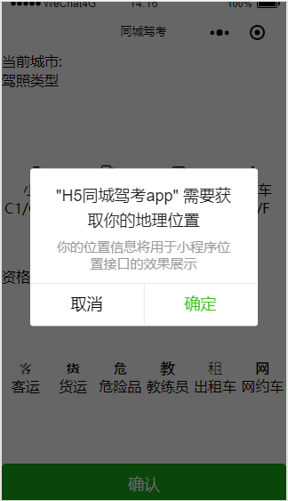
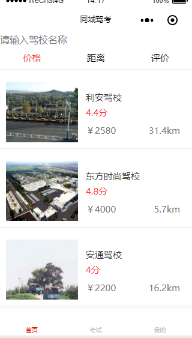
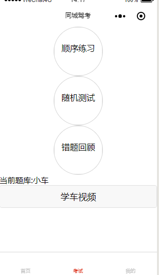
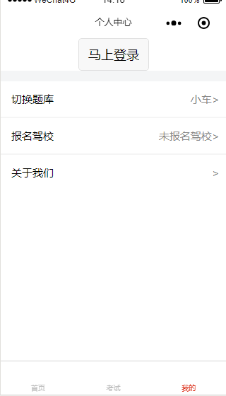
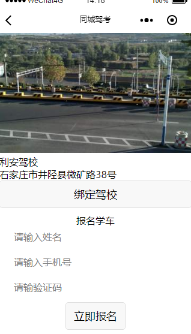
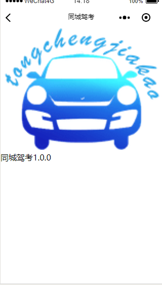
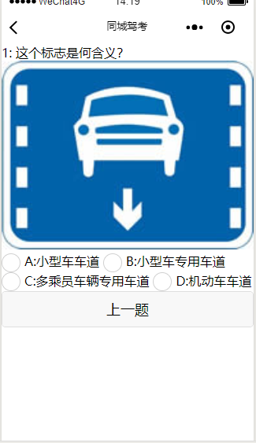

# 2016级项目实训成果展示 

## 《同城驾考》 - HTML5与移动互联网开发方向

### 项目简介

由《同城驾考》APP外延出的微信小程序，保留主要功能，如搜索教练、搜索驾校、模拟考试等功能。为微信用户提供更方便简洁的服务。

### 项目成员

- 朱子安（Manager/Developer）
	- Email:2890876565@qq.com
	- Github:http://github.com/zhuzian

- 郑栋文（Developer）
	- Email:1686435878@qq.com
	- Github:http://github.com/zdw98

- 邝绅绅（Developer）
	- Email:1360064467@qq.com
	- Github:http://github.com/kuangshenshen

- 白新正（Developer）
	- Email:894572759@qq.com
	- Github:http://github.com/Baixinzheng

### 效果图

