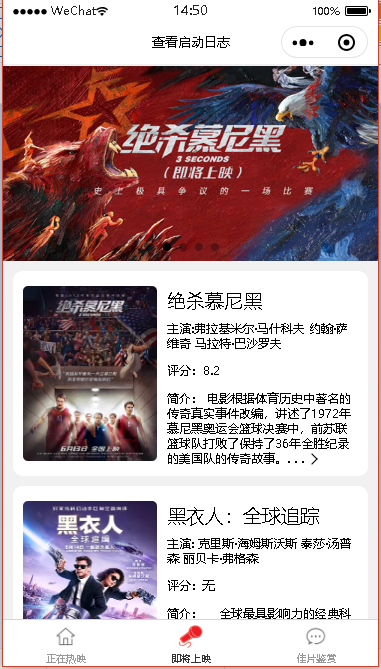
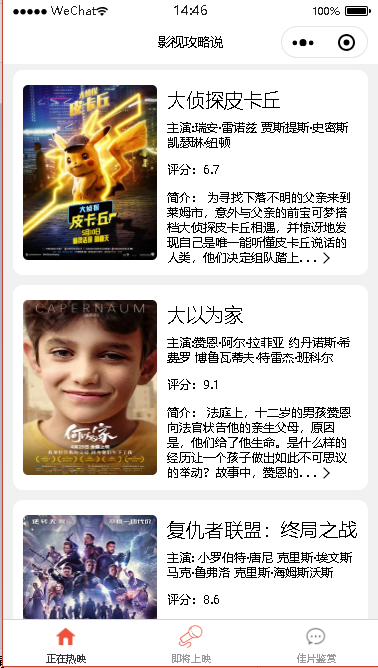
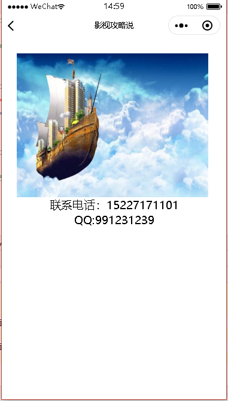
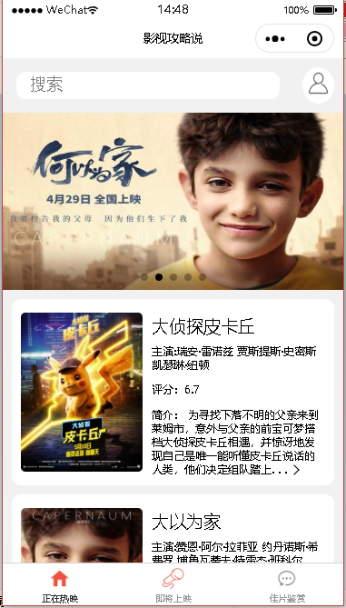
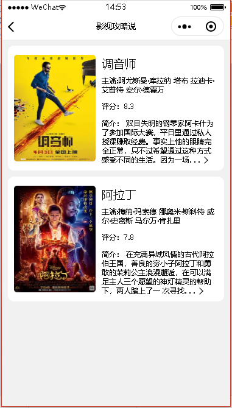
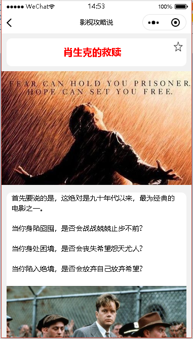
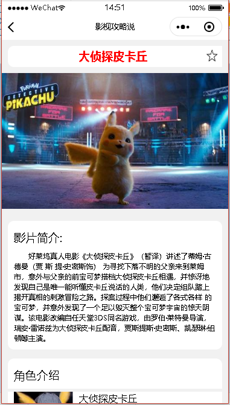
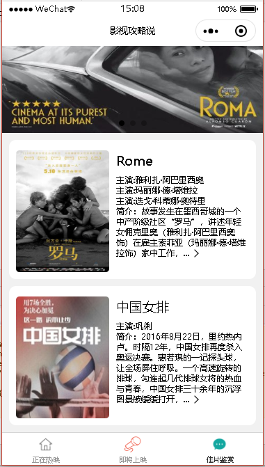

# 2016级项目实训成果展示 

## 《影视攻略说》 - HTML5与移动互联网开发方向

### 项目简介

一款“简易影视攻略微信小程序”

越来越多的’九九六‘，‘九九七’工作制压得我们这些程序猿喘不过气来，更没有时间去享受那些所谓的美好生活，整天陪我们最长时间的莫过于电脑和手机。我们针对于一些喜欢看电影或是打算看定影放松身心的微信用户，开服出一款简易的影视攻略说小程序，只需要登陆之后便能获得大量的影视内容，还有定期的文章推送。

### 项目地址
- Github：https://github.com/moviestrategy-2020

### 项目成员

- 黄鹏（项目经理、UI设计师、开发工程师、测试工程师）
  - Email：1337312919@qq.com
  - Github：https://github.com/haungpeng
- 陈琛（市场总监、UI设计师、开发工程师、测试工程师）
  - Email：1486001914@qq.com
  - Github：https://github.com/chenchen210
- 赵芊伊（技术总监、UI设计师、开发工程师、测试工程师）
  - Email：495225376@qq.com
  - Github：https://github.com/zhaoqianyi1997

    

