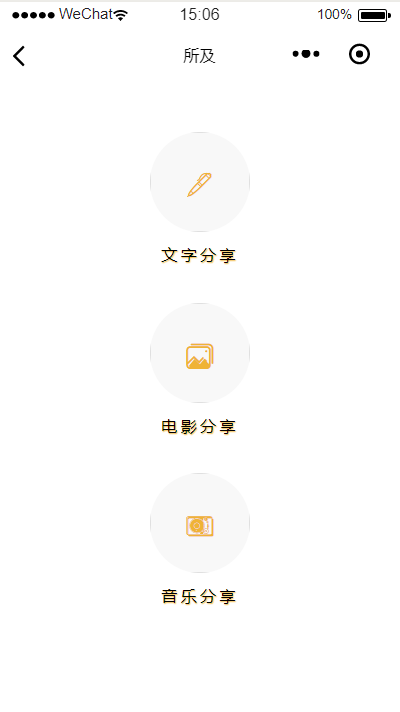
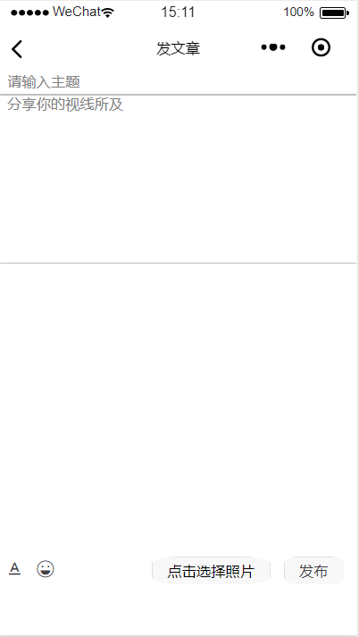
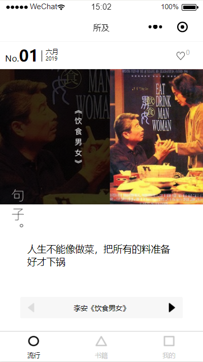
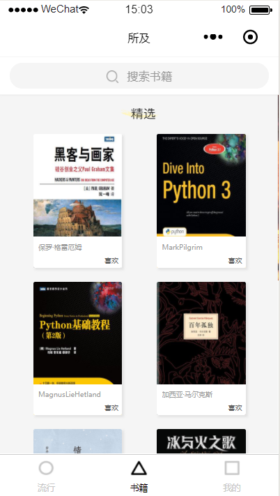
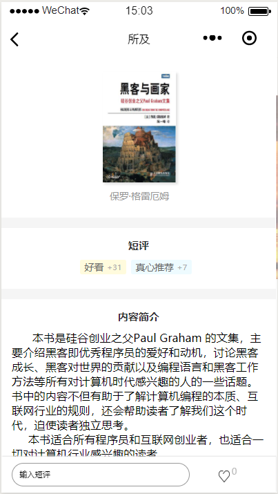
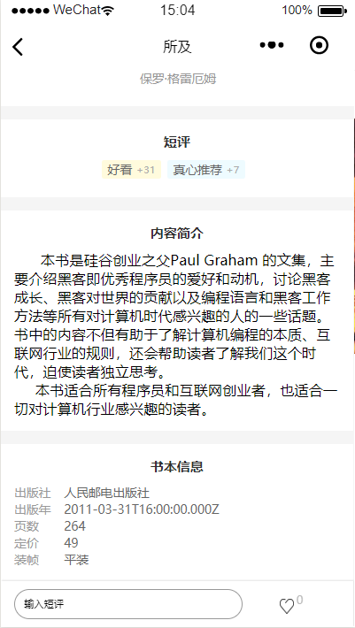
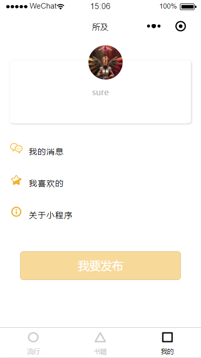

# 2016级项目实训成果展示 

## 《所及APP》 - HTML5与移动互联网开发方向

### 项目简介

**所及app**是一款小众化的文艺应用。用户通过文字、图片和音乐来寻找共鸣，追求简而精。

**所及app**旨在让每一位用户都能够寻找到自己灵魂深处的共鸣。他是每一位用户的知己。视线所及之处，总有一段文字、几句歌词、一段对白触动到你的心弦，所及app为你记录下每一个触动你的瞬间。同时，所及app也是每一位用户的创作天地，你可以写些小诗，创作长文，亦或是平实的记录生活，引起他人的共鸣，成为你的读者。

### 项目地址
- Github：[https://github.com/nieliangpeng/Worry-Grocery-Shop-APP](https://github.com/nieliangpeng/Worry-Grocery-Shop-APP)

### 项目成员

- 李文轩（项目经理、UI设计师、开发工程师、测试工程师）
  - Email：[1076843408@qq.com](mailto:1076843408@qq.com) 
  - Github：[https://github.com/Aluaead](https://github.com/Aluaead)
- 刘冉（产品经理、UI设计师、开发工程师、测试工程师）
  - Email：[260338425@qq.com](mailto:260338425@qq.com)
  - Github：[https://github.com/LiuRann](https://github.com/LiuRann)
- 马硕（技术总监、UI设计师、开发工程师、测试工程师）
  - Email：[shou_ma.sjz@foxmial.com](mailto:shou_ma.sjz@foxmial.com)
  - Github：[https://github.com/MashuoSure](https://github.com/MashuoSure)
- 李薇（技术总监、UI设计师、开发工程师、测试工程师）
  - Email：[2335644296@qq.com](mailto:2335644296@qq.com)
  - Github：[https://github.com/liwei2016011717](https://github.com/liwei2016011717)
- 于洋（市场总监、UI设计师、开发工程师、测试工程师）
  - Email：[937508676@qq.com](mailto:937508676@qq.com)
  - Github：[https://github.com/yuyang1998](https://github.com/yuyang1998)

### 项目截图

