# 2016级项目实训成果展示 

## 《数据故事》 - HTML5与移动互联网开发方向

### 项目简介

我们年代的沟通QQ占据了很大的部分，无论你和他是友情、亲情还是爱情，时光荏苒，但留下的痕迹不灭，数据交给我，故事还给你！ 现在人们生活节奏越来越快，很多之前经常联系的好友现在也很少说话了，导致有些生疏，而通过该项目的数据分析可以让你快速的回忆起和好友聊天的场景、说话的习惯和经常讨论的话题等，帮您重温美好回忆！

### 项目地址
- https://github.com/wangzilong1997/The-Story-of-Data

### 项目成员

- 王子龙（项目经理、UI设计师、开发工程师、测试工程师）
  - Github：[https://github.com/wangzilong1997/The-Story-of-Data/tree/wzl](https://github.com/wangzilong1997/The-Story-of-Data/tree/wzl)
- 李悦（市场总监、UI设计师、开发工程师、测试工程师）
  - Github：[https://github.com/wangzilong1997/The-Story-of-Data/tree/ly](https://github.com/wangzilong1997/The-Story-of-Data/tree/wzl)
- 李欣芸（技术总监、UI设计师、开发工程师、测试工程师）
  - Github：[https://github.com/wangzilong1997/The-Story-of-Data/](https://github.com/wangzilong1997/The-Story-of-Data/)
- 郝芸婷（技术总监、UI设计师、开发工程师、测试工程师）
  - Github：[https://github.com/wangzilong1997/The-Story-of-Data/](https://github.com/wangzilong1997/The-Story-of-Data/)

### 项目截图

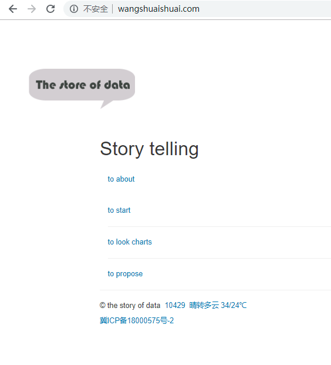
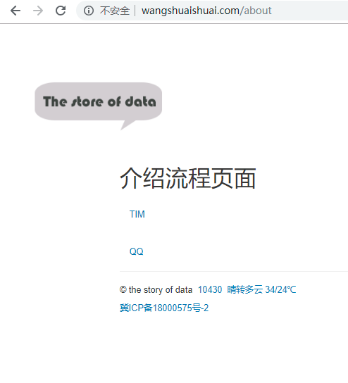
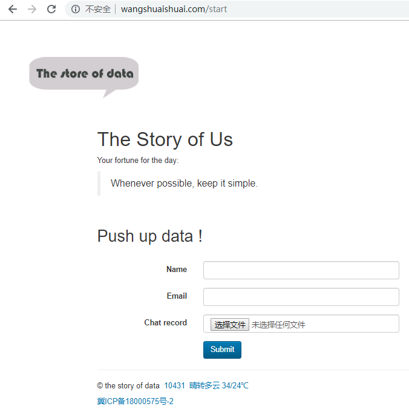
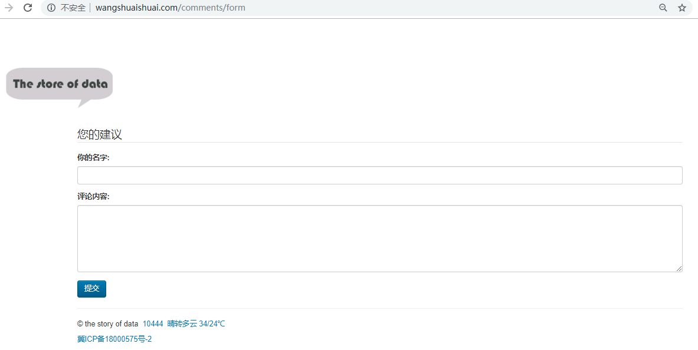

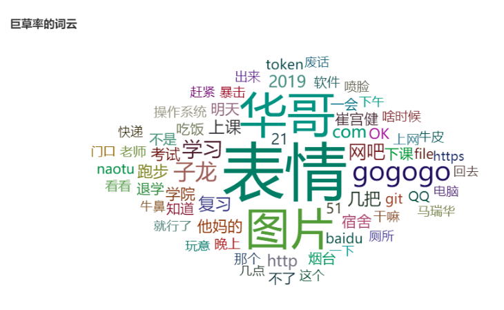
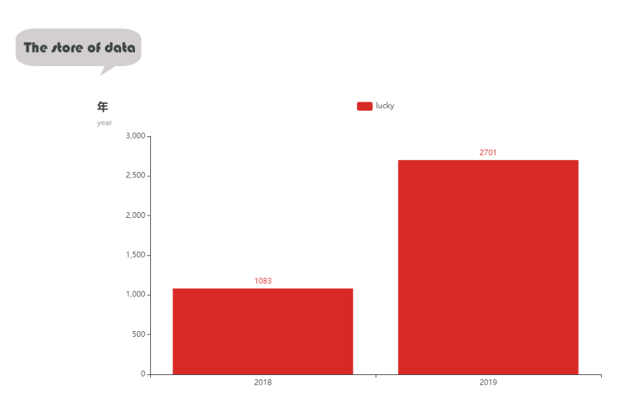
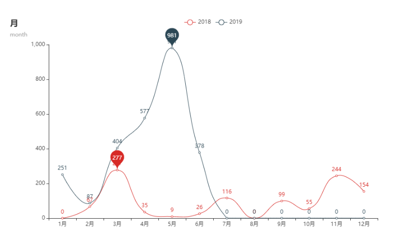

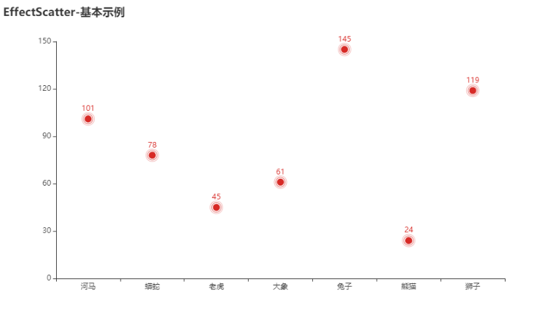
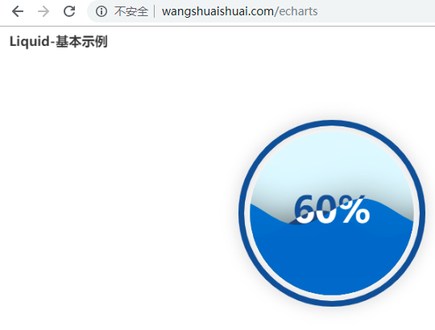
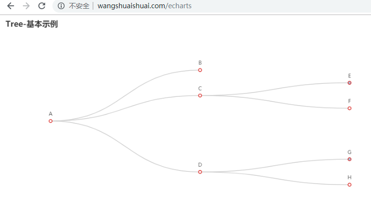

### 项目管理

#### Redmine - 王子龙

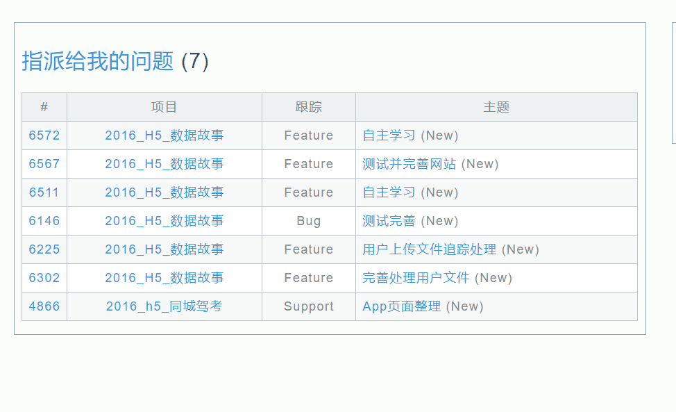

#### Redmine - 李悦

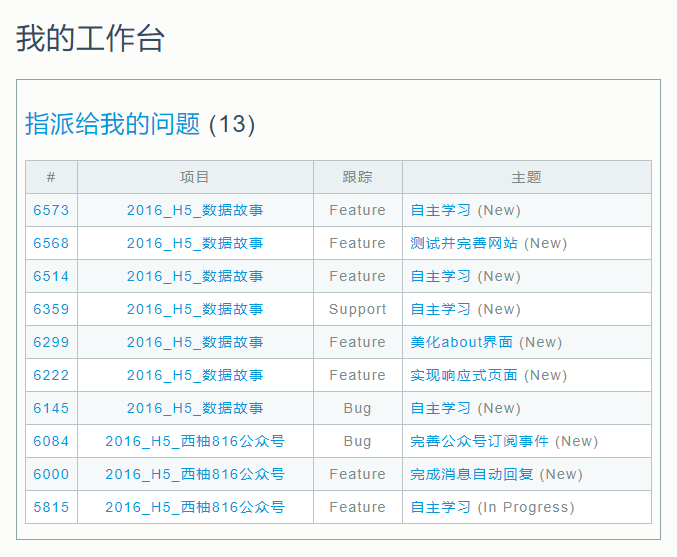

#### Redmine - 李欣芸

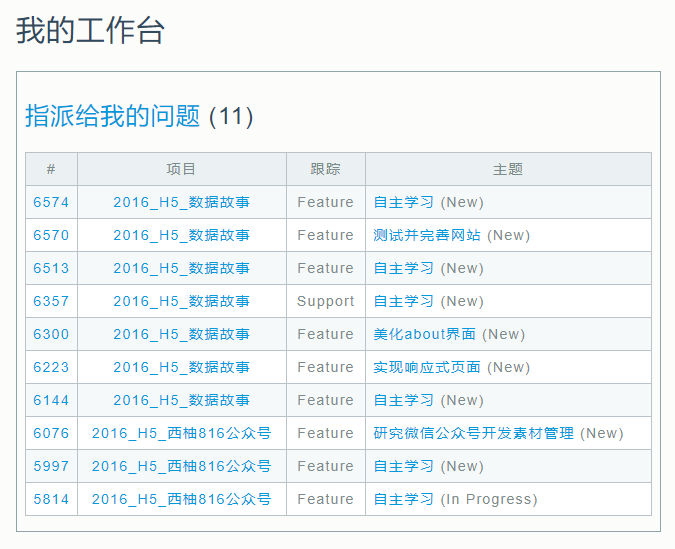

#### Redmine - 郝芸婷

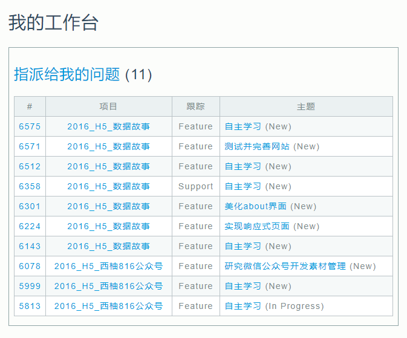
