# 2016级项目实训成果展示 

## 《益生活》 - HTML5与移动互联网开发方向

### 项目简介

&nbsp;&nbsp;&nbsp;&nbsp;"**益生活**"一款包含体质测试、打造养生方案、制定计划并督促用户执行计划的APP；

&nbsp;&nbsp;&nbsp;&nbsp;"**益生活**"是一款健康养生类APP。旨在为用户提供饮食、运动等方面的养生建议，减少用户因饮食或运动不当而产生不适的情况，使好用户通过养生达到良好的身体状况。

### 用户功能

- 用户可以通过进行体质测试之后返回的结果来获得自己的体质情况以及一系列的注意事项。
- 用户在测试完毕以后，可以根据我们推送的调理方案在日常生活中进行调理。
- 用户可以使用"益生活"获得基于本人体质结果推荐的文章，通过阅读文章来了解自身体质相关的保养知识。
- 用户可以选择我们为其创建的计划并添加，然后我们为其记录每日完成情况。
- 用户可以使用"益生活"APP分享自己的动态和浏览他人的动态，还可以对他人的动态进行收藏和评论。

### 项目地址
   * Github：[https://github.com/jixinchan/ToBeBetter/tree/master/project](https://github.com/jixinchan/ToBeBetter/tree/master/project)

### 项目成员
* 季新婵
   * 负责整体进度把控。前端及服务器端代码实现。代码整合。
   * Github：[https://github.com/jixinchan](https://github.com/jixinchan)
   * 常用邮箱：1209980074@qq.com
* 王颖
   * 服务器端代码实现。主要负责后台管理系统。
   * Github：[https://github.com/wangying1998](https://github.com/wangying1998)
   * 常用邮箱：1610010554@qq.com
* 田圆方
   * 前端及服务器端代码实现。技术钻研。
   * Github：[https://github.com/tianyuanfang](https://github.com/tianyuanfang)
   * 常用邮箱：1784634905@qq.com
* 徐瑞婷
   * 前端及服务器端代码实现。负责体质测试主要模块。
   * Github：[https://github.com/xuruiting1](https://github.com/xuruiting1)  
   * 常用邮箱：1263183452@qq.com
* 高铱镁
   * 前端及服务器端代码实现。文档书写。
   * Github：[https://github.com/gaoyimei0721](https://github.com/gaoyimei0721)  
   * 常用邮箱：1272379222@qq.com
* 孟乐鑫
   * 前端代码实现。UI设计。文档书写。
   * Github：[https://github.com/MengLeXin](https://github.com/MengLeXin)  
   * 常用邮箱：970914982@qq.com

### 项目文件
>>project 
>>>> backend 
>>>>>> back-server ——前台服务器端代码  
>>>>>> src ——前台前端代码  

>>>> frontend  
>>>>>> front-serer ——后台服务器端代码 
>>>>>> src ——后台前端代码 

>>>> 项目启动 
>>>>>> 益生活前台原型 
>>>>>> 益生活后台原型 
>>>>>> 《益生活》项目需求规格说明书 

>>>> 项目规划 
>>>>>> 《益生活》项目人力资源规划 
>>>>>> 《益生活》项目数据库设计说明书 
>>>>>> 《益生活》项目软件架构设计说明书 
>>>>>> 《益生活》项目风险规划 

>>>> Backlog.xls —— 项目Backlog 以及 Sprint

## 项目运行部分截图

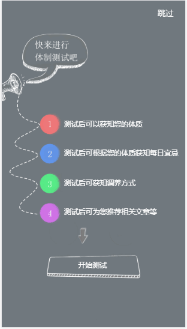
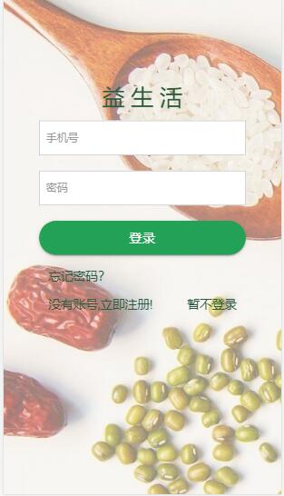
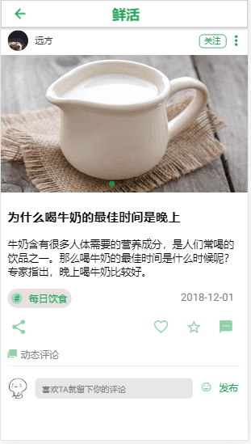

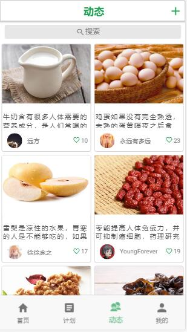
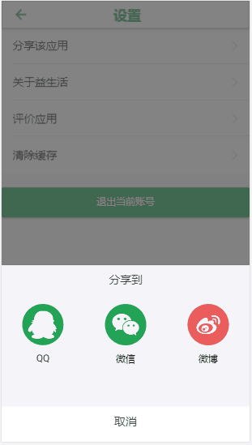

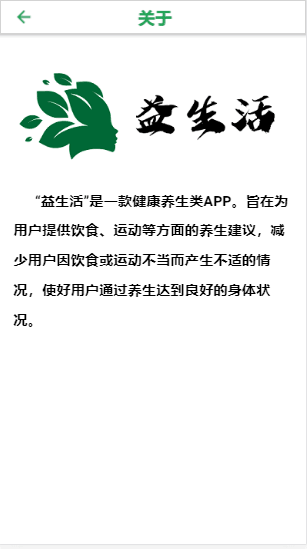
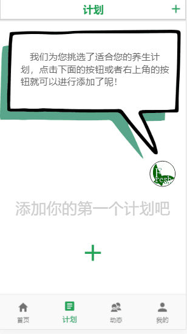

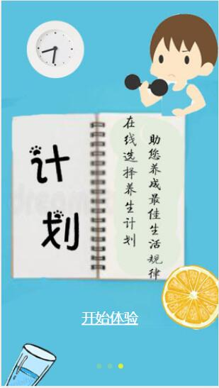
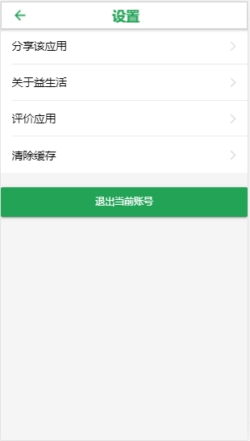

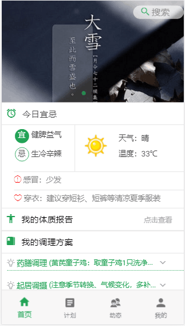
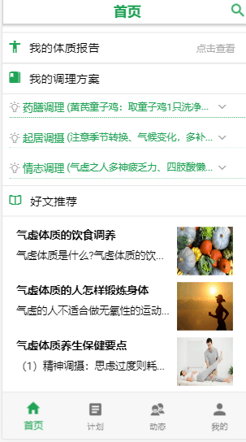
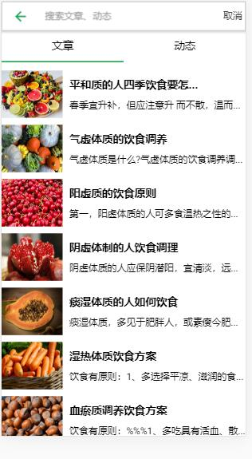

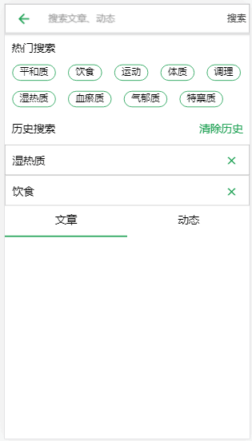
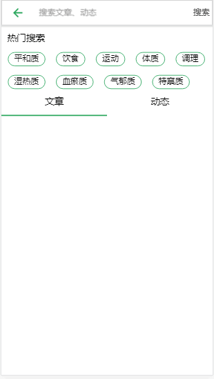
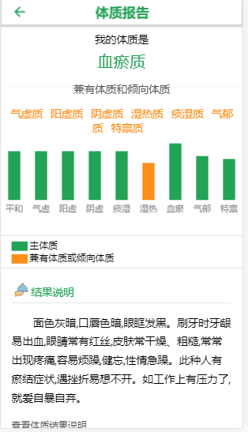

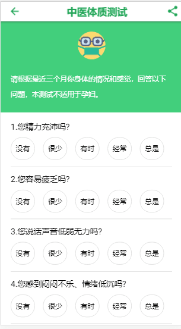
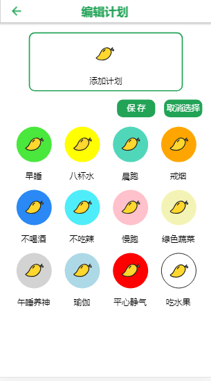
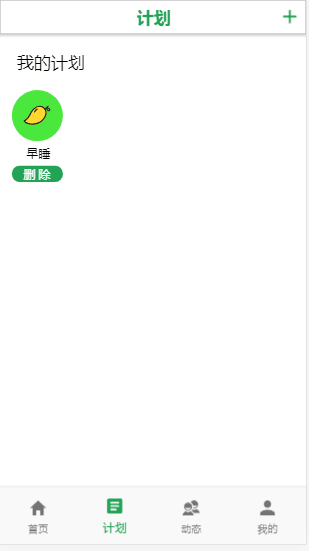

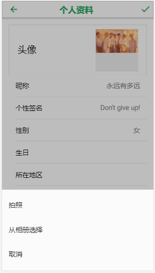
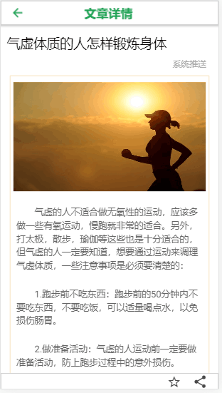

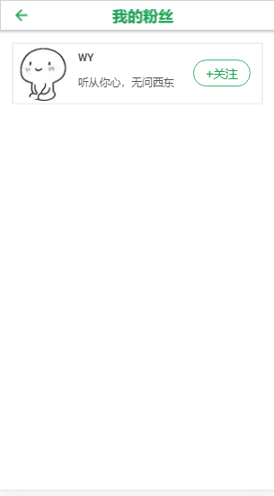
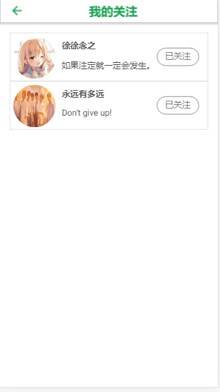
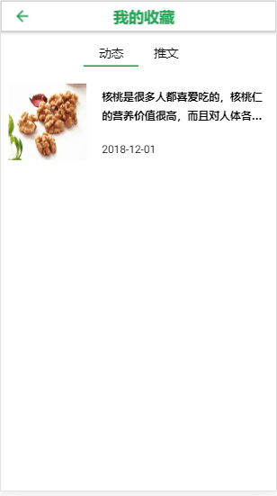

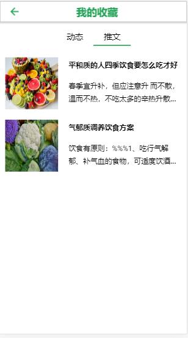
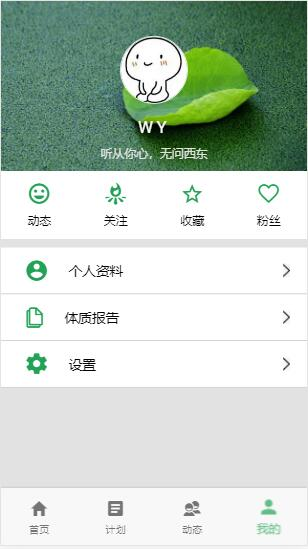

