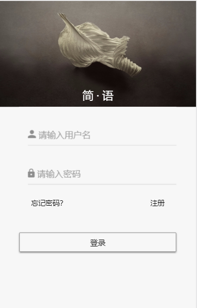
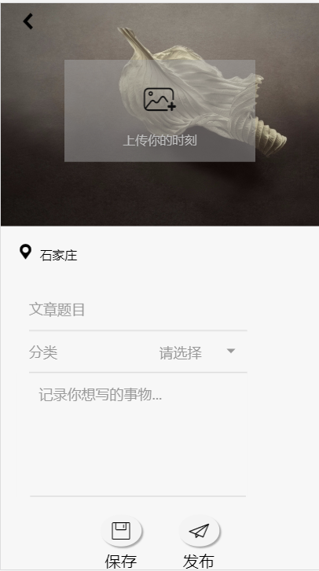
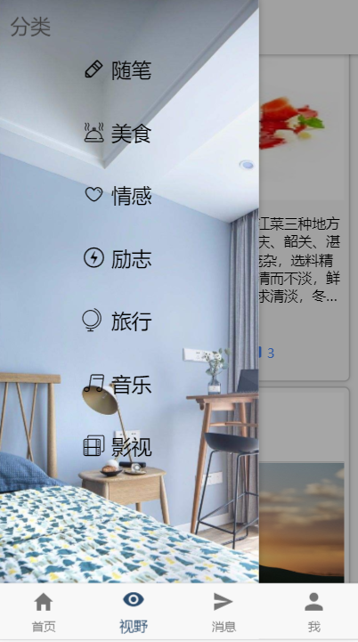
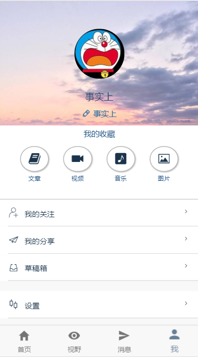
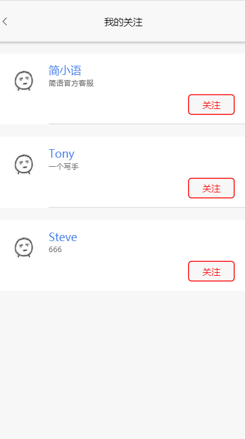
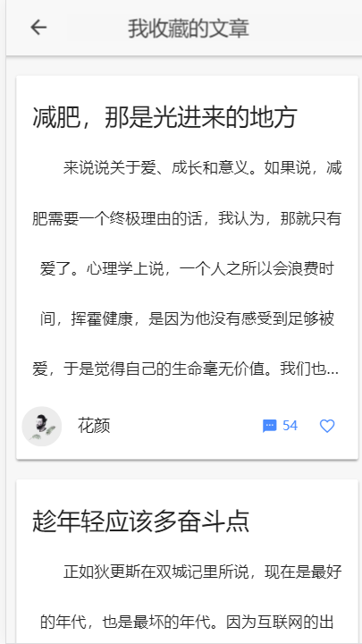
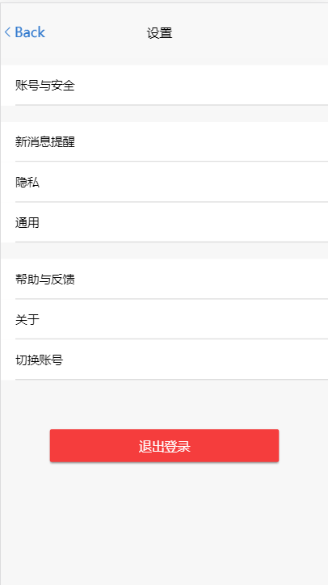
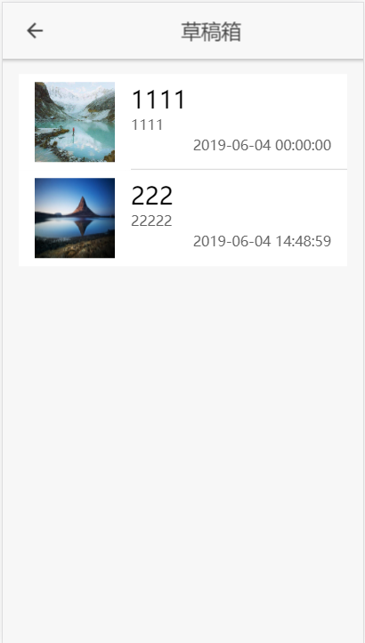
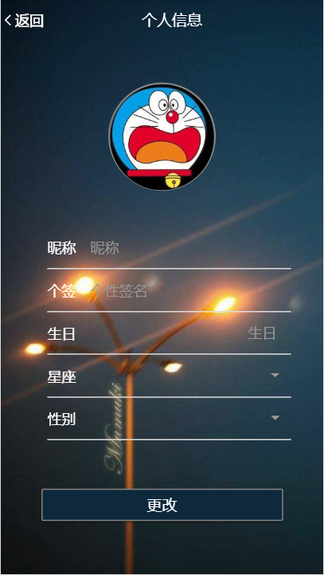

# 2016级项目实训成果展示 

## 《简语》 —— HTML5与移动互联网开发方向

Github：https://github.com/dongxuteng/software

## 项目简介

**《简语》** 是一款极简风格的集阅读，交流，分享为一体的轻文学阅读APP。

**每天，《简语》会为您准备几篇优秀的故事，几首动听的音乐，几张精美的图片。** 在快节奏生活的今天，抽出半小时，坐下喝杯咖啡，读几篇文章，与其他同样喜爱阅读的读者们交流你的心得体会。

**在这里，你也可以分享你的故事。或许因为种种原因，你无法吐露自己的心声。**但是在**《简语》**，你可以将你的故事分享给陌生人，看一看他人的理解和看法。让他人分享你的快乐，也在诉说中消散你的不开心。

**《简语》** 旨在让读者在疲惫忙碌的生活中通过阅读获得快乐与温暖，让阅读成为一种生活方式。

## 项目成员

* 董旭腾
  * E-mail：260739028@qq.com
  * Github：https://github.com/dongxuteng
* 崔一鸣
  * E-mail：cuiyimingyoung@outlook.com
  * Github：https://github.com/cuiyiming1998
* 张天护
  * E-mail：zthdy11@outlook.com
  * Github：https://github.com/zhangtianhu
* 高歌远
  * E-mail：986264376@qq.com
  * Github：https://github.com/tracyuan
* 张韬毅
  * E-mail: 734045289@qq.com
  * Github: https://github.com/zhangtaoyi77
* 吴三荣
  * E-mail: 2085067543@qq.com
  * Github: https://github.com/wusanrong915

## 运行效果

