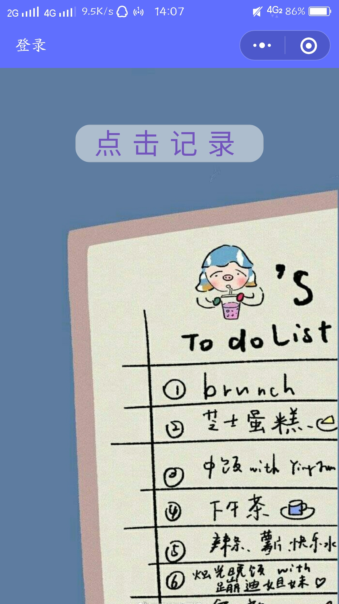
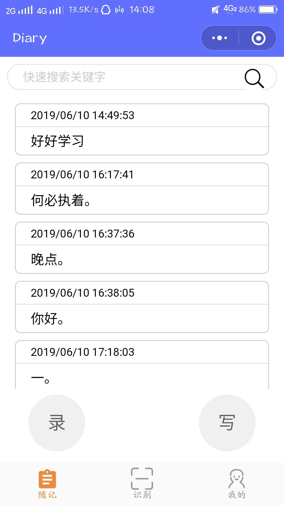
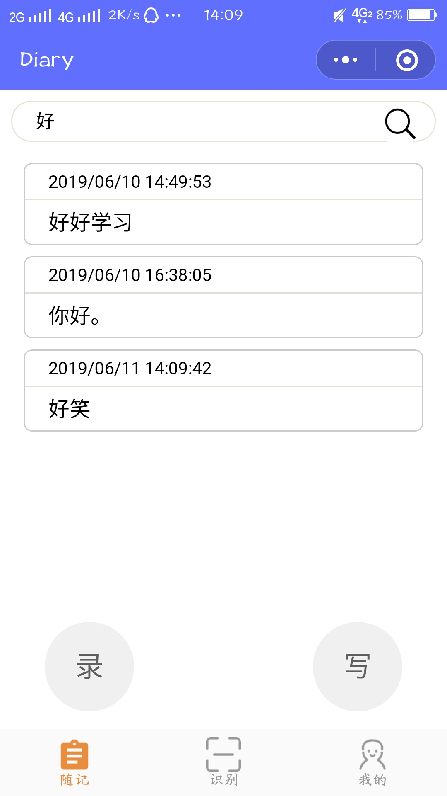
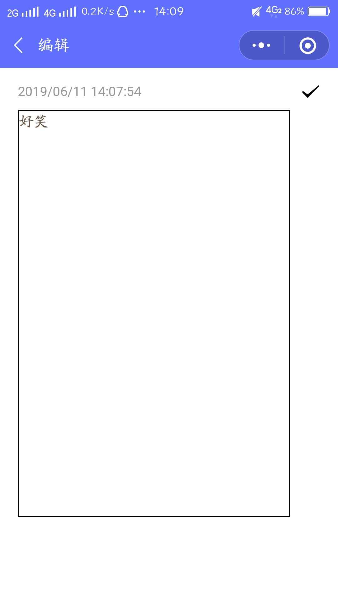
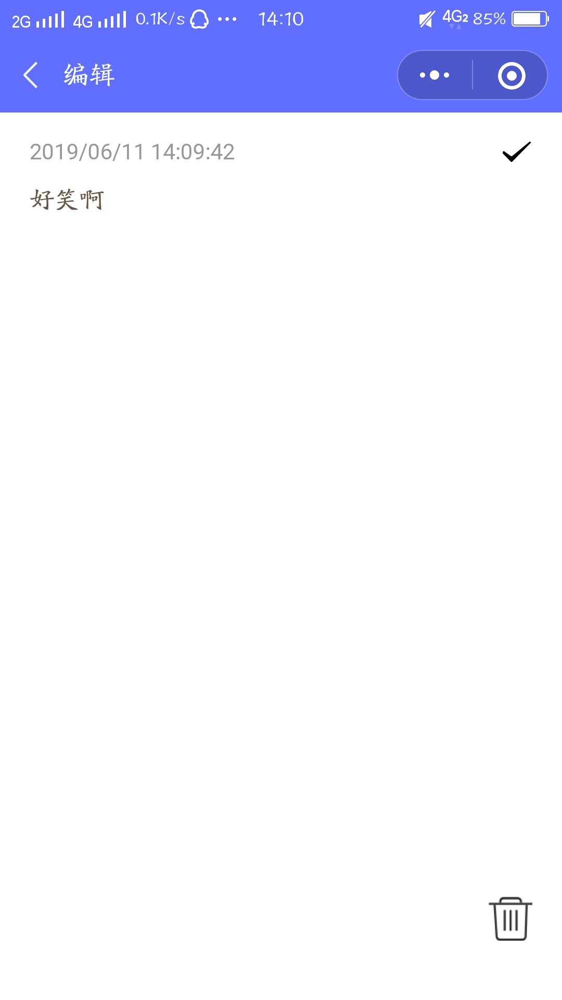
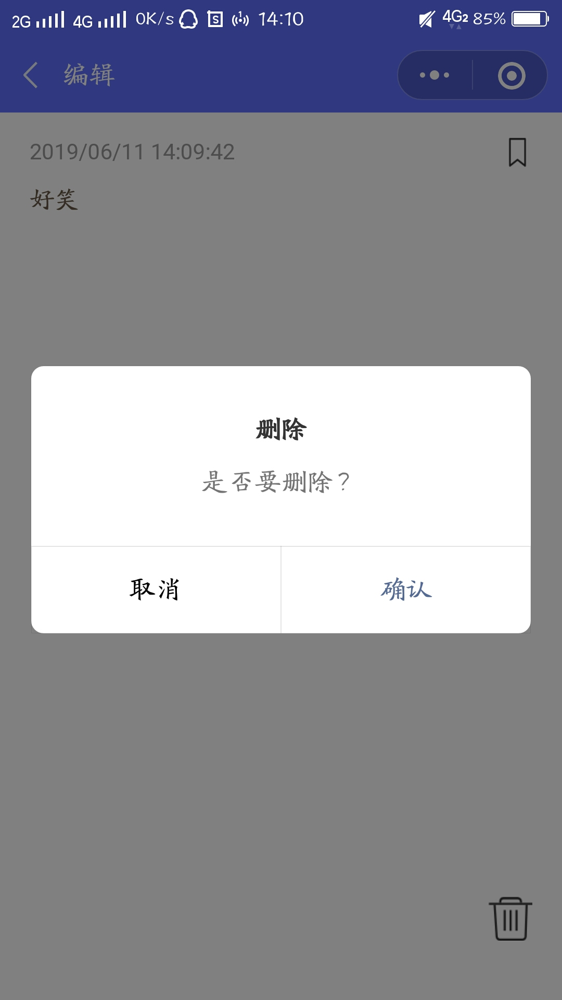
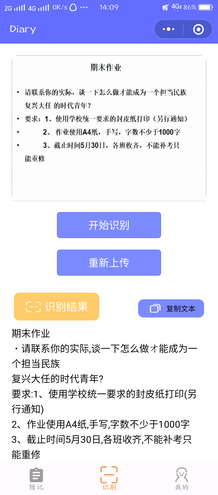
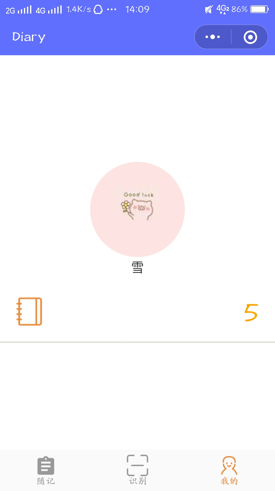

# 2016级项目实训成果展示 

## 《耶耶记事》 - HTML5与移动互联网开发方向

### 项目简介

**耶耶记事**是一个记事类的小程序，但它更具有特色，区别于一般的日记小程序，首先第一大特点是让我们的记事方式不仅仅局限于写，而是用一种更快更方便的方法——录，你只需要把你想写的说出来，它会帮助你转化文字，省时又方便。另外如果你在生活中还有这样的烦恼，比如说没带手机，但是要记东西，这时你回用笔写下来，但是又怕自己弄丢了，你可以在有手机的第一时间拍下来然后上传到小程序中，它也会帮你识别出来图片上的文字，这样就不会担心丢失重要资料了！

### 项目地址

- Github：[https://github.com/Guoshibo/Miniprogram](https://github.com/Guoshibo/Miniprogram)

### 项目成员

- 郭诗博（项目经理、UI设计师、开发工程师、测试工程师）
  - Email：[1137603852@qq.com](mailto:1137603852@qq.com) 
  - Github：[https://github.com/Guoshibo](https://github.com/Guoshibo)
- 潘凯亚（市场总监、UI设计师、开发工程师、测试工程师）
  - Email：[3131225624@qq.com](mailto:3131225624@qq.com)
  - Github：[https://github.com/pankaiya](https://github.com/pankaiya)
- 纪朝萍（技术总监、UI设计师、开发工程师、测试工程师）
  - Email：670237342[@qq.com](mailto:670237342@qq.com)
  - Github：[https://github.com/JIZHAOPING](https://github.com/JIZHAOPING)

### 项目截图

