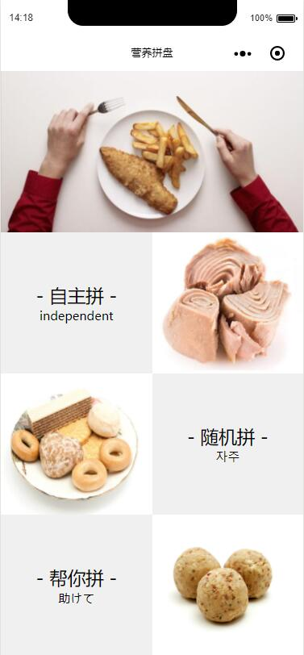
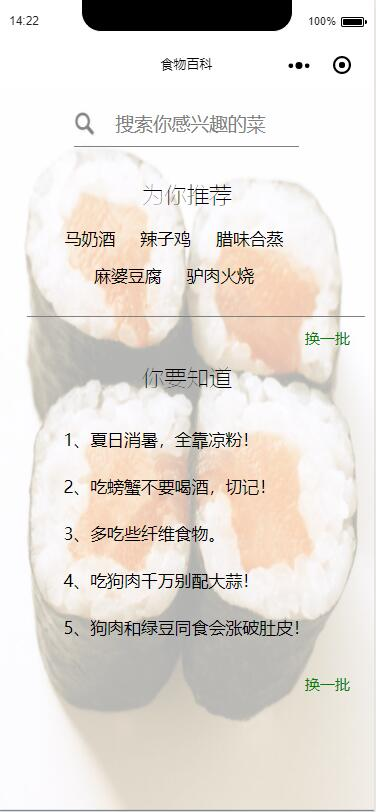
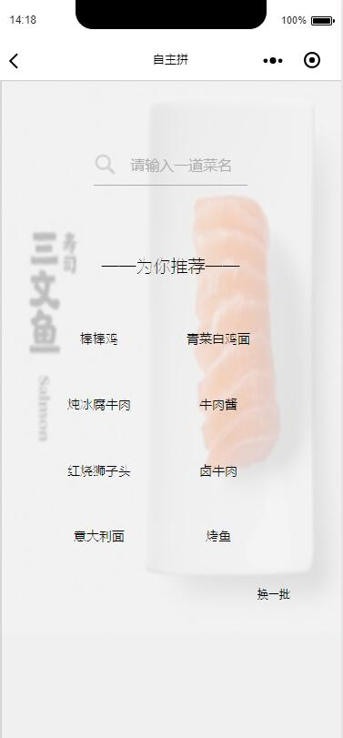
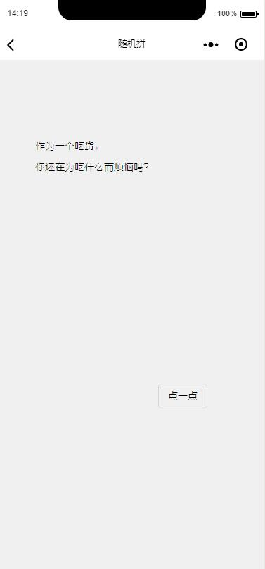
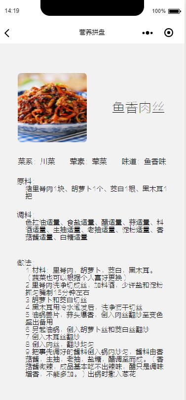
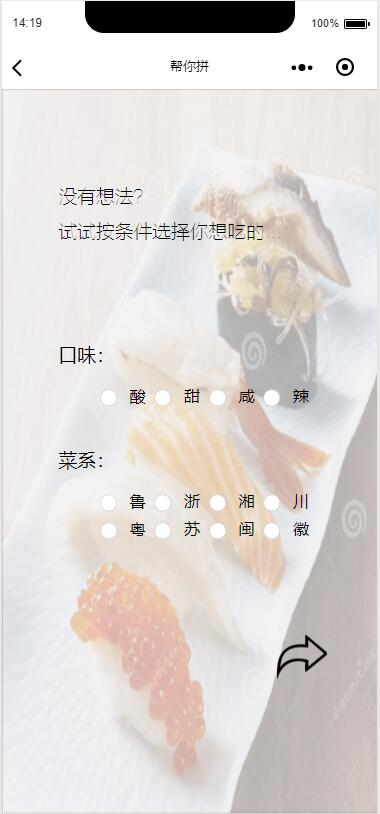

# 2016级项目实训成果展示 

## 《营养品盘》 - HTML5与移动互联网开发方向

### 项目地址

- Github : [https://github.com/liqilin1996/yingyangpinpan](https://github.com/liqilin1996/yingyangpinpan)

### 项目简介

营养拼盘是通过微信小程序为当代任何人士解决饮食营养不平衡、不健康的问题的项目。

### 项目成员

- 杨茜（前端开发）
	- 电子邮箱:2462006777@qq.com
	- github地址:https://github.com/yangxi1998
- 郭艳霞（前端开发）
	- 电子邮箱:2537158536@qq.com
	- github地址:https://github.com/guoyanxia
- 卜冬晓（数据库设计）
	- 电子邮箱:1165140257@qq.com
	- github地址:https://github.com/bodongxiao
- 李其林（前端UI设计）
	- 电子邮箱:1819755585@qq.com
	- github地址:https://github.com/liqilin1996
- 张宁（后端开发）
	- 电子邮箱:zn993160060@icloud.com
	- github地址:https://github.com/zn1121
- 迟国强（文档编写）
	- 电子邮箱:255177826@qq.com
	- github地址:https://github.com/0214Chi

### 功能实现

- 随机拼：随机为用户提供科学合理且营养的菜肴搭配
- 帮你拼：用户输入一款想吃的菜肴，程序帮用户搭配出另外合理的菜肴作搭配
- 自主拼：用户输入自己想吃的菜肴搭配，程序为其进行营养评价

### 页面展示

