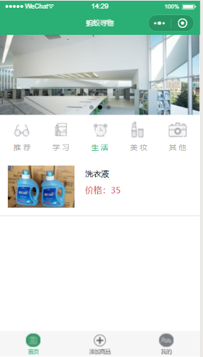
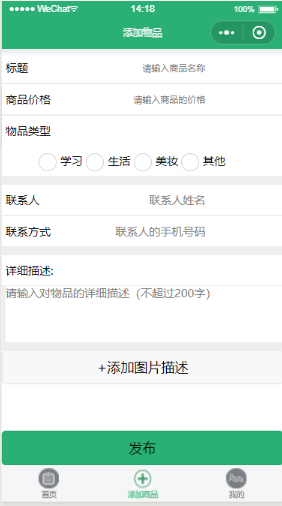
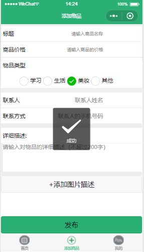
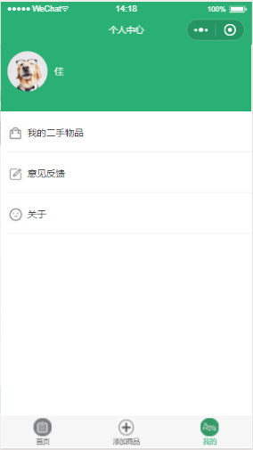
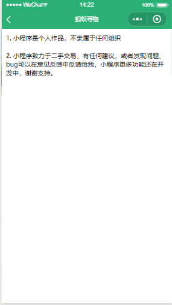
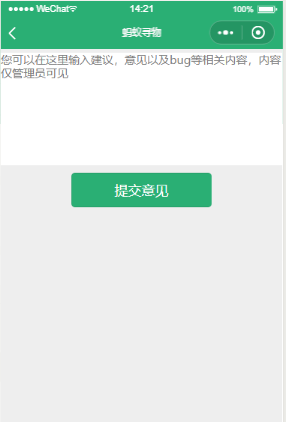
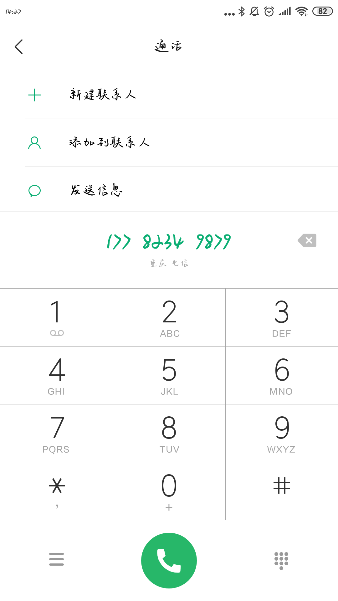

# 2016级项目实训成果展示 

## 《蚂蚁寻物》 - HTML5与移动互联网开发方向

### 项目简介

蚂蚁寻物是一款包含基于地点闲置物品买卖的小程序。 旨在根据商品地点，方便广大师生对物品的选择。为各大高校的师生提供详细的分类二手物品，可以通过电话联系，线下进行交易。保障商品的可靠性，减少师生买卖物品地点上的局限性。

### 项目地址
- Github：[https://github.com/weijia0208/project-training](https://github.com/weijia0208/project-training)

### 项目成员

- 姚静（项目经理、UI设计师、开发工程师、测试工程师）
  - Email：[1903123658@qq.com](mailto:1903123658@qq.com) 
  - Github：[https://github.com/yaojingo728](https://github.com/yaojingo728)
- 魏佳（产品经理、UI设计师、开发工程师、测试工程师）
  - Email：[1002475276@qq.com](mailto:1002475276@qq.com)
  - Github：[https://github.com/weijia0208](https://github.com/weijia0208)
- 王秀莲（质量专家、UI设计师、测试工程师）
  - Email：[1544329238@qq.com](mailto:1544329238@qq.com)
  - Github：[https://github.com/wangxiulian](https://github.com/wangxiulian)

### 项目截图

