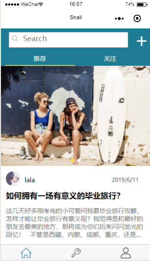
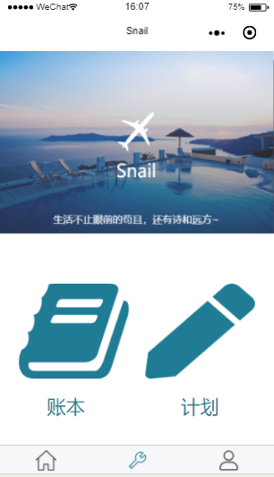
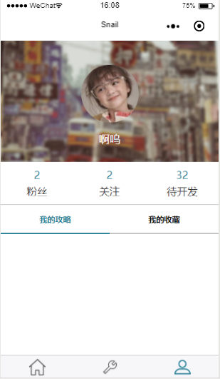
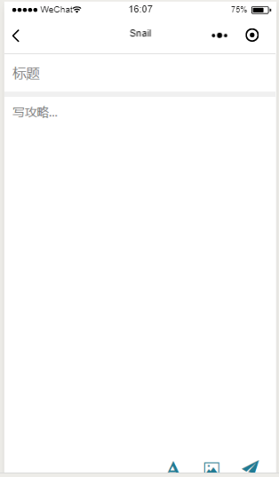
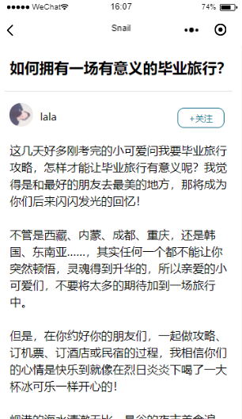
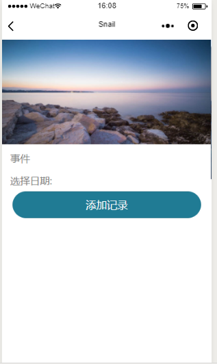
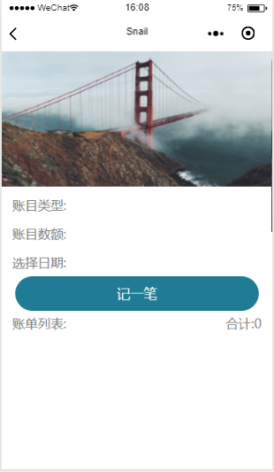

# 2016级项目实训成果展示 

## 《蜗牛旅行》 - HTML5与移动互联网开发方向

### 项目简介

**蜗牛旅行**是一款旅游攻略分享的APP，致力于帮助自驾游行者发现更好的旅行路线。

**蜗牛旅行**是一款旅行攻略分享的APP。旨在多方面、更真实的反映不同景点的不同旅行体验。通过不同人群对景点的评分和评价，反映景点的真实价值，为自驾游行者提供更有价值的参考。而目的地的旅游攻略的分享也会丰富自驾游行者的旅游路线，提供多层次的景点选择，从而制定出贴合自身实际情况的完美旅行路线，真正做到不虚此行。

**蜗牛**名字的由来，是区别于旅行团的“定时行动”，蜗牛旅行不在乎走得快，而是帮助游客尽情感受旅行的整个过程，汲取丰富的旅行体验。

### 项目成员

- 王佳琦（后端工程师）
    - Email：1397978384@qq.com
    - Github：https://github.com/8wangjiaqi
- 黄媛媛（UI设计师）
    - Email：930317972@qq.com
    - Github：https://github.com/huangyuanyuan98
- 齐琦（前端工程师）
    - Email：3510363360@qq.com
    - Github：https://github.com/8wangjiaqi
- 候存巧（前端工程师）
    - Email：853801007@qq.com
    - Github：https://github.com/8qiqi

### 运行效果

