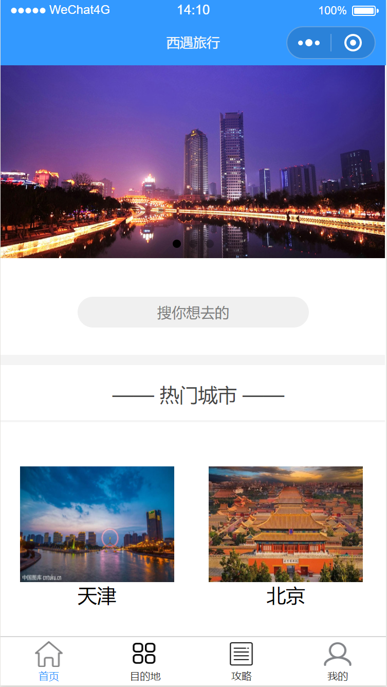
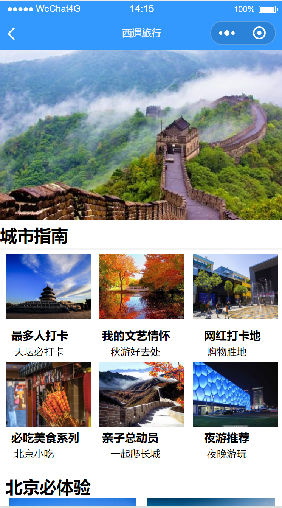
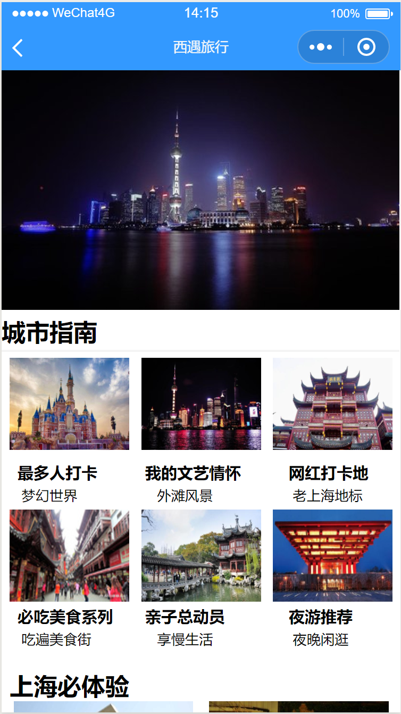
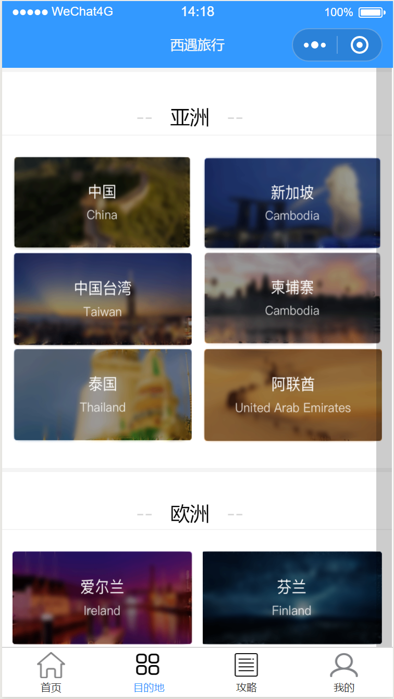
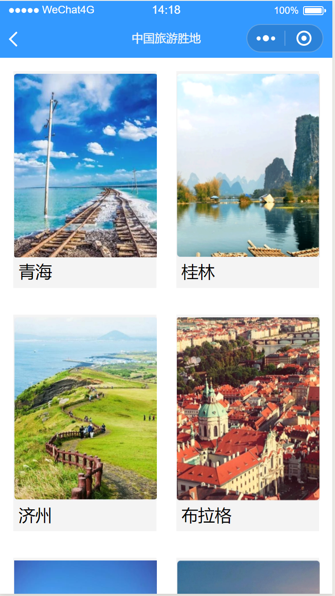
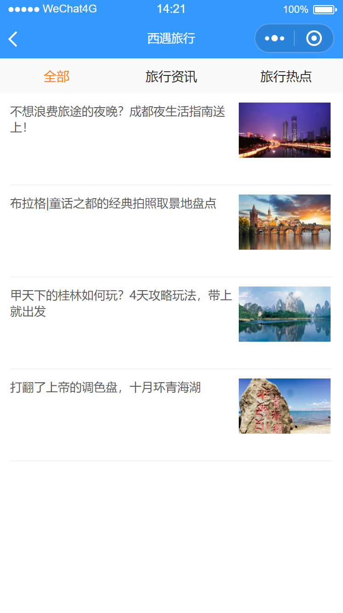
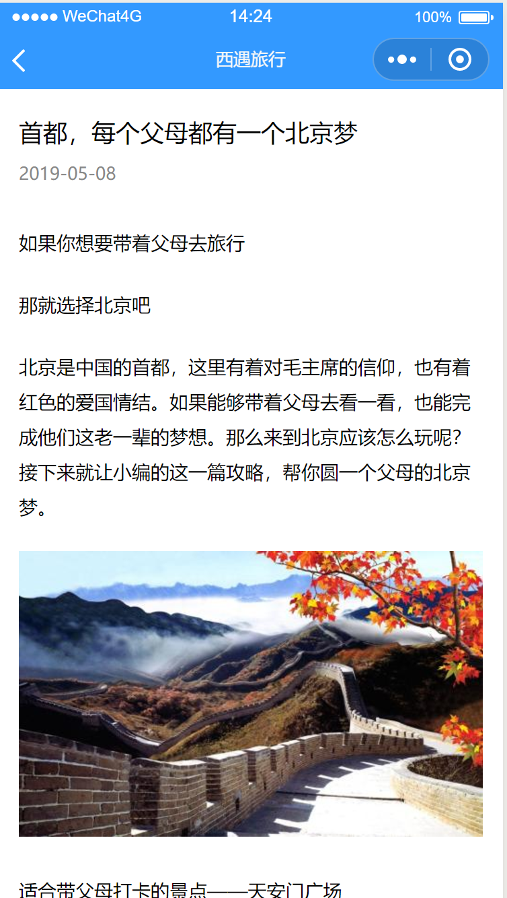
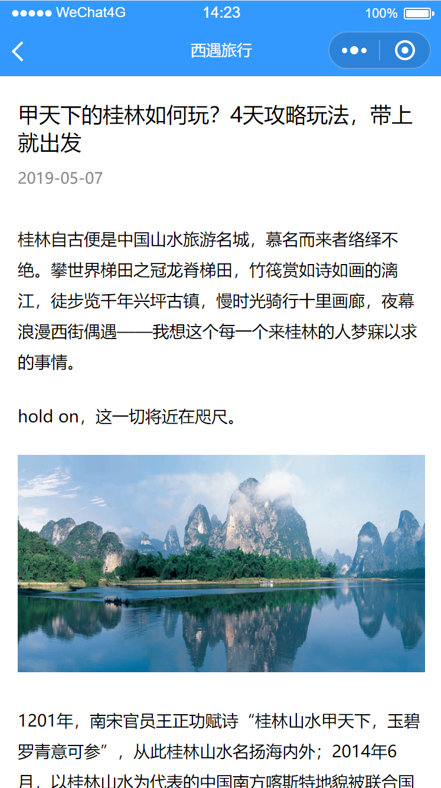

# 2016级项目实训成果展示 

## 《西遇》 - HTML5与移动互联网开发方向

### 项目简介

一款以旅游分享和查看旅游攻略为主的小程序。

和志同道合的小伙伴去北京天安门，去天津的天津之眼，上海的外滩等等。这个世界很大，这个世界很小，一起玩，才能更好玩！得到最新的旅游资讯才能更好的完成旅行。

### 项目地址

- Github：https://github.com/liuzixue1998/Mini-Program

### 项目成员

- 刘子雪（项目经理、UI设计师、开发工程师、测试工程师）
  - Email：825673952@qq.com
  - Github：https://github.com/liuzixue1998
- 尹雨佳（市场总监、UI设计师、开发工程师、测试工程师）
  - Email：1373722811@qq.com
  - Github：https://github.com/yujia1997
- 李润川（技术总监、UI设计师、开发工程师、测试工程师）
  - Email：695309771@qq.com  
  - Github：https://github.com/chuan695309771

### 项目截图

