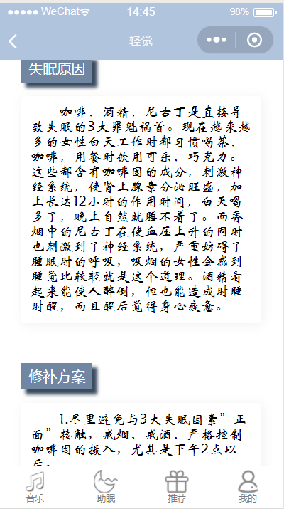
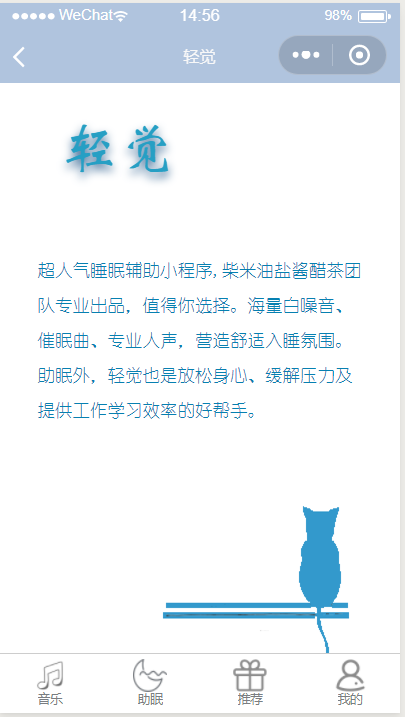
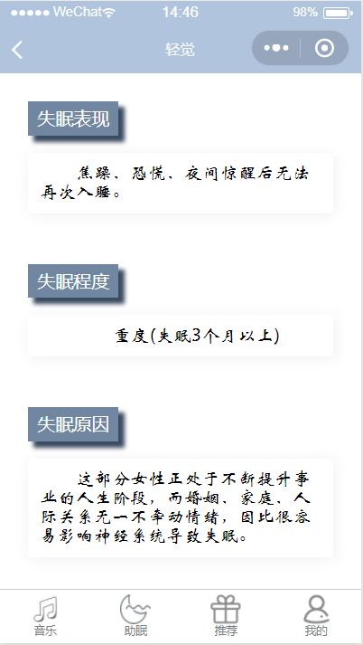
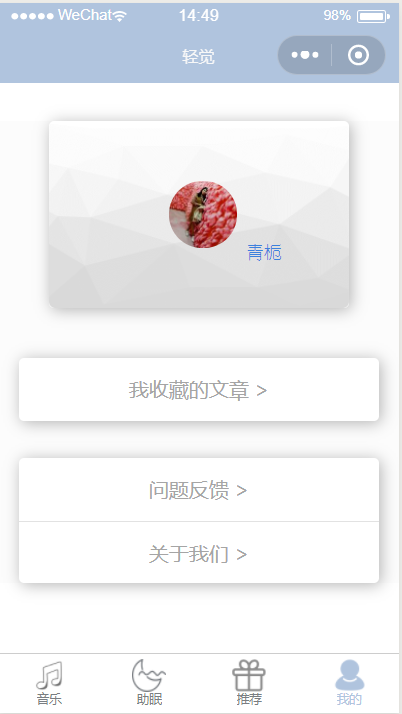
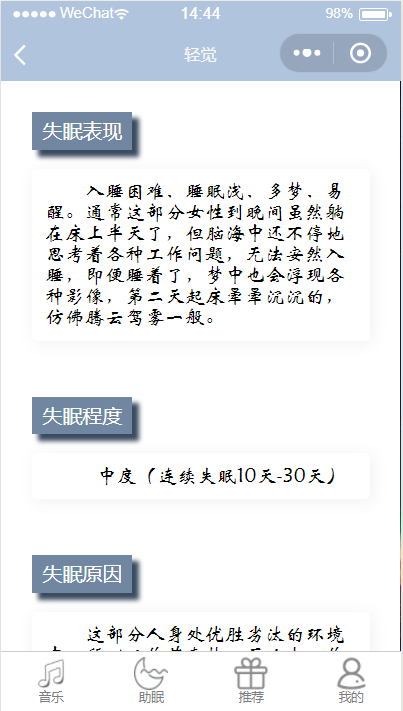
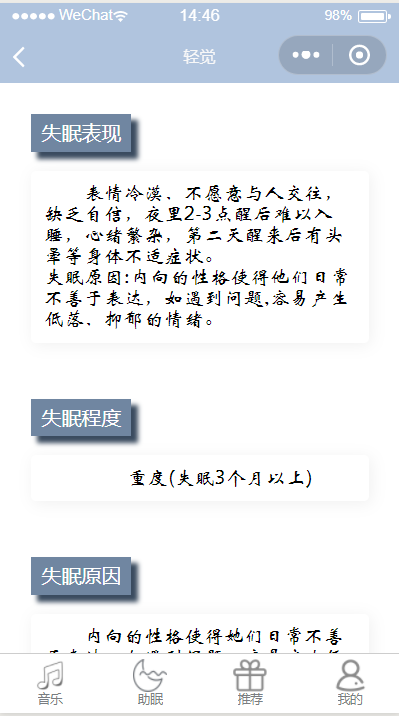
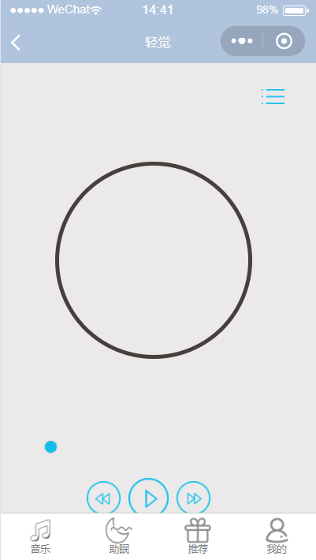
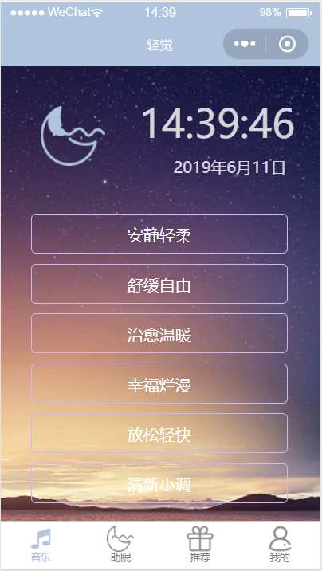
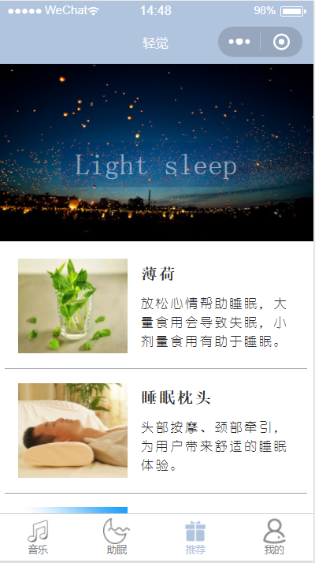
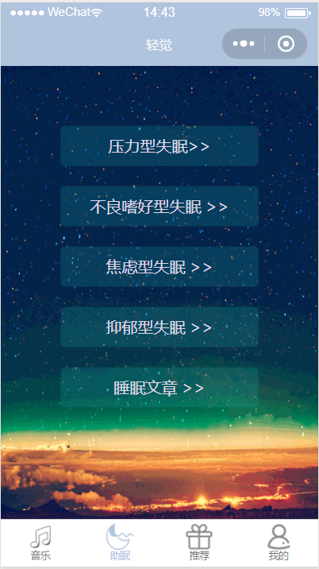

# 2016级项目实训成果展示 

## 《轻觉》 - HTML5与移动互联网开发方向

### 项目简介

“轻觉”——一款超人气睡眠辅助小程序，海量白噪音、催眠曲、专业人声，营造舒适入睡氛围。
除助眠外，轻觉也是放松身心、缓解压力及提高工作学习效率的好帮手。

### 项目地址
- Github：[https://github.com/lijingdan2016/groups](https://github.com/lijingdan2016/groups)
### 项目成员

- 王洁（项目经理、UI设计师、开发工程师、测试工程师）
  
- 李建辉（市场总监、UI设计师、开发工程师、测试工程师）
  
- 侯苏洪（技术总监、UI设计师、开发工程师、测试工程师）

- 宋莹然（技术总监、UI设计师、开发工程师、测试工程师）

- 康润芳（产品经理、UI设计师、开发工程师、测试工程师）
  
- 李敬单（质量专家、UI设计师、开发工程师、测试工程师）

### 项目截图

