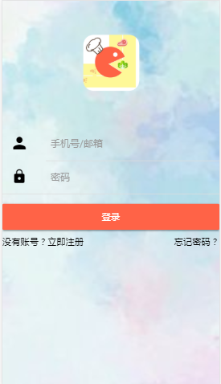
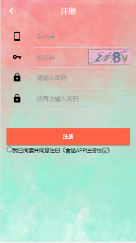
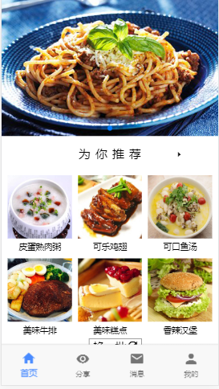
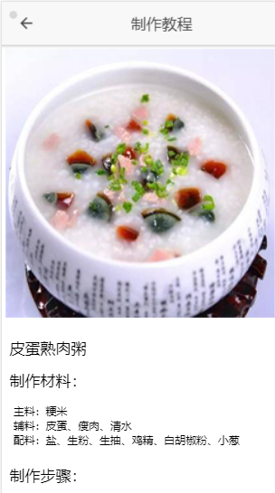
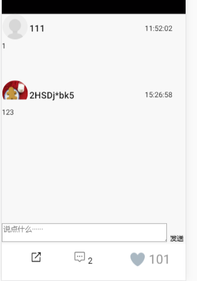
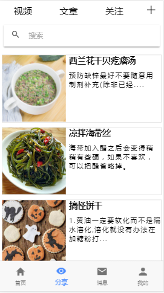
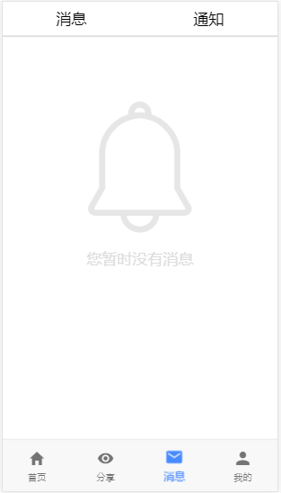
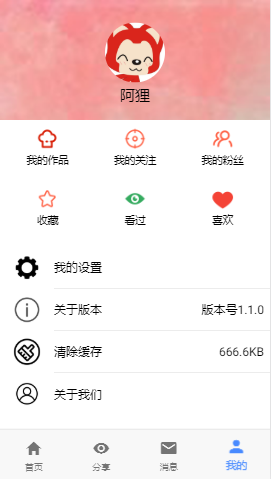
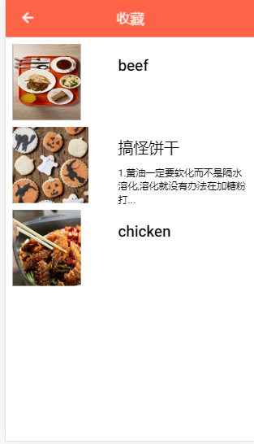

# 2016级项目实训成果展示 

## 《食途》 - HTML5与移动互联网开发方向

- GitHub : [https://github.com/wangqingshun/HTML5-Practical](https://github.com/wangqingshun/HTML5-Practical) 

### 项目简介

食途是一款推荐各地美食和优秀食材，以及帮你选择吃什么app。 
随着生活水平的提高，越来越多的人开始追求舌尖上的享受，纠结每日三餐，食途应用程序为你推荐美食及制作过程，提供美食分享的平台，在你纠结食物时，可以让系统自助为你选择。食途的上线，人们可以找到和做出更多的美食，满足自己的味蕾享受，这个应用程序不仅仅可以带来商业的价值，更是对美食的推广。 

### 项目成员

* 张成成（项目经理、前端工程师）
  * Email：1306073684@qq.com  
  * Github：https://github.com/zhangchengcheng123  
* 闫博文（前端工程师，UI设计）  
  * Email：942090534@qq.com
  * Github：https://github.com/Yanbowen1999
* 朱泓宇（前端工程师，UI设计）
  * Email：1315211512@qq.com
  * Gitthub：https://github.com/zhuhongyu6
* 王清顺（后端工程师、数据库管理员）
  * Email：2184801857@qq.com
  * Github：https://github.com/wangqingshun
* 陈自力（数据库管理员、测试）
  * Email：646582284@qq.com
  * Github：https://github.com/chenzilli
* 郭佳昊（后端工程师、数据库管理员）
  * Email：1113234417@qq.com
  * Github：https://github.com/Guojiahao7

### 运行效果

