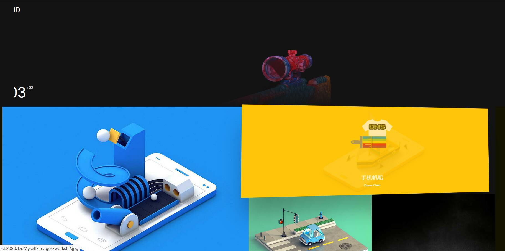
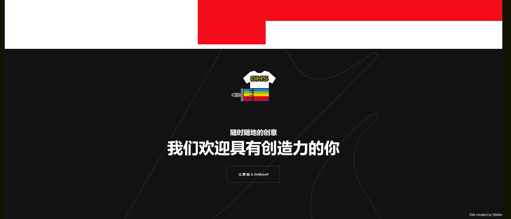
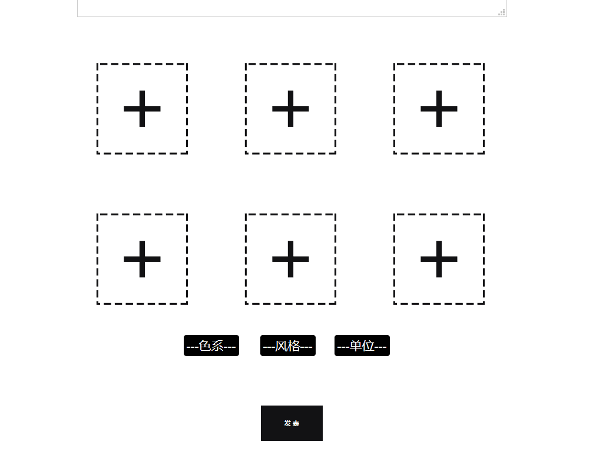
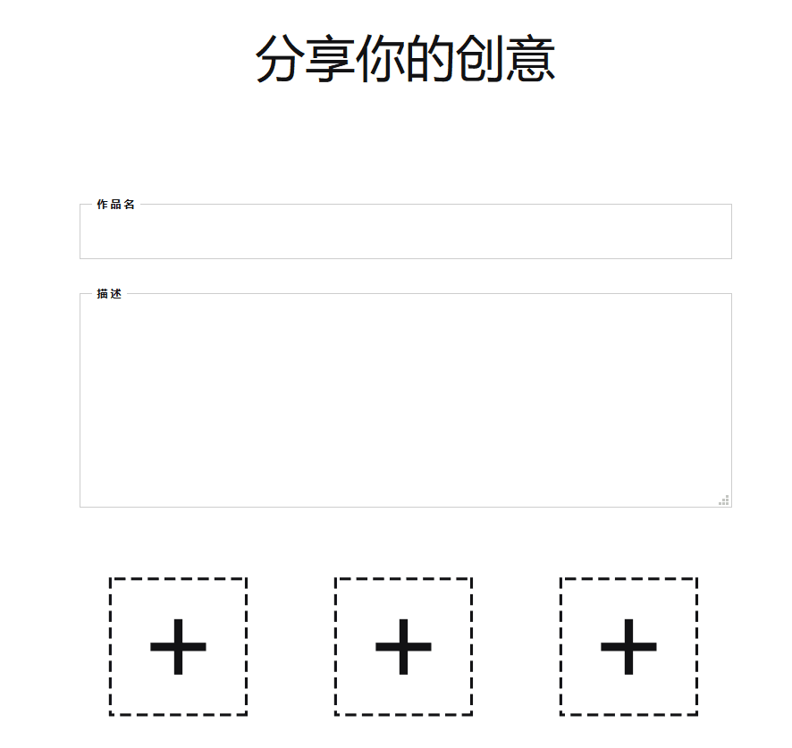
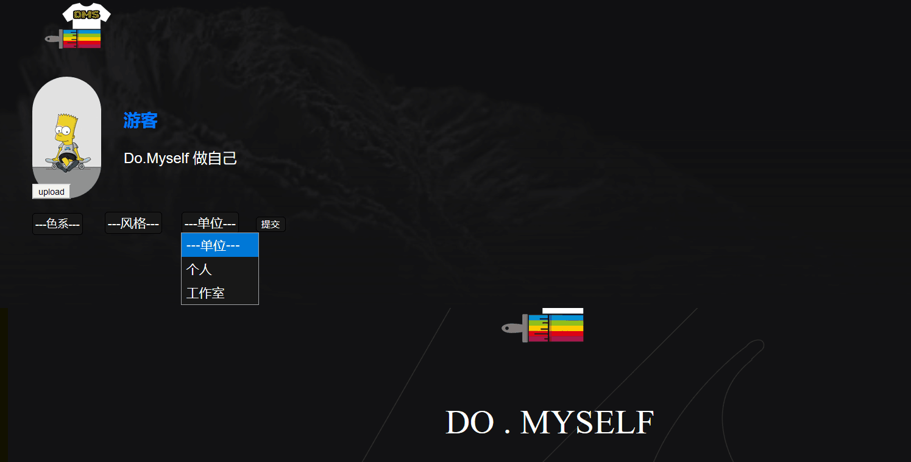
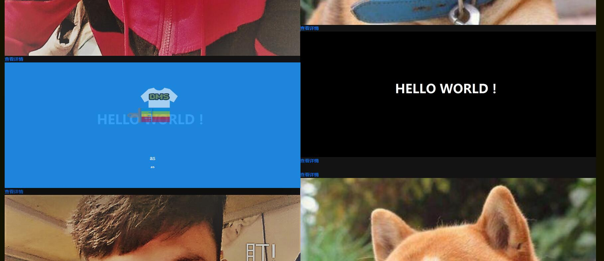
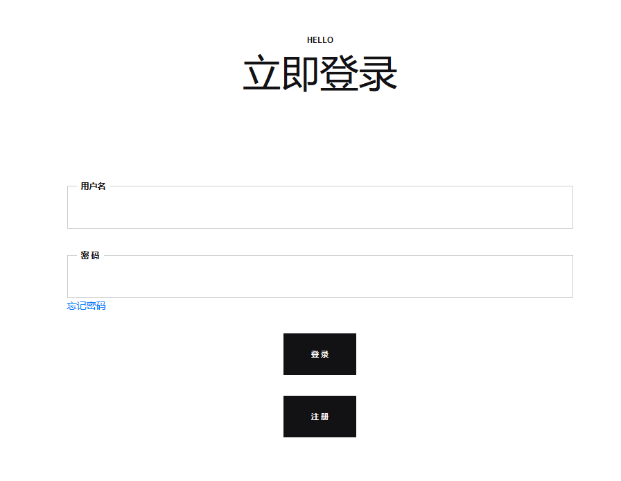
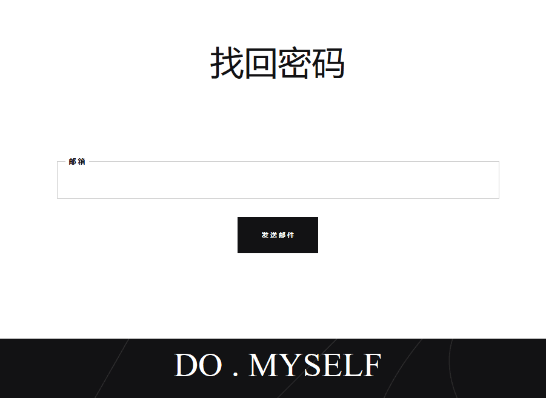

# 2016级项目实训成果展示 

## 《DoMySelf》 - Java与大数据分析方向

### 项目简介

DoMySelf是一个集社区服务，电子商务，网络零售的一个文化性的网站平台，随着人们的消费水平不断提高，越来越多的人在消费品的外观上有着自己的创意，所以我们组创作了一个以在线制作，绘图，涂鸦为主体的网站，用户能在网站上大胆释放自己的灵感创意，并将创意与一些消费品，如鞋服，家具，水杯，餐具结合起来，在平台上与平台合作的商铺进行交易，在缺乏创意灵感时候，可以在社区找到更多的创意作品，并进行交流。

### 项目地址

- Github : [https://github.com/chenpengyu1998/DoMyself](https://github.com/chenpengyu1998/DoMyself)

### 项目成员

- 陈鹏宇（项目经理、UI设计师、开发工程师、测试工程师）
  - Email：[1145693809@qq.com](1145693809@qq.com) 
  - Github：[www.github.com/chenpengyu1998](www.github.com/chenpengyu1998)
- 王志臻（市场总监、UI设计师、开发工程师、测试工程师）
  - Email：[379279146@qq.com](379279146@qq.com)
  - Github：[https://github.com/wangzhizhen1998](https://github.com/wangzhizhen1998)
- 张煜熙（技术总监、UI设计师、开发工程师、测试工程师）
  - Email：[479145955@qq.com](479145955@qq.com)
  - Github：[https://github.com/stephenz30](https://github.com/stephenz30)
- 易剑权（技术总监、UI设计师、开发工程师、测试工程师）
  - Email：[1355335683@qq.com](1355335683@qq.com)
  - Github：[https://github.com/yijianquan](https://github.com/yijianquan)

### 项目截图

