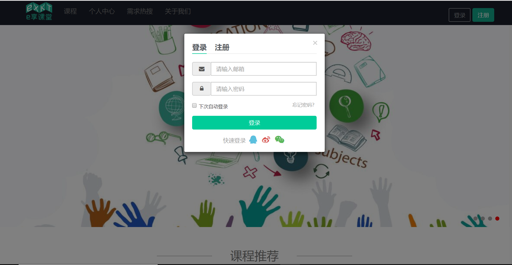
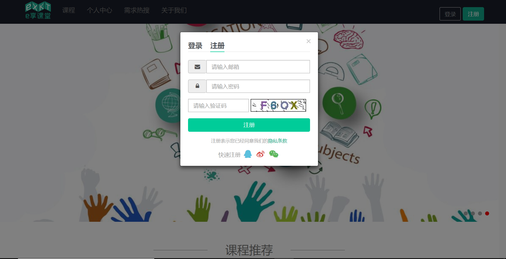
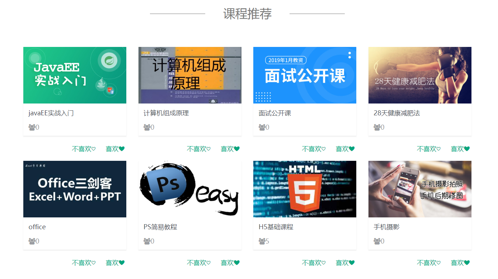
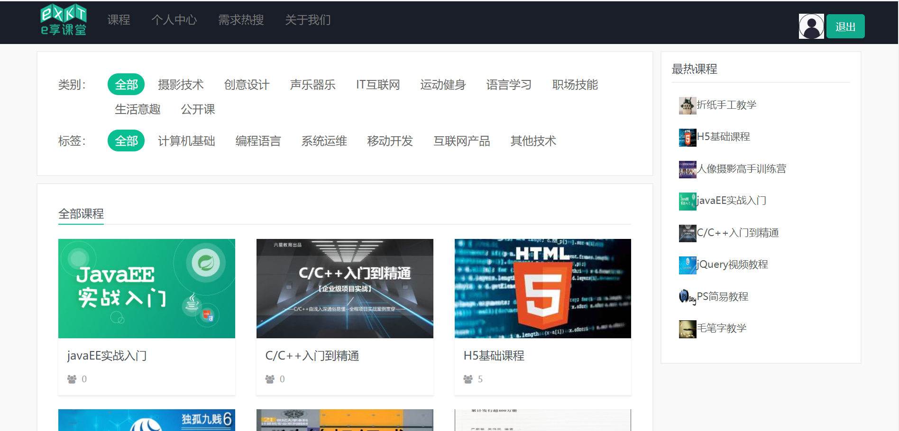
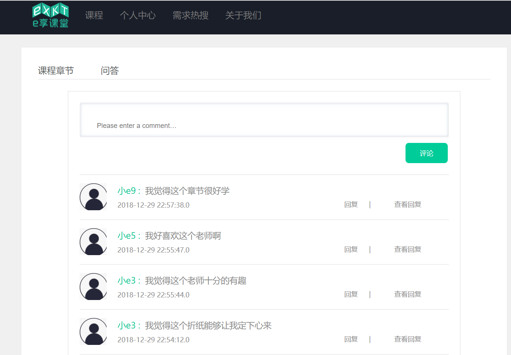
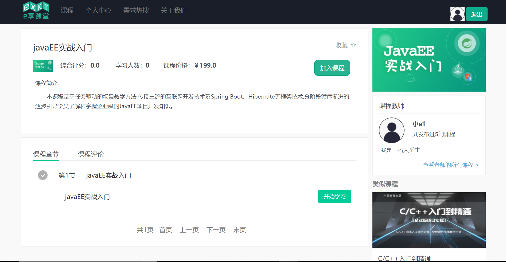
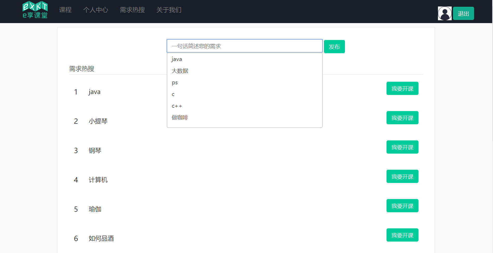
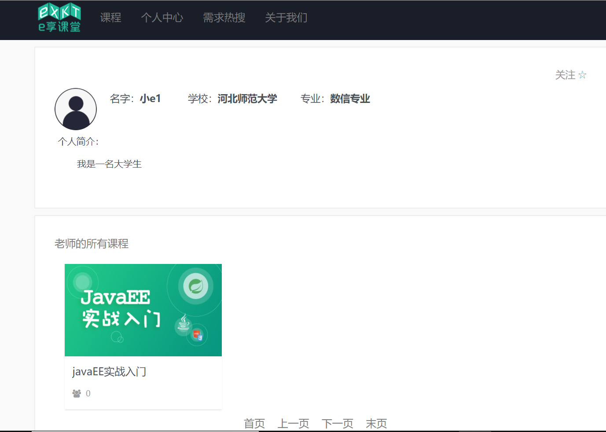
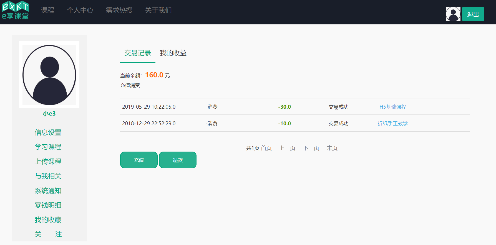

# 2016级项目实训成果展示 

## 《e享课堂》 - Java与大数据分析方向

### 项目简介

e享课堂是一款针对在校大学生的学习平台，给每个人提供“低门槛”当老师的机会，同时可以学习自己感兴趣的课程，平台提供线下预约场地的功能，满足大家组团学习等多样化需求，丰富大家的校园生活。

### 项目地址

- Github：[https://github.com/guoqiuxia/BigData-project.git](https://github.com/guoqiuxia/BigData-project.git)

### 项目成员

- 郭秋霞（项目经理、UI设计师、开发工程师、测试工程师）
  - Email：[m15132113028@163.com](mailto:m15132113028@163.com) 
  - Github：[https://github.com/guoqiuxia](https://github.com/guoqiuxia)
- 梁芳芳（市场总监、UI设计师、开发工程师、测试工程师）
  - Email：[m15227119655@163.com](mailto:m15227119655@163.com)
  - Github：[https://github.com/Liangfangfang97](https://github.com/Liangfangfang97)
- 刘珊珊（技术总监、UI设计师、开发工程师、测试工程师）
  - Email：[3449165425@qq.com](mailto:3449165425@qq.com)
  - Github：[https://github.com/liushanshan980908](https://github.com/liushanshan980908)
- 辛佳锟（技术总监、UI设计师、开发工程师、测试工程师）
  - Email：[1913829181@qq.com](mailto:1913829181@qq.com)
  - Github：[https://github.com/xinjiakun](https://github.com/xinjiakun)
- 张思嘉（产品经理、UI设计师、开发工程师、测试工程师）
  - Email：[m13932208353@163.com](mailto:2396515252@qq.com)
  - Github：[https://github.com/ZSJ-9](https://github.com/ZSJ-9)
- 梁雅茹（质量专家、UI设计师、开发工程师、测试工程师）
  - Email：[m15226538922@163.com](mailto:m15226538922@163.com)
  - Github：[https://github.com/liangyaru](https://github.com/liangyaru)

### 项目截图

- 首页

- 课程页

- 需求热搜

- 个人中心页

