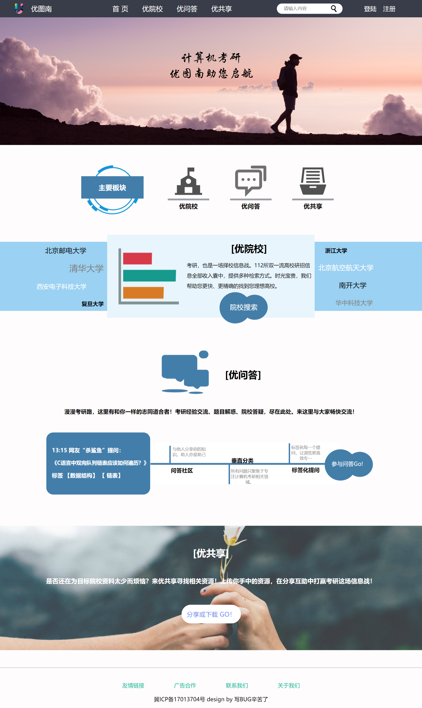
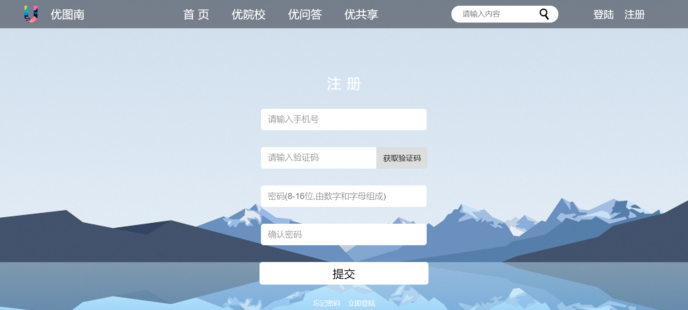
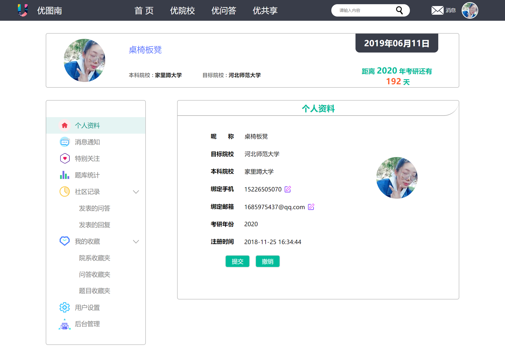
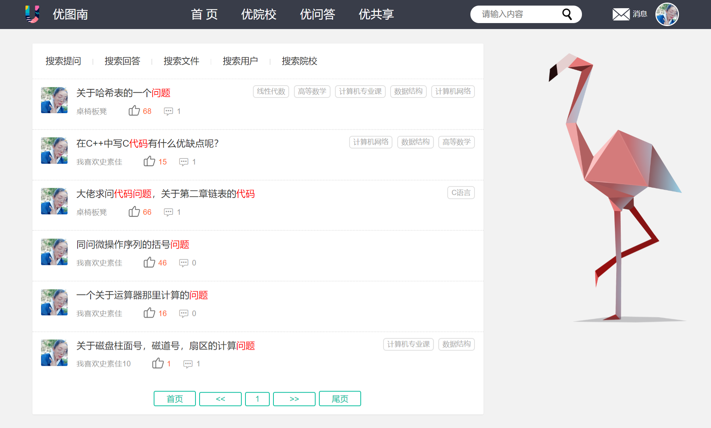
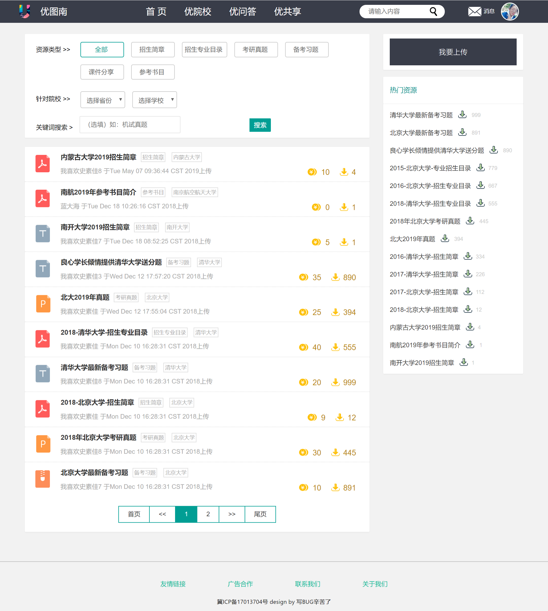
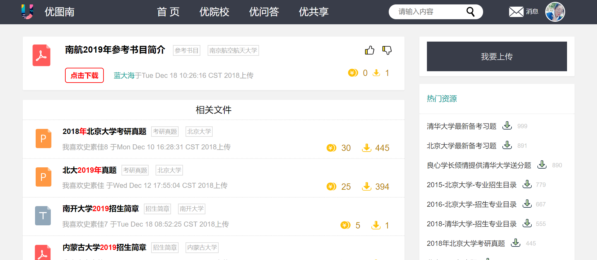
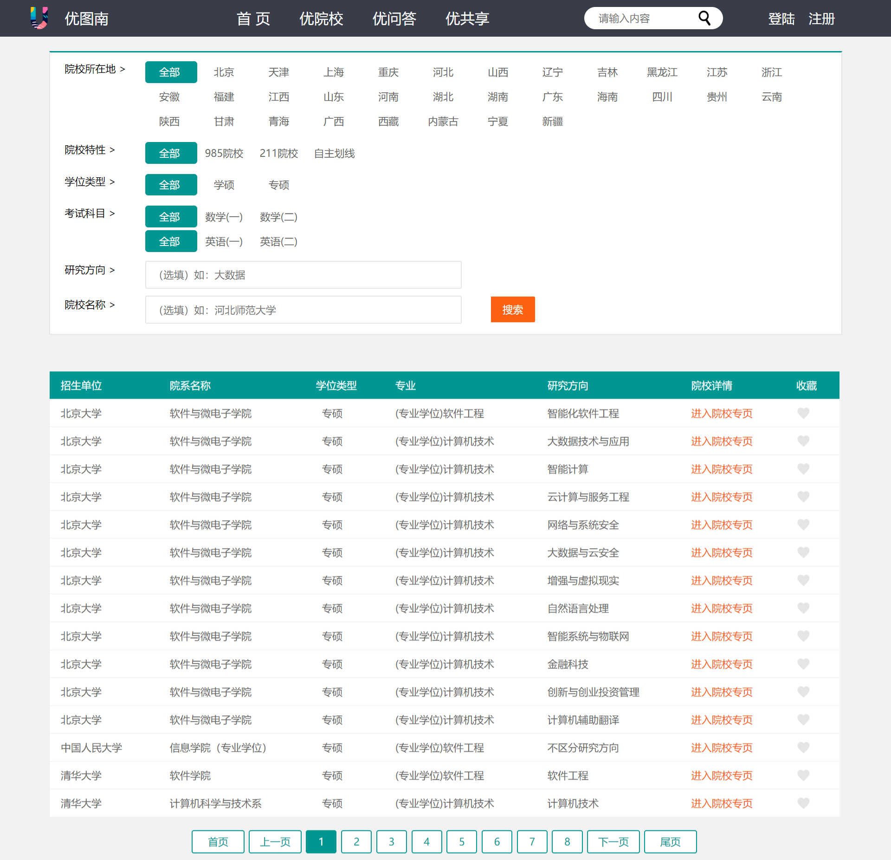
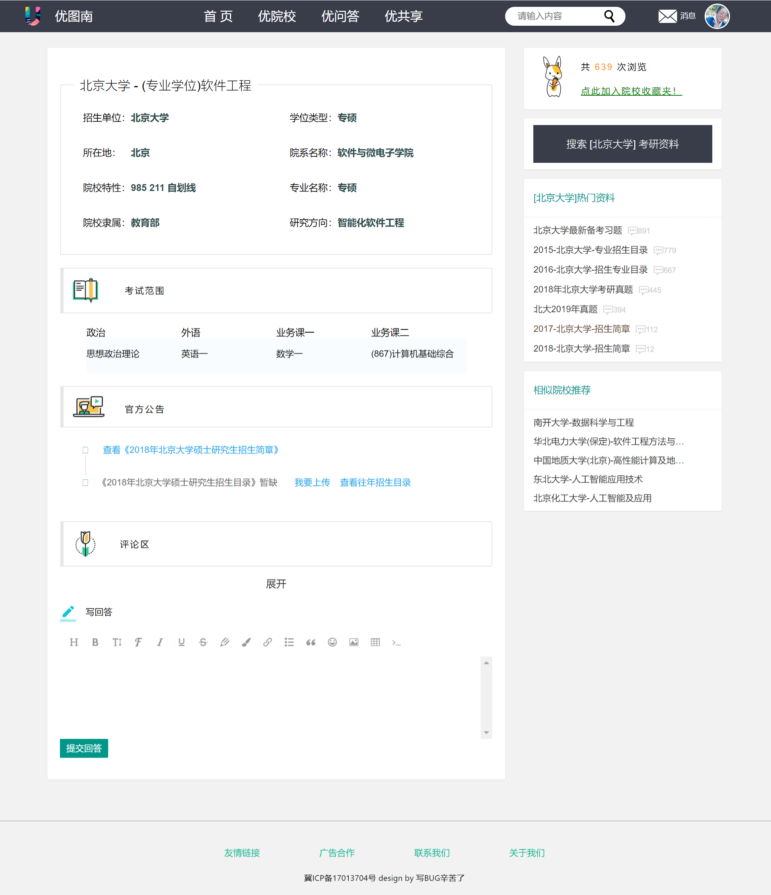
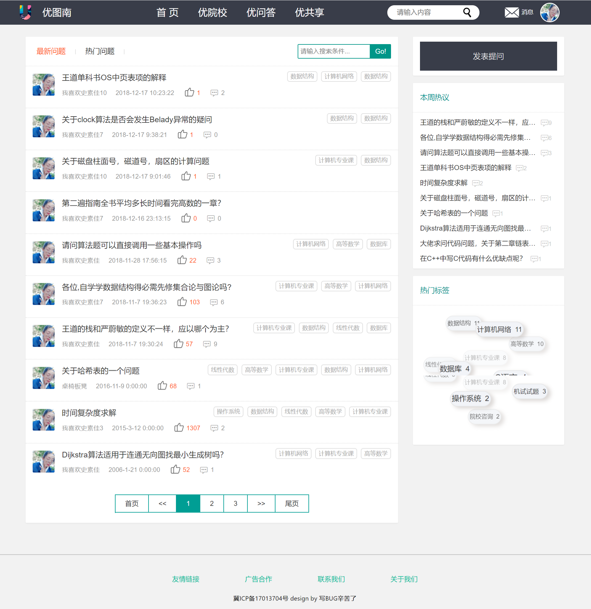
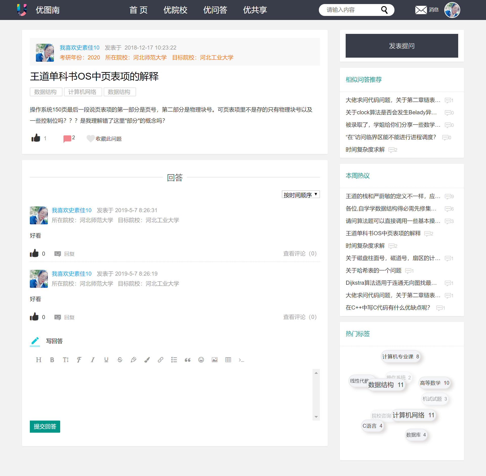

# 2016级项目实训成果展示 

## 《优图南》 - Java与大数据分析方向

### 项目简介

“背负青天而莫之夭阏者，而后乃今将图南”

考研，便是一条通往优秀的南征之路。考研的决心一旦作出就要义无反顾、勇往直前。

而《优图南》服务于计算机方向的考研者，助考研学子一臂之力。《优图南》涵盖三方面内容：院校招录信息，帮助考研者确立目标学校；资源分享，互助共享招考资料；互助问答，提供答疑解惑的平台，并辅以智能推荐提供个性化服务。《优图南》多方面、全方位协助计算机考研者高效备考。

### 项目地址

- Github：[https://github.com/Utunan/Utunan](https://github.com/Utunan/Utunan)

### 项目成员

- 唐溪（项目经理、UI设计师、开发工程师）
  - Github：[https://github.com/tangxi8823](https://github.com/tangxi8823)
- 王云弟（产品经理、开发工程师）
  - Github：[https://github.com/wangyundi1997](https://github.com/wangyundi1997)
- 王慧（技术总监、开发工程师、测试工程师）
  - Github：[https://github.com/wanghui1997](https://github.com/wanghui1997)
- 靳若琪（UI设计师、前端工程师、测试工程师）
  - Github：[https://github.com/jinruoqi2333](https://github.com/jinruoqi2333)
- 孙程程（数据库管理、开发工程师、测试工程师）
  - Github：[https://github.com/SunChengC1024](https://github.com/SunChengC1024)
- 张正扬（数据库管理、开发工程师、测试工程师）
  - Github：[https://github.com/zhangzhengyang1998](https://github.com/zhangzhengyang1998)

### 项目截图

