# 2016级项目实训成果展示 

## 《教学辅助工具》 - Java与大数据分析方向

### 项目简介

一款旨在提高本科教学质量的教学辅助系统，基于软件学院的教学模式，将电脑和教学有机地结合在一起。主要功能有人脸识别签到，师生共享屏幕，录屏，课堂反馈，资源共享，课堂小测。我们希望通过该软件增加课上的师生互动，提高学生的听课效率从而提升教学质量。

### 项目地址

- Github : [https://github.com/fangyz123/JavaSprits](https://github.com/fangyz123/JavaSprits)

### 项目成员

- 任玉媛（项目经理、开发工程师、需求专家）
  -Email：[1697562142@qq.com](mailto:1697562142@qq.com) 
  - Github：[https://github.com/renyuyuan](https://github.com/renyuyuan)
- 方玉珍（技术总监、产品经理、开发工程师、质量专家）
  - Email：[2254400231@qq.com](mailto:2254400231@qq.com) 
  - Github：[https://github.com/fangyz123](https://github.com/fangyz123)
- 何慧霞（市场总监、开发工程师）
  - Email：[1611980609@qq.com](mailto:1611980609@qq.com)
  - Github：[https://github.com/hehuixia](https://github.com/hehuixia)
- 栾晓玥（UI设计师、开发工程师）
  - Email：[416493968@qq.com](mailto:416493968@qq.com)
  - Github：[https://github.com/luanxiaoyue](https://github.com/luanxiaoyue)
- 张鼎（技术总监、开发工程师）
  - Email：[2630140493@qq.com](mailto:2630140493@qq.com)
  - Github：[https://github.com/Zhang-Ding](https://github.com/Zhang-Ding)
- 郭程媛（产品经理、开发工程师）
  - Email：[517949069@qq.com](mailto:517949069@qq.com)
  - Github：[https://github.com/LauraGuo](https://github.com/LauraGuo)
- 高天禹（UI设计师、开发工程师）
  - Email：[673539779@qq.com](mailto:1673539779@qq.com)
  - Github：[https://github.com/gaotianyu586](https://github.com/gaotianyu586)
- 赵旭（视觉总监、开发工程师）
  - Email：[1370442846@qq.com](mailto:1370442846@qq.com)
  - Github：[https://github.com/zhaoxu6666](https://github.com/zhaoxu6666)
- 陈若繁（测试工程师）
  - Email：[1297985138@qq.com](mailto:1297985138@qq.com)
  - Github：[https://github.com/chenruofan3274](https://github.com/chenruofan3274)

### 项目截图

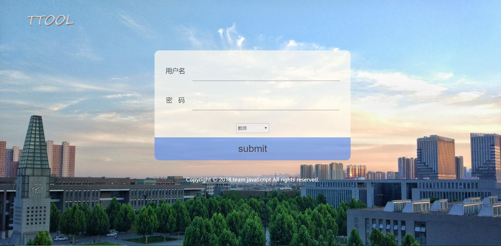

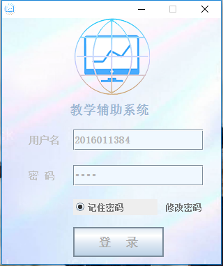

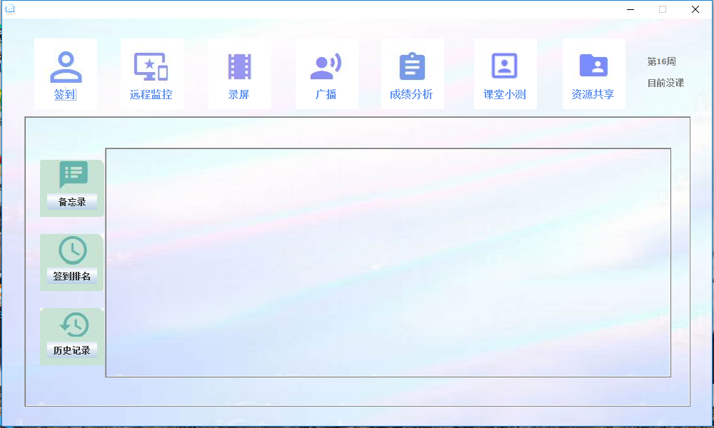
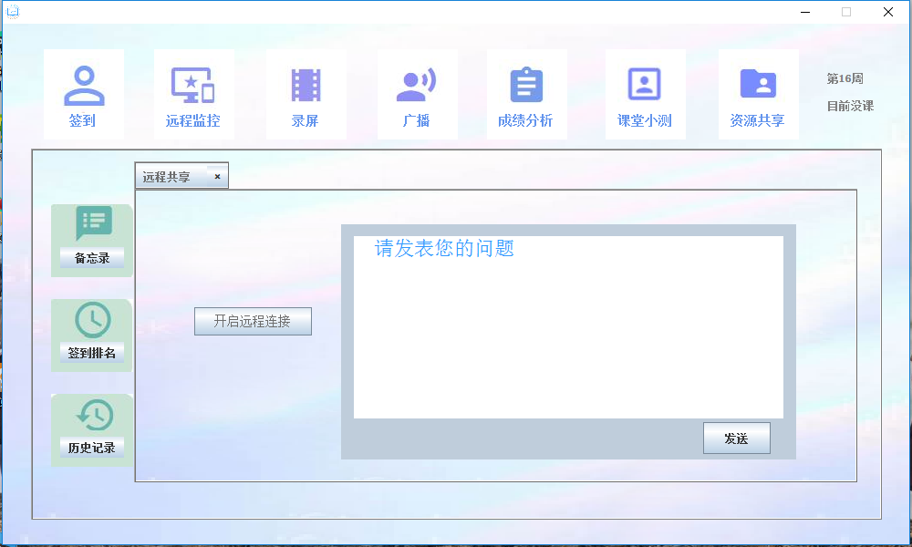

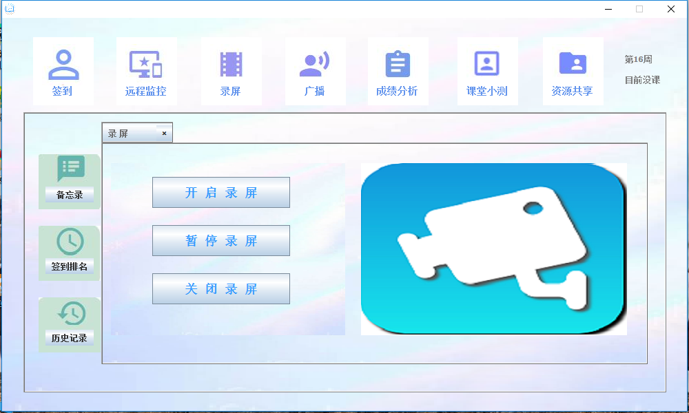
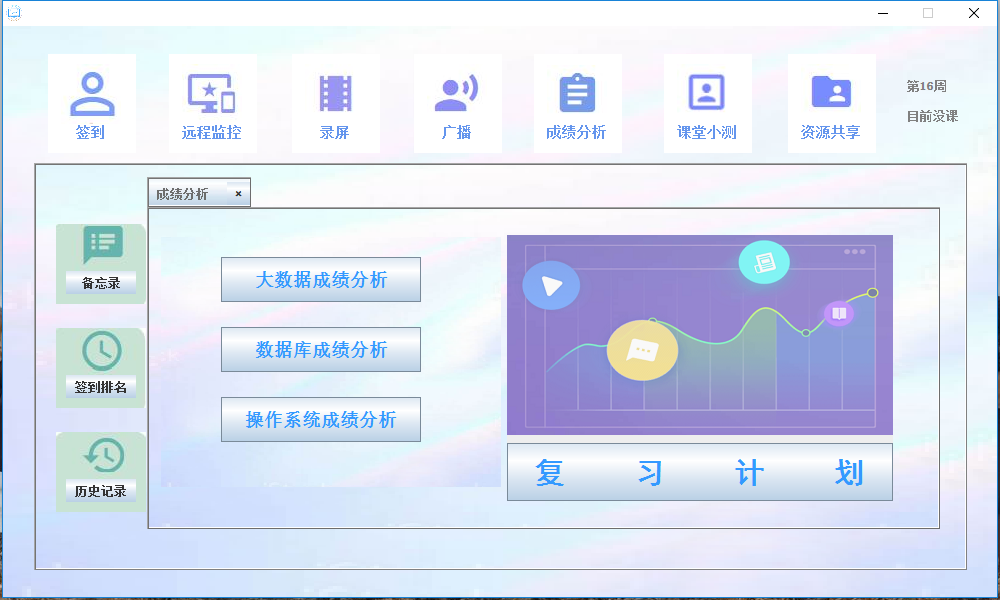

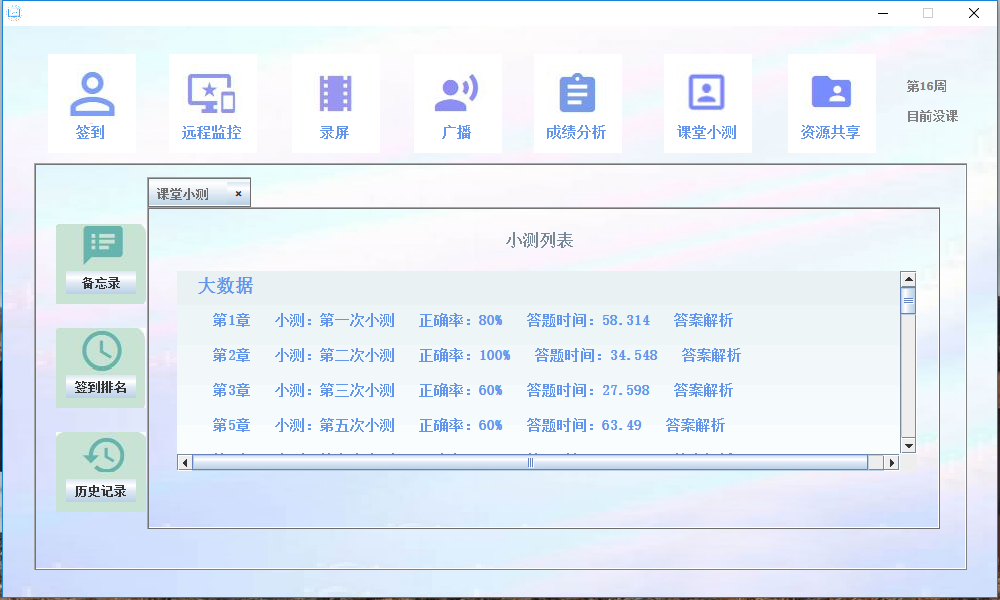
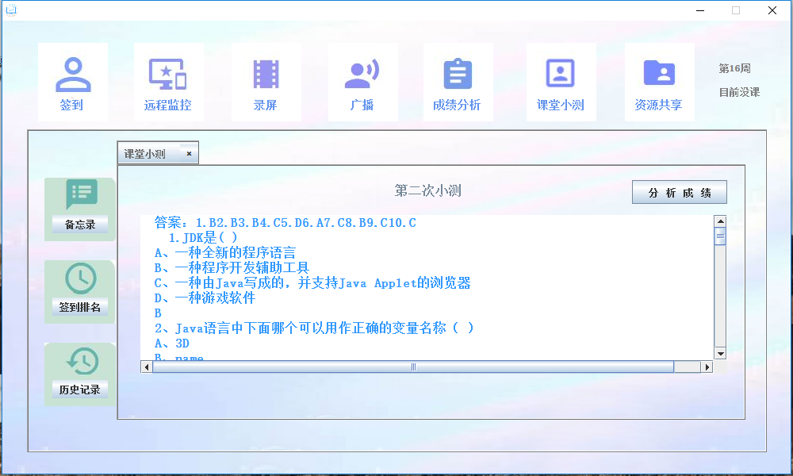

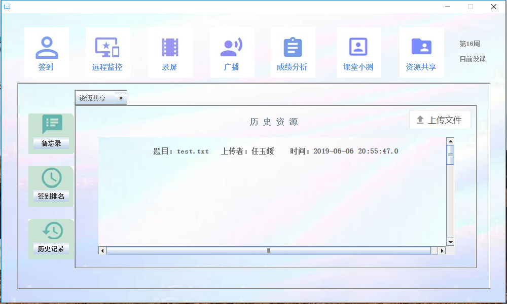
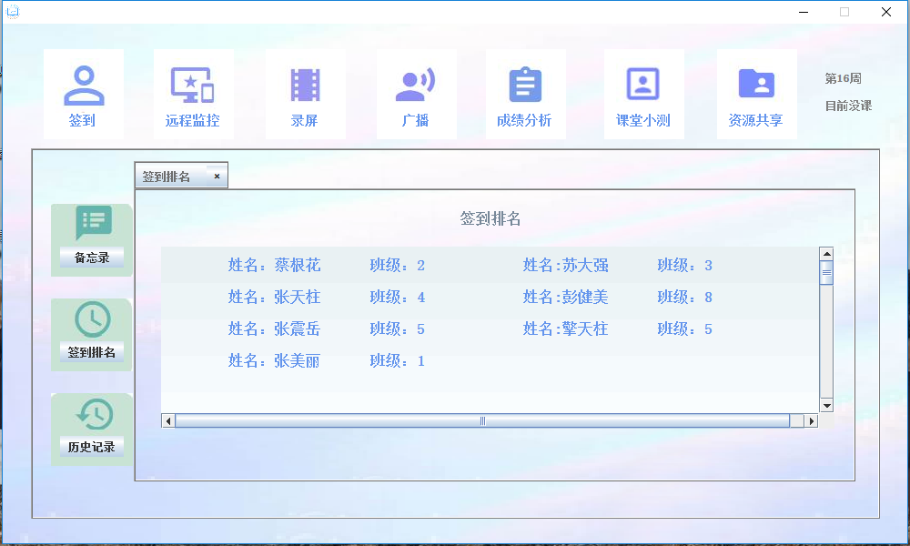

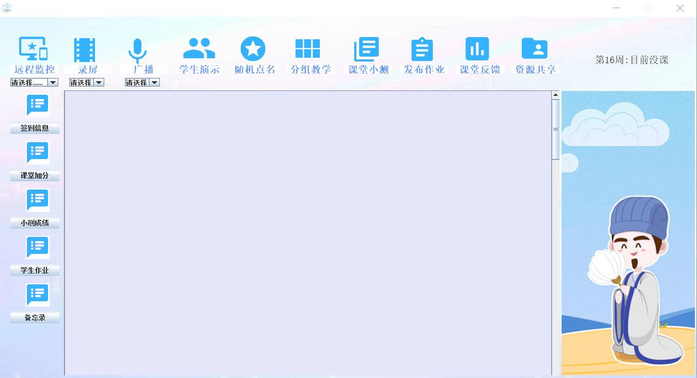
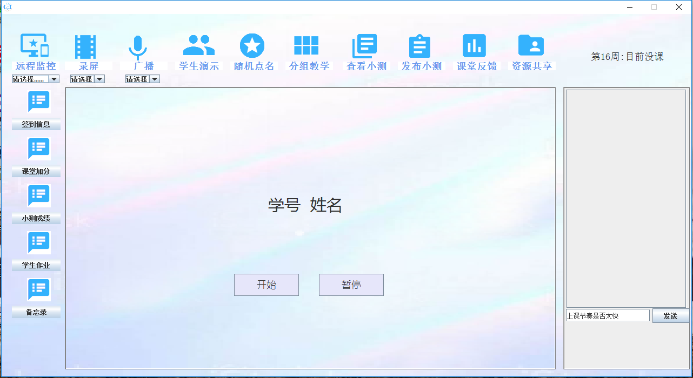

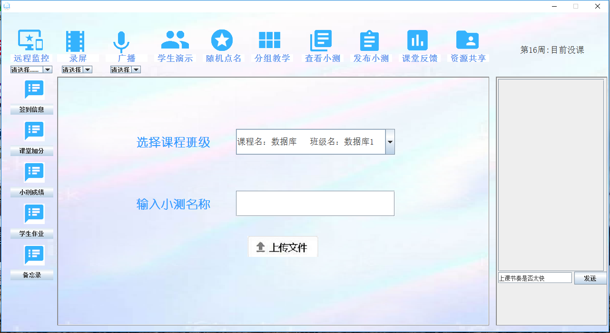
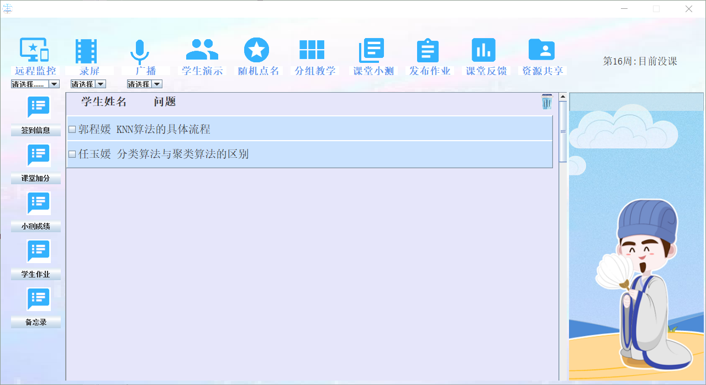

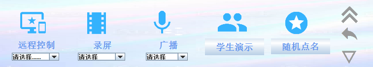

