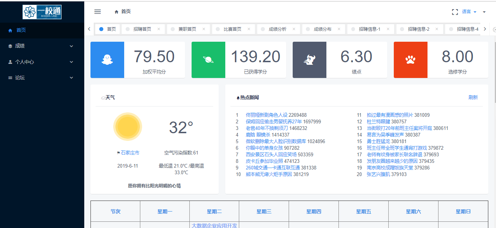
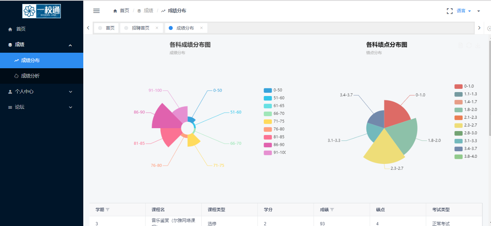
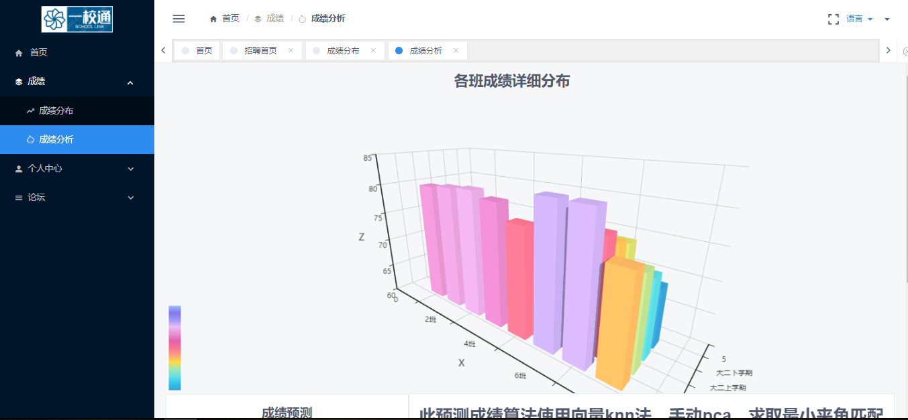
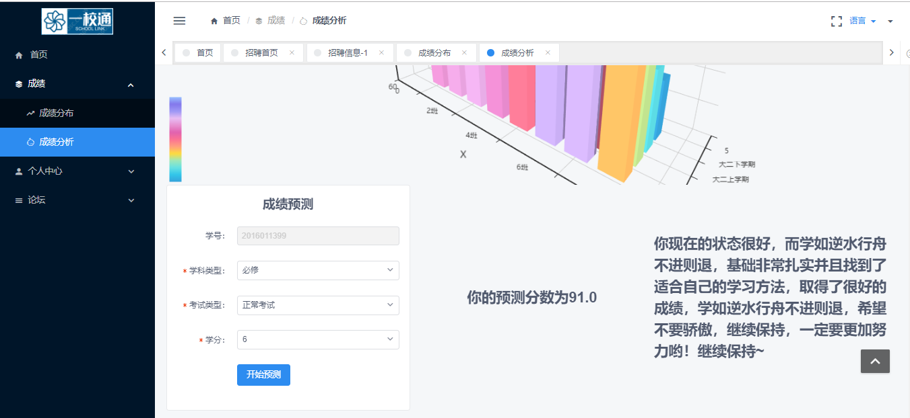
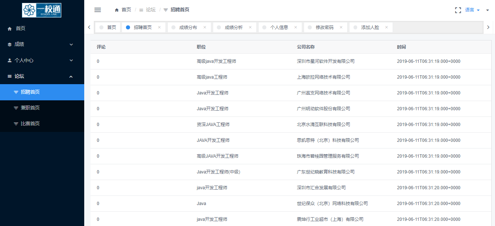
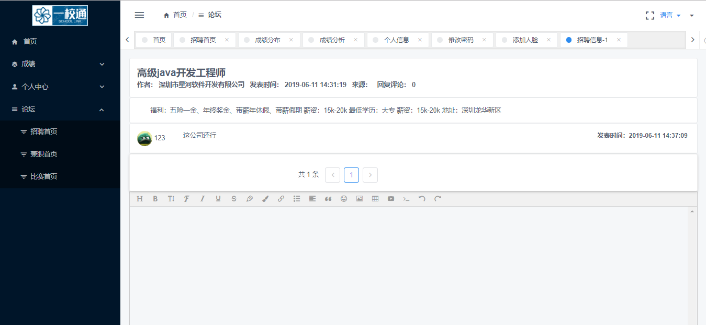

# 2016级项目实训成果展示 

## 《校园信息平台》 - Java与大数据分析方向

### 项目简介

本项目主要是为了给同学们提供一个便捷、条理清晰的信息服务平台，为同学们收集学习和生活方面的信息，并通过一定的处理和汇总，以简洁明了的方式向同学们展示这些信息。

### 项目地址

- Github：[https://github.com/guojinkang/school_Information](https://github.com/guojinkang/school_Information)

### 项目成员

- 郭金康（项目经理、UI设计师、开发工程师、测试工程师）
  - Email：[1473291402@qq.com](1473291402@qq.com) 
  - Github：[https://github.com/guojinkang](https://github.com/guojinkang)
- 袁云鹏（市场总监、UI设计师、开发工程师、测试工程师）
  - Email：[1013121161@qq.com](mailto:1013121161@qq.com)
  - Github：[https://github.com/yuanyunpeng](https://github.com/yuanyunpeng)
- 黄文旭（技术总监、UI设计师、开发工程师、测试工程师）
  - Email：[2214821343@qq.com](mailto:2214821343@qq.com)
  - Github：[https://github.com/2016011416](https://github.com/2016011416)
- 邬梓渌（技术总监、UI设计师、开发工程师、测试工程师）
  - Email：[748717911@qq.com](mailto:748717911@qq.com)
  - Github：[https://github.com/wuzilu](https://github.com/wuzilu)
- 李云洋（产品经理、UI设计师、开发工程师、测试工程师）
  - Email：[695511535@qq.com](mailto:695511535@qq.com)
  - Github：[https://github.com/liyunyang123](https://github.com/liyunyang123)
- 汪世昭（产品经理、UI设计师、开发工程师、测试工程师）
  - Email：[nobodynoway@qq.com](mailto:nobodynoway@qq.com)
  - Github：[https://github.com/wangshizhao](https://github.com/wangshizhao)
- 侯忠祺（质量专家、UI设计师、开发工程师、测试工程师）
  - Email：[948727781@qq.com](mailto:948727781@qq.com)
  - Github：[https://github.com/houzhongqi](https://github.com/houzhongqi)
- 黄军阳（质量专家、UI设计师、开发工程师、测试工程师）
  - Email：[1327087884@qq.com](1327087884@qq.com)
  - Github：[https://github.com/huangjunyang1](https://github.com/huangjunyang1)

  ### 项目截图
  

