# 2016级项目实训成果展示 

## 《行途》 - Java与大数据分析方向

### 项目简介

你的旅行管家，独一份的安排，个性化的行程，让你计划之中走遍天下，回忆林中定向穿梭！

在物质生活越来越丰富的今天，你是否希望得到更多心灵中的馈赠。

旅行，成为了我们生活中不可或缺的一项活动。

但每次出行前，你是否也有过困扰？不知道去哪里玩？不知道哪里好玩？不知道时间怎么安排？跟团总是会有不尽如人意的地方，自驾又好像总是安排不妥当？

用行途！你的专属旅行管家，为你个性化定制你的行程，让你合理安排时间，每一次旅行都合心合意！

出行之后，你是否有很多的回忆想要留下，很多美好的事情，想要记录？

用行途！记录出行点滴美好。锁住美好回忆！

照片繁多，时间久远，你是否已经忘了当初的笑脸是在什么样的场景中？在哪里？跟什么人在一起？

用行途！帮助你去记录你的回忆信息，让你定向回忆！

### 项目地址
- Github：[https://github.com/baocaiqian/QTL-JAVA](https://github.com/baocaiqian/QTL-JAVA)

### 项目成员

- 鲍彩倩（项目经理、UI设计师、开发工程师、测试工程师）
  - Email：[2952635041@qq.com](mailto:2952635041@qq.com) 
  - Github：[https://github.com/baocaiqian](https://github.com/baocaiqian)
- 田悦霖（市场总监、UI设计师、开发工程师、测试工程师）
  - Email：[1098484059@qq.com](mailto:1098484059@qq.com)
  - Github：[https://github.com/tianyuelin](https://github.com/tianyuelin)
- 薛云晴（技术总监、UI设计师、开发工程师、测试工程师）
  - Email：[2404226102@qq.com](mailto:2404226102@qq.com)
  - Github：[https://github.com/xueyunqing](https://github.com/xueyunqing)
- 田实（技术总监、UI设计师、开发工程师、测试工程师）
  - Email：[240436170@qq.com](mailto:240436170@qq.com)
  - Github：[https://github.com/240436170](https://github.com/240436170)
- 孙晴晴（产品经理、UI设计师、开发工程师、测试工程师）
  - Email：[1669256211@qq.com](mailto:1669256211@qq.com)
  - Github：[https://github.com/sunqingqing213](https://github.com/sunqingqing213)
- 瞿婷婷（质量专家、UI设计师、开发工程师、测试工程师）
  - Email：[1581015545@qq.com](mailto:1581015545@qq.com)
  - Github：[https://github.com/qutingting1998]https://github.com/qutingting1998)
- 齐雪婷（数据库设计师、UI设计师、开发工程师、测试工程师）
  - Email：[598422315@qq.com](mailto:598422315@qq.com)
  - Github：[https://github.com/QiXueting](https://github.com/QiXueting)

### 项目截图

<h3>欢迎页</h3>
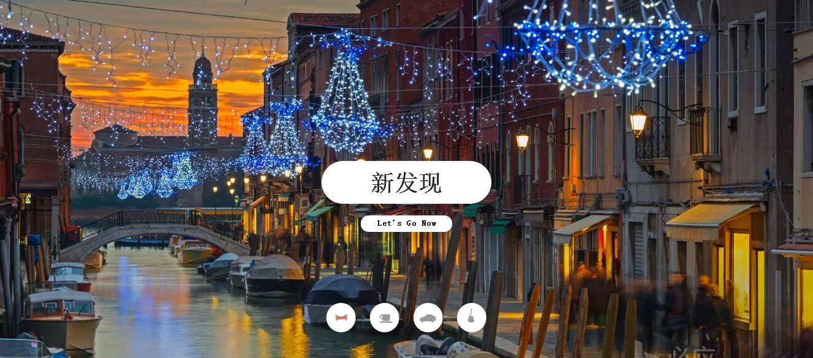

<h3>首页</h3>

<h3>景点列表页</h3>
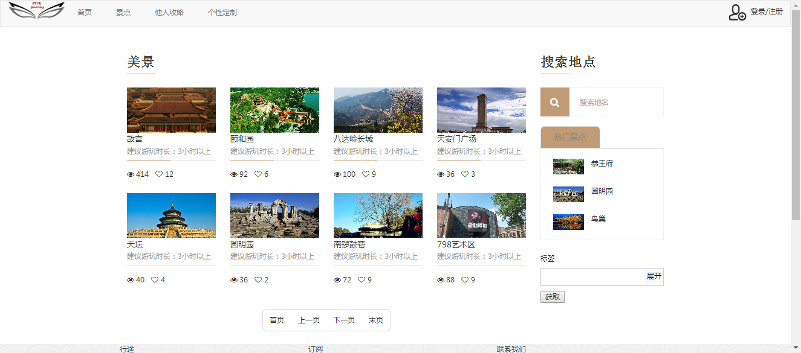

<h3>攻略列表页</h3>
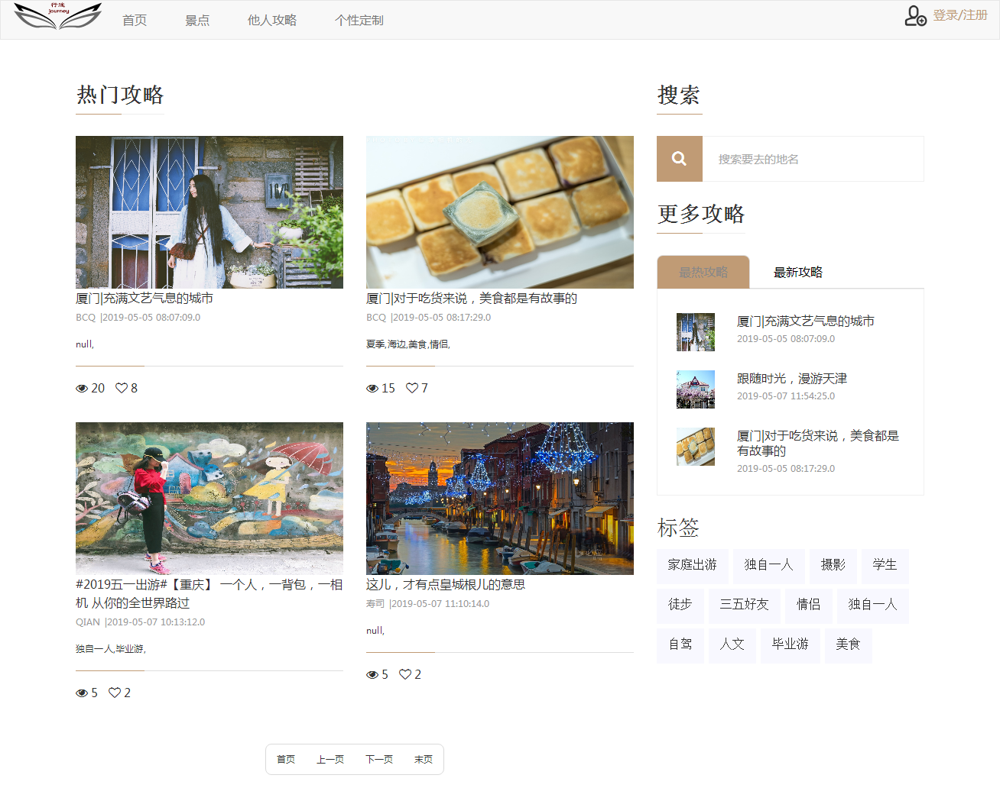

<h3>登录</h3>
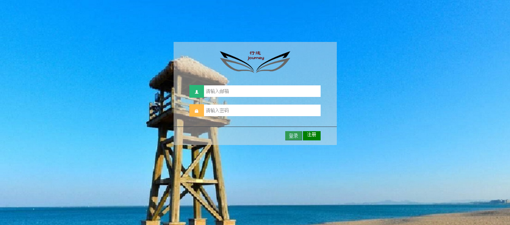

<h3>个人空间</h3>
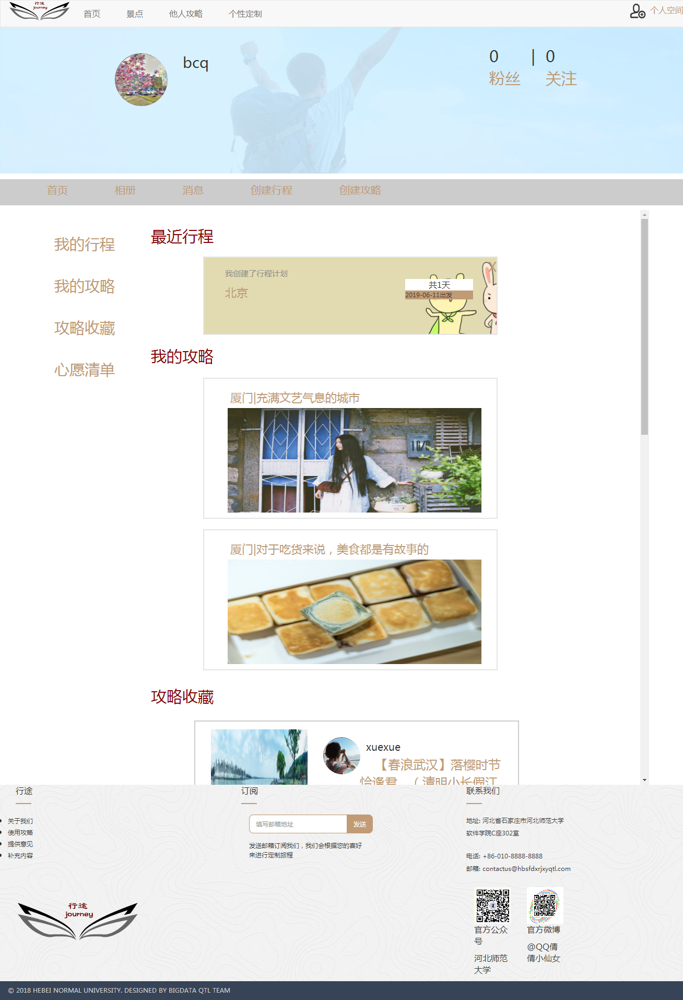

<h3>相册</h3>

<h3>攻略展示页</h3>

<h3>行程展示页</h3>
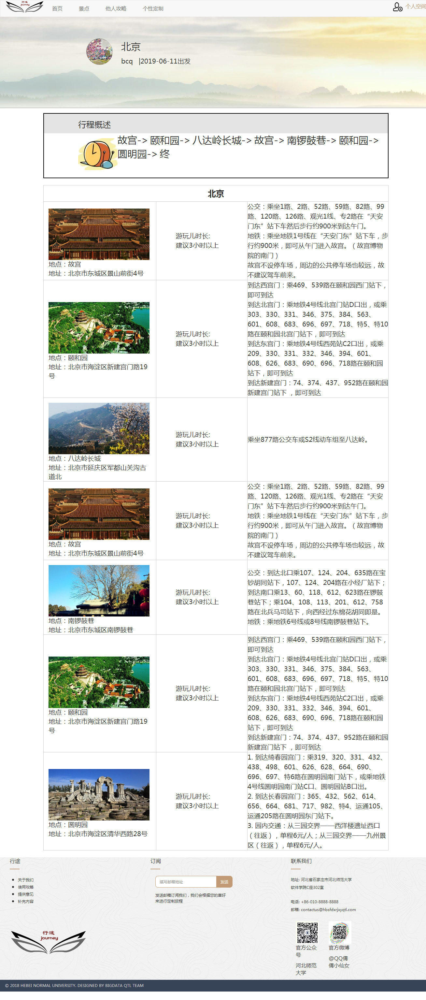

<h3>创建行程页</h3>
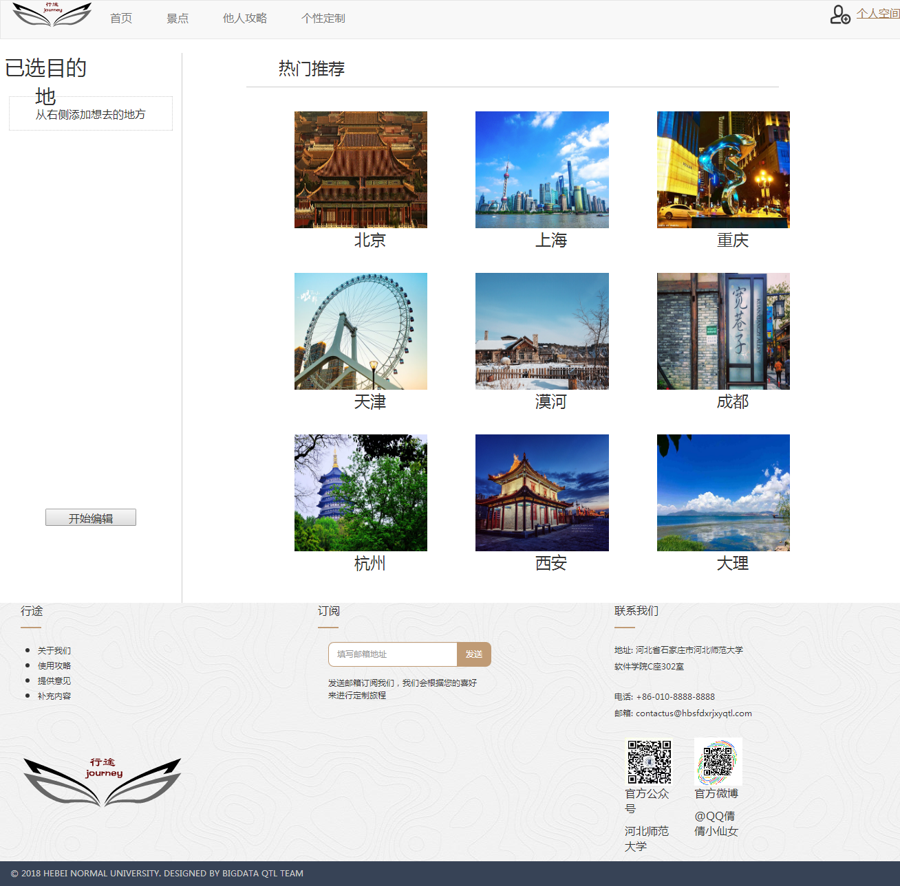
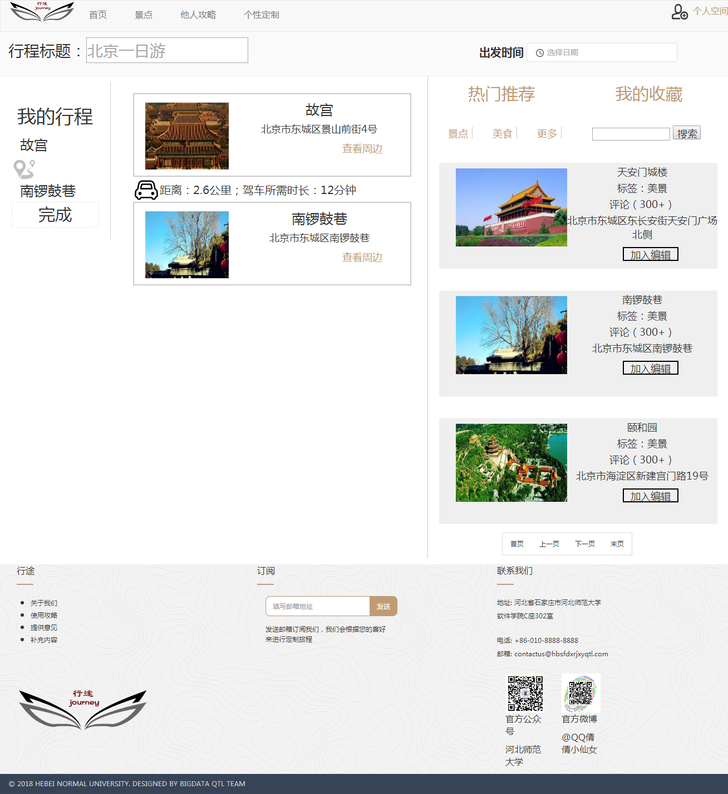

<h3>创建攻略</h3>
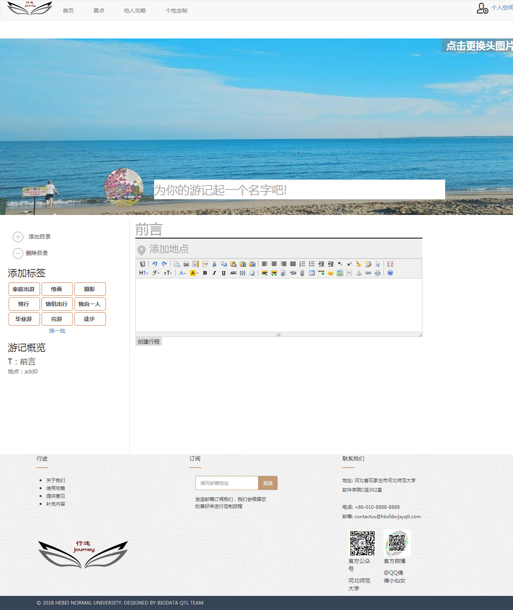

<h3>照片操作</h3>
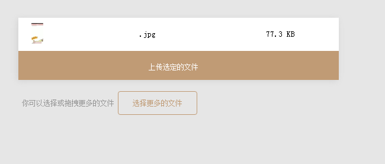
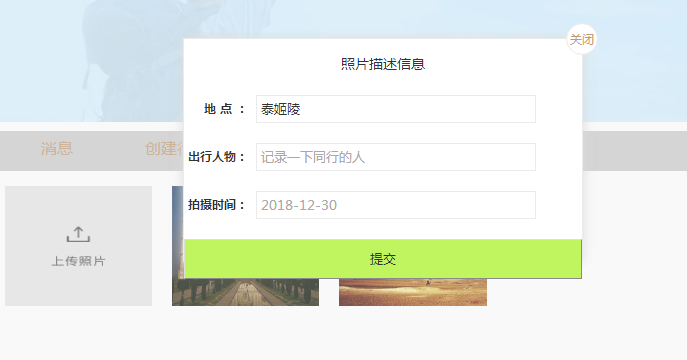
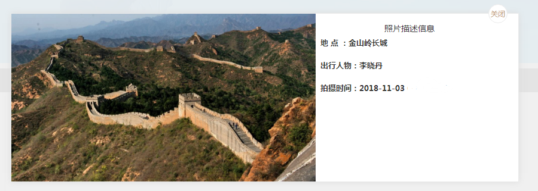
