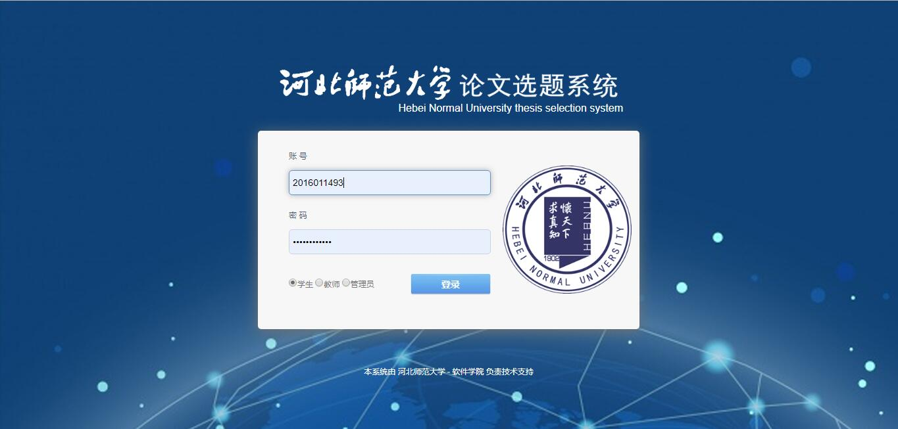
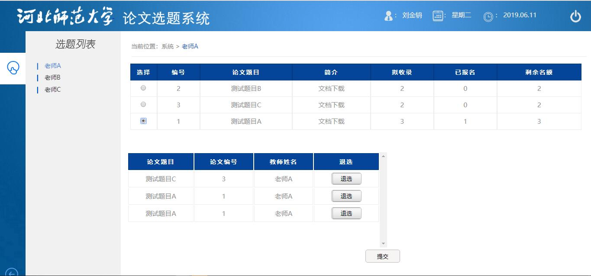

# 2016级项目实训成果展示 

## 《论文选题系统》 - Java与大数据分析方向

### 项目简介

每年一度的毕业季，学生的一门关键必修课为毕业设计。学生需要与开课题的老师联系，沟通方式通常基于短信、QQ、口述等方式，可能会出现老师遗漏学生的情况，那么就造成了学生与老师之间的矛盾。

学生可能不知道那些老师的课题有名额剩余量导致选不上课，自己也不主动打听，需要教务老师反复询问各位老师确定那些老师的课题有剩余量再反馈到学生。同时，老师也不知道大部分学生的在校情况，那么就会造成自己所带的毕设学生可能含有在毕设设计阶段非常不积极主动的人。

在论文设计阶段，当学生论文内容出现的时候，学生需要找到老师进行当面沟通再返工，如果有的学生不在校，那么需要电话沟通，通常电话沟通的时长不短造成的经济开销不小。

### 项目地址

- Github：[https://github.com/HBSDLJZ/lunwen](https://github.com/HBSDLJZ/lunwen)

### 项目成员

- 刘金辀（项目经理、UI设计师、开发工程师、测试工程师）
  - Email：[1242353902@qq.com](mailto:1242353902@qq.com) 
  - Github：[https:https://github.com/HBSDLJZ](https:https://github.com/HBSDLJZ)
- 李春良（市场总监、UI设计师、开发工程师、测试工程师）
  - Email：[lichunliang8521@163.com](mailto:lichunliang8521@163.com)
  - Github：[https://github.com/lichunliang1997](https://github.com/lichunliang1997)
- 丁泽仁（技术总监、UI设计师、开发工程师、测试工程师）
  - Email：[DZROVAL@163.com](mailto:DZROVAL@163.com)
  - Github：[https://github.com/DZROVAL](https://github.com/DZROVAL)
- 孙亦璇（技术总监、UI设计师、开发工程师、测试工程师）
  - Email：[2908673445@qq.com](mailto:2908673445@qq.com)
  - Github：[https://github.com/WangMing6ban](https://github.com/WangMing6ban)
- 白晨皓（产品经理、UI设计师、开发工程师、测试工程师）
  - Email：[1441448530@qq.com](mailto:1441448530@qq.com)
  - Github：[https://github.com/baichenhao](https://github.com/baichenhao)
- 徐昌隆（质量专家、UI设计师、开发工程师、测试工程师）
  - Email：[718416039@qq.com](mailto:718416039@qq.com)
  - Github：[https://github.com/xuchanglong123](https://github.com/xuchanglong123)
- 倪泽苒（质量专家、UI设计师、开发工程师、测试工程师）
  - Email：[1005796431@qq.com](mailto:1005796431@qq.com)
  - Github：[https://github.com/nizeran469](https://github.com/nizeran469)

### 项目截图

