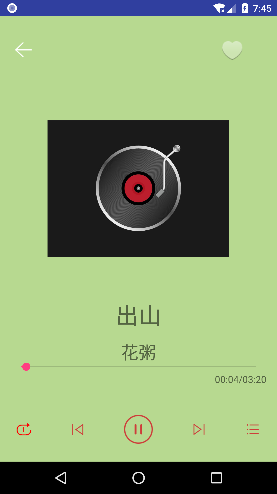
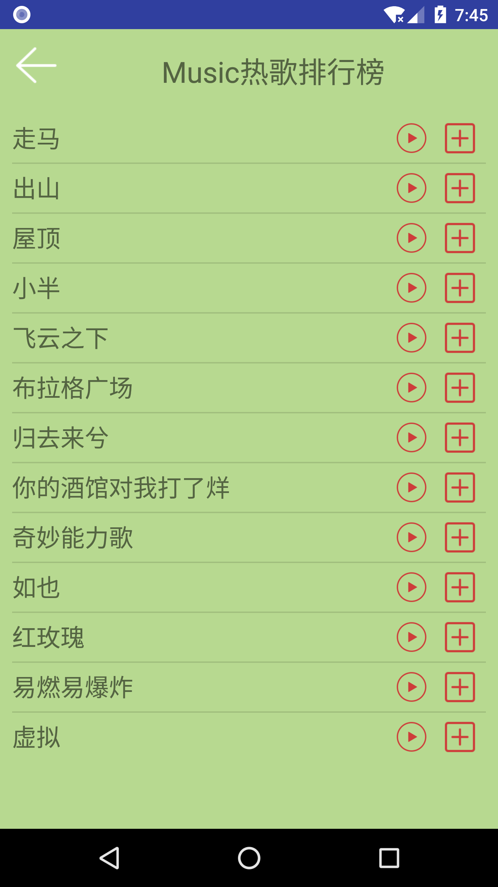
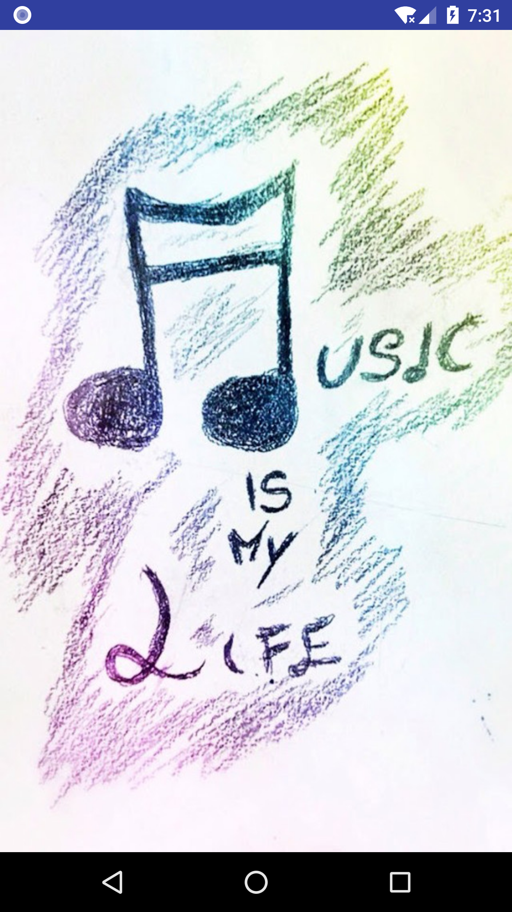
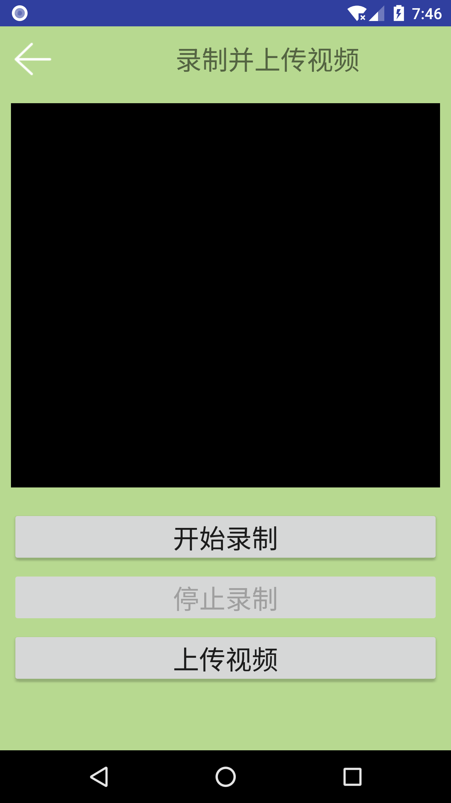

# 2016级项目实训成果展示 

## 《MyMusic》 -  Java与移动智能设备开发方向

###  项目简介

Mymusic是一款为用户提供正版音乐服务以及相关的搜索服务的音乐APP，。以“透过技术与艺术并重的服务，使听众随时随性享受音乐，让音乐人找到知音且取得商业成功”为使命，Mymusic致力于为用户提供在线听歌，以及为用户提供直接、丰富试听体验的在线音乐内容。“我的音乐”播放器不仅满足用户在线听歌需求，还为用户提供了拍摄视频、上传视频等功能。

###  项目地址

- Github：[https://github.com/shengxingli/Music.git](https://github.com/shengxingli/Music.git)

###  项目成员

-李胜星（项目经理、UI设计师、开发工程师、测试工程师）
  - Email：[761972440.@qq.com](mailto:761972440.@qq.com) 
  - Github：[https://github.com/shengxingli](https://github.com/shengxingli)

-赵晨鹤（技术总监、UI设计师、开发工程师、测试工程师）
  - Email：[1946109049@qq.com](mailto:1946109049@qq.com)
  - Github：[https://github.com/chenhezhao](https://github.com/chenhezhao)

###  项目截图

