# 2016级项目实训成果展示 

## 《RivenMusic》 -  Java与移动智能设备开发方向

###  项目简介

RIVEN MUSIC手机客户端是一款音乐软件。

作为一款音乐软件，RIVEN MUSIC除了最基本的音乐查询，音乐播放，音乐下载的功能外，还具有论坛，定位，分享，评论，推荐功能。

RIVEN MUSIC为喜爱音乐的人提供一个分享自我，收获快乐的平台，用户可以在这里说自己想说的，听自己爱听的，聊自己想聊的。

### 项目地址

- Github：[https://github.com/kimskylines/Riven-Music](https://github.com/kimskylines/Riven-Music)

### 项目成员

- 金鼎龙（项目经理、UI设计师、开发工程师、测试工程师）
  - Email：2099726689@qq.com
  - Github：https://github.com/kimskylines/
- 王志岗（UI设计师、开发工程师、测试工程师）
  - Email：lianpuyanhua@163.com
  - Github：https://github.com/wangzhigang2016
- 敬欢（UI设计师、开发工程师、测试工程师）
  - Email：1059726539@qq.com
  - Github：暂无
  
### 项目截图

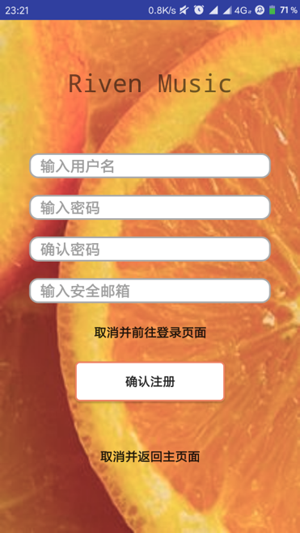
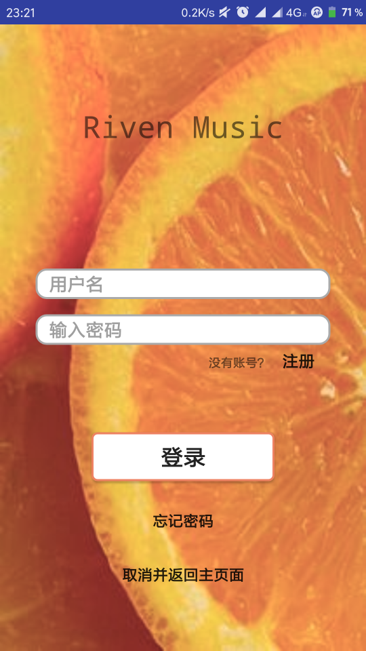
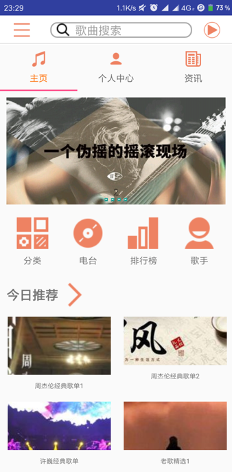

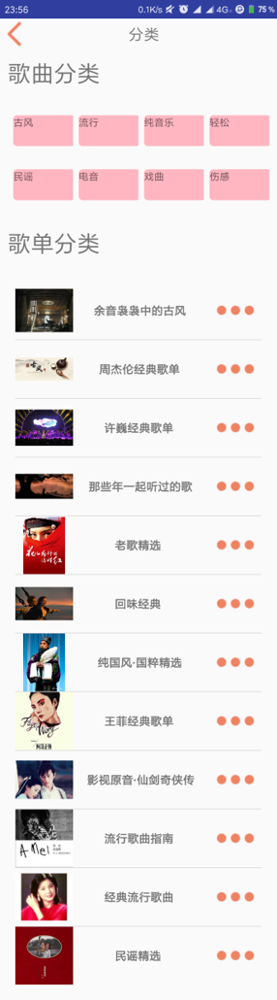
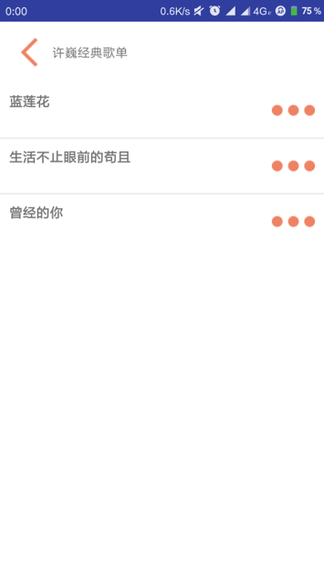

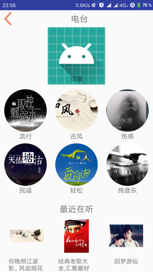
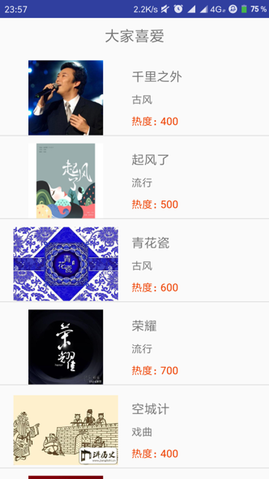
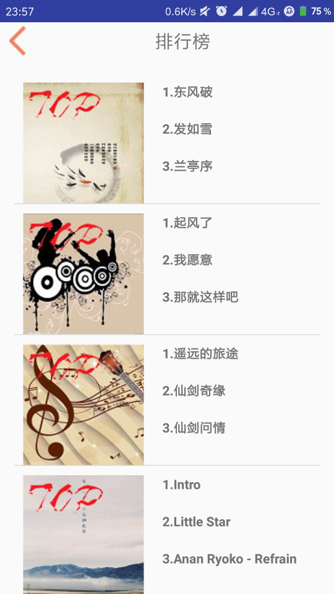

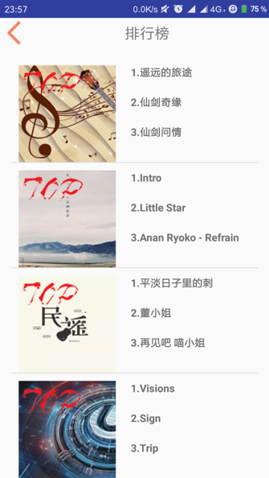

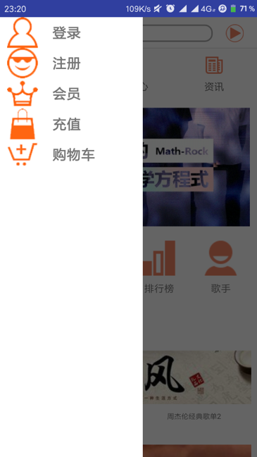
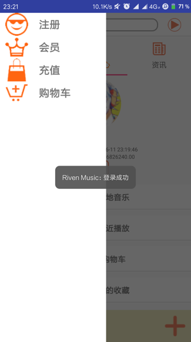

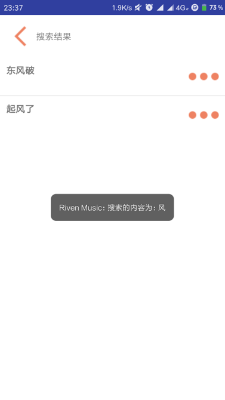
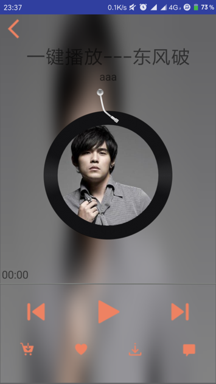

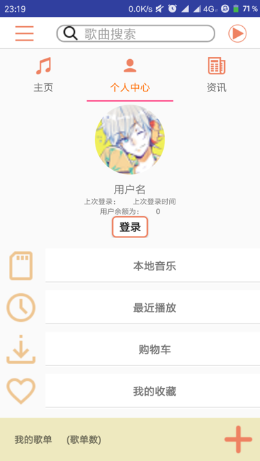

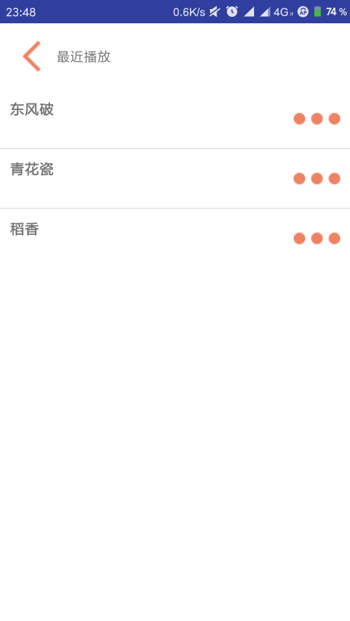

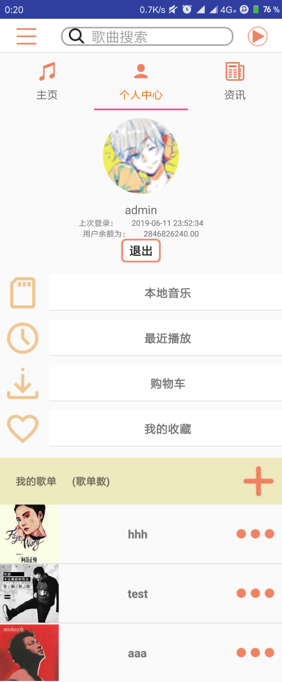
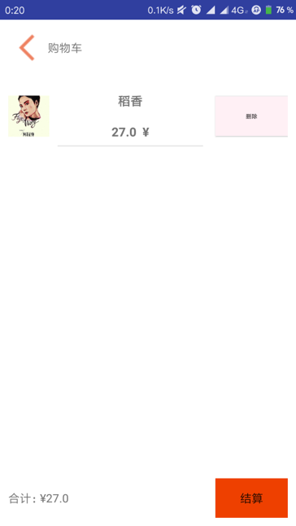
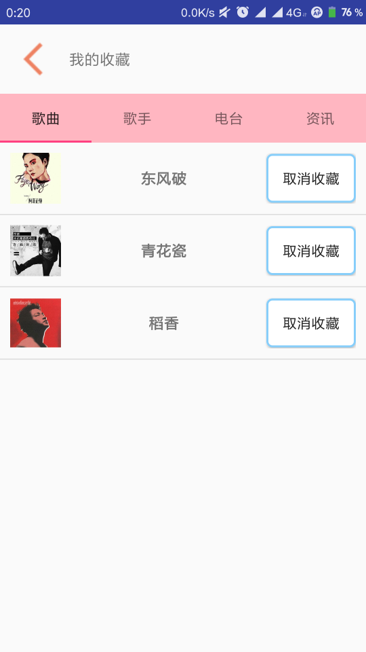

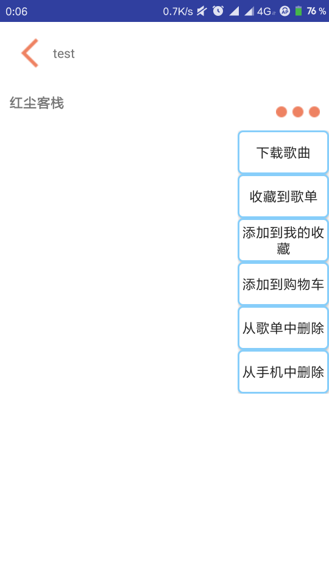
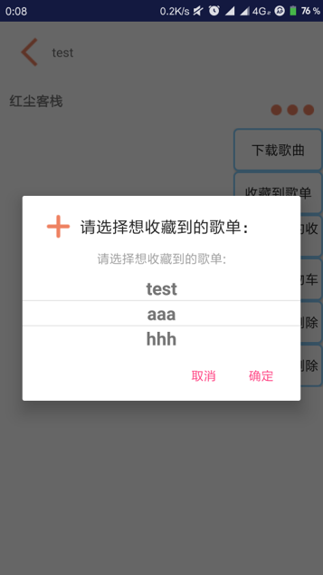
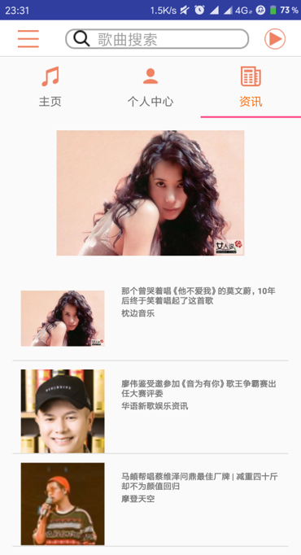

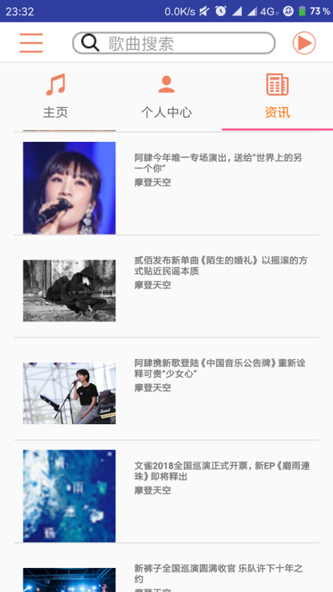
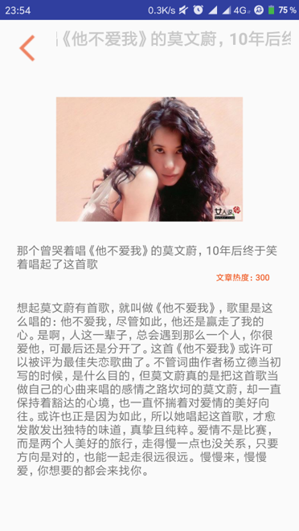

