# 2016级项目实训成果展示 

## 《SchoolHelper》 -  Java与移动智能设备开发方向

###  项目简介

针对大学生日常生活中所遇到的困难，发布悬赏并提供相应的赏金，其他人可接受任务完成后获得相应的赏金。 

- School_Helper_Back  为服务器端 
- School_Helper_Front 为客户端 
- images 为图片文件 
- Mysql  为数据库文件 

### 项目截图

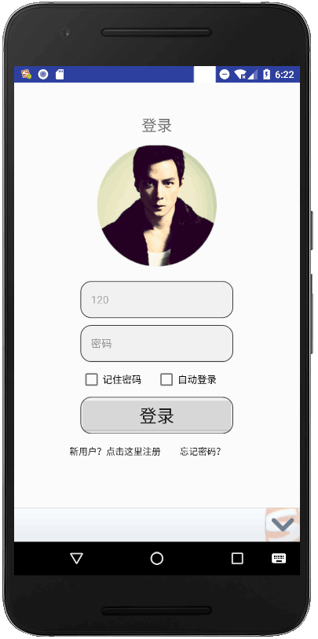
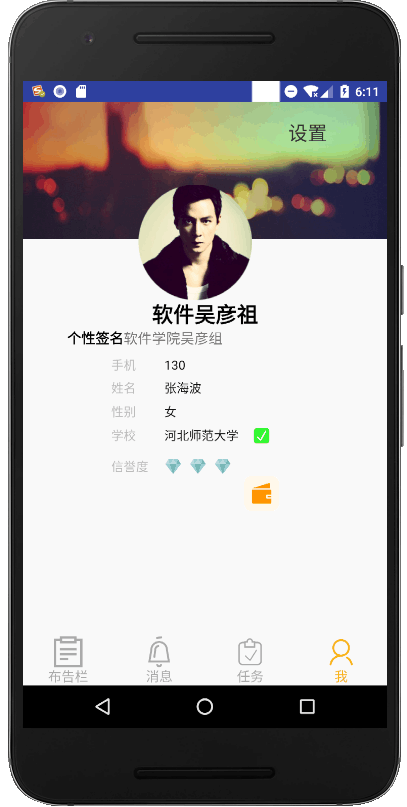

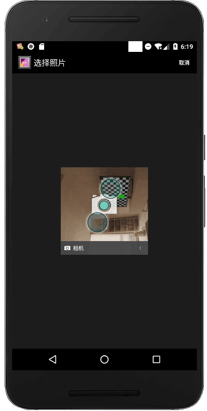

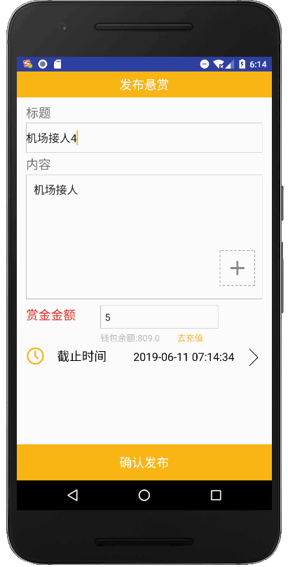

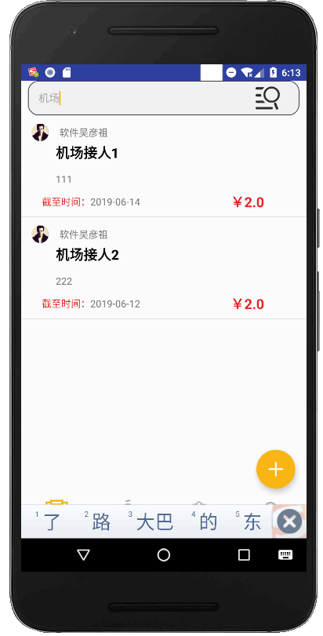
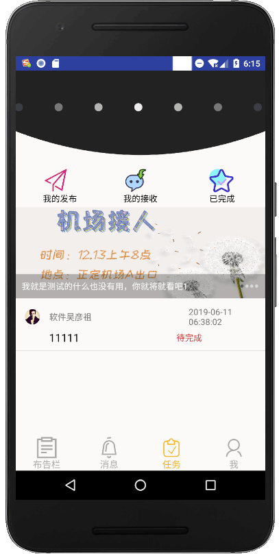

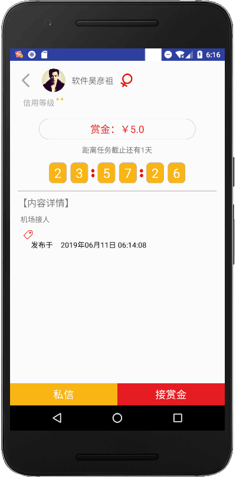

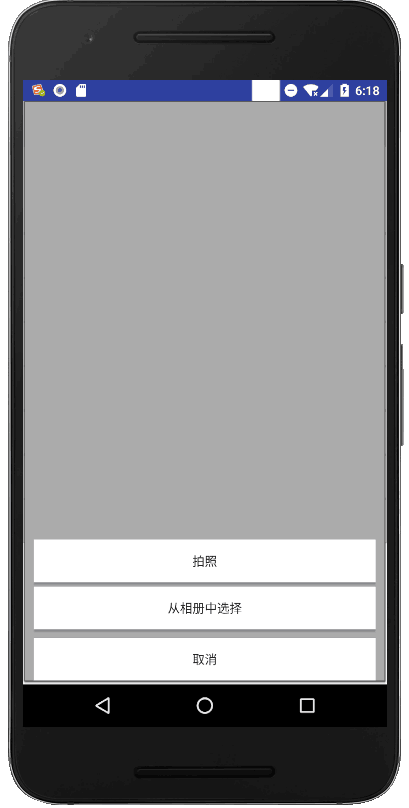

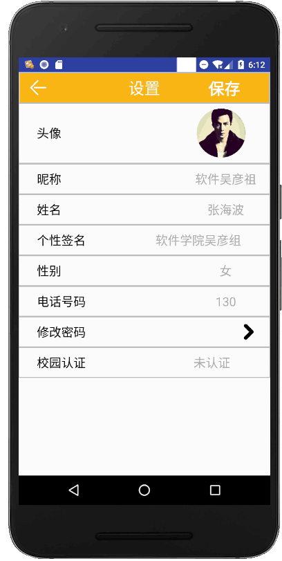
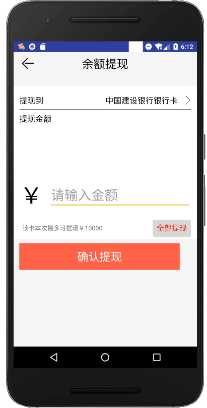
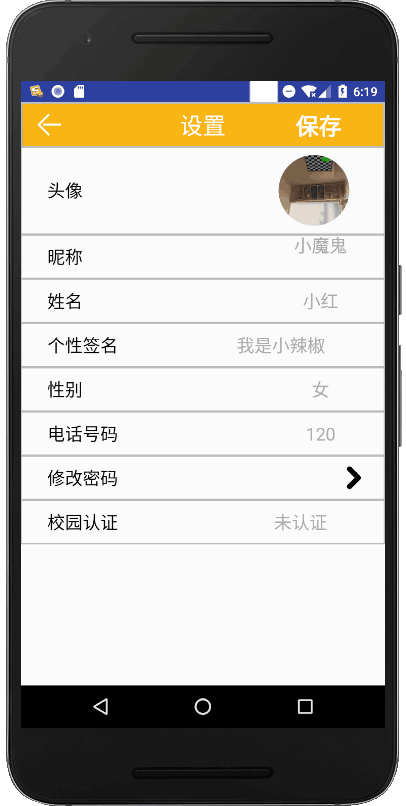

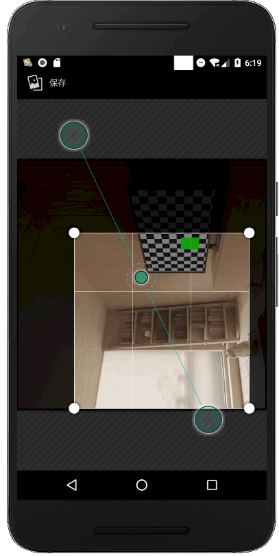
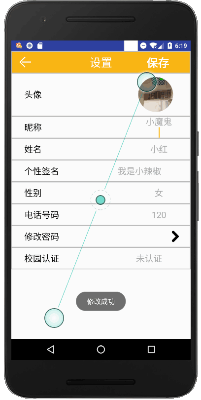

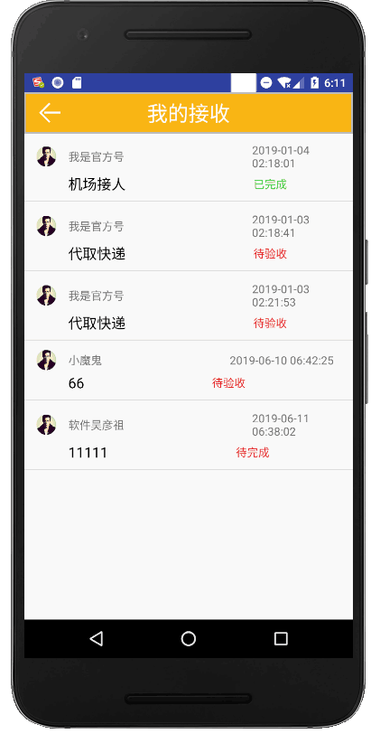
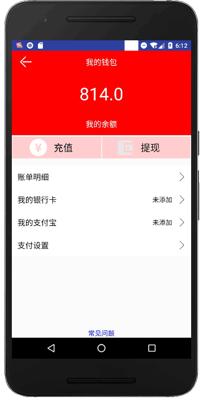

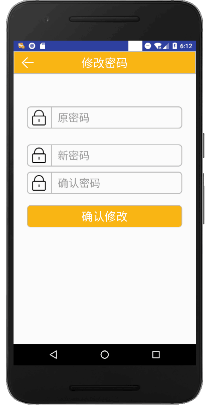
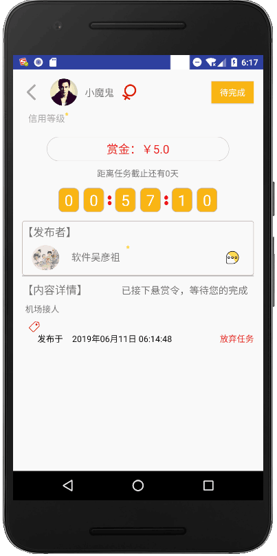
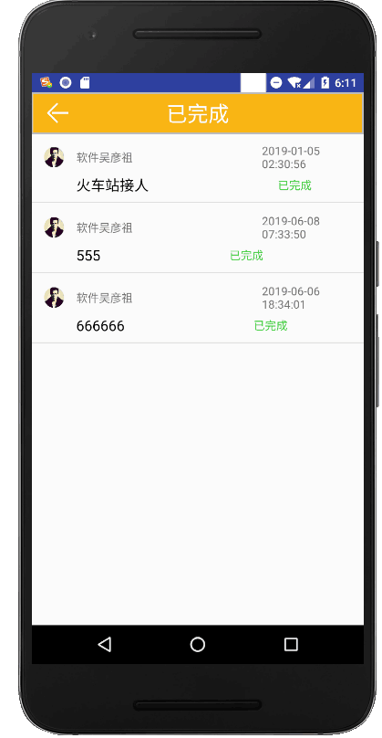

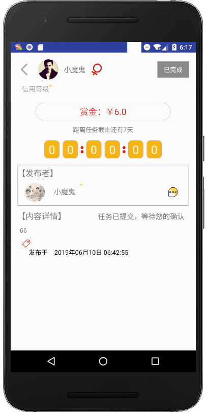
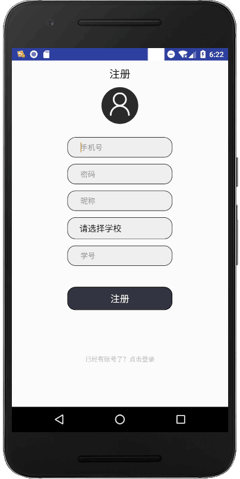

