# 2016级项目实训成果展示 

## 《ShareMate》 -  Java与移动智能设备开发方向

###  项目简介

一款“笔记分享型App”——记录点滴，分享生活！

随着网络时代的不断发展，很多人喜欢把自己的精彩瞬间晒到网络上，与更多的人分享。我们的团队就开发了Share Mate这样一个平台，用户可以再Share Mate上分享自己生活中有趣的部分，也可以看到其他人的不一样的美好生活。Share Mate是一个用户之间分享美好生活的社区交流平台。用户可以通过发布图片、文字或视频的笔记来分享自己在生活中的一点一滴，也可以在平台看到他人的分享并进行评论、收藏或点赞等，发现自己或其他人的生活中的乐趣。记录美好生活，分享美好生活，美好生活从Share开始。

### 项目地址

- Github（客户端）：[https://github.com/niuweiwei/ShareMateClient](https://github.com/niuweiwei/ShareMateClient)

-Github（服务器）：[https://github.com/niuweiwei/ShareMateServer](https://github.com/niuweiwei/ShareMateServer)

### 项目成员

- 牛薇薇（项目经理、UI设计师、开发工程师、测试工程师）
  - Email：[954425164@qq.com](954425164@qq.com) 
  - Github：[https://github.com/niuweiwei](https://github.com/niuweiwei)
- 李春柳（技术总监、UI设计师、开发工程师、测试工程师）
  - Email：[1945642767@qq.com](mailto:1945642767@qq.com)
  - Github：[https://github.com/lichunliu](https://github.com/lichunliu)
- 付娆（技术总监、UI设计师、开发工程师、测试工程师）
  - Email：[1412830417@qq.com](mailto:1412830417@qq.com)
  - Github：[https://github.com/furao1998](https://github.com/furao1998)
- 冯嘉星（技术总监、UI设计师、开发工程师、测试工程师）
  - Email：[873086452@qq.com](mailto:873086452@qq.com)
  - Github：[https://github.com/fengjiaxing666](https://github.com/fengjiaxing666)
- 李铭飞

### 项目截图

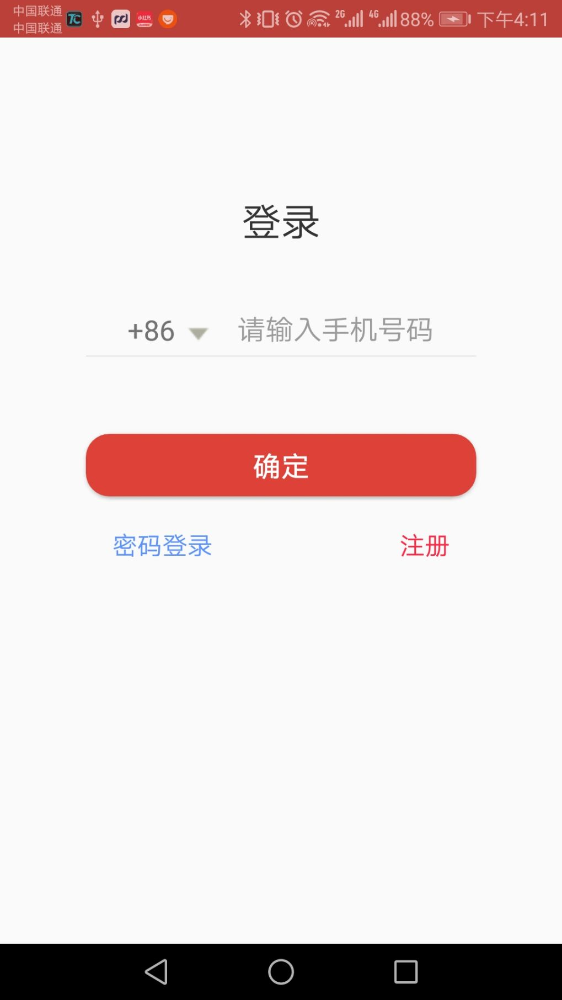
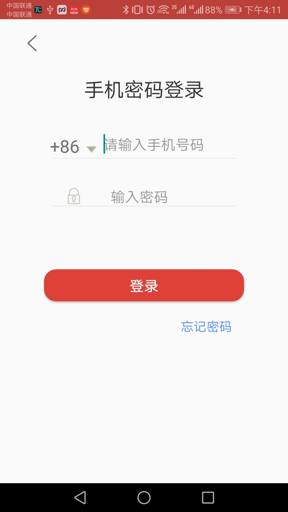
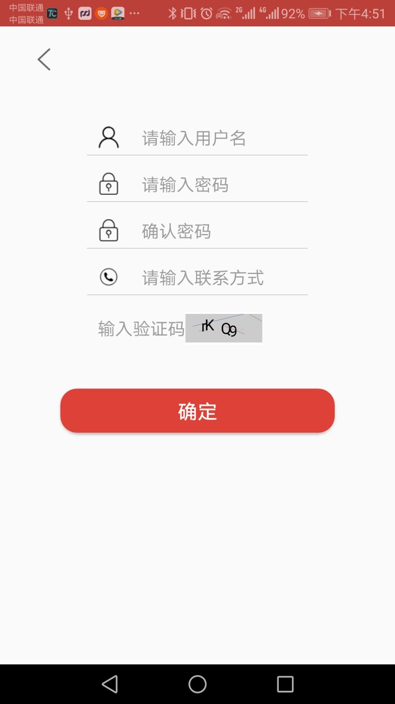

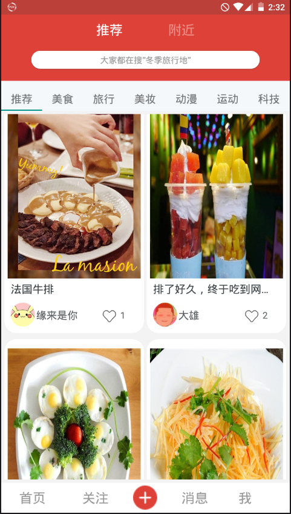
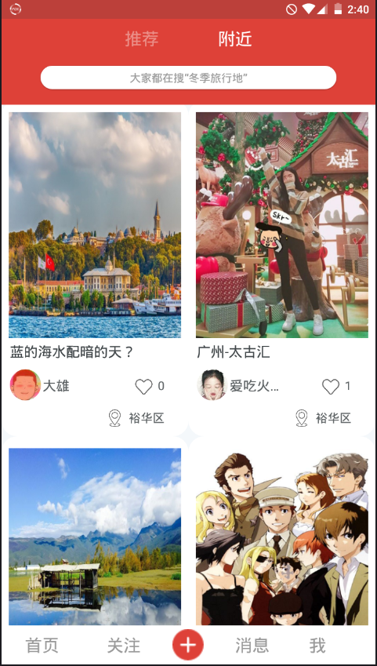

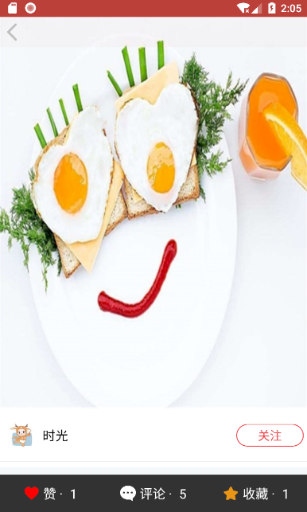
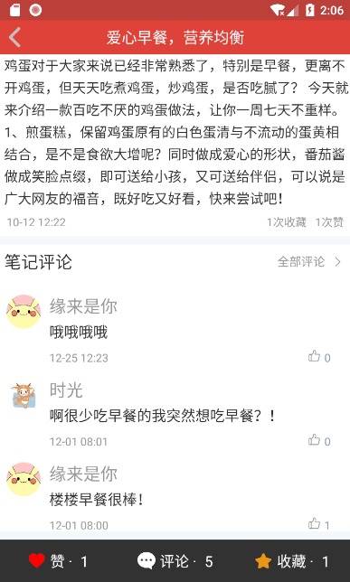
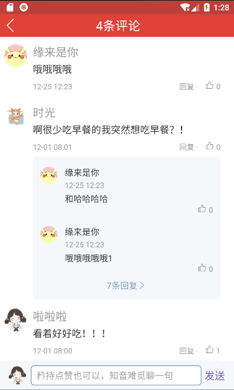

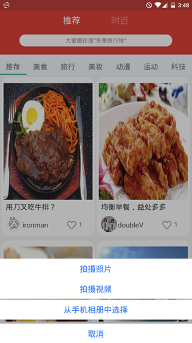

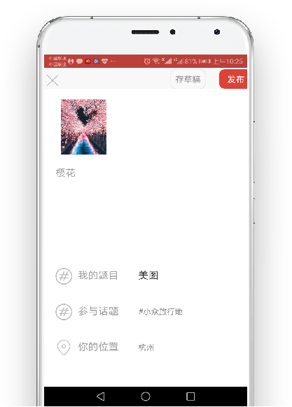
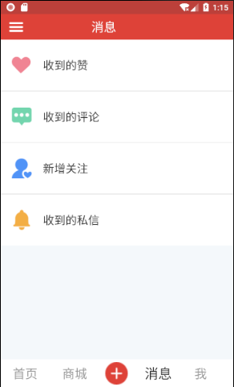

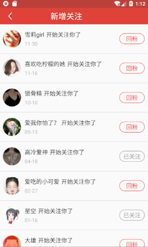
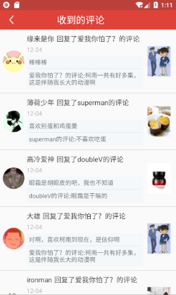

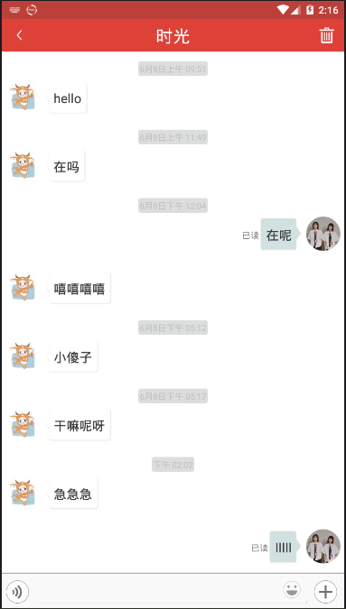

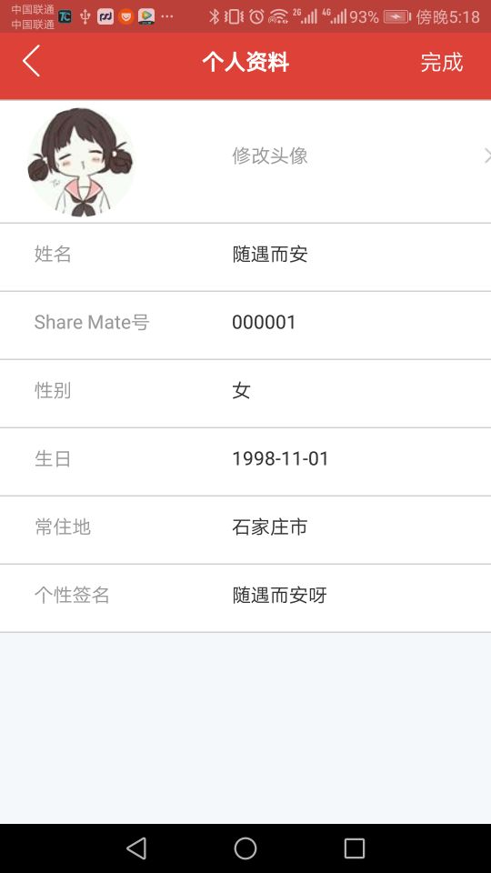

