# 2016级项目实训成果展示 

## 《Solar》 -  Java与移动智能设备开发方向

###  项目简介

这是一款高效习惯养成的App，结合了科学的番茄工作法，有序的计划制定，任务管理等功能， 将你的工作和生活中的待办任务与目标技能关联起来，让你做过的事务都成为积累技能成长的一部分。  通过丰富的图表统计，简洁的事务提醒，  为你直观展示你对时间的管理情况，打造一款全方位的实用性时间管理工具。

### 项目地址

- Github：[https://github.com/zhaoyang1997/2016_Android_Solar](https://github.com/zhaoyang1997/2016_Android_Solar)

### 项目成员

- 赵洋（项目经理、UI设计师、开发工程师、测试工程师）
  - Email：[m15226510335@163.com](mailto:m15226510335@163.com) 
  - Github：[https://github.com/zhaoyang1997](https://github.com/zhaoyang1997)
- 范艺琳（技术总监、UI设计师、开发工程师、测试工程师）
  - Email：[443281340@qq.com](mailto:443281340@qq.com)
  - Github：[https://github.com/fanyilin0128](https://github.com/fanyilin0128)
- 郑宁宁（技术总监、UI设计师、开发工程师、测试工程师）
  - Email：[zhengnning@163.com](mailto:zhengnning@163.com)
  - Github：[https://github.com/zhengnning](https://github.com/zhengnning)
- 李亚冰（技术总监、UI设计师、开发工程师、测试工程师）
  - Email：[3111512700@qq.com](mailto:3111512700@qq.com)
  - Github：[https://github.com/liyabing](https://github.com/liyabing)
- 黄亚鑫（产品经理、UI设计师、开发工程师、测试工程师）
  - Email：[562479963@qq.com](mailto:562479963@qq.com)
  - Github：[https://github.com/huangyaxin1999](https://github.com/huangyaxin1999)
- 贾欣蕊（质量专家、UI设计师、开发工程师、测试工程师）
  - Email：[1019785953@qq.com](mailto:1019785953@qq.com)
  - Github：[https://github.com/jiaxinrui](https://github.com/jiaxinrui)

### 项目截图

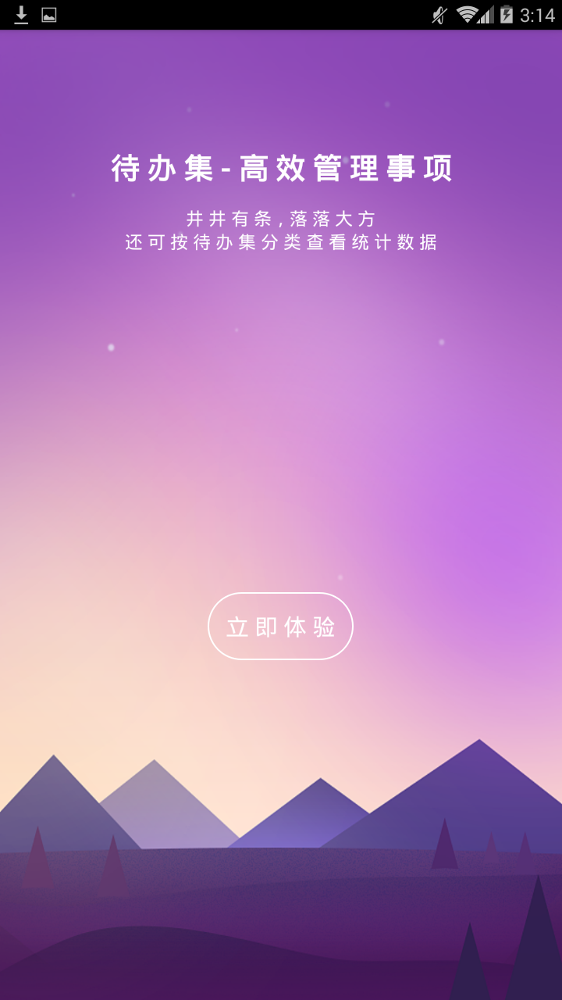
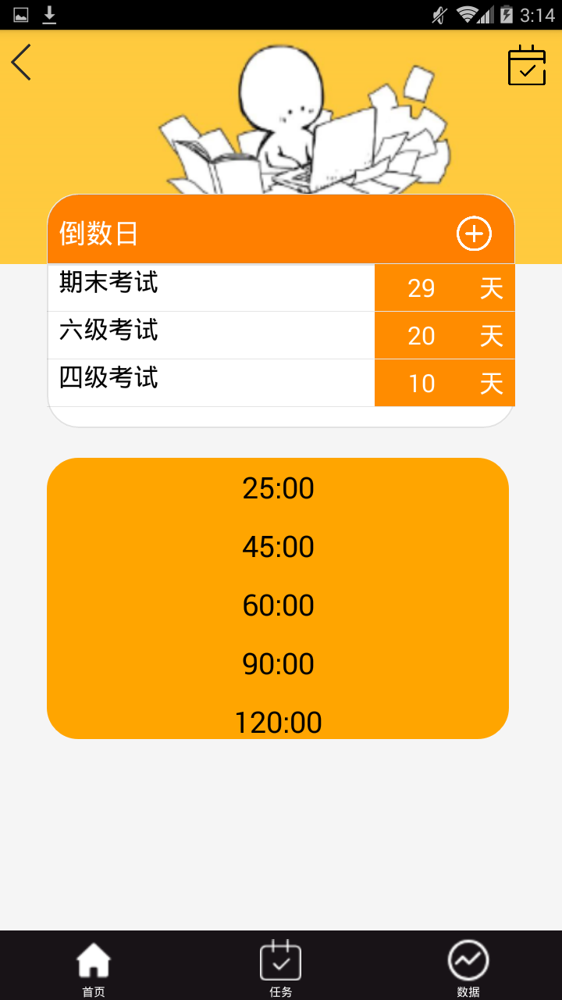
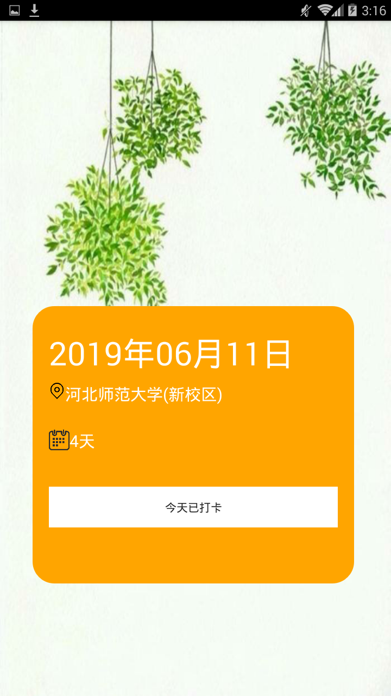

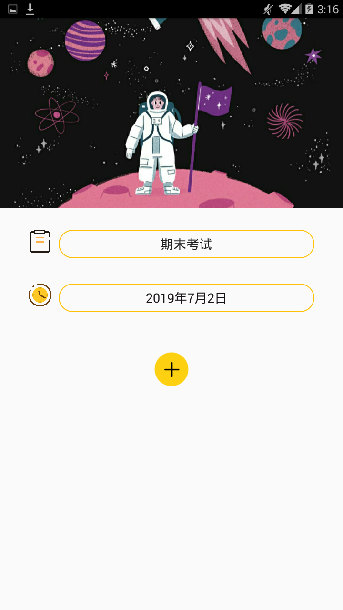
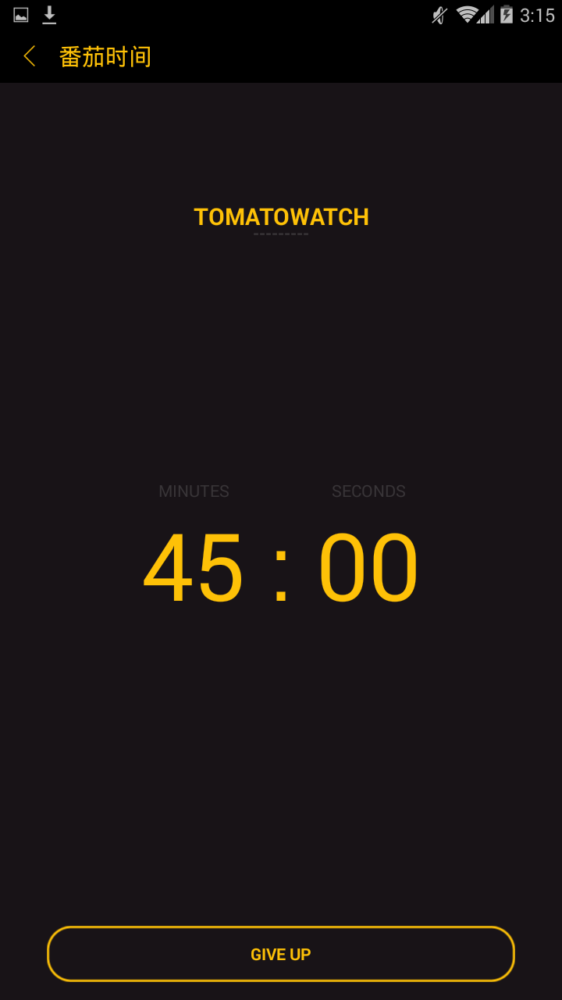
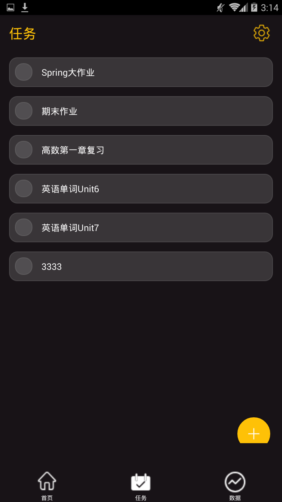

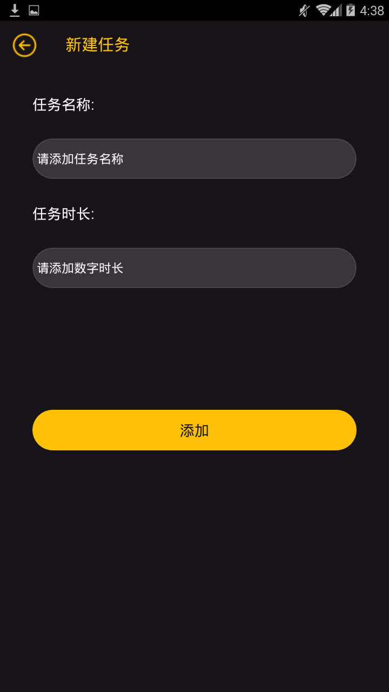
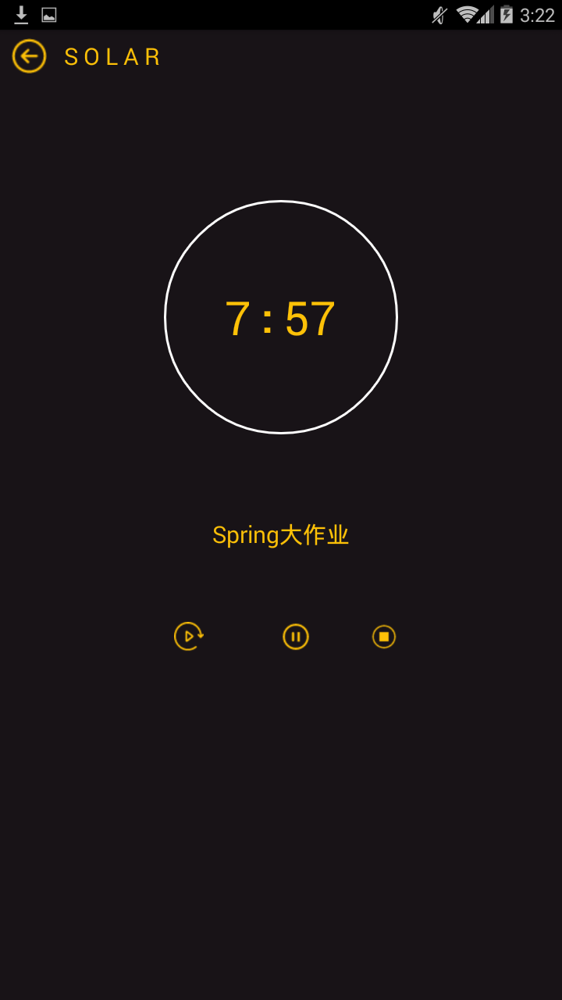
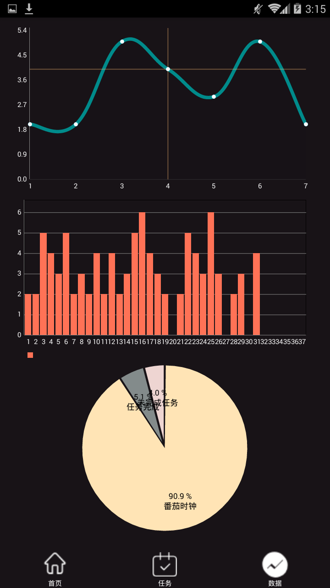

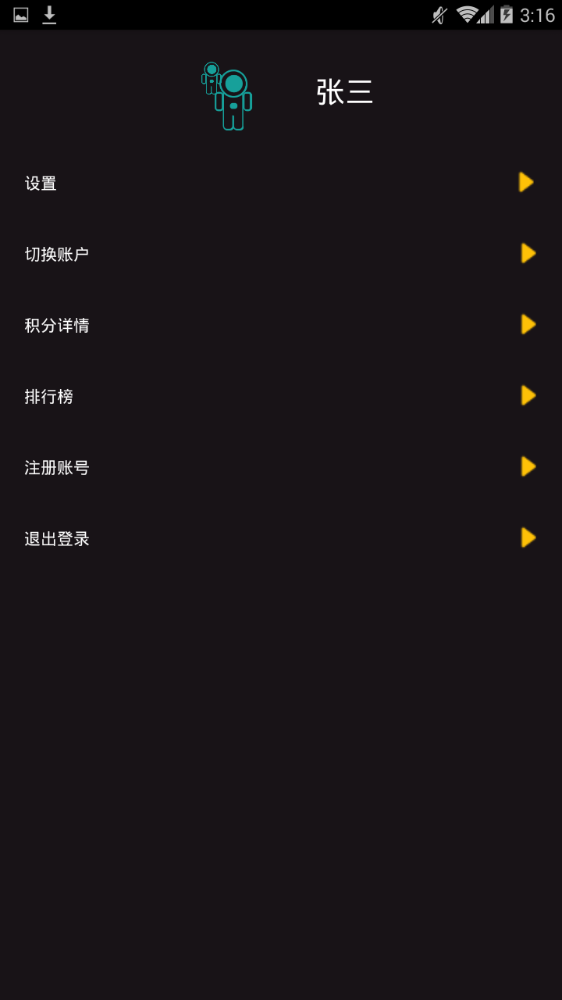

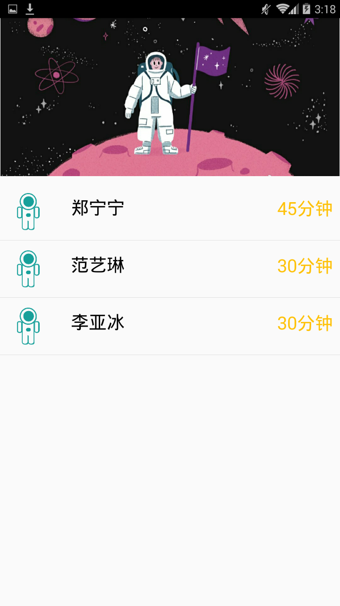

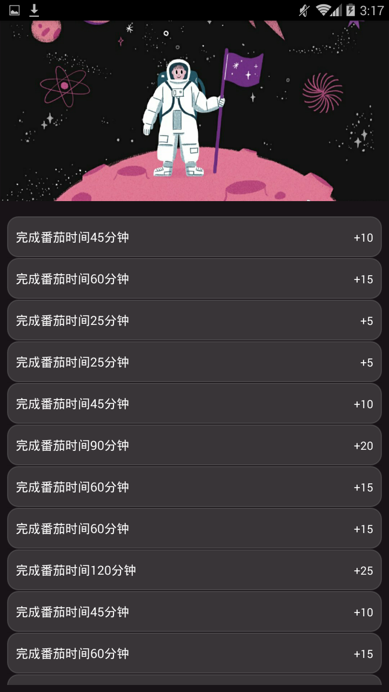
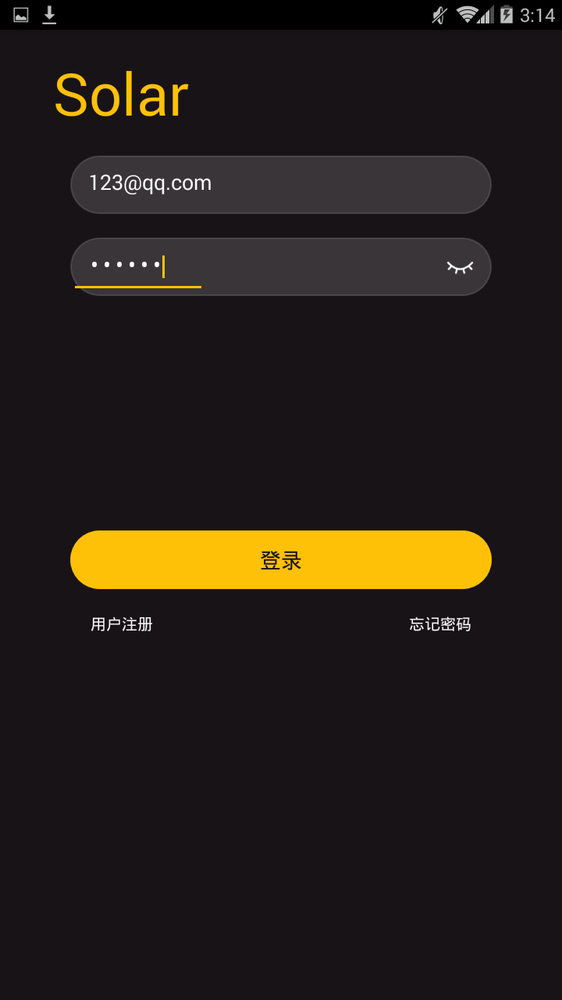
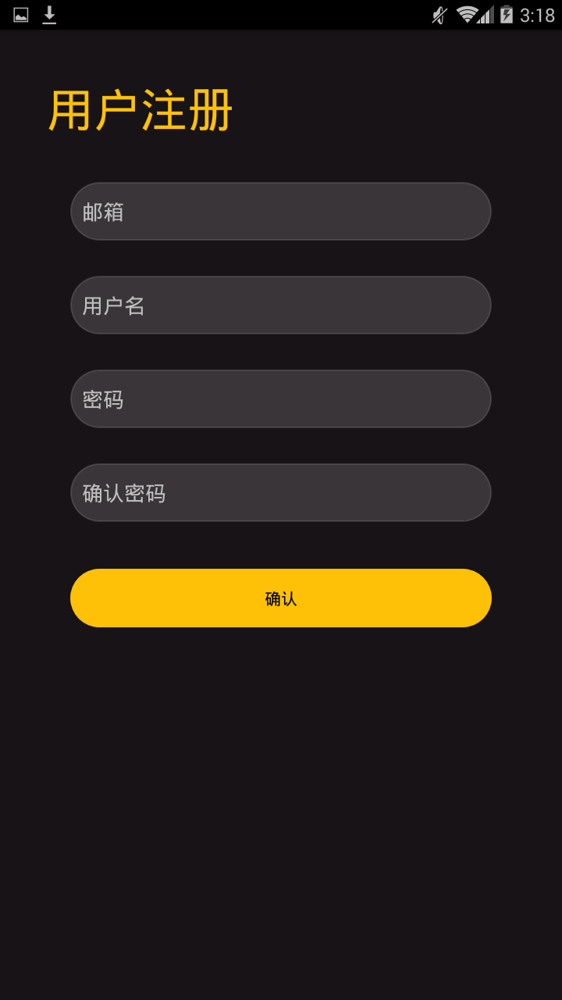

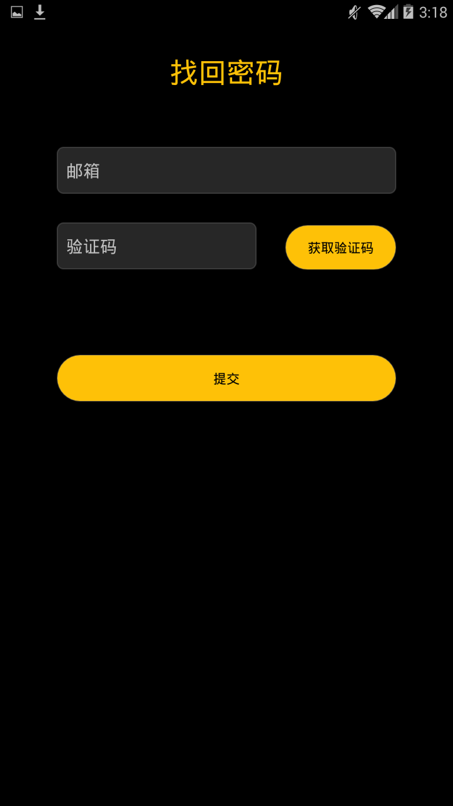
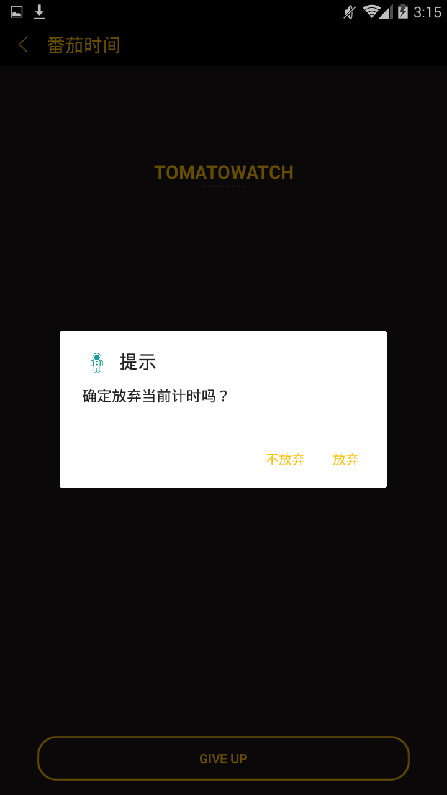
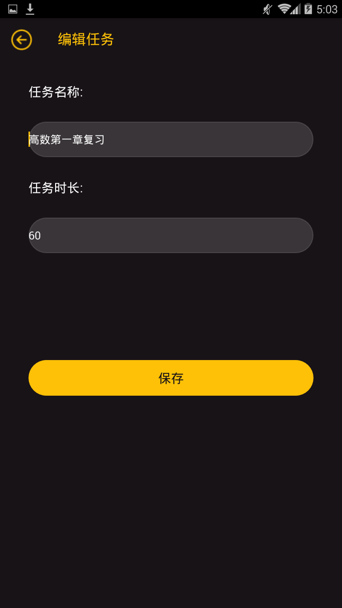

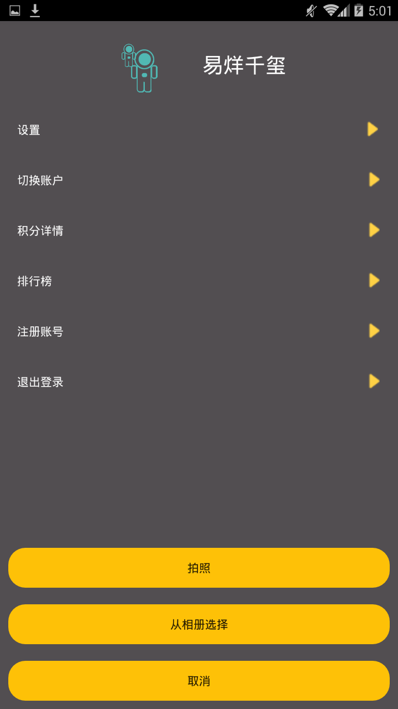

