# 2016级项目实训成果展示 

## 《人人帮》 -  Java与移动智能设备开发方向

###  项目简介

“人人帮”是为每所大学在校学生提供：代取快递、外卖等其它东西，出售或交换学习资料 等为大学生提供诸多便利的一款APP 。

使用者通过在本APP“帮我”一栏中发布求助信息后，如果本学校的同学看到后并愿意帮助你，他会通过接单功能接单，并对你提供帮助。 

帮助会有记录，帮助成功后会有评价，及虚拟货币挣取；帮助失败会有相应举报功能，举报多次，经查实后会进行封停账号等处理。

为了您的隐私信息不被泄露，本APP专门设置了一道安全墙，即只有您与您的帮助者可以查看彼此的个人信息，当然您也可以匿名。

#### 项目地址

- Github：[https://github.com/zhangjianqingGitHub/Android-2-/edit/master/README.md](https://github.com/zhangjianqingGitHub/Android-2-/edit/master/README.md)

#### 项目成员

- 张建青（项目经理、UI设计师、开发工程师、测试工程师）
  - Email：[QQ邮箱：729395495@qq.com]
  - Github：[https://github.com/zhangjianqingGitHub](https://github.com/zhangjianqingGitHub)
- 李子腾（市场总监、开发工程师、测试工程师）
  - Email：[QQ邮箱：15210513545@qq.com]

#### 项目截图

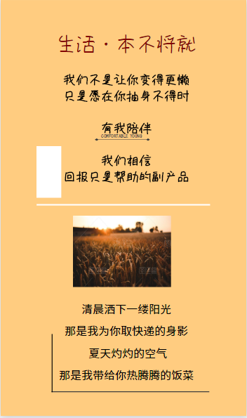
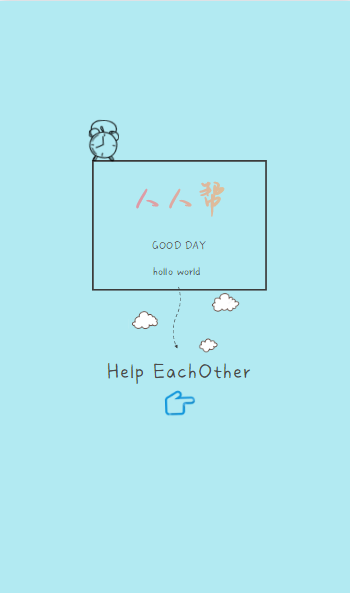

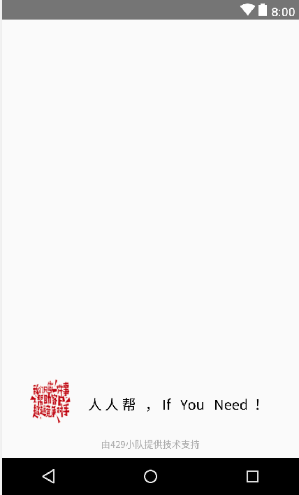

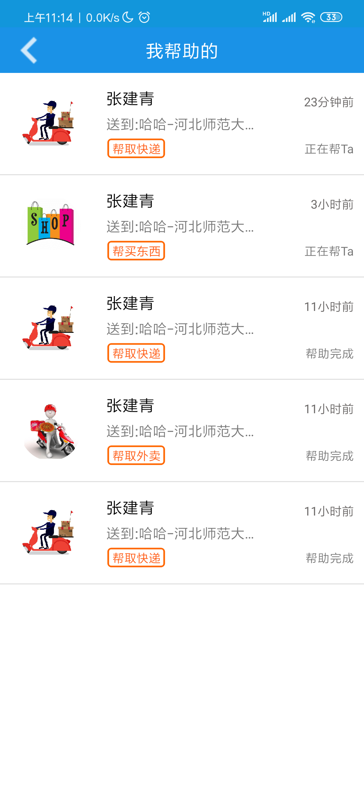
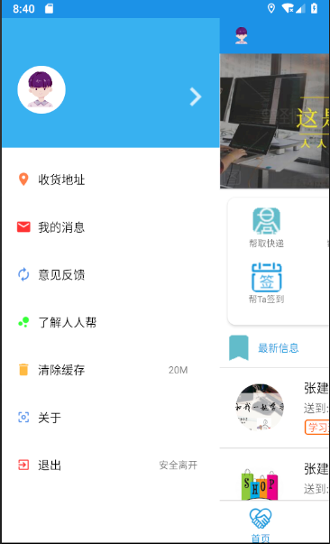

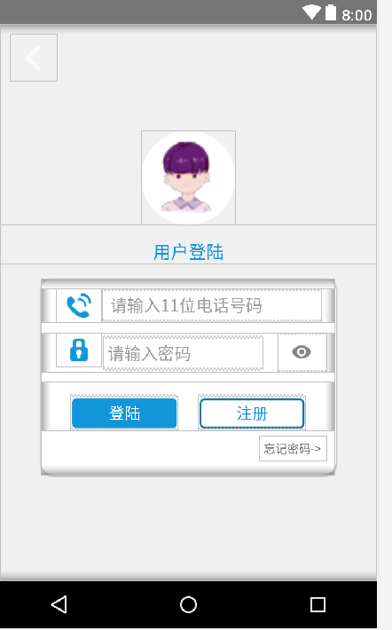
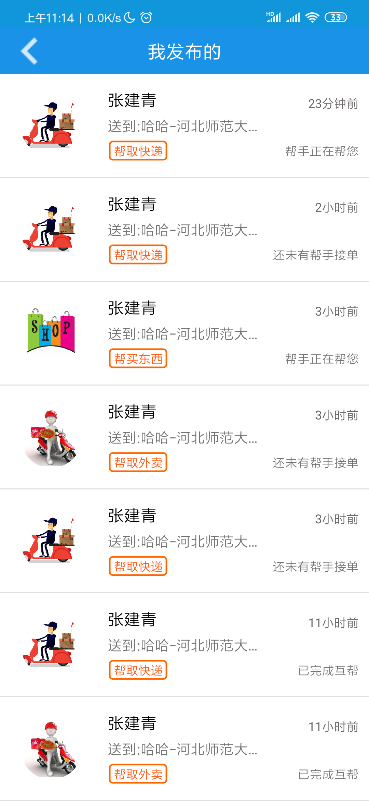
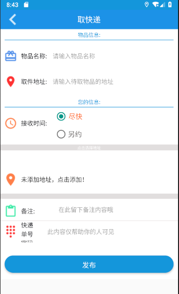

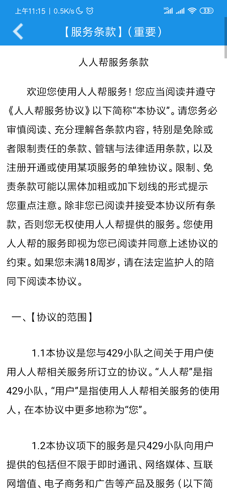
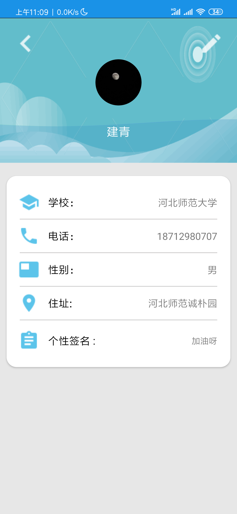
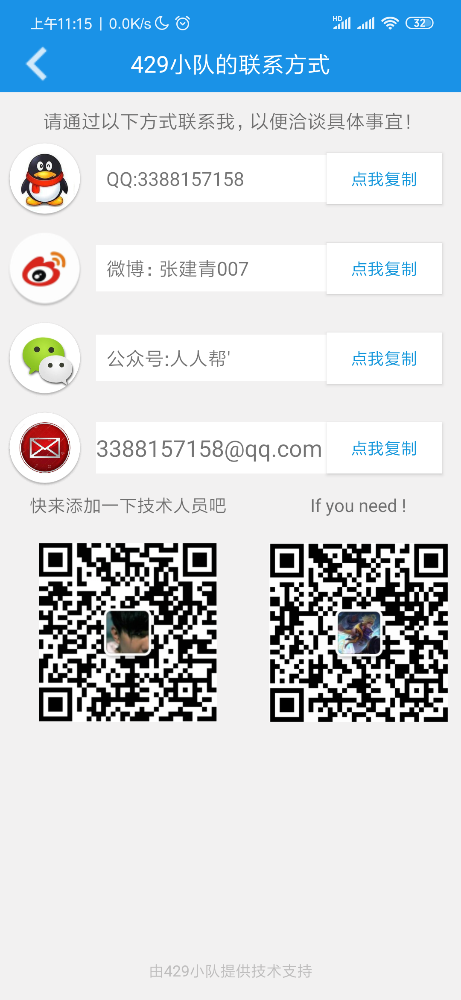

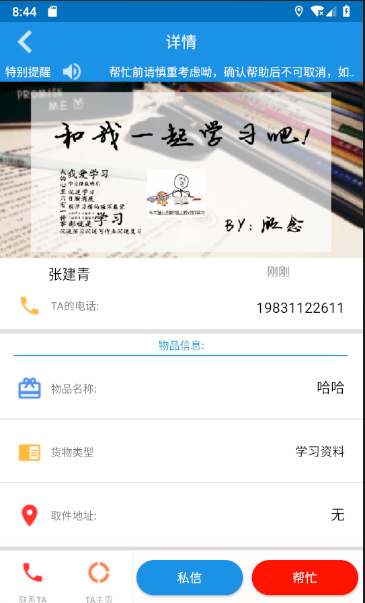

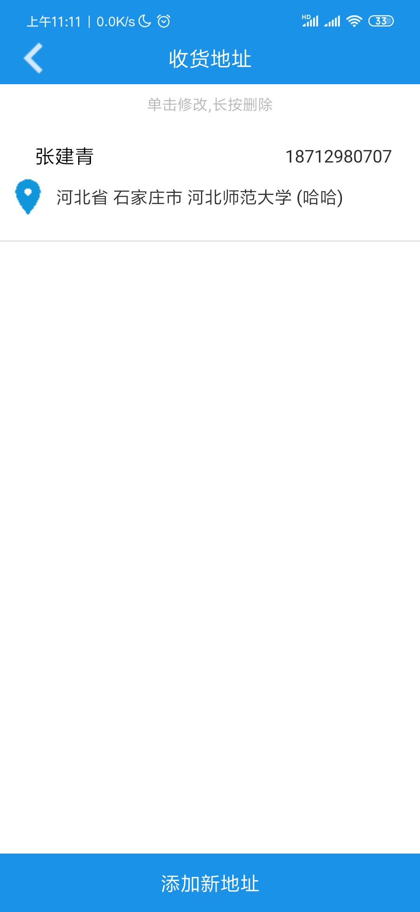

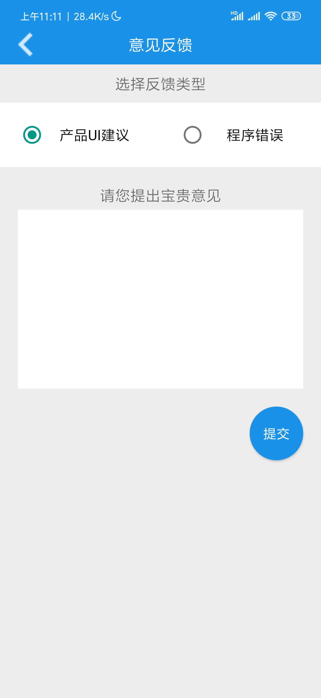
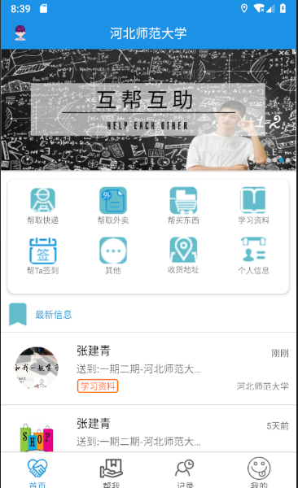
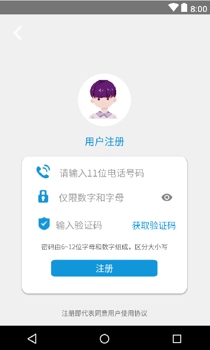

