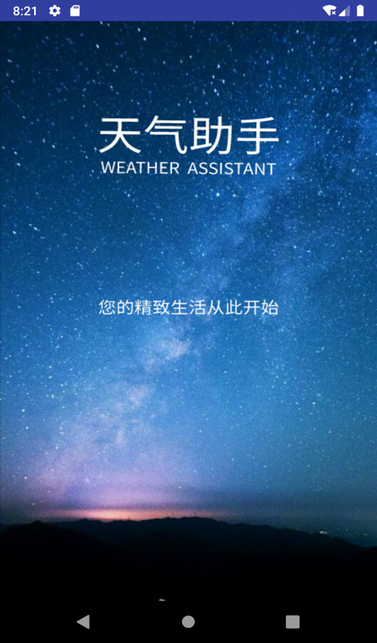
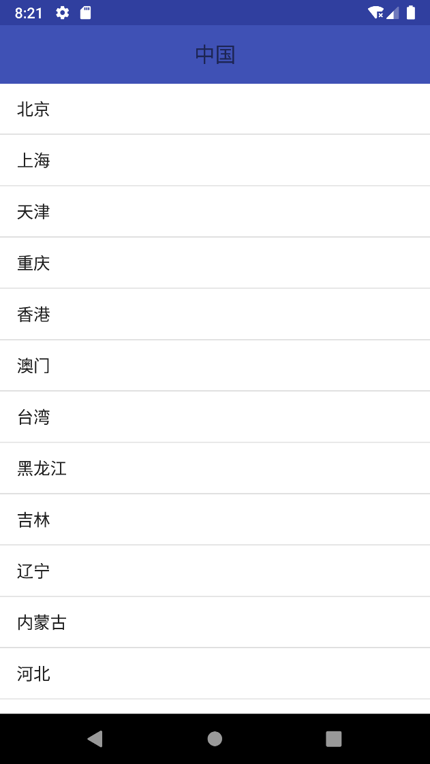
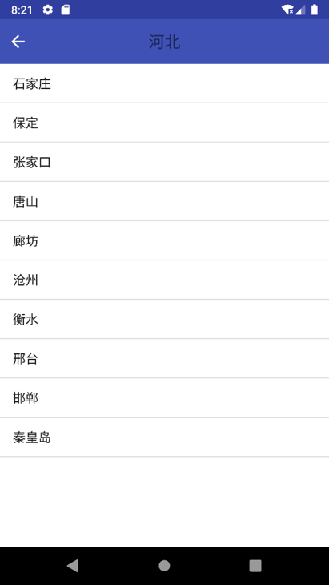
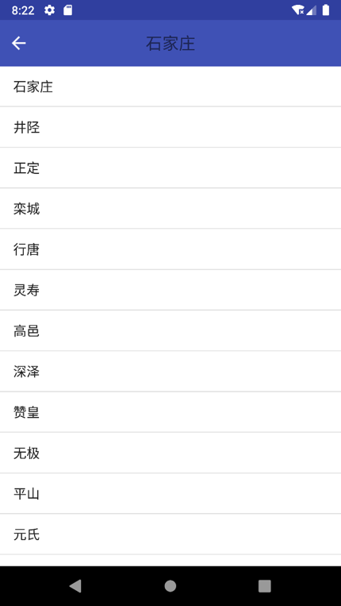
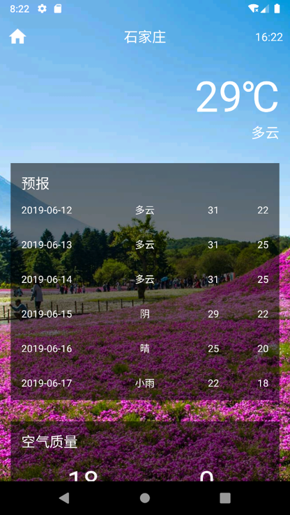
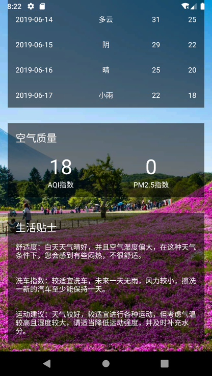
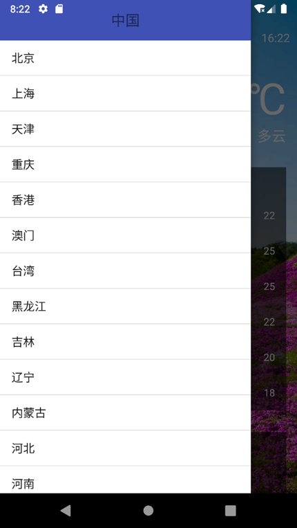

# 2016级项目实训成果展示 

## 《天气助手》 -  Java与移动智能设备开发方向

###  项目简介

为了方便人们的生活出现，制作了一个简洁明了的七天天气查询，可以实现多地的天气查询、空气质量查询等，并根据天气和气温给出穿衣建议和生活建议

### 项目地址

- Github：[https://github.com/nieliangpeng/Worry-Grocery-Shop-APP](https://github.com/nieliangpeng/Worry-Grocery-Shop-APP)

### 项目成员

- 李佳伟（项目经理、UI设计师、开发工程师、测试工程师）
  - Email：[787679573@qq.com](mailto:787679573@qq.com) 
  - Github：[https://github.com/hunteen](https://github.com/hunteen)
- 李晔欣（市场总监、UI设计师、开发工程师、测试工程师）
  - Email：[1044350375@qq.com](mailto:1044350375@qq.com)
  - Github：[https://github.com/liyexin27](https://github.com/liyexin27)
- 武升辉（技术总监、UI设计师、开发工程师、测试工程师）
  - Email：[2649621511@qq.com](mailto:2649621511@qq.com)
  - Github：[https://github.com/WSH5](https://github.com/WSH5)
- 王庭恩（技术总监、UI设计师、开发工程师、测试工程师）
  - Email：[dasd129@foxmail.com](mailto:dasd129@foxmail.com)
  - Github：[https://github.com/wangtingen](https://github.com/wangtingen)

### 项目截图

