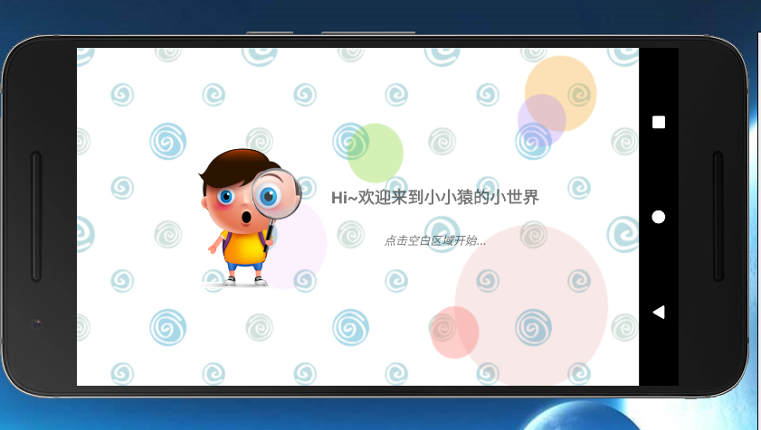
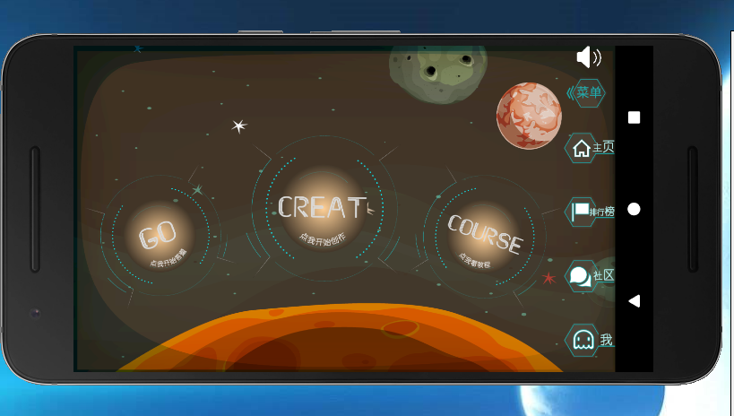
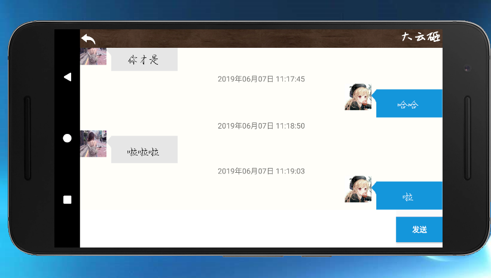
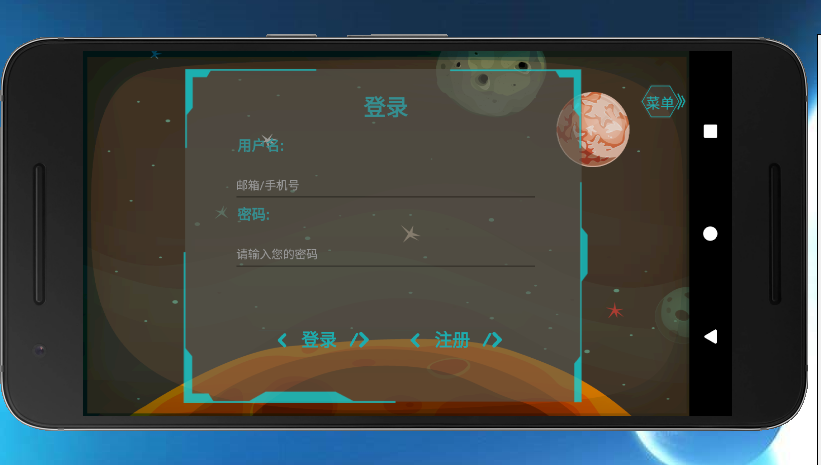
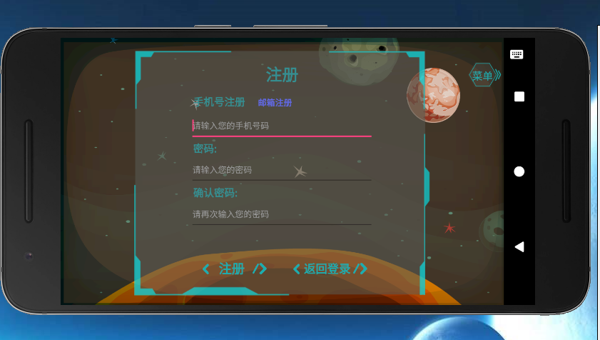
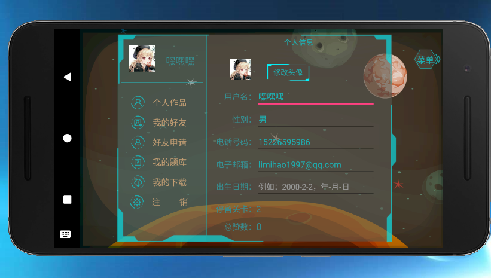
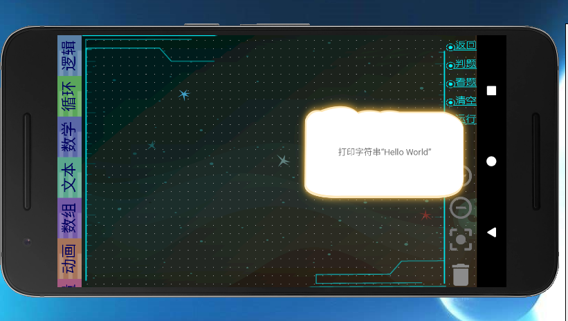
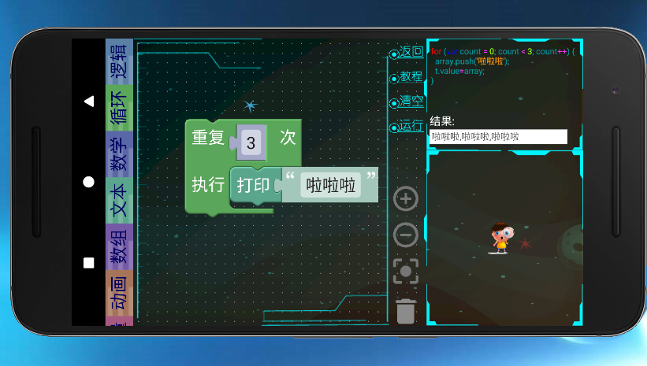
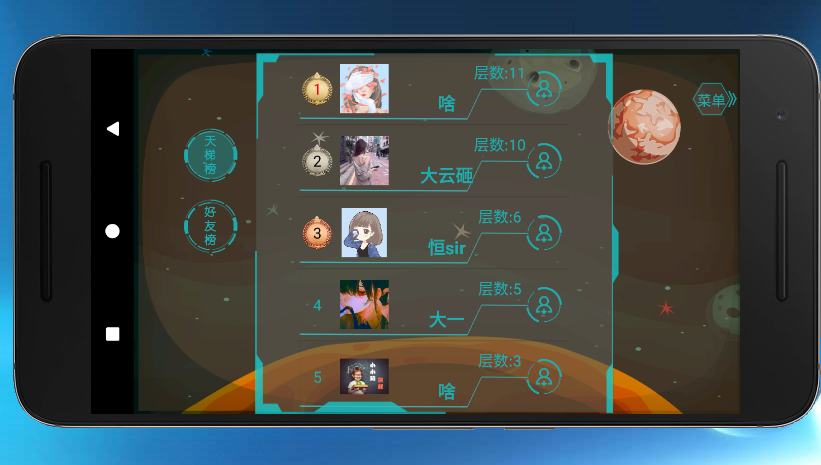
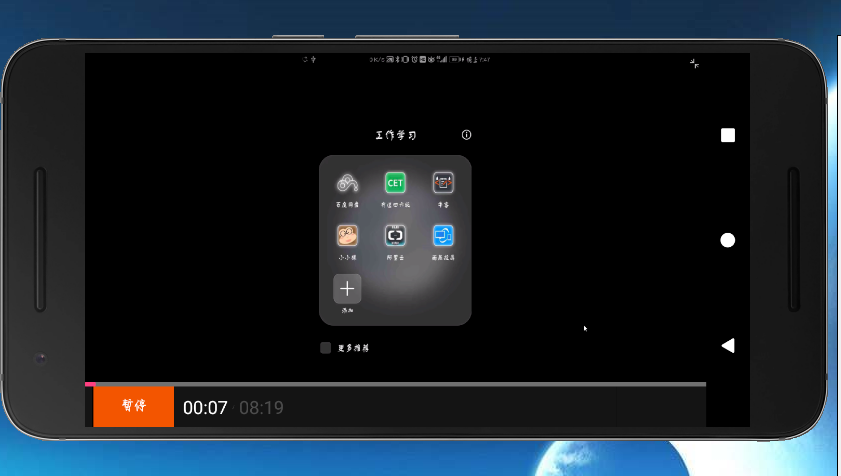

# 2016级项目实训成果展示 

## 《小小猿》 -  Java与移动智能设备开发方向

###  项目简介

小小猿是一款本土化的少儿编程软件，集练习、教育于一体，在这里既可以通过练习体验编程乐趣、开发编程思维，又可以通过教育获取知识，提升自身编程素养。目前国内少儿编程市场尚未成熟而愈发火爆，本软件着力于为青少年提供一个有效便捷的学习、训练平台。

### 项目地址

-Github：[https://github.com/liuhaiyuan97/xiaoxiaoyuan/tree/develop](https://github.com/liuhaiyuan97/xiaoxiaoyuan/tree/develop)

### 项目成员

- 李密浩（产品经理、开发工程师、测试工程师）  
	- Email：limihao1997@qq.com
	- Github:https://github.com/limihao1998
- 柳海源（项目经理、开发工程师、测试工程师）
	- Email:LHY97xh@163.com
	- Github:https://github.com/liuhaiyuan97
- 陈若云（质量专家、开发工程师、测试工程师）
	- Email:599791038@qq.com
	- Github:https://github.com/chenruoyun1016
- 夏桐（UI设计师、开发工程师、测试工程师）
	- Email:364809592@qq.com
	- Github:https://github.com/XiaTongo

 ### 项目截图

