# 2016级项目实训成果展示 

## 《小遛》 -  Java与移动智能设备开发方向

###  项目简介

> 小遛——让遛狗更轻松

我们深知，狗作为陪伴人类的精神伴侣，我们所做的并不能替代主人，而我们所努力的方向，是搭起狗与主人的桥梁，引导主人更关注他们的宠物。当前世面现有的一些APP过于小众，还没有走入人们的视野，他们缺乏人文的关怀，这是这些app不能发展的原因，我们的项目，希望也本着关怀主人与狗狗的目的出发，从一次遛狗开始，基于贴心细致的服务，为主人带来一次良好的体验，鼓励主人抽出更多时间与宠物相处。

### 项目地址

- Github：[https://github.com/yaoduo1997/XiaoLiu](https://github.com/yaoduo1997/XiaoLiu)

### 项目成员

- 姚朵（项目经理）
  - Email：[2932079827@qq.com](mailto:2932079827@qq.com) 
  - Github：[https://github.com/yaoduo1997](https://github.com/yaoduo1997)
- 王凯（开发工程师）
  - Email：[736423577@qq.com](mailto:736423577@qq.com)
  - Github：[https://github.com/wangkai1998](https://github.com/wangkai1998)
- 王昊（UI设计师）
  - Email：[haowang9706@foxmail.com](mailto:haowang9706@foxmail.com)
  - Github：[https://github.com/pandawang77](https://github.com/pandawang77)
- 王晓双（测试工程师）
  - Email：[1023359291@qq.com](mailto:1023359291@qq.com)
  - Github：[https://github.com/wangxiaoshuang18](https://github.com/wangxiaoshuang18)

### 项目截图

  
  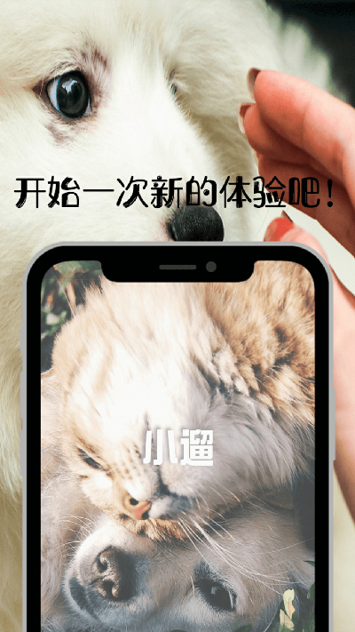
  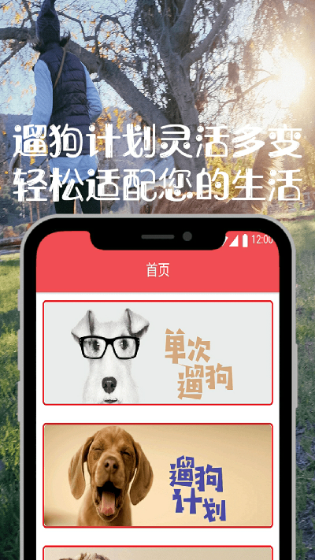

  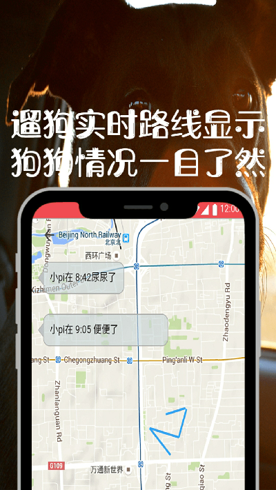
  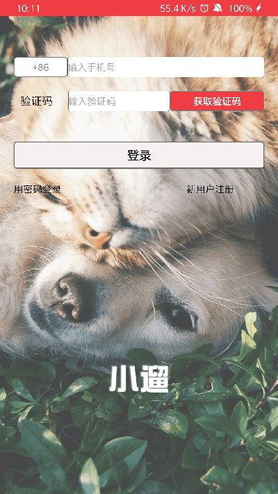
  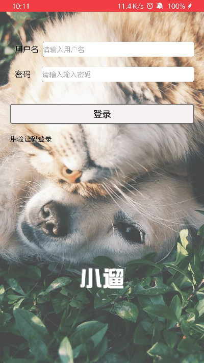

  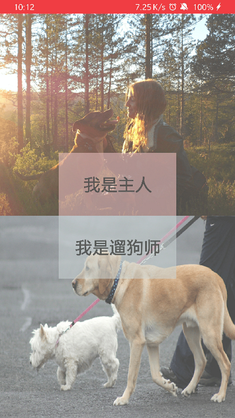
  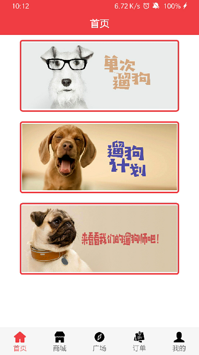
  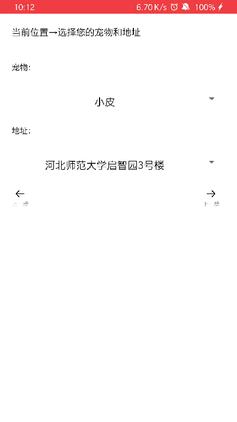

  
  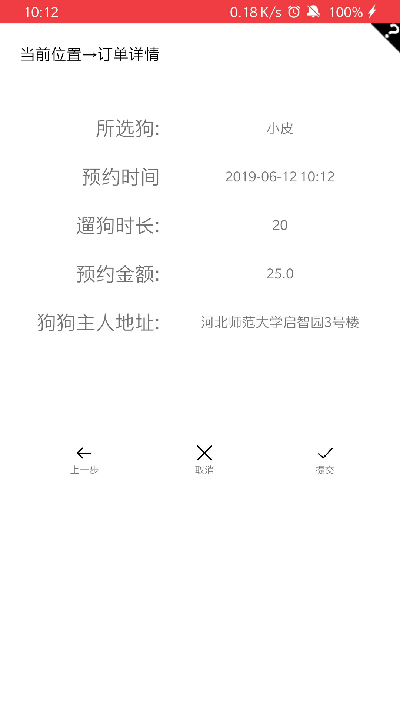
  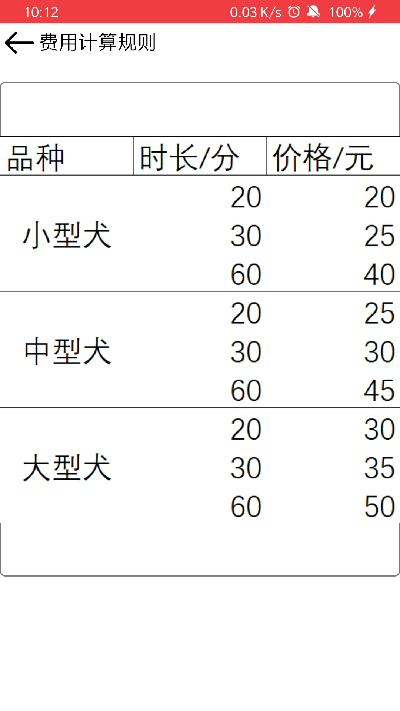

  
  
  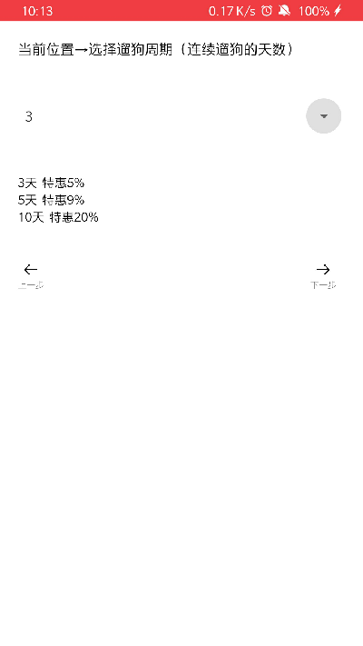

  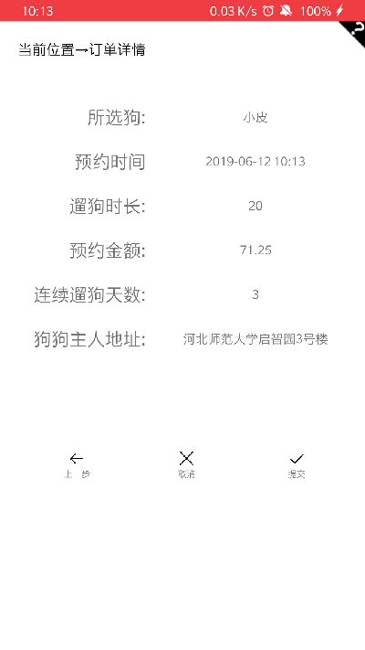
  
  

  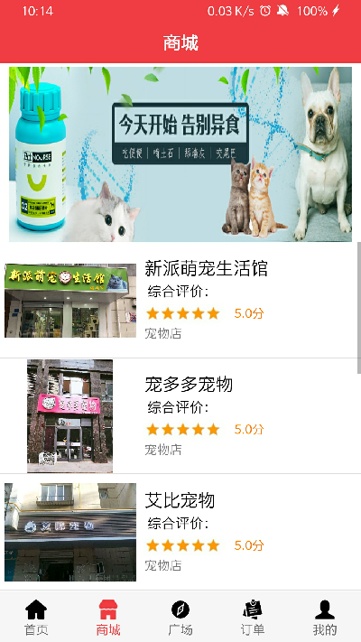
  
  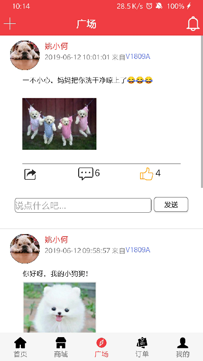

  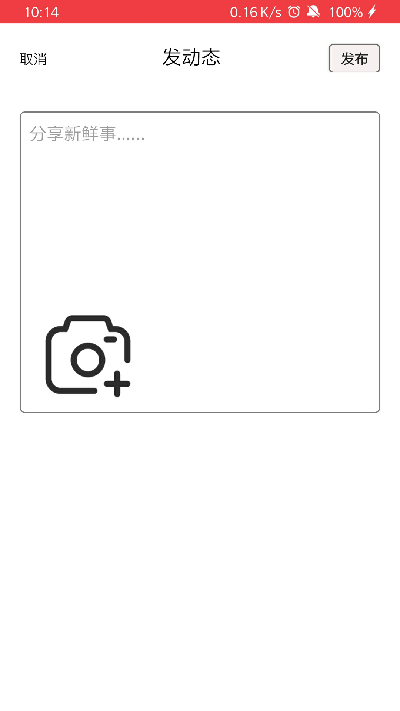
  
  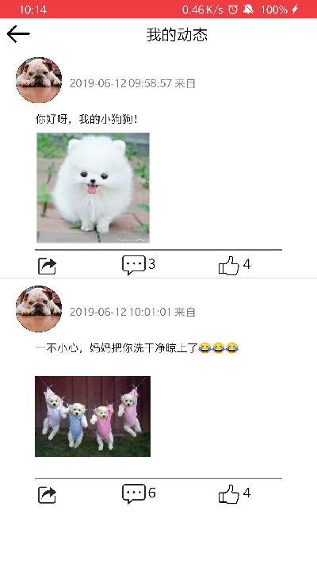

  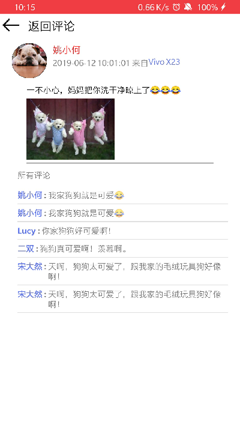
  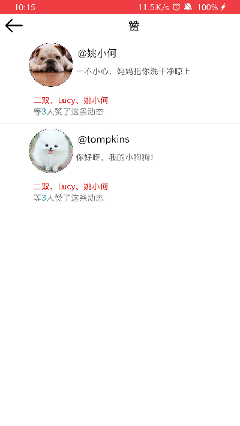
  

  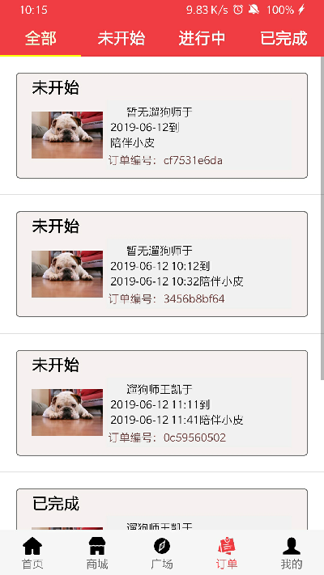
  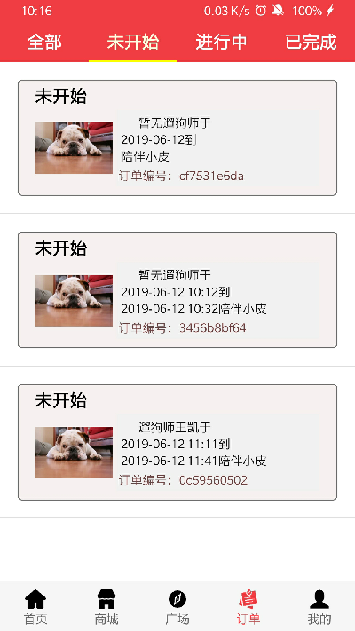
  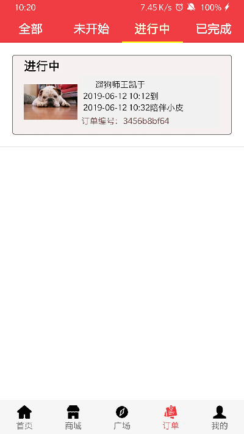

  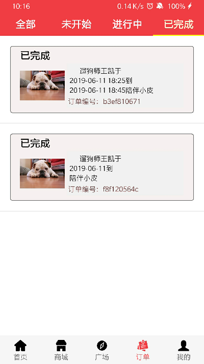
  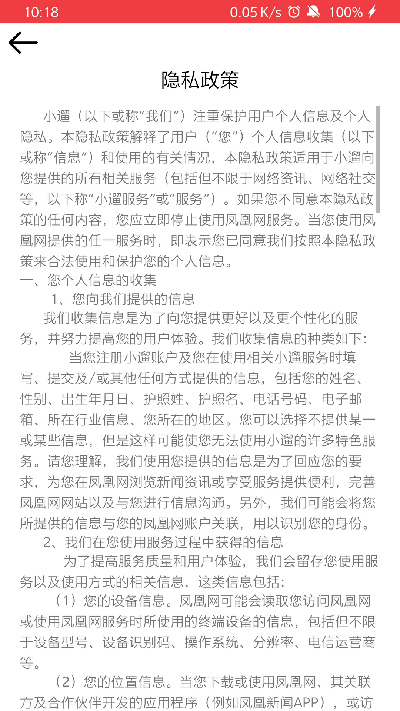
  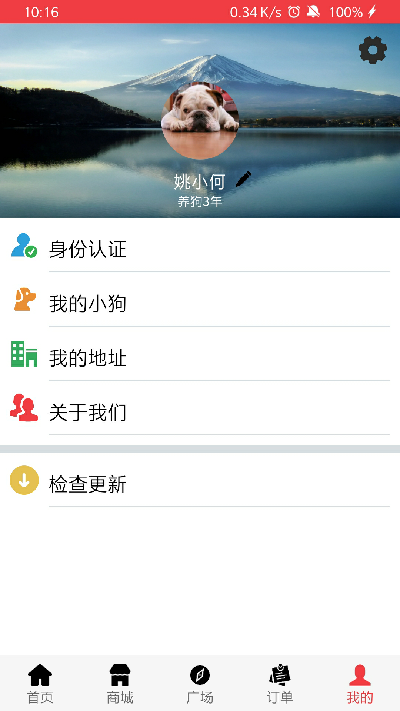

  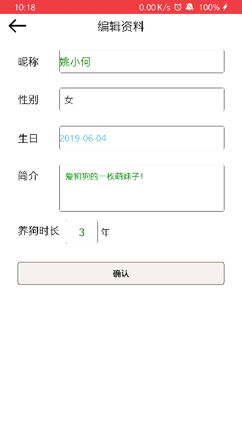
  
  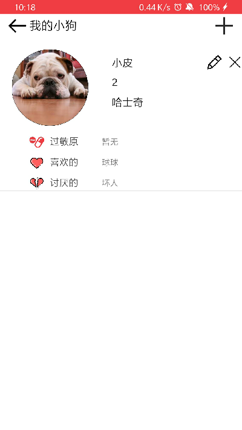

  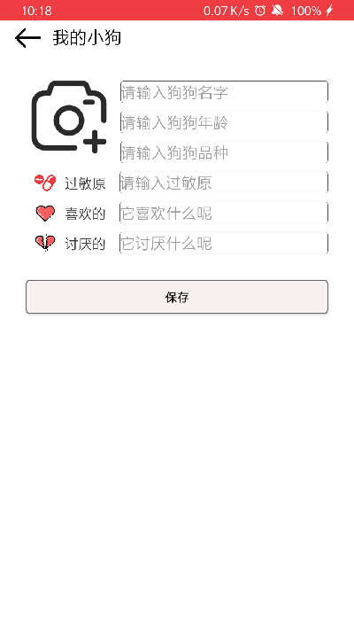
  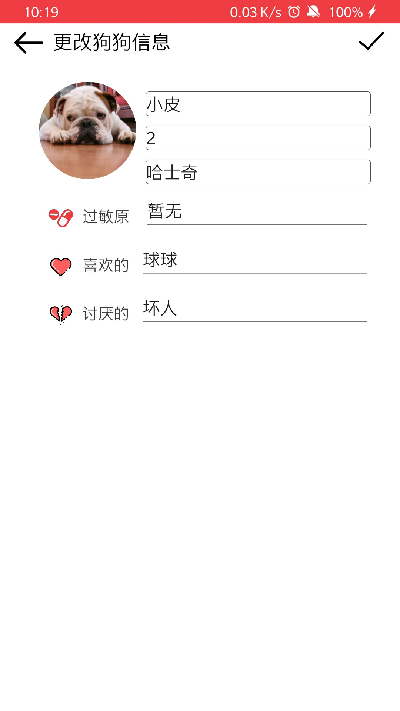
  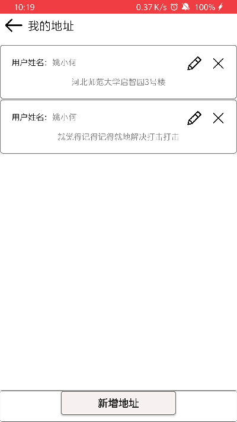

  
  
  

  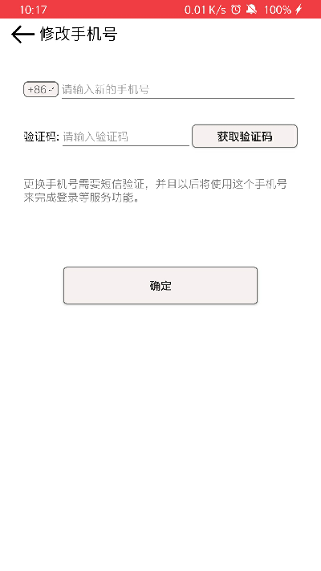
  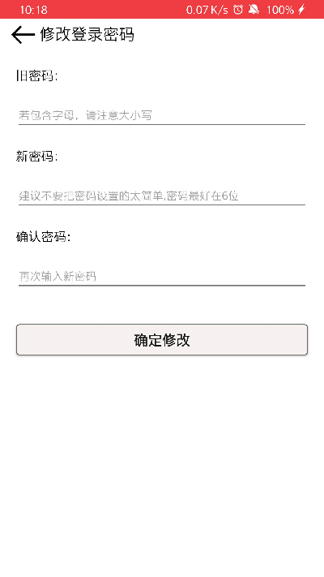
  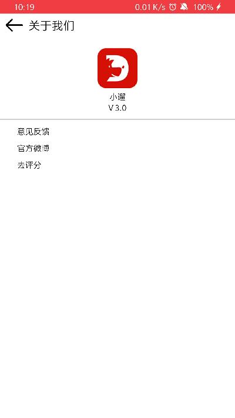

  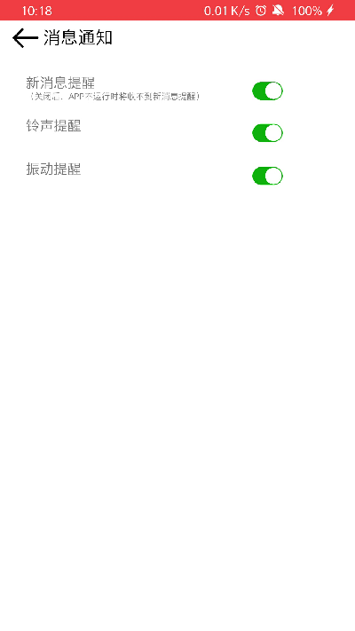
  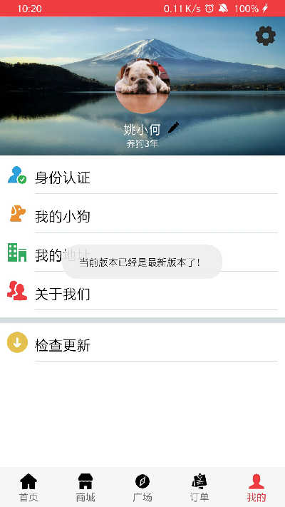
  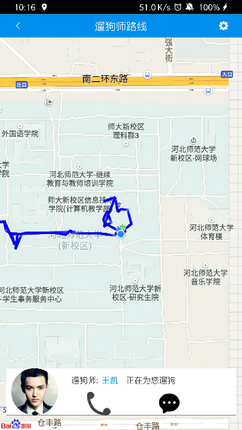

