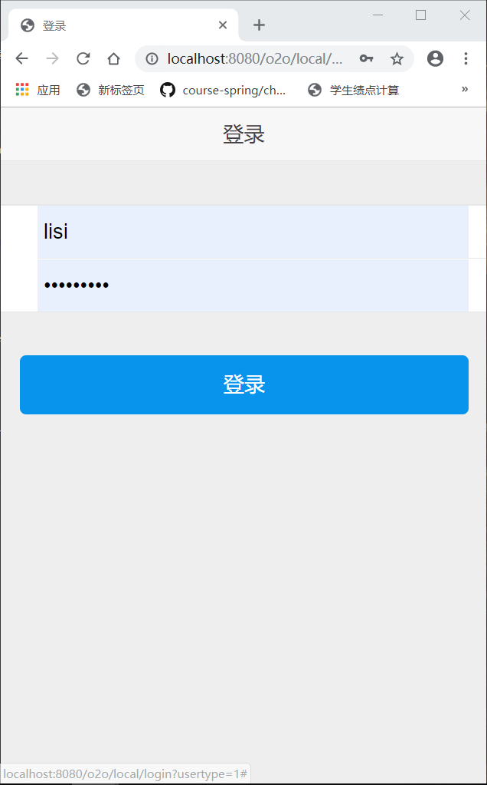
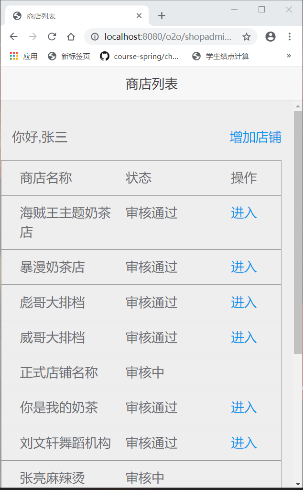
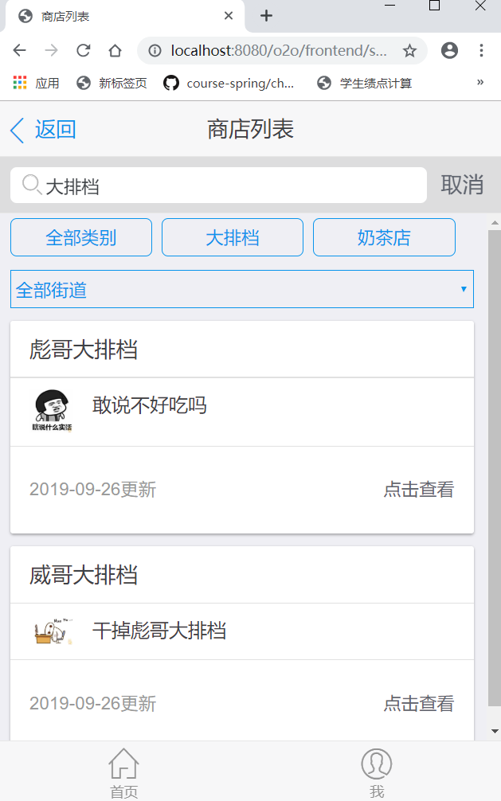
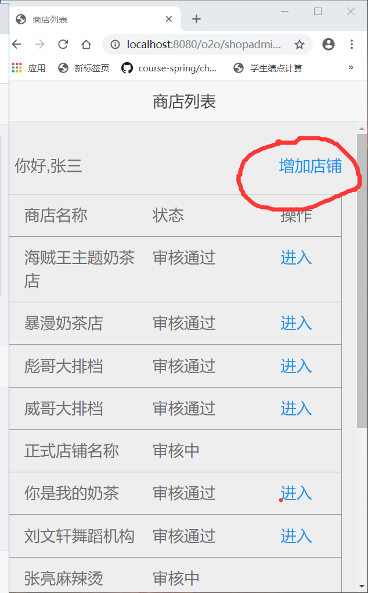
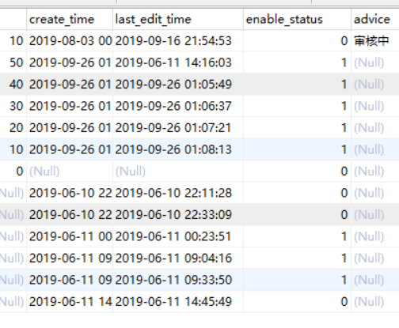

# 2016级项目实训成果展示 

## 《o2校园商铺》 -  Java与移动智能设备开发方向

###  项目简介

网罗周边实体店，接收最新优惠信息，线上预订座位或下单，天热也不用排队啦

### 项目地址

- Github：[https://github.com/lihailiang1997/Project_Practice](https://github.com/lihailiang1997/Project_Practice)

### 项目成员

- 李海亮（项目经理、UI设计师、开发工程师、测试工程师）
  - Email：420809214@qq.com 
  - Github：htps://github.com/lihailiang1997
- 赵宸（市场总监、UI设计师、开发工程师、测试工程师）
  - Email：470158790@qq.com
  - Github：github.com/zhaochen10086
- 刘兆康（技术总监、UI设计师、开发工程师、测试工程师）
  - Email：1353730599@qq.com
  - Github：https://github.com/SanTianLiangJiao
- 陆贺松（技术总监、UI设计师、开发工程师、测试工程师）
  - Email：773798339@qq.com
  - Github：https://github.com/luhesong2016
- 刘文轩（质量专家、UI设计师、开发工程师、测试工程师）
  - Email：16812520@qq.com
  - Github：[https://github.com/liuwenxuan]

### 项目截图

