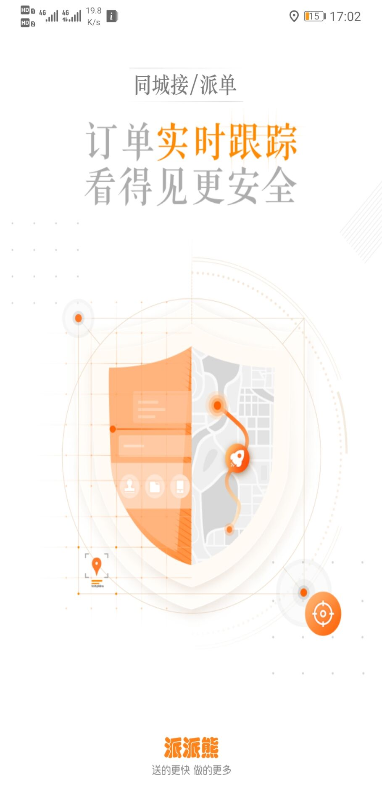
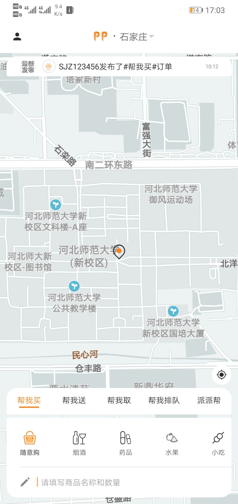
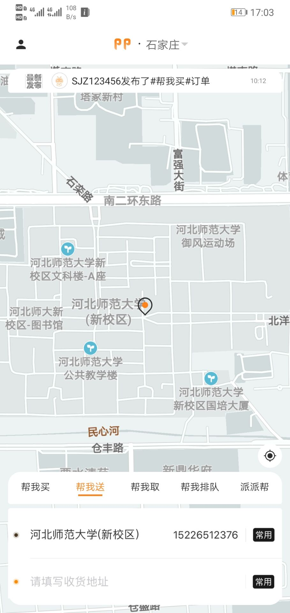
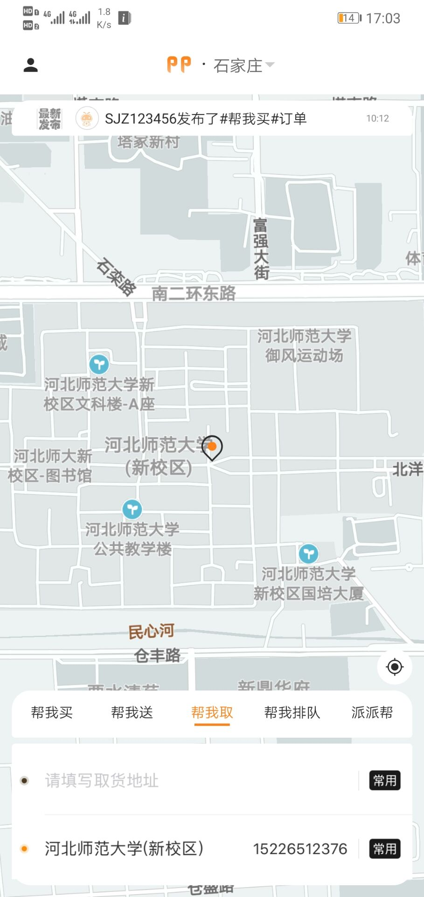
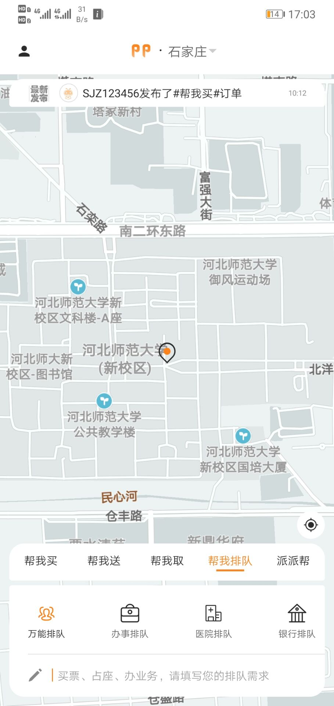
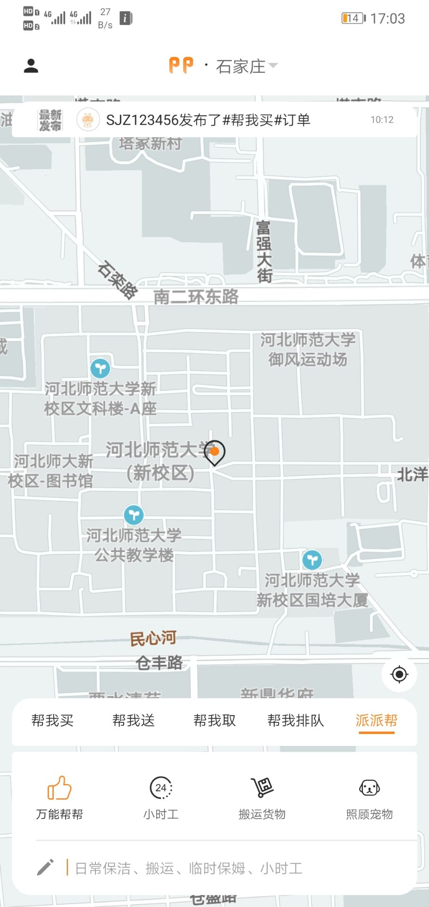
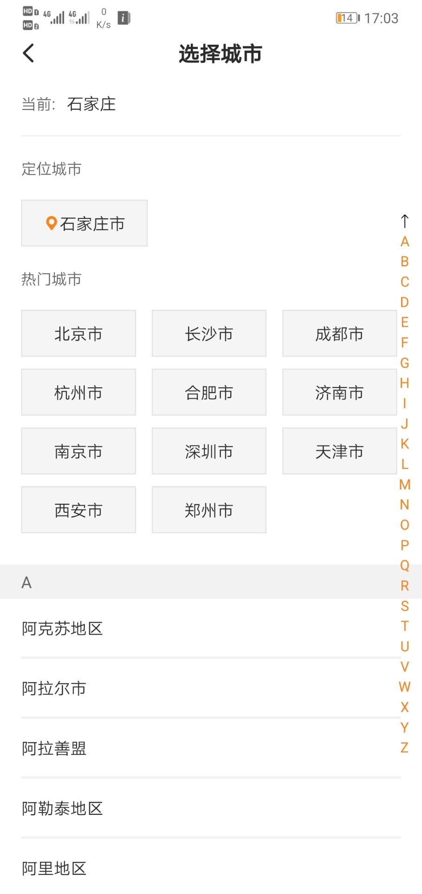
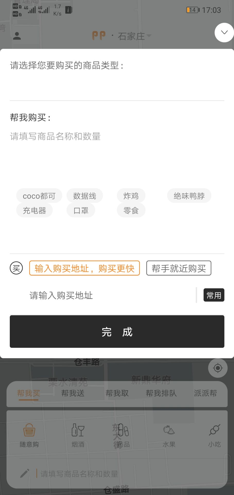

# 2016级项目实训成果展示 

## 《派派熊跑腿》 -  Java与移动智能设备开发方向

###  项目简介

派派熊跑腿是一个在外卖服务的基础上扩展的帮买、帮取、帮送等等多种同城助力订单发布平台。

### 项目成员

- 杨永好（项目经理、UI设计师、开发工程师、测试工程师）
  
- 杨丽颖（市场总监、UI设计师、开发工程师、测试工程师）
  
- 程伟业（技术总监、UI设计师、开发工程师、测试工程师）
  
- 王澎源（技术总监、UI设计师、开发工程师、测试工程师）
  
- 梅连伟（产品经理、UI设计师、开发工程师、测试工程师）
  
- 郝凯歌（质量专家、UI设计师、开发工程师、测试工程师）

### 项目截图

