# 2016级项目实训成果展示 

## 《游迹+》 -  Java与移动智能设备开发方向

###  项目简介

一款“旅游App”！

为那些喜欢旅行的人们打造一个畅想言论，分享旅行体验的社区，让旅行生活匾额丰富多彩，不在“耳听为虚”，做到真正的“眼见为实；为需要旅行信息的群体提供实时的，详细的，人性化的旅行信息，让用户可以花费更少的时间在收集信息上。

### 项目地址

- Github：[https://github.com/Liangqiwen123/youji2.0](https://github.com/Liangqiwen123/youji2.0)

### 项目成员

- 刘恒韧（项目经理、UI设计师、开发工程师、测试工程师）
  - Email：[1016406999@qq.com](mailto:1016406999@qq.com) 
  - Github：[https://github.com/liuhengren](https://github.com/liuhengren)
- 梁启文（市场总监、UI设计师、开发工程师、测试工程师）
  - Email：[651838281@qq.com](mailto:651838281@qq.com)
  - Github：[https://github.com/Liangqiwen123](https://github.com/Liangqiwen123)
- 李俊霞（技术总监、UI设计师、开发工程师、测试工程师）
  - Email：[1366647501@qq.com](mailto:1366647501@qq.com)
  - Github：[https://github.com/JX1025](https://github.com/JX1025)
- 郝帅虎（UI设计师、开发工程师）
  - Email：[1362101602@qq.com](mailto:1362101602@qq.com)
  - Github：[https://github.com/haoshuaihu](https://github.com/haoshuaihu)

### 项目截图

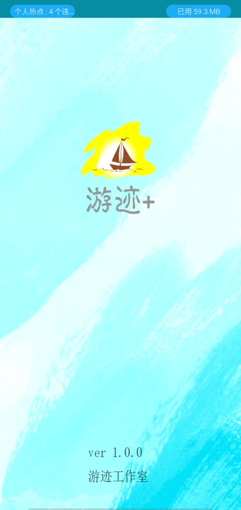
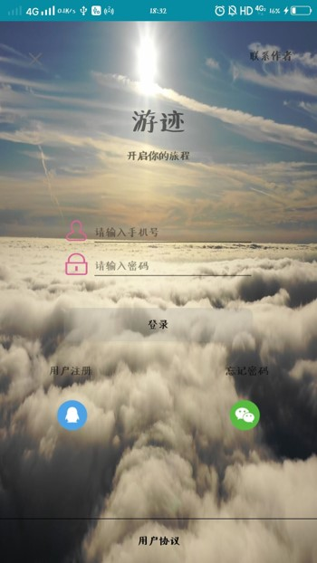
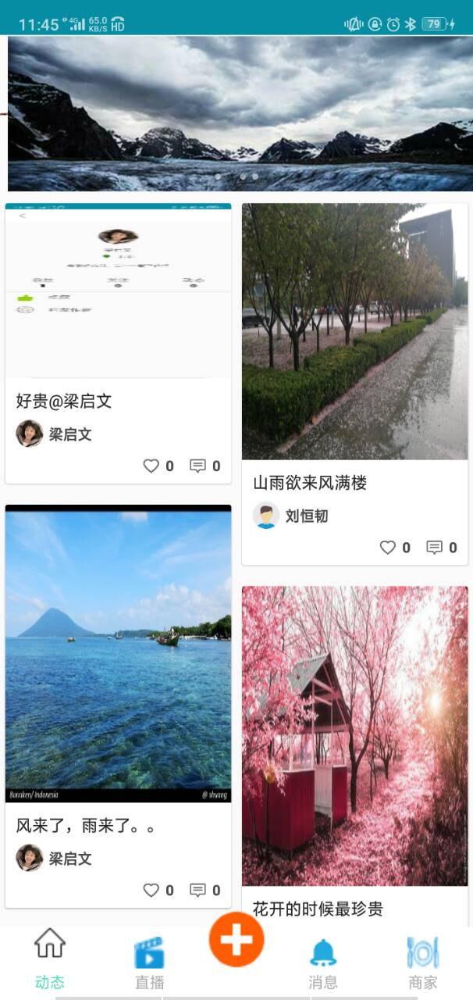

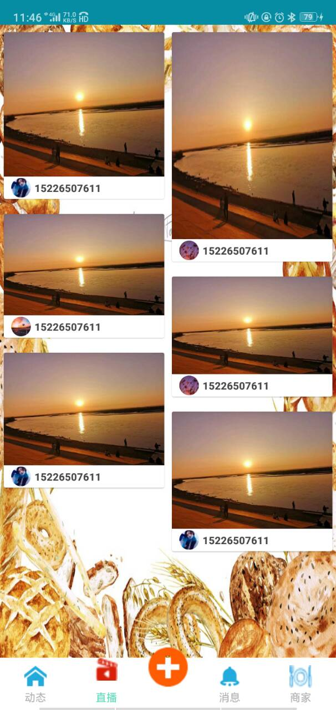
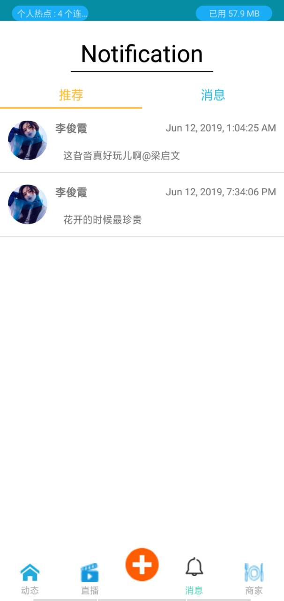

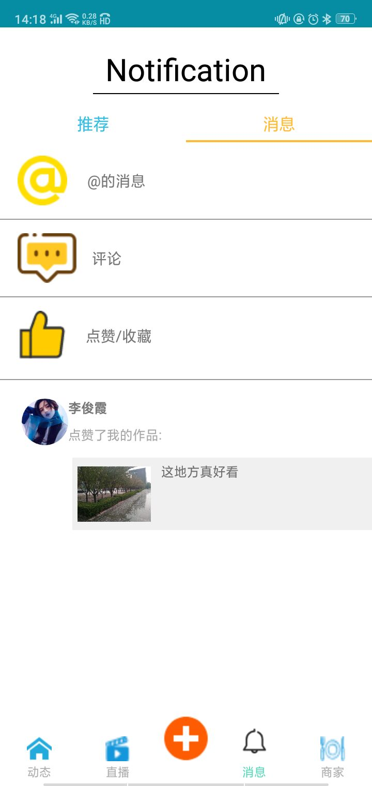
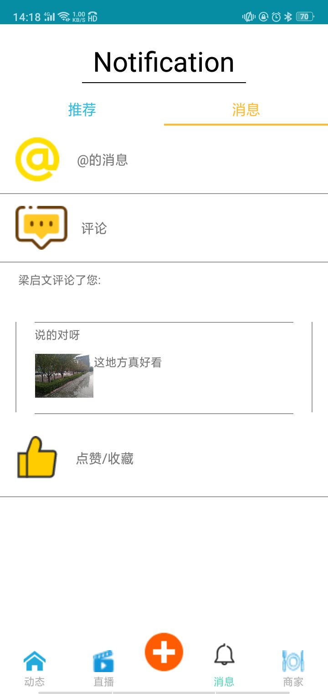
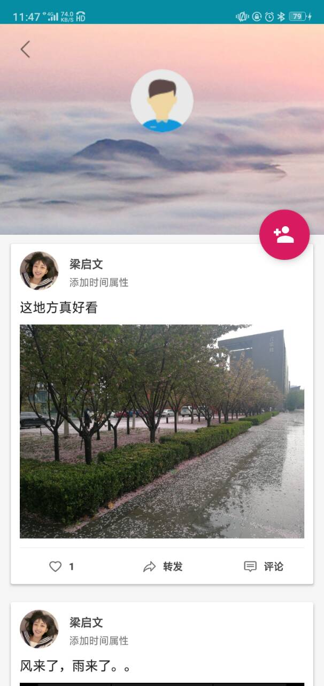

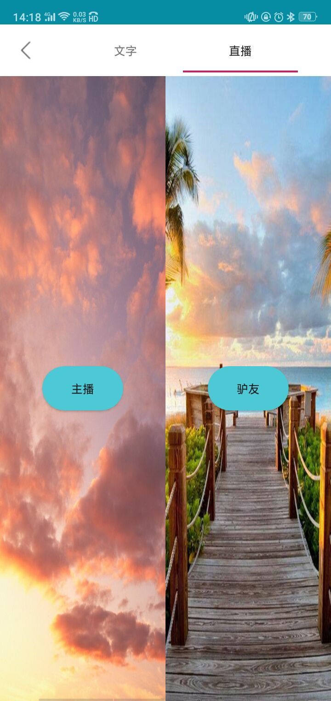
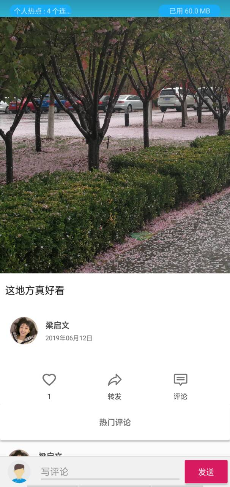

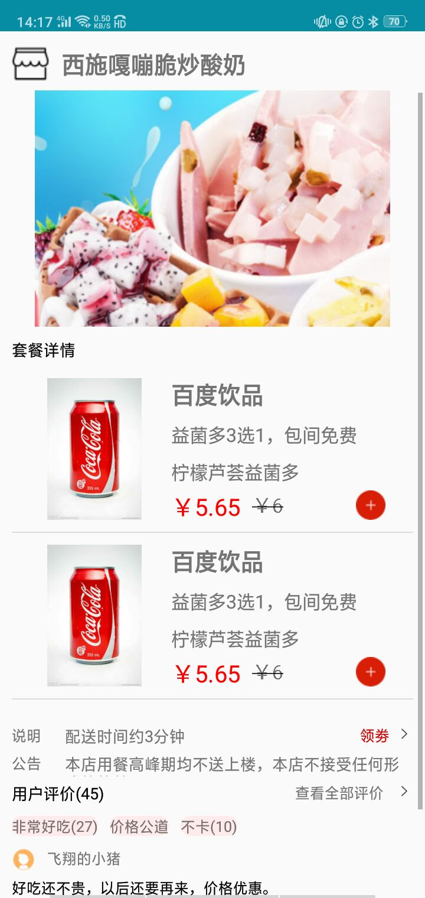

