# 2016级项目实训成果展示 

## 《灵跃》 -  Java与移动智能设备开发方向

###  项目简介

**灵跃（英文名：Linear）**是一款运行在 Android 端的运动类 app，它可以为喜欢健身活动和有健身意向的人群提供一个集训练、健康、课程和社交为一体的综合平台。用户可以通过 app 开展训练（如跑步、健身操）、通过分析健康指标和环境数据得到合理的健康建议、通过安排日程制定运动计划，并有社交和分享功能，app 还有线上课程和运动知识供用户学习。

### 项目成员

- 穆晓炜（项目经理，产品，Android工程师，数据库管理员）
  - Email：[1196943487@qq.com](mailto://1196943487@qq.com)
  - Github：[https://github.com/Hsiau-wei](https://github.com/Hsiau-wei)
- 吴慧霞（Android工程师，产品，测试）
  - Email：[1972525548@qq.com](mailto://1972525548@qq.com)
  - Github：[https://github.com/WuHuiXia689](https://github.com/WuHuiXia689)
- 安琪（Android工程师，UI设计师）
  - Email：[1136706318@qq.com](mailto://1136706318@qq.com)
  - Github：[https://github.com/anqi0427](https://github.com/anqi0427)
- 付举鹏（Android工程师，产品，测试）
  - Email：[493675684@qq.com](mailto://493675684@qq.com)
  - Github：[https://github.com/fujupeng](https://github.com/fujupeng)
- 王鲁玉（Android工程师，测试）
  - Email：[963053165@qq.com](mailto://963053165@qq.com)
  - Github：[https://github.com/wangluyu1996](https://github.com/wangluyu1996)
- 吴旭东（后端工程师，数据库管理员）
  - Email：[i@5am3.com](mailto://i@5am3.com)
  - Github：[https://github.com/5am3](https://github.com/5am3)

### 项目截图

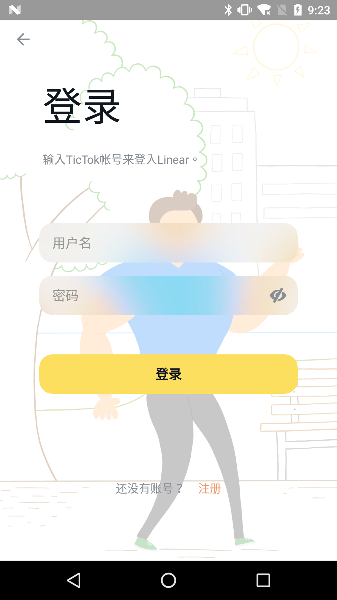
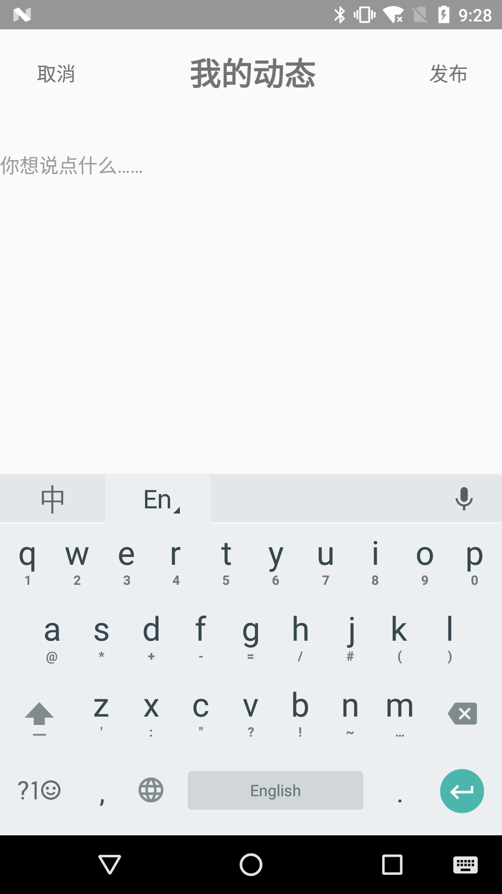
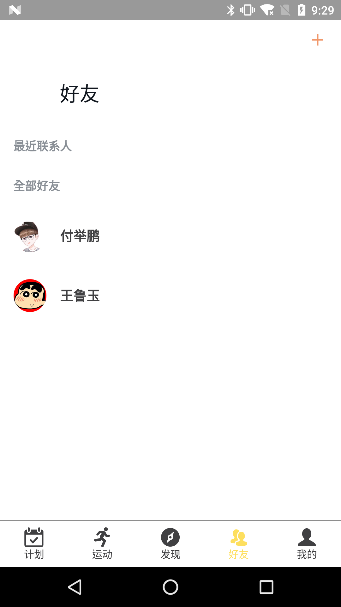

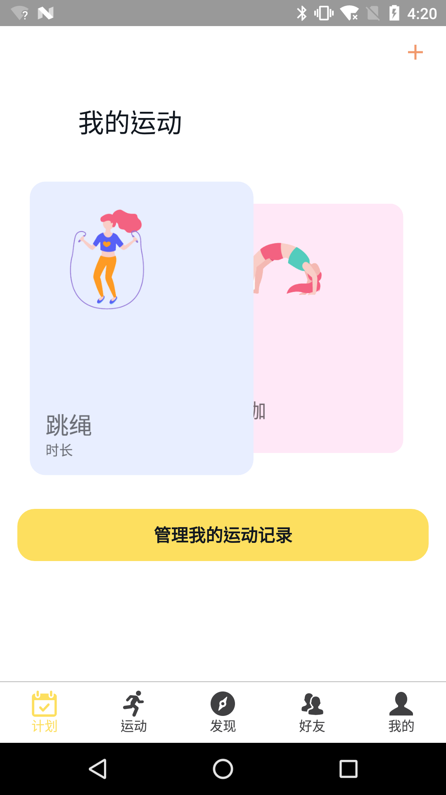
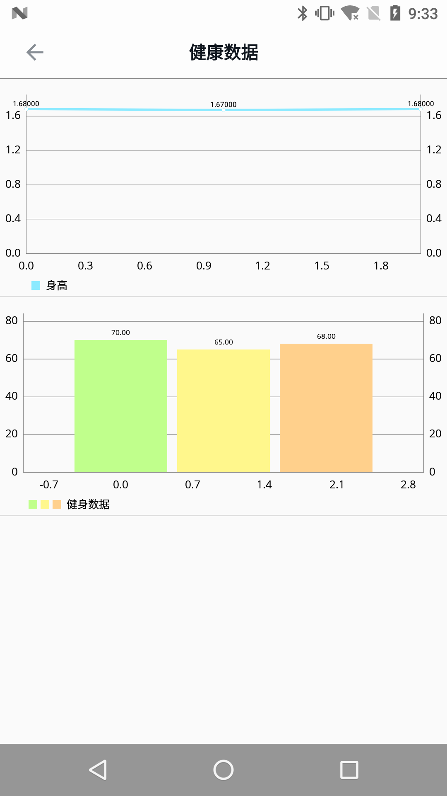

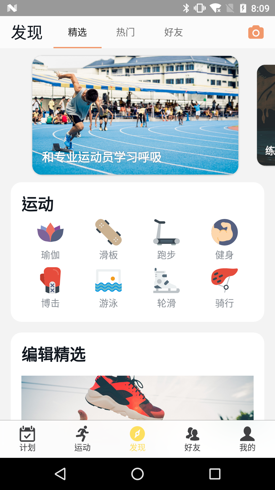
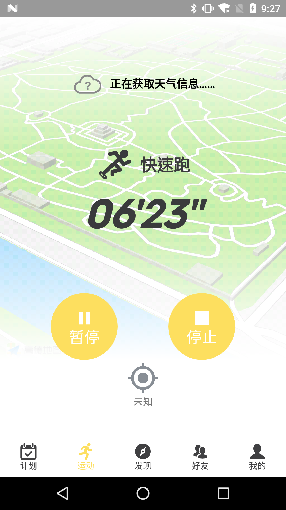
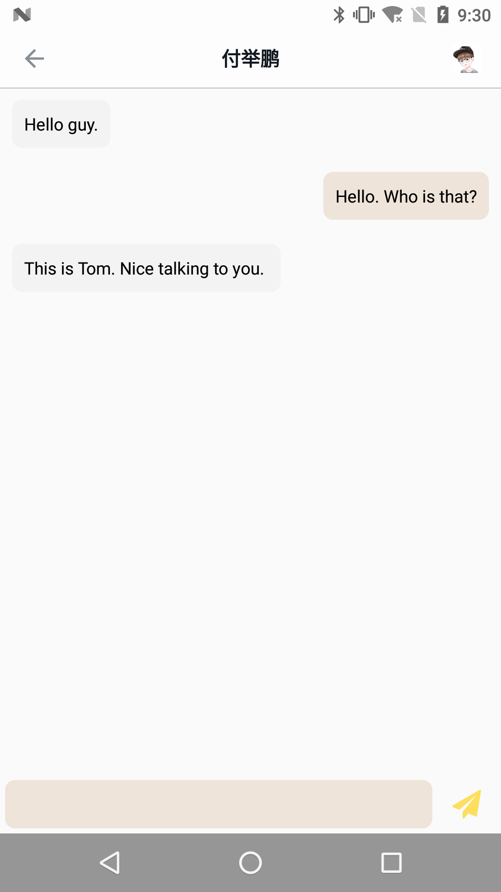

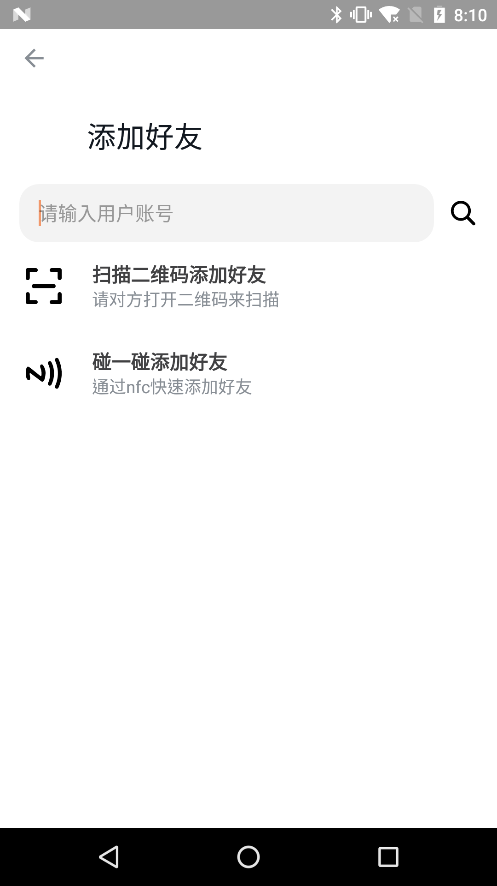
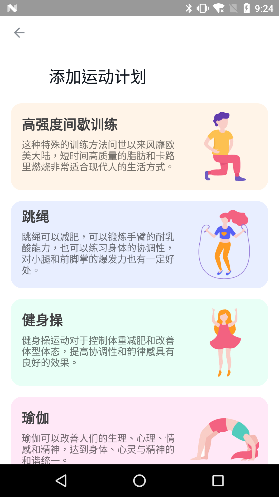

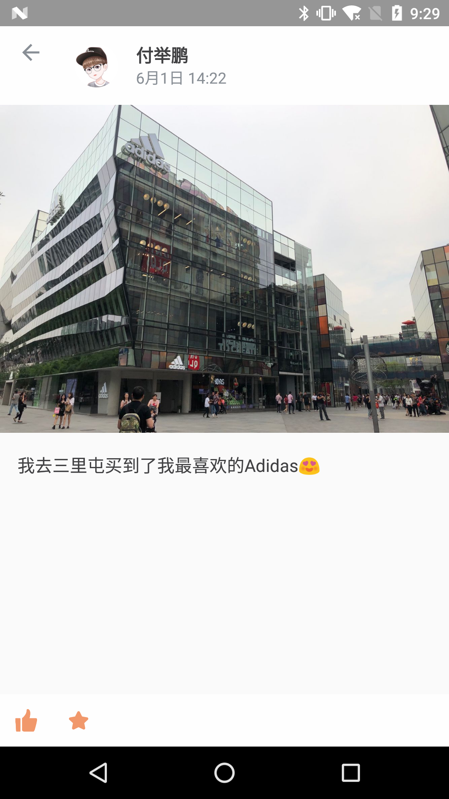
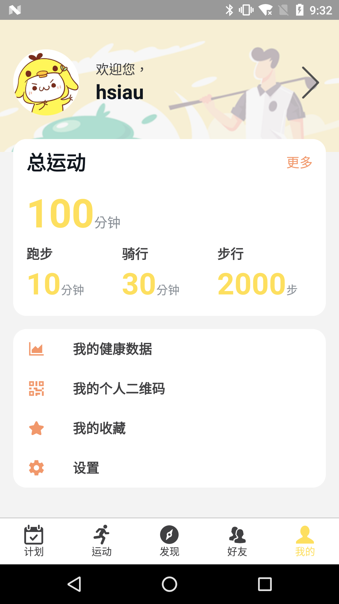

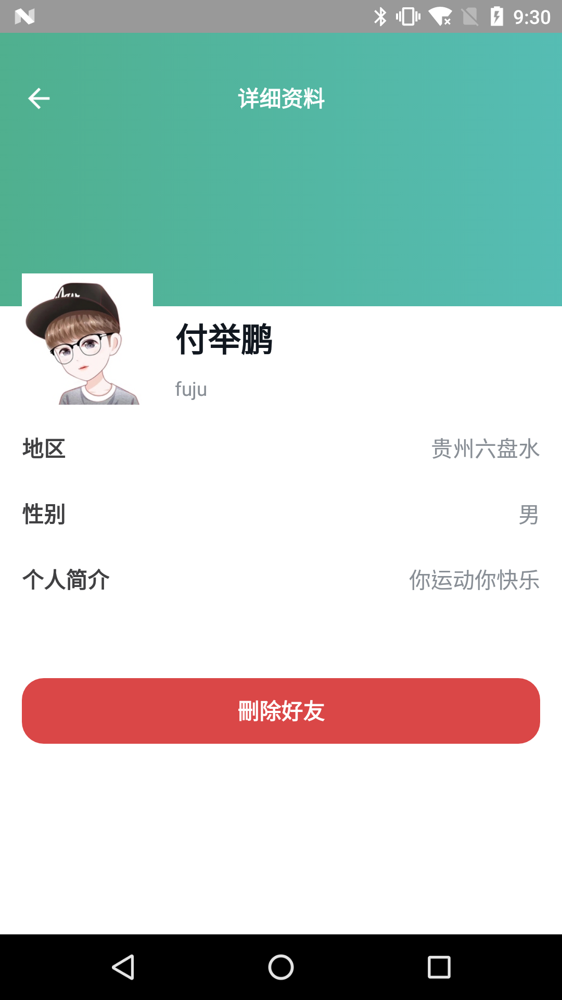
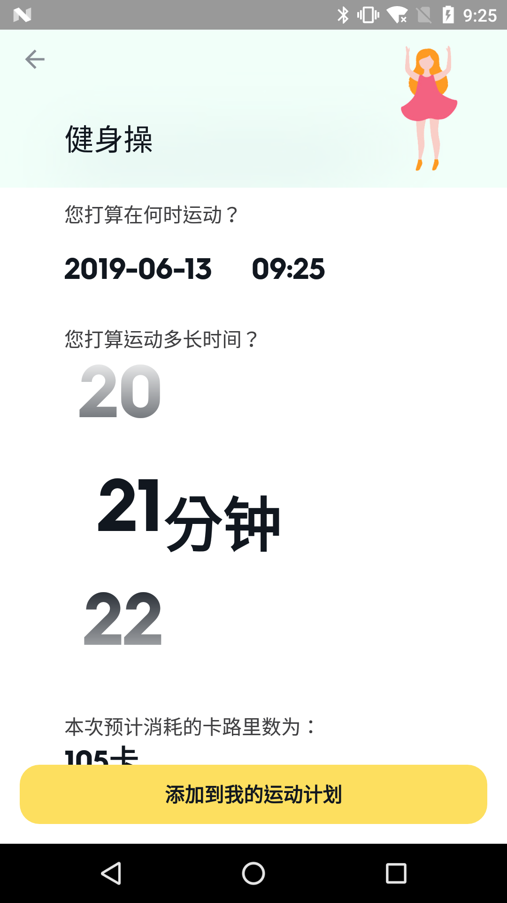
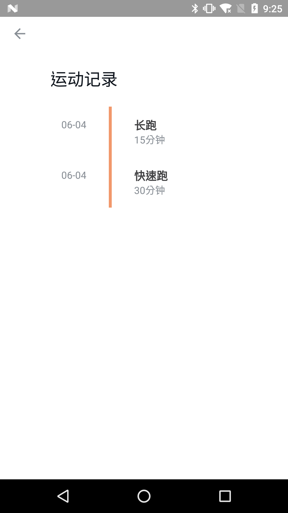

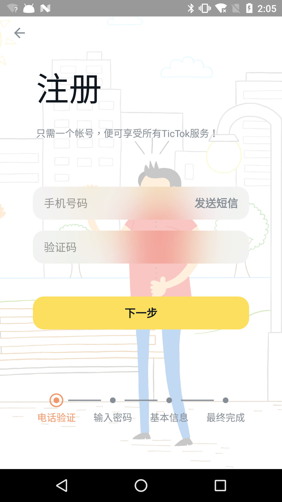

