# 2016级项目实训成果展示 

## 《菜》 -  Java与移动智能设备开发方向

###  项目简介

一款“美食App”——让你吃到嗨！

全国美食精品荟萃，集聚八大菜系，川鲁粤苏浙闽湘徽，从家常菜到人气料理，从正餐到甜点，从满汉全席到养生汤。搜索美食智慧，品评美食文化，体会美食乐趣。菜，简单的名字，幸福的滋味！海量不同菜系菜谱，满足您的个性化需求

风味民肴，特色食材，独家匠艺！各种美食，随心所享！让你体验前所未有的爆炸口感！

### 项目地址

- Github：[https://github.com/zhaoyunfeng123/project](https://github.com/zhaoyunfeng123/project)

### 项目成员

* 赵云峰（项目经理、开发工程师、测试工程师）
    * Email :1546419171@qq.com
    * GitHub:[https://github.com/zhaoyunfeng123](https://github.com/zhaoyunfeng123)
* 刘浩（市场总监、开发工程师、测试工程师）
    * Email :1535910050@qq.com
    * GitHub:[https://github.com/liuhao1202](https://github.com/liuhao1202)
* 孟乐乐（技术总监、开发工程师、测试工程师）
    * Email :2515854955@qq.com
    * GitHub:[https://github.com/menglele](https://github.com/zhaoyunfeng123/project)
* 杨时雨（技术总监、UI设计师、开发工程师、测试工程师）
    * Email :yangsy823@outlook.com
    * GitHub:[https://github.com/speedwind7](https://github.com/speedwind7)
* 李奥博（产品经理、UI设计师、开发工程师、测试工程师）
    * Email :1062212300@qq.com
    * GitHub:[https://github.com/1062212300](https://github.com/1062212300)
* 刘宇豪（质量专家、UI设计师、开发工程师、测试工程师）
    * Email :1403949014@qq.com
    * GitHub:[https://github.com/wujiel](https://github.com/wujiel)

### 项目截图

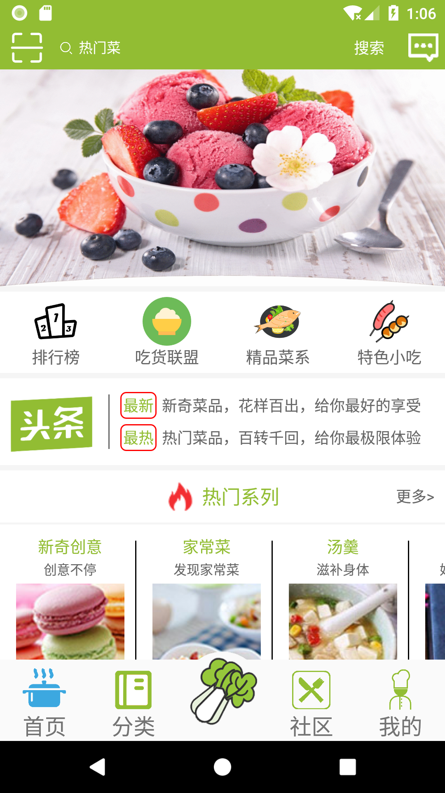
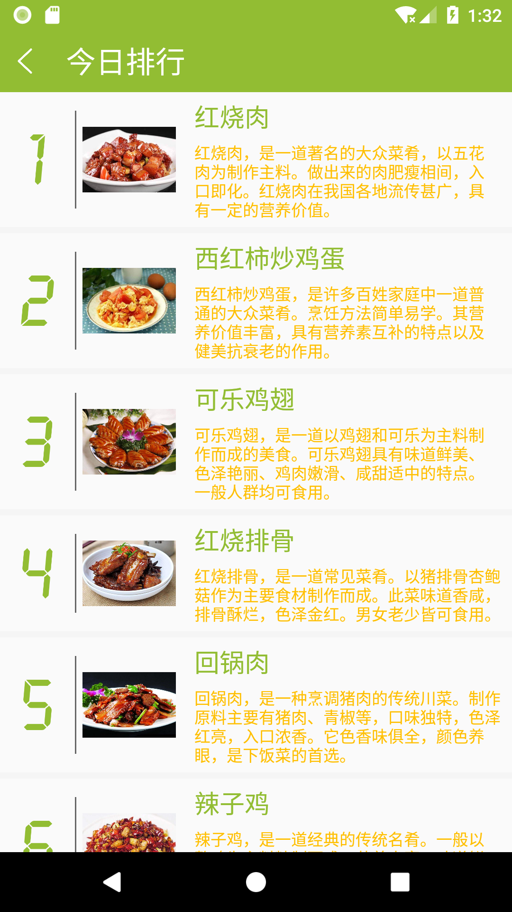

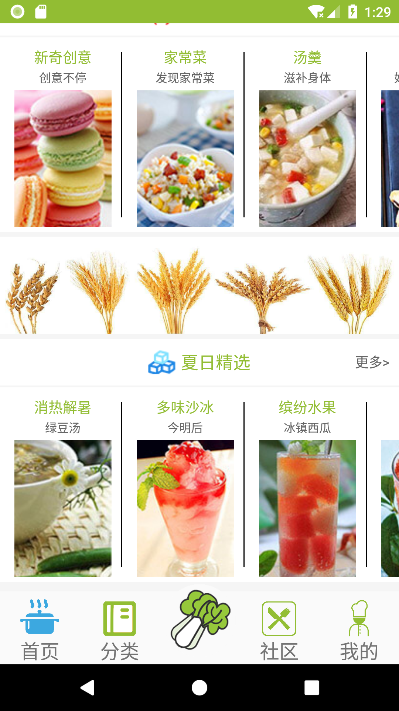
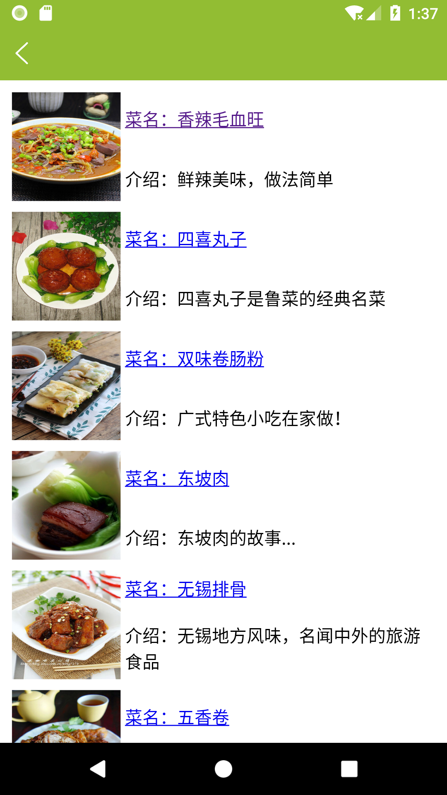
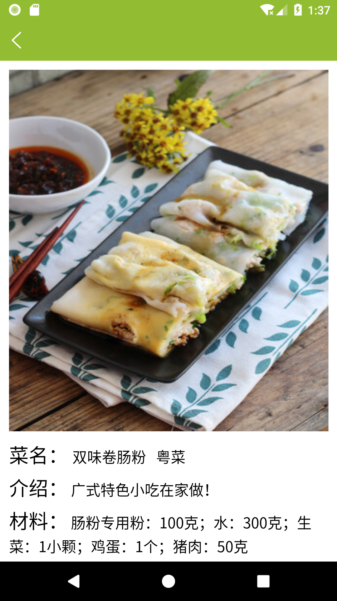

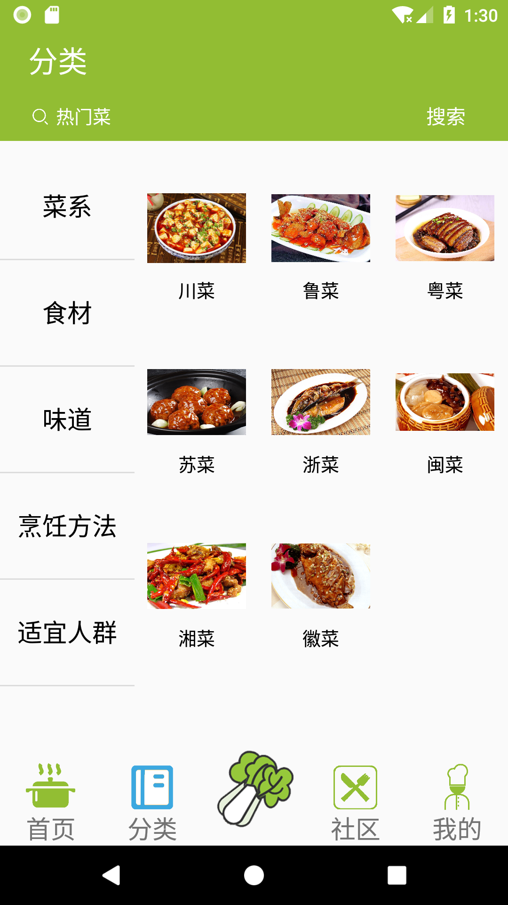
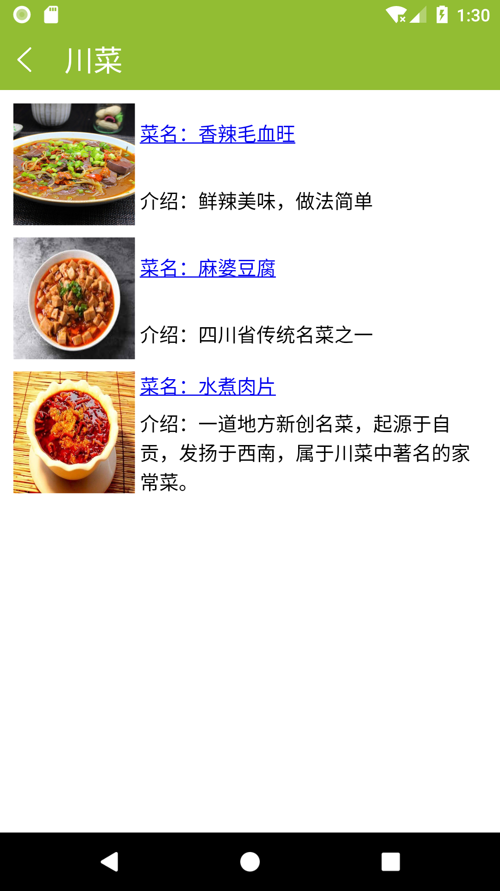
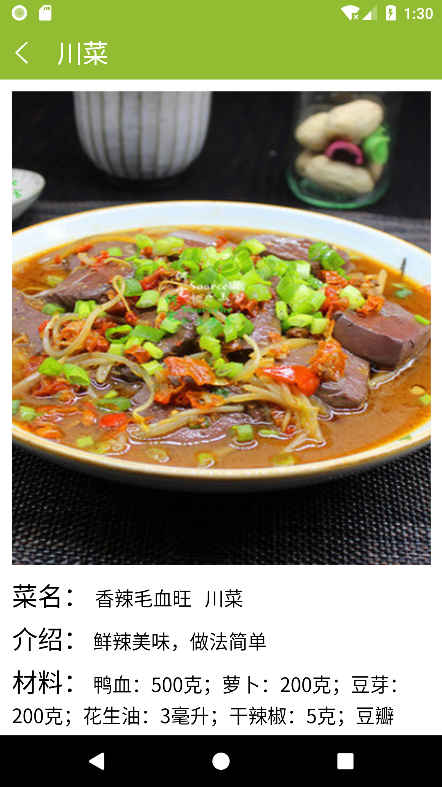

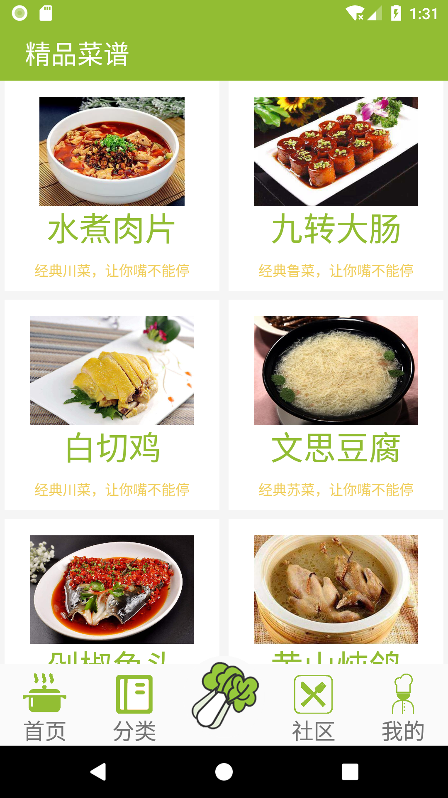

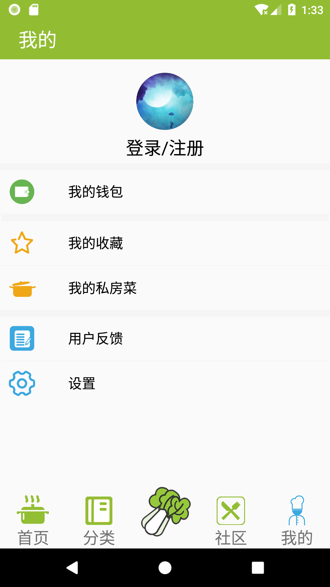
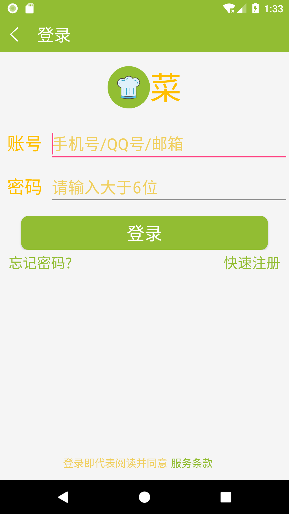
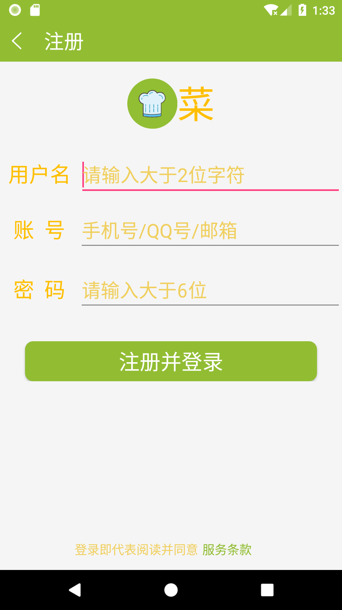

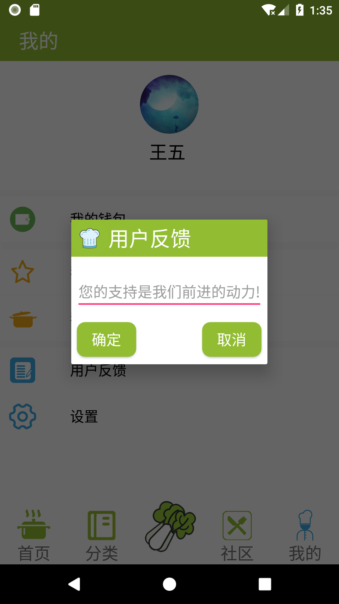
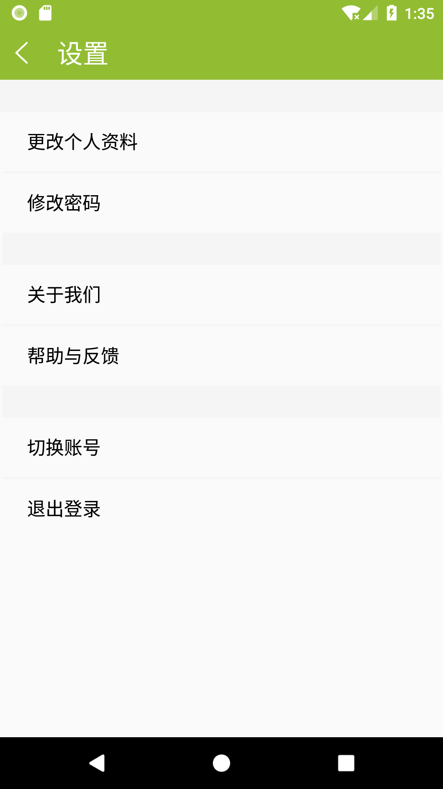
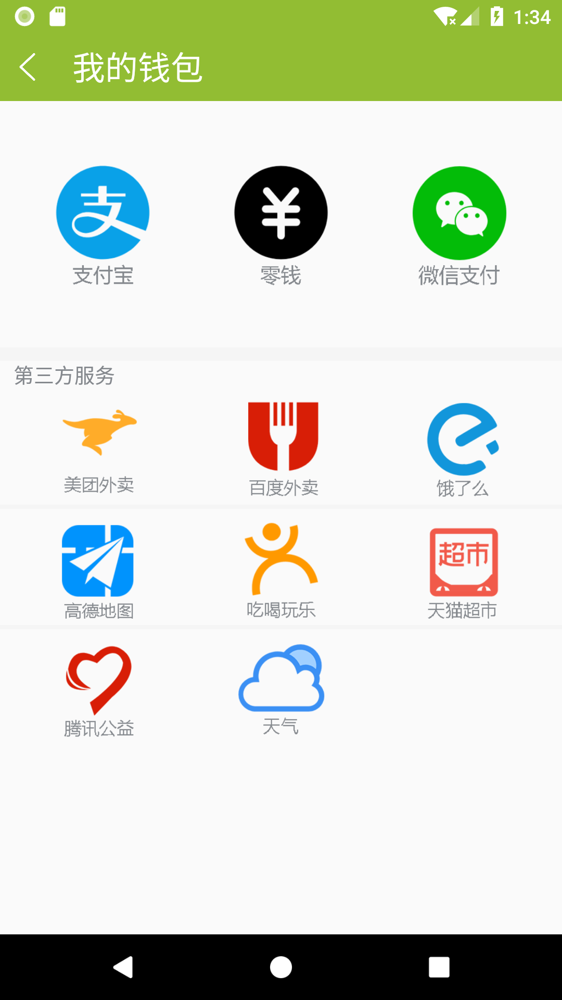

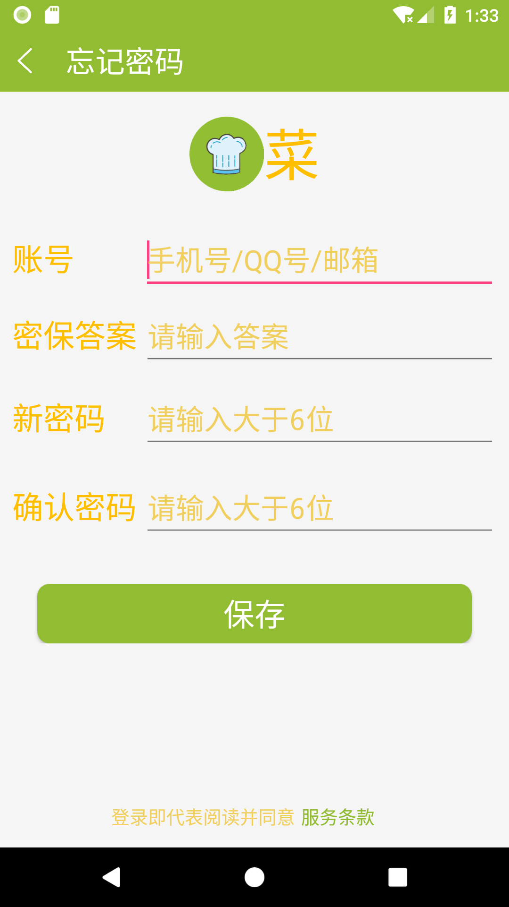
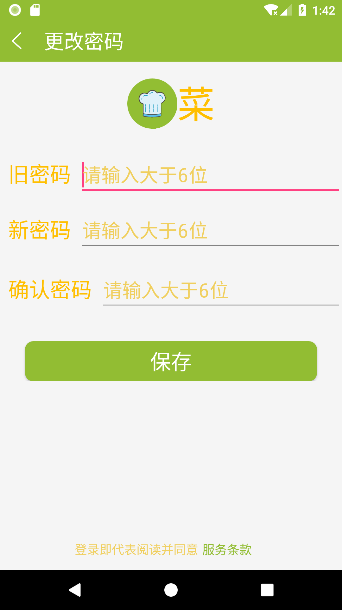
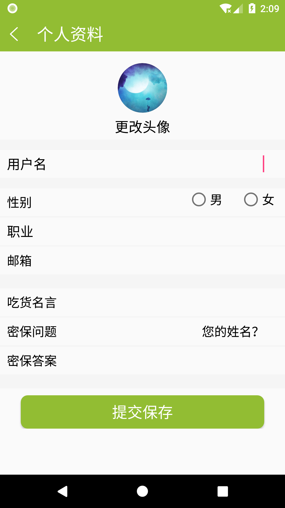

