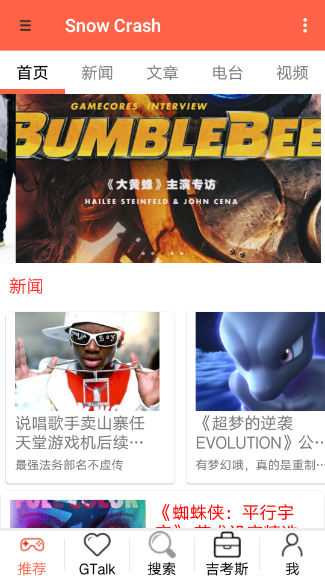
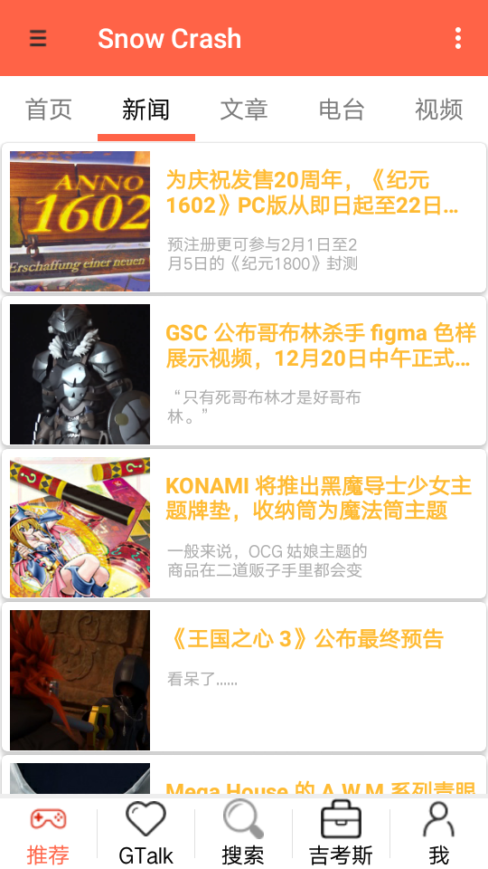
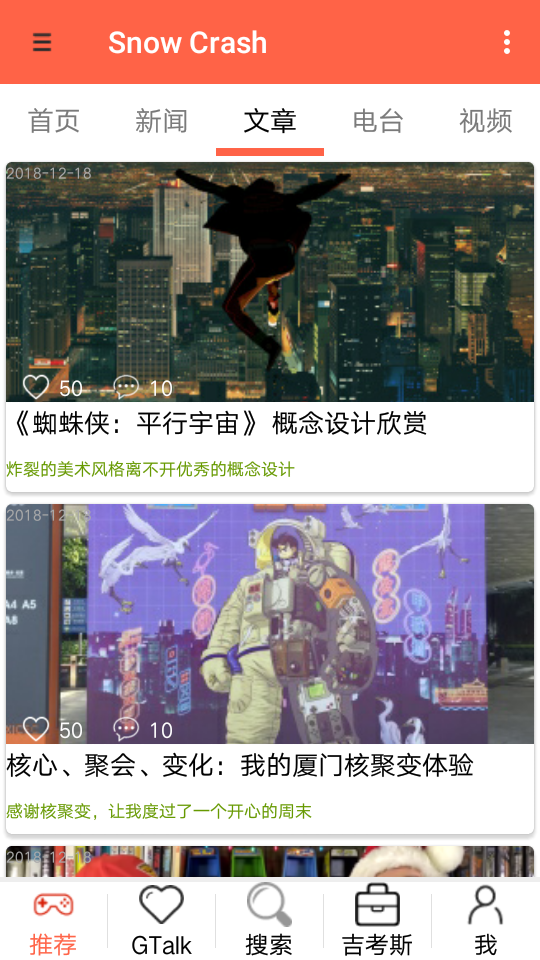
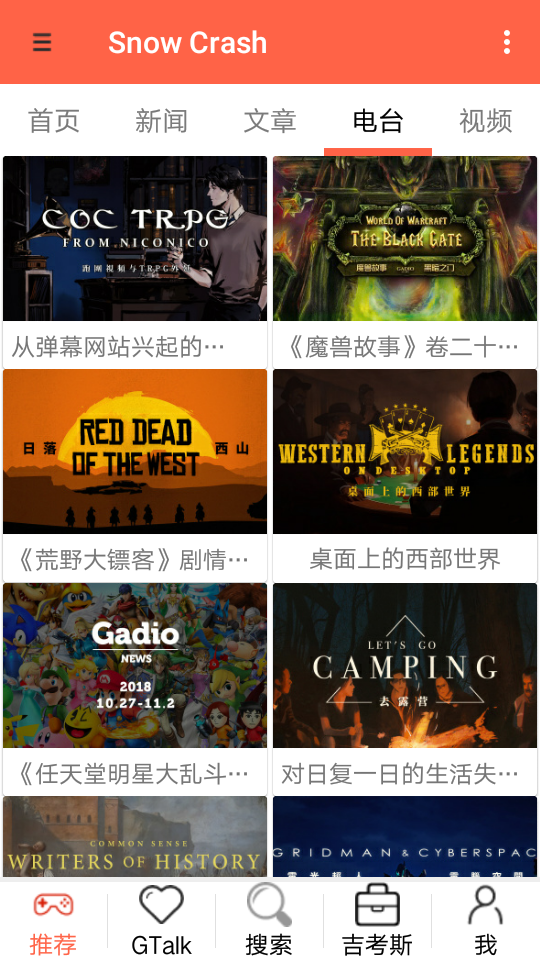
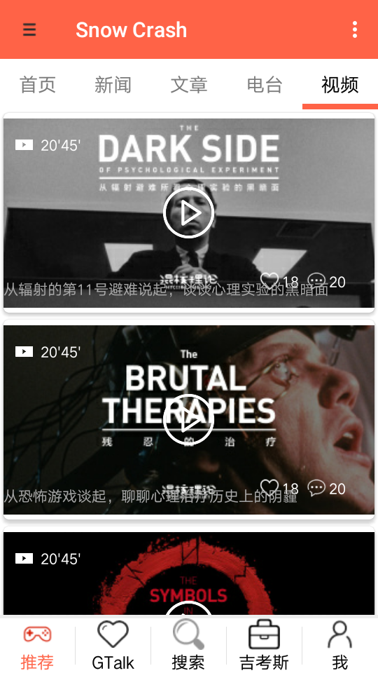
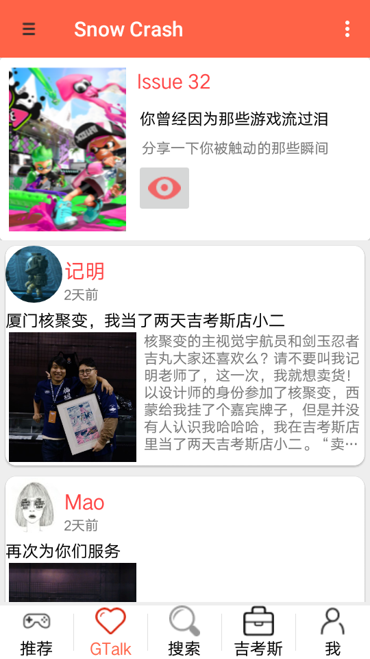
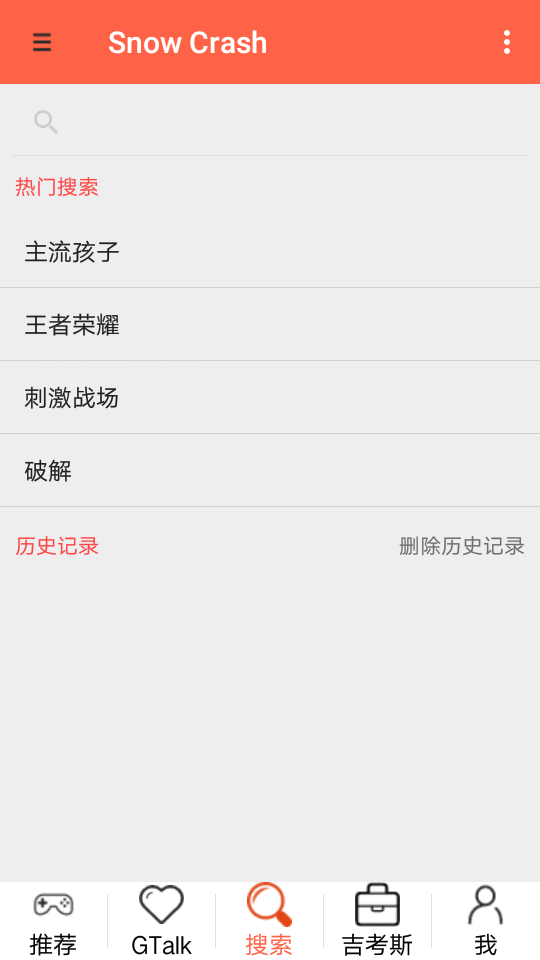
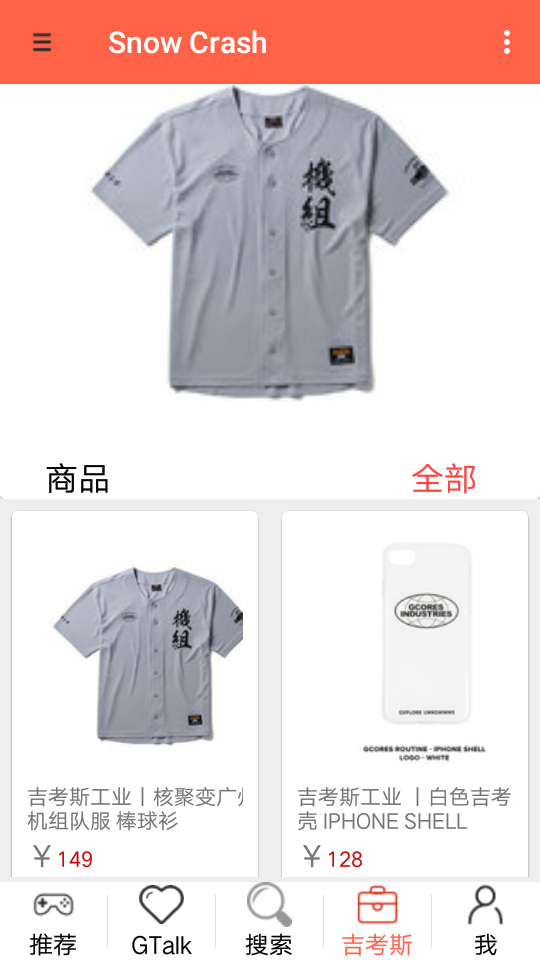

# 2016级项目实训成果展示 

## 《雪崩》 -  Java与移动智能设备开发方向

###  项目简介

雪崩一款包含二次元信息推送，游戏玩家生活分享功能的APP。

雪崩是一款休闲娱乐向的APP。旨在搭建起广大二次元爱好者和游戏爱好者交流沟通的桥梁。打造集动漫，游戏，生活分享，商品交易等信息共享平台，为时下的青少年提供更加订制化的休闲娱乐体验，保证用户减少信息收集时间成本的同时，实现自身的盈利。

用户可以在雪崩APP上了解最新最热的话题资讯，同时根据个人爱好制定出私人订制化的个性首页，减少不必要的信息检索。APP也致力于开发原创的电台与视频节目，辐射到二次元甚至是电影的领域，用户在享受到这些各种资源的同时也能与其他用户展开热烈的讨论。

### 项目成员

- 张振东(客户端代码开发)
	- Email:12345678@qq.com
	- Github:https://github.com/zhang
	
- 王禹婕(客户端代码开发)
	- Email:12345678@qq.com
	- Github:https://github.com/xiongQ233

### 运行效果

 

