# 2016级项目实训成果展示 

## 《食堂早知道》 -  Java与移动智能设备开发方向

###  项目简介

我们将食堂与学生建立起良好的沟通交互平台，为学生提供饭菜预定服务，平台会提前一天推送明天的菜品，学生们可以浏览并且投票选出明天想吃的菜品，
通过预订及预订凭证直接去窗口领取，食堂会根据投票进行采购以及决定所做菜量，这样学生们既节约时间，食堂又避免了对粮食的浪费。
以服务便捷学生，减少浪费为根本出发点，创造一个更加便捷完善的系统平台。

### 项目地址

- Github：[https://github.com/fuhuixu/canteenforecast](https://github.com/fuhuixu/canteenforecast)

### 项目成员

- 徐福惠（项目经理、开发工程师）
  - Email：[1627645034@qq.com](mailto:1627645034@qq.com) 
  - Github：[https://github.com/fuhuixu](https://github.com/fuhuixu)
- 张萌（UI设计师、开发工程师、测试工程师）
  - Email：[2496525846@qq.com](mailto:2496525846@qq.com)
  - Github：[https://github.com/zhangmeng11](https://github.com/zhangmeng11)
- 句艳平（技术总监、UI设计师、开发工程师、测试工程师）
  - Email：[2453366021@qq.com](mailto:2453366021@qq.com)
  - Github：[https://github.com/juyanping](https://github.com/juyanping)
- 李晔（UI设计师、开发工程师、测试工程师）
  - Email：[2908673445@qq.com](mailto:2908673445@qq.com)
  - Github：[https://github.com/liye1997](https://github.com/liye1997)

### 项目截图

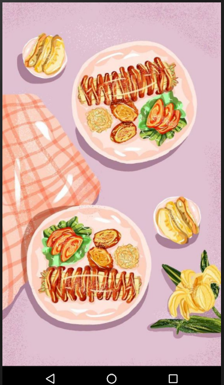
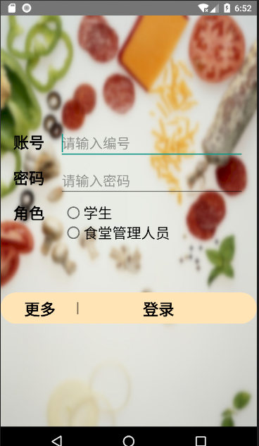
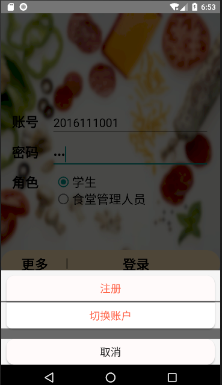

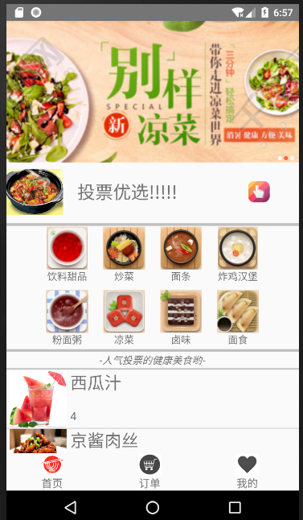
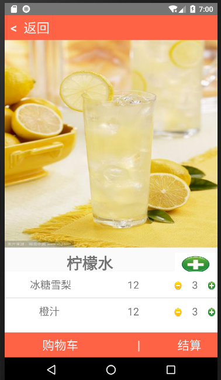
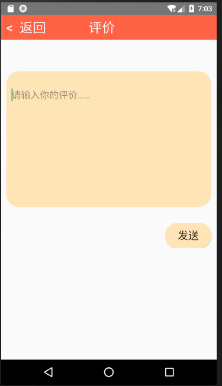

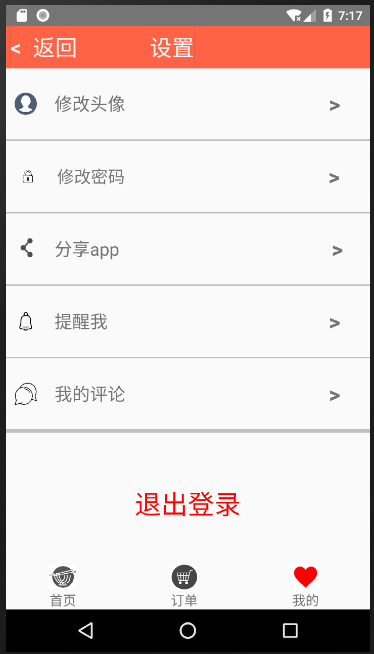
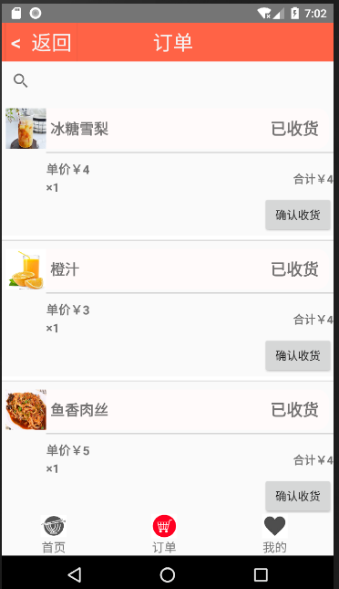
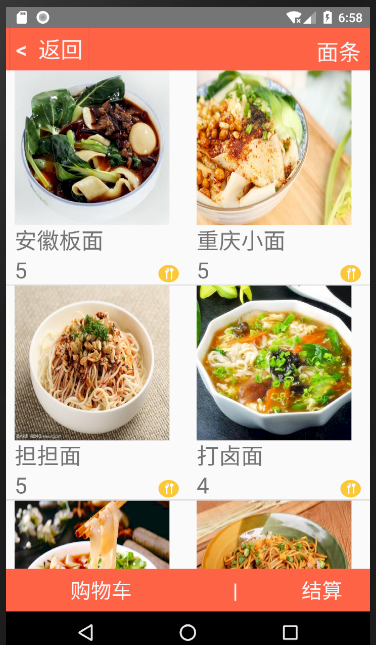

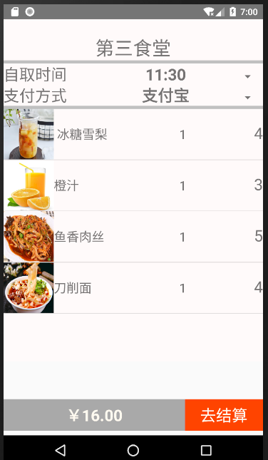
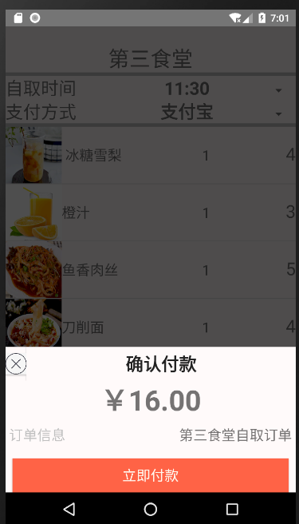
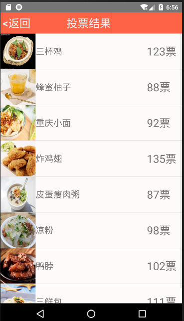

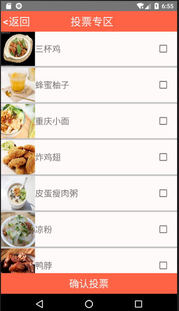

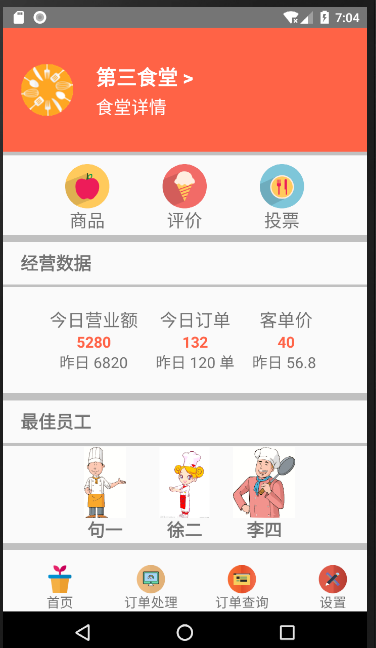

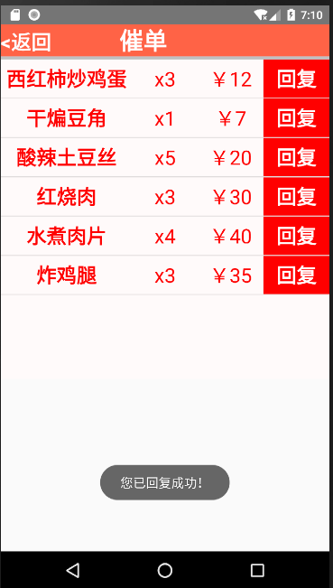
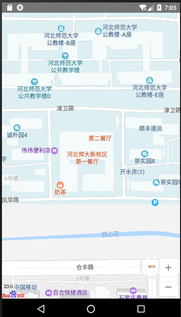
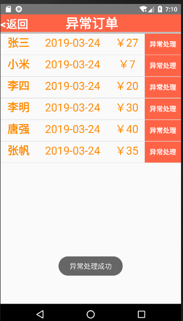

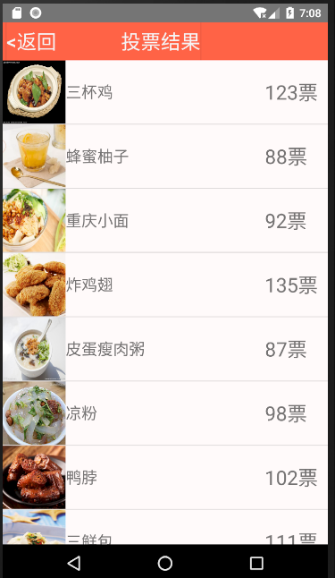
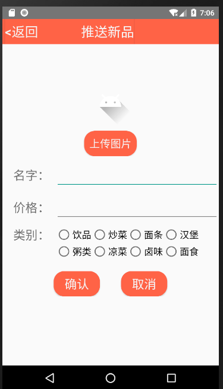
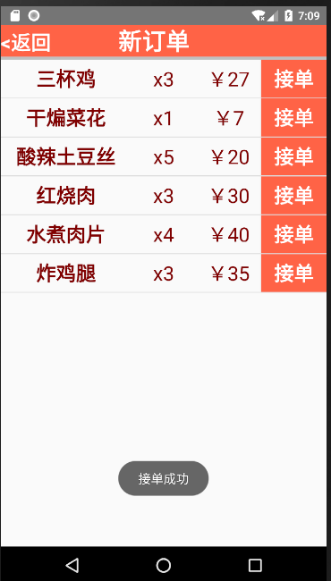

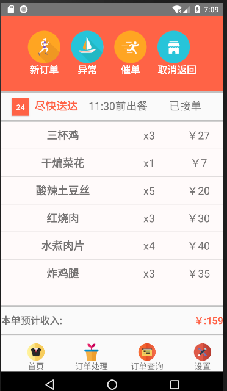
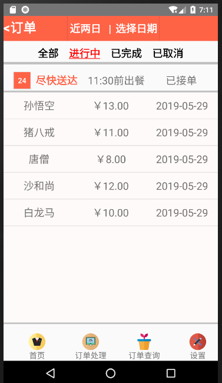
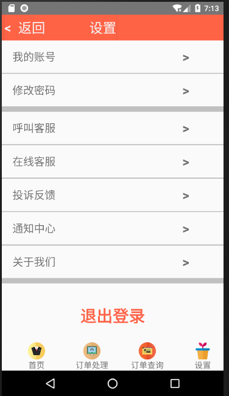

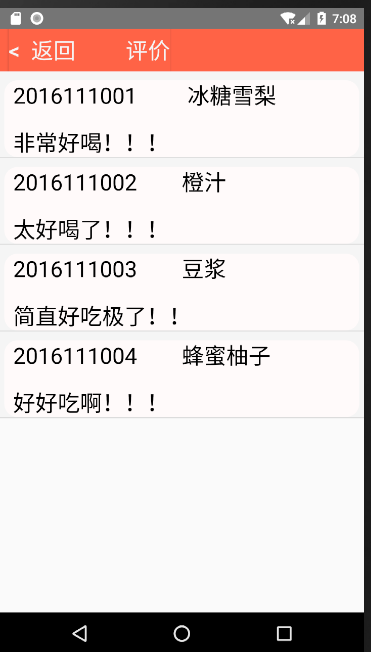
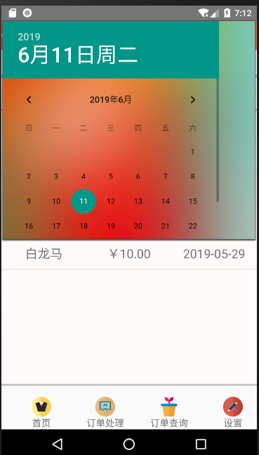
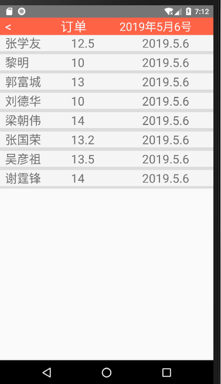

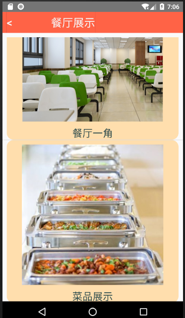

