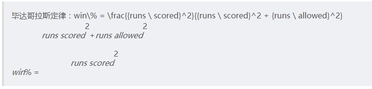
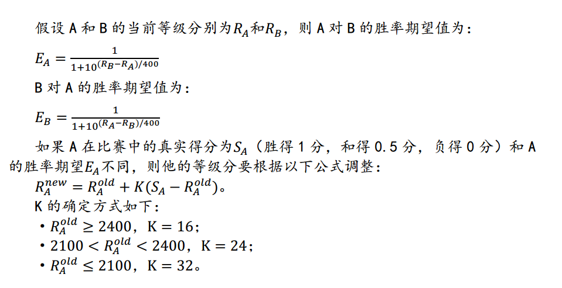
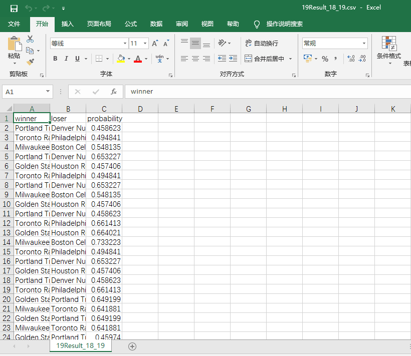
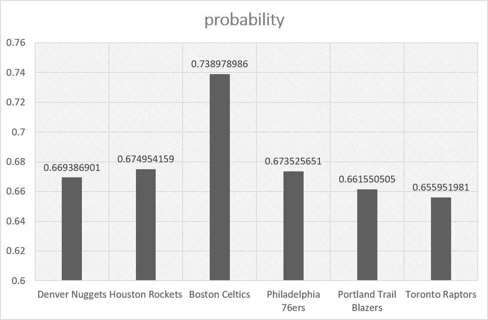
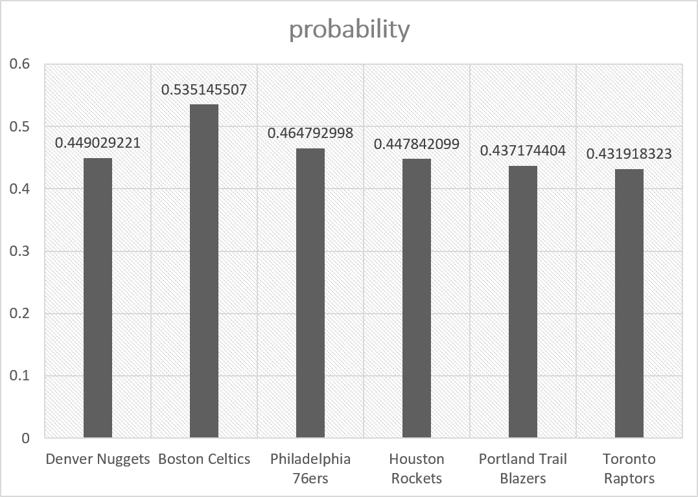

# 2016级项目实训成果展示 

## 《AnalysisNBAData》 - Python与机器学习方向


### 一、实验介绍

#### 1.1实验目的：

我们将基于2018-2019年的NBA常规赛及部分季后赛的比赛统计数据，预测在当下正在进行的2018-2019,季后赛5月份的每场赛事的结果 

#### 1.2实验流程：

1. 获取比赛统计数据
2. 比赛数据分析，得到代表每场比赛每支队伍状态的特征表达
3. 利用机器学习方法学习每场比赛与胜利队伍的关系，并对2018-2019的比赛进行预测

### 二、获取NBA比赛统计数据

#### 2.1比赛数据介绍：

我们将采用[Basketball Reference.com](http://www.basketball-reference.com/)中的统计数据。在这个网站中，你可以看到不同球员、队伍、赛季和联盟比赛的基本统计数据，如得分，犯规次数等情况，胜负次数等情况。而我们在这里将会使用2018-19 NBA Season Summary中数据。 

在这个2015-16总结的所有表格中，我们将使用的是以下三个数据表格 ：

##### Team Per Game Stats：每支队伍平均每场比赛的表现统计

| 数据名                             | 含义                       |
| ---------------------------------- | -------------------------- |
| Rk -- Rank                         | 排名                       |
| G -- Games                         | 参与的比赛场数（都为82场） |
| MP -- Minutes Played               | 平均每场比赛进行的时间     |
| FG--Field Goals                    | 投球命中次数               |
| FGA--Field Goal Attempts           | 投射次数                   |
| FG%--Field Goal Percentage         | 投球命中次数               |
| 3P--3-Point Field Goals            | 三分球命中次数             |
| 3PA--3-Point Field Goal Attempts   | 三分球投射次数             |
| 3P%--3-Point Field Goal Percentage | 三分球命中率               |
| 2P--2-Point Field Goals            | 二分球命中次数             |
| 2PA--2-point Field Goal Attempts   | 二分球投射次数             |
| 2P%--2-Point Field Goal Percentage | 二分球命中率               |
| FT--Free Throws                    | 罚球命中次数               |
| FTA--Free Throw Attempts           | 罚球投射次数               |
| FT%--Free Throw Percentage         | 罚球命中率                 |
| ORB--Offensive Rebounds            | 进攻篮板球                 |
| DRB--Defensive Rebounds            | 防守篮板球                 |
| TRB--Total Rebounds                | 篮板球总数                 |
| AST--Assists                       | 辅助                       |
| STL--Steals                        | 偷球                       |
| BLK -- Blocks                      | 封阻                       |
| TOV -- Turnovers                   | 失误                       |
| PF -- Personal Fouls               | 个犯                       |
| PTS -- Points                      | 得分                       |

##### Opponent Per Game Stats

所遇到的对手平均每场比赛的统计信息，所包含的统计数据与Team Per Game Stats中的一致，只是代表的该球队对应的对手的。

##### Miscellaneous Stats

综合统计数据 

| 数据项                                               | 数据含义                                                     |
| ---------------------------------------------------- | ------------------------------------------------------------ |
| Rk (Rank)                                            | 排名                                                         |
| Age                                                  | 队员的平均年龄                                               |
| W (Wins)                                             | 胜利次数                                                     |
| L (Losses)                                           | 失败次数                                                     |
| PW (Pythagorean wins)                                | 基于毕达哥拉斯理论计算的赢的概率                             |
| PL (Pythagorean losses)                              | 基于毕达哥拉斯理论计算的输的概率                             |
| MOV (Margin of Victory)                              | 赢球次数的平均间隔                                           |
| SOS (Strength of Schedule)                           | 用以评判对手选择与其球队或是其他球队的难易程度对比，0为平均线，可以为正负数 |
| SRS (Simple Rating System)                           | 3                                                            |
| ORtg (Offensive Rating)                              | 每100个比赛回合中的进攻比例                                  |
| DRtg (Defensive Rating)                              | 每100个比赛回合中的防守比例                                  |
| Pace (Pace Factor)                                   | 每48分钟内大概会进行多少个回合                               |
| FTr (Free Throw Attempt Rate)                        | 罚球次数所占投射次数的比例                                   |
| 3PAr (3-Point Attempt Rate)                          | 三分球投射占投射次数的比例                                   |
| TS% (True Shooting Percentage)                       | 二分球、三分球和罚球的总共命中率                             |
| eFG% (Effective Field Goal Percentage)               | 有效的投射百分比（含二分球、三分球）                         |
| TOV% (Turnover Percentage)                           | 每100场比赛中失误的比例                                      |
| ORB% (Offensive Rebound Percentage)                  | 球队中平均每个人的进攻篮板的比例                             |
| FT/FGA                                               | 罚球所占投射的比例                                           |
| eFG% (Opponent Effective Field Goal Percentage)      | 对手投射命中比例                                             |
| TOV% (Opponent Turnover Percentage)                  | 对手的失误比例                                               |
| DRB% (Defensive Rebound Percentage)                  | 球队平均每个球员的防守篮板比例                               |
| FT/FGA (Opponent Free Throws Per Field Goal Attempt) | 对手的罚球次数占投射次数的比例                               |



我们将用这三个表格来评估球队过去的战斗力，另外还需**2018-19 NBA Schedule and Results**中的2018~2019年的NBA常规赛及部分季后赛的每场比赛的比赛数据，用以评估`Elo score`。在`Basketball Reference.com`中按照从季后赛的时间，列出了5月份的每场比赛的比赛情况。 

在每个Schedule表格中所包含的数据为： 

| 数据项          | 数据含义                 |
| --------------- | ------------------------ |
| Date            | 比赛日期                 |
| Start (ET)      | 比赛开始时间             |
| Visitor/Neutral | 客场作战队伍             |
| PTS             | 客场队伍最后得分         |
| Home/Neutral    | 主场队伍                 |
| PTS             | 主场队伍最后得分         |
| Notes           | 备注，表明是否为加时赛等 |

#### 2.2获取比赛数据

### 三、数据分析

Elo等级分定义：



在获取到数据之后，我们将利用每支队伍过去的比赛情况和Elo 等级分来判断每支比赛队伍的可胜概率。在评价到每支队伍过去的比赛情况时，我们将使用到Team Per Game Stats，Opponent Per Game Stats和Miscellaneous Stats（之后简称为T、O和M表）这三个表格的数据，作为代表比赛中某支队伍的比赛特征。**我们最终将实现针对每场比赛，预测比赛中哪支队伍最终将会获胜，但并不是给出绝对的胜败情况，而是预判胜利的队伍有多大的获胜概率**。因此我们将建立一个代表比赛的特征向量。由两支队伍的以往比赛情况统计情况（T、O和Ｍ表），和两个队伍各自的Elo等级分构成。 

### 四、基于数据进行模型训练和预测

```
# 创建类
class NBA():
    # 构造函数，类实例化是自动执行
    def __init__(self,Mstats,Ostats,Tstats,results_data,schedules):
        '''初始化实例属性'''
        self.base_elo = 1600
        self.team_elos = {}
        self.teams_stats = {}
        self.X = []
        self.y = []
        self.model = LogisticRegression()
        self.Mstats = Mstats
        self.Ostats = Ostats
        self.Tstats = Tstats
        self.results_data = results_data
        self.schedules = schedules
        self.prediction_results = []
        #self 是一个形式参数，执行类中的方法时，可以通过self间接调用被封装的内容。
```

在最开始需要初始化数据，从T、O和M表格中读入数据，去除一些无关数据并将这三个表格通过`Team`属性列进行连接： 

```
# 数据初始化
    def initialize_data(self,Mstats,Ostats,Tstats):
        print('[INFO]:初始化训练集...')
        # 去除一些不必要的数据
        # drop函数默认删除行，它不改变原有的df中的数据，而是返回另一个dataframe来存放删除后的数据
        initial_Mstats = Mstats.drop(['Rk','Arena'],axis=1)
        initial_Ostats = Ostats.drop(['Rk','G','MP'],axis=1)
        initial_Tstats = Tstats.drop(['Rk','G','MP'],axis=1)
        #将三个表格通过Team属性列进行连接
        temp = pd.merge(initial_Mstats,initial_Ostats,how='left',on='Team')
        all_stats = pd.merge(temp,initial_Tstats,how='left',on='Team')
        return all_stats.set_index('Team',inplace=False,drop=True)
```

基于我们初始好的统计数据，及每支队伍的Elo score计算结果，建立对应每场比赛的数据集（在主客场比赛时，我们认为主场作战的队伍更加有优势一点，因此会给主场作战队伍相应加上100等级分）： 

```
 # 建立数据集
    def build_DataSet(self,results_data):
        print('[INFO]:建立数据集...')
        X = []
        y = []
        for index,row in results_data.iterrows():
            Wteam = row['WTeam']
            Lteam = row['LTeam']
            # 获取elo的值
            Wteam_elo = self.get_team_elo(Wteam)
            Lteam_elo = self.get_team_elo(Lteam)
            # 给主场比赛的队伍加上100的elo值
            if row['WLoc'] == 'H':
                Wteam_elo += 100
            else:
                Lteam_elo += 100
            # elo作为评价每个队伍的第一个特征值
            Wteam_features = [Wteam_elo]
            Lteam_features = [Lteam_elo]
            # 添加其他统计信息
            for key,value in self.teams_stats.loc[Wteam].iteritems():
                # append() 方法用于在列表末尾添加新的对象。
                Wteam_features.append(value)
            for kry,value in self.teams_stats.loc[Lteam].iteritems():
                Lteam_features.append(value)
            
            # 两支队伍的特征值随机分配
            if random.random() > 0.5:
                X.append(Wteam_features + Lteam_features)
                y.append(0)
            else:
                X.append(Lteam_features + Wteam_features)
                y.append(1)
            # 根据比赛数据更新队伍elo值
            new_winner_rank,new_loser_rank = self.calc_elo(Wteam,Lteam)
            self.team_elos[Wteam] = new_winner_rank
            self.team_elos[Lteam] = new_loser_rank
        return np.nan_to_num(X),np.array(y)
```

最终在main函数中调用NBA类，使用sklearn的`Logistic Regression`方法建立回归模型： 

```
  # 训练网络模型
    def train_model(self):
        print('[INFO]:训练模型...')
        self.model.fit(self.X,self.y)
        # 10折交叉验证计算训练正确率
        print(cross_val_score(self.model,self.X,self.y,cv=10,
                              scoring='accuracy',n_jobs=-1).mean())
```

最终利用训练好的模型在18-19年的季后赛数据中进行预测。 利用模型对一场新的比赛进行胜负判断，并返回其胜利的概率： 

```
    # 用于预测
    def predict(self,team1,team2):
        features = []
        # team1为客场队伍
        features.append(self.get_team_elo(team1))
        for key,value in self.teams_stats.loc[team1].iteritems():
            features.append(value)
        # team2为主场队伍
        features.append(self.get_team_elo(team2)+100)
        for key,value in self.teams_stats.loc[team2].iteritems():
            features.append(value)
        features = np.nan_to_num(features)
        return self.model.predict_proba([features])
```

在main函数中调用NBA类，并将预测结果输出到`19Result_18_19.csv`文件中： 

```
	# 19年季后赛（截止到目前）比赛安排
    schedule19 = pd.read_csv('./data/2019Schedules.csv')
    
    pred_results = NBA(Mis_Stats, Opp_Stats, Tea_Stats, results_data, schedule19).run()
    print('[INFO]:保存预测结果...')
    with open('19Result_18_19.csv', 'w',newline='') as f:
        writer = csv.writer(f)
        writer.writerow(['winner', 'loser', 'probability'])
        writer.writerows(pred_results)
        f.close()
    print('[INFO]:完成！')
```

### 五、总结

1、LogisticRegression逻辑回归算法，预测结果只有两种（0或1），是一个用于分类的线性模型

2、在我们的预测结果中，与以往不同，我们没有给出绝对的正负之分，而是给出胜算较大一方的队伍能够赢另外一方的概率 

### 六、预测部分结果展示



##### 1、主场




##### 2、客场



