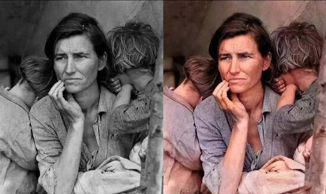
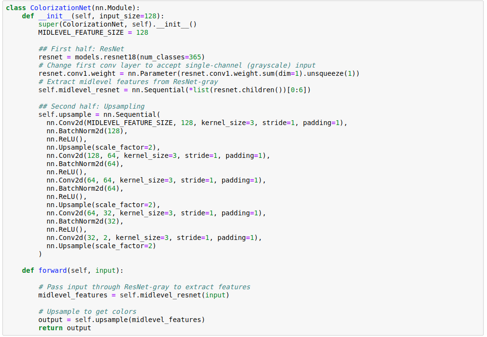
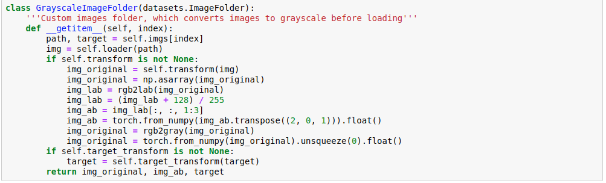
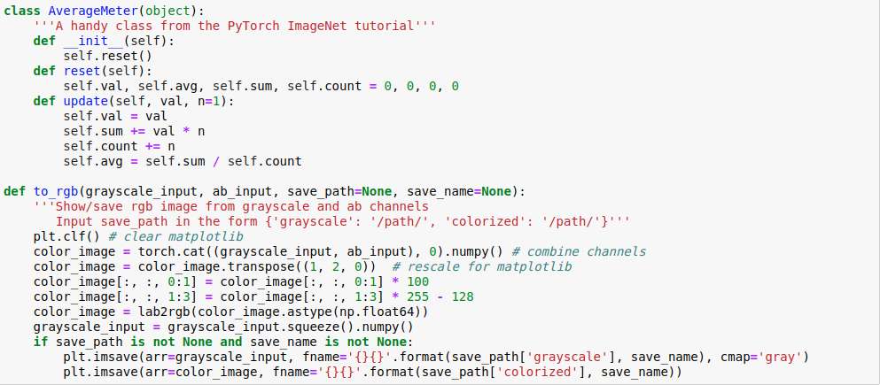
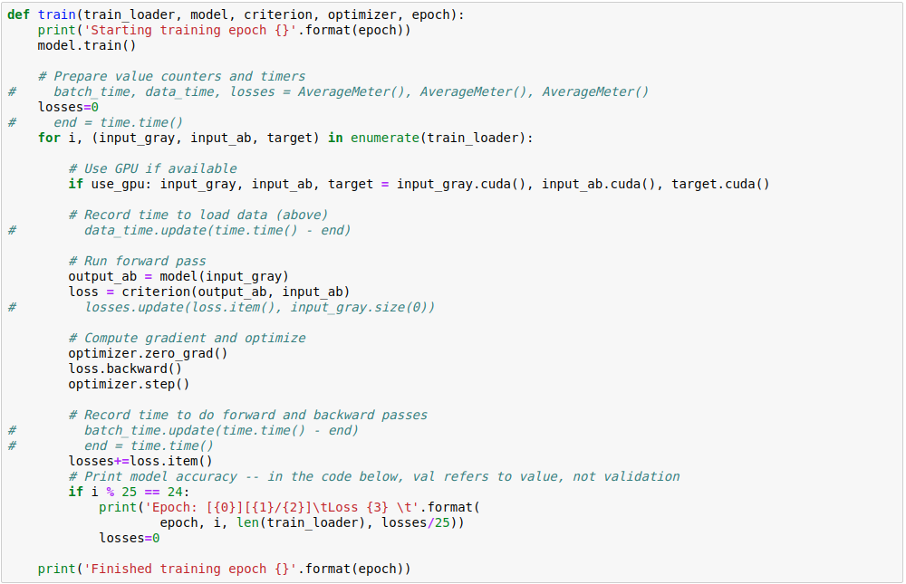
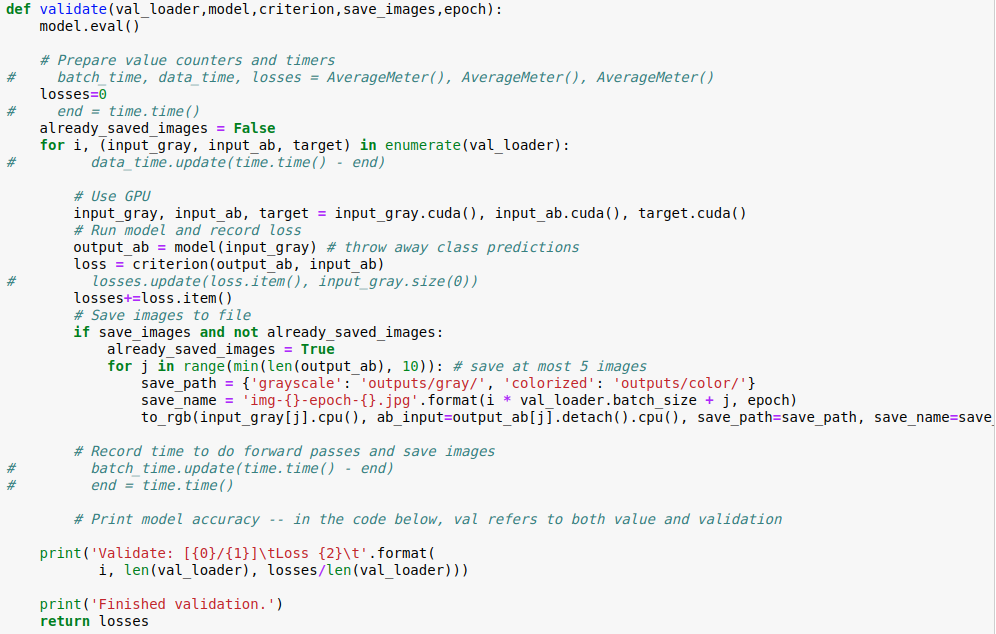
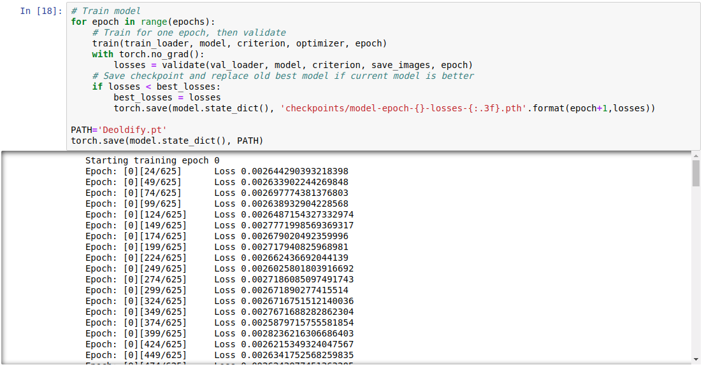
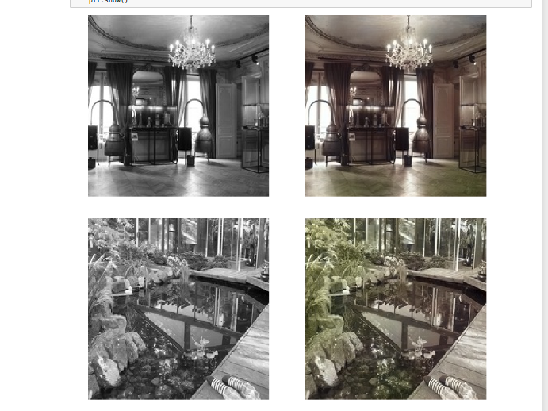

# 2016级项目实训成果展示 

## 《DeOldify》 - Python与机器学习方向

### 项目简介

照片承载了很多人在某个时刻的记忆，尤其是一些老旧的黑白照片，尘封于脑海之中，随着时间的流逝，记忆中对当时颜色的印象也会慢慢消散，这确实有些可惜。

技术的发展会解决一些现有的难题，深度学习恰好能够解决这个问题。

### 项目地址

- - Github：

### 项目成员

- 王浩权（项目经理、UI设计师、开发工程师、测试工程师）
  - Email：292594199@qq.com
  - Github：https://github.com/wanghaoquan123
- 李照钰（市场总监、产品经理、UI设计师、开发工程师、测试工程师）
  - Email： 1356278759@qq.com
  - Github： <https://github.com/lizhaoyu18>
- 徐利媛（技术总监、质量专家、UI设计师、开发工程师、测试工程师）
  - Email：528135783@qq.com

### 项目截图

