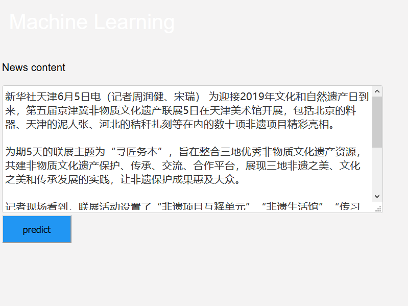
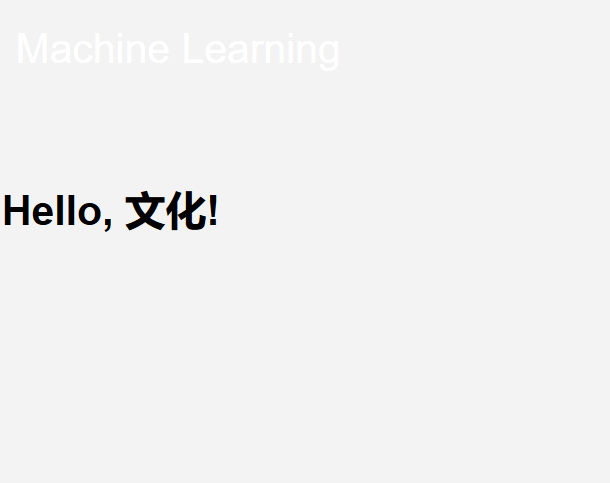
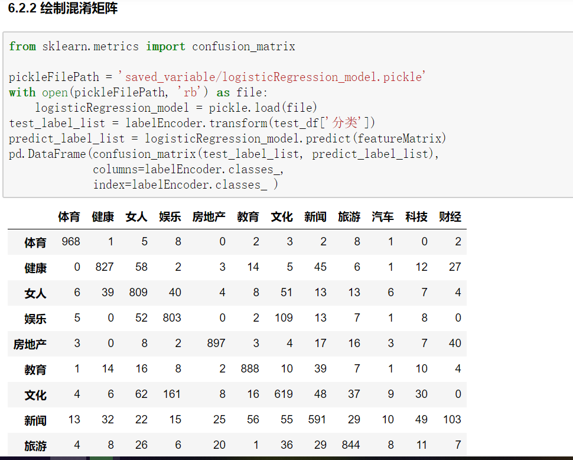
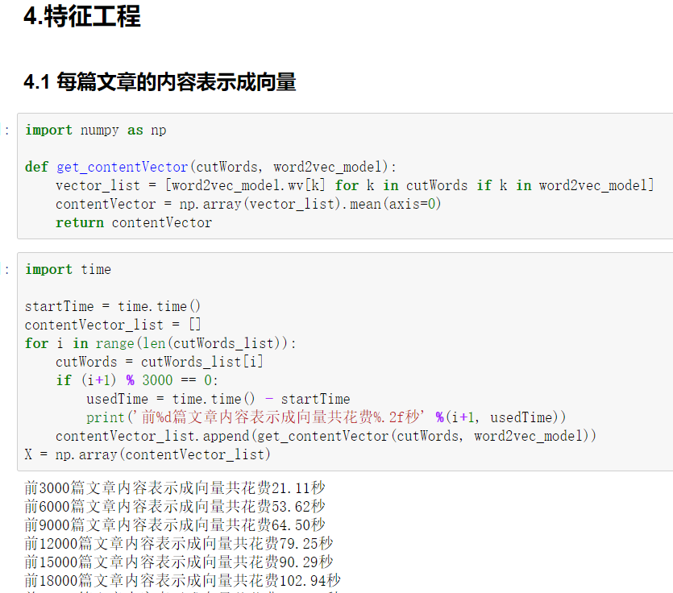
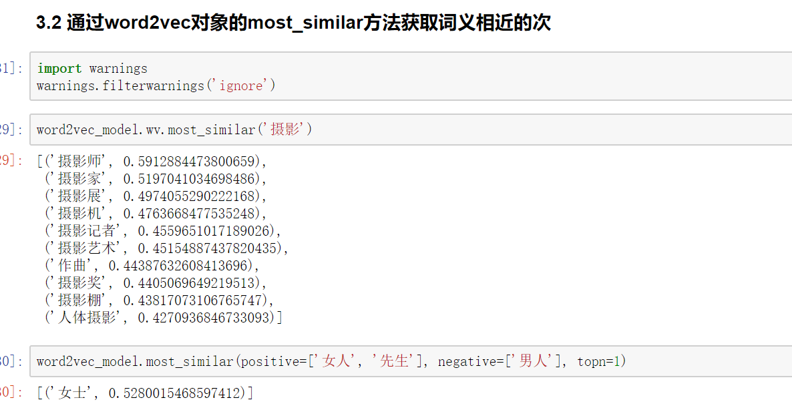
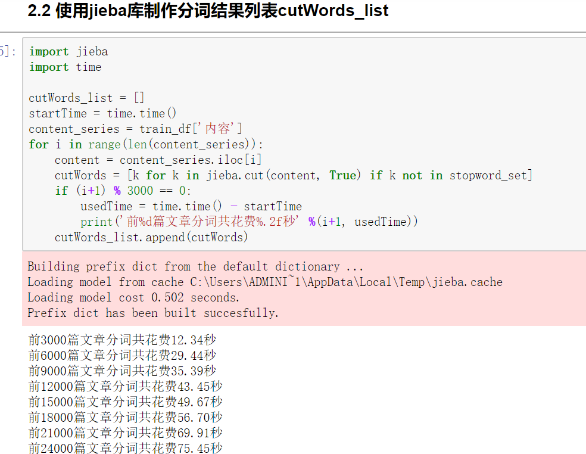
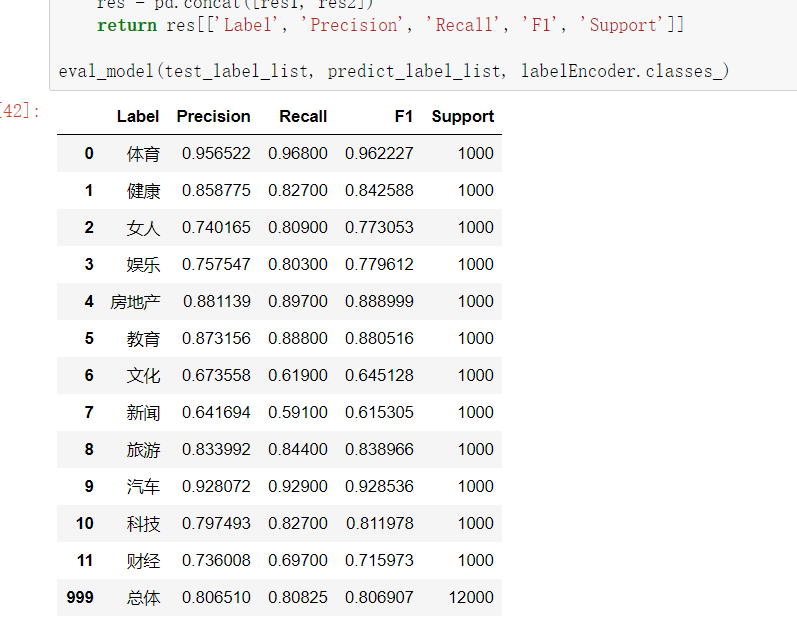

# 2016级项目实训成果展示 

## 《ML_News classification》 - Python与机器学习方向

### 项目简介

“新闻自动分类”—— 让机器再跑一会儿！

如果是人工来分类的话，首先读者要理解这个新闻讲的是什么，主题是什么，最后根据不同的主题进行分类。

但是如何通过计算机来进行分类呢？计算机读不懂新闻的内容，更不会提出这篇新闻的主题。那么就需要把新闻变成一组可以计算的数据，然后找出这两篇新闻的相似性。

首先，新闻文章是通过词组成句子来表达出不同意思，但是同一类新闻的用词是相似的，不同类的新闻用词各不相同。比如：网红、娱乐、粉丝、明星、演唱会等一般出现在娱乐新闻；房价、美元、基金、银行、物价等一般出现在金融类新闻。不难看出，和新闻主题相关的词出现的频率就高。

如何量化这次高频词呢？对某一类新闻出现的频率较高的词定义一个多维的向量，每一个词代表一个维度，这样就形成了一个这类新闻的一个特征向量。两篇新闻长得像不像，主题是否相似，取决于我们衡量他们之间的特征向量的相似性。

让机器再跑一会儿！识别新闻的类别。

### 项目地址
- Github：[https://github.com/Liu-ShiKun/ML_News-classification](https://github.com/Liu-ShiKun/ML_News-classification)

### 项目成员

- 吝盼利（UI设计师、测试工程师）
  - Email：[1315893766@qq.com](mailto:1315893766@qq.com)	
  - Github：[https://github.com/linpanli-2016]

- 刘士坤（项目经理、UI设计师、测试工程师）
  - Email：[18066896@qq.com](mailto:18066896@qq.com) 
  - Github：[https://github.com/Liu-ShiKun](https://github.com/Liu-ShiKun)

- 霍宁肖（UI设计师、开发工程师、测试工程师）

  - Email：[2733523269@qq.com](mailto:2733523269@qq.com)
  - Github：[https://github.com/huoningxiao1996](https://github.com/huoningxiao1996)

- 孟响（质量专家、开发工程师、测试工程师）

  - Email：[2563097814@qq.com](mailto:2563097814@qq.com)

  - Github：[https://github.com/mengxiangdream](https://github.com/mengxiangdream)

### 项目截图

