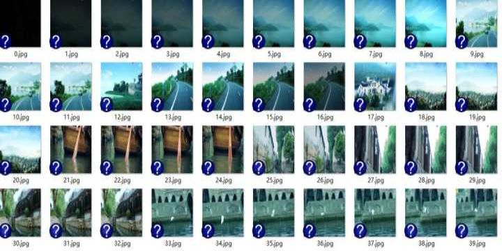
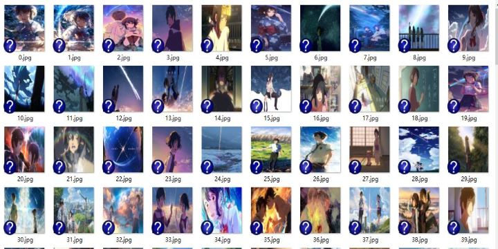
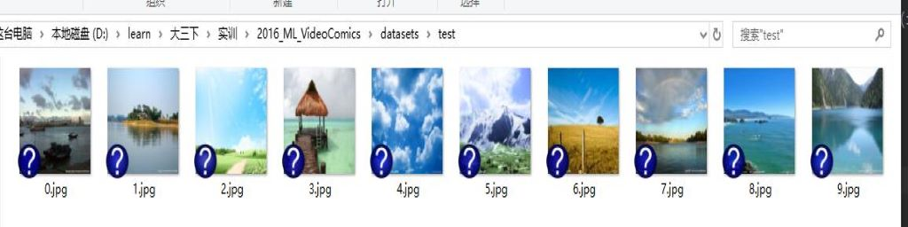
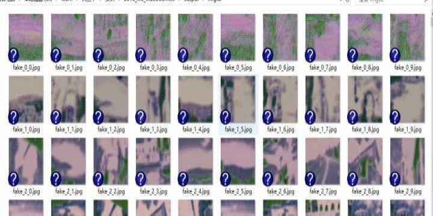
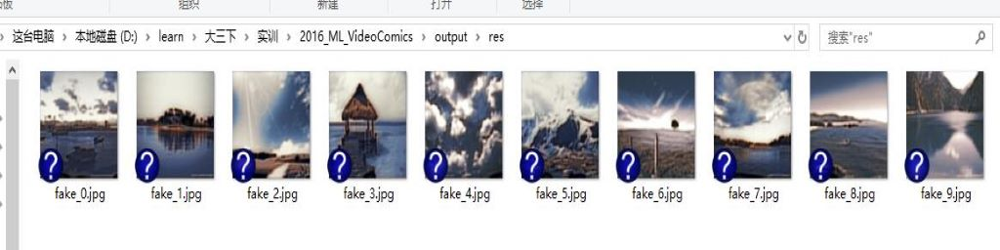
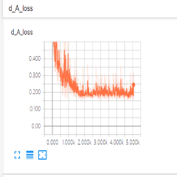
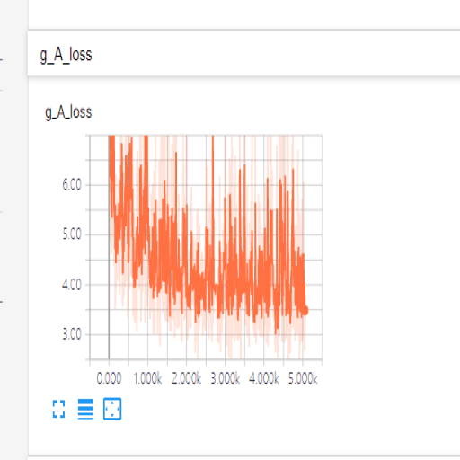
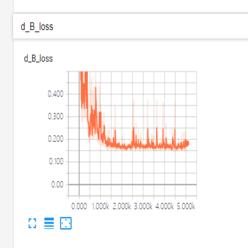
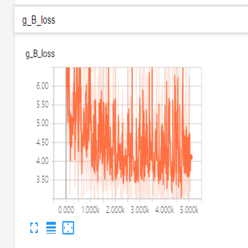

# 2016级项目实训成果展示 

## 《VideoComics》 - Python与机器学习方向

### 项目简介

在这高速发展的时期中，各种技术在不断进步，许多新功能也在不断浮现。《VideoComics》也是其中之一，可以带给用户多种享受。

我们将这个问题分为两部分：（a）帧提取和（b）样式转换。第一阶段的目标是从提供最全面的视频背景的视频中选择帧的子集，这些自己同时对漫画的观众具有视觉吸引力。在第二阶段，我们将选定关键帧的样式转换为漫画的样式。为了达到最好的效果，我们针对漫画风格转换的具体问题分析出了现有的风格转换方法。

### 项目组成员

我们的项目组由三个人构成，项目构建的过程主要涉及两步：（1）视频关键帧提取，（2）图片的风格转换，这几个步骤。 其中：

* 刘佳昌（主要负责神经网络的构建以及神经网络的构成）
  * github: https://github.com/liujiachang
  * 电子邮箱：1040496263@qq.com

* 徐润凯 （关键帧提取）
  * github: https://github.com/xurunkai
  * 电子邮箱：996874863@qq.com

* 刘西寅（主要负责编程环境的搭建和神经网络的训练过程）
  * github: https://github.com/liuxiyin
  * 电子邮箱：915709379@qq.com

### 运行截图

- train_A

- train_B

 

- test

- train_epoch

- test_result

 

- d_A_loss

-  g_A_loss

- d_B_loss

- g_B_loss

### 项目主题

基于对抗神经网络(gan)完成的风格转换。

### 项目范围

本项目是基于对抗神经网络(gan)完成的风格转换。

把所选中的视频中关键帧提取出来，并且将关键帧图像转换成不同风格的图像。

动画片和漫画成为世界各地流行的艺术表达手段。不幸的是，只有少数有绘画或图形技能的人才能够创造出符合美学标准的作品。更重要的是，它还需要大量的时间来创建一个有价值的漫画。提供一种将视频转换为漫画的自动工具，可以彻底改变出版商和个人创作漫画化内容的方式

在目前的市场中，已知的可以使用漫画化的软件只能对相片进行处理，而无法对视频进行处理。

本项目能够以以下步骤对视频进行处理：

1. 将用户上传的视频分割成许多关键帧，并用图片来表示
2. 对分割出来的关键帧进行处理，并以用户选中的漫画风格来显示
