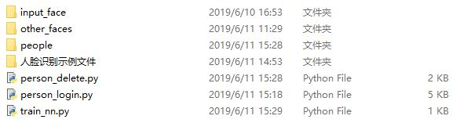
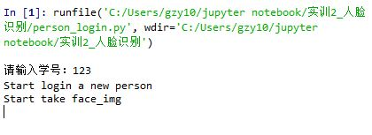
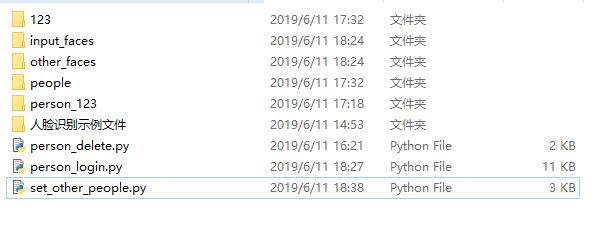
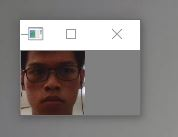
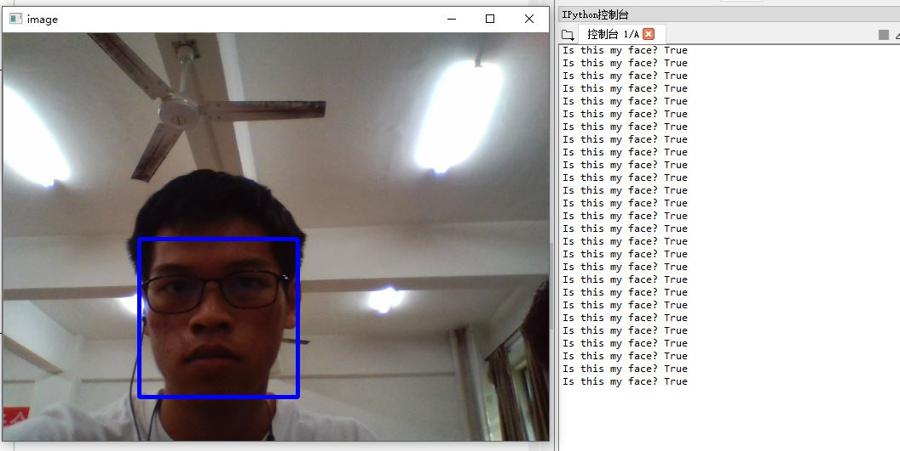
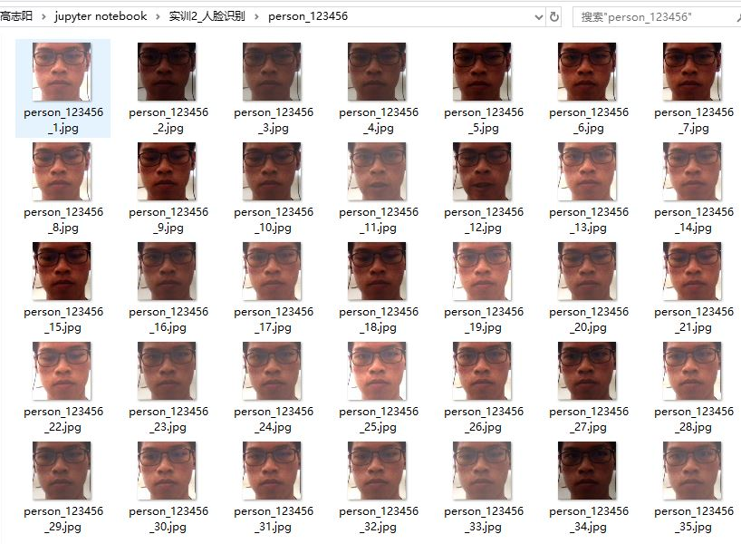
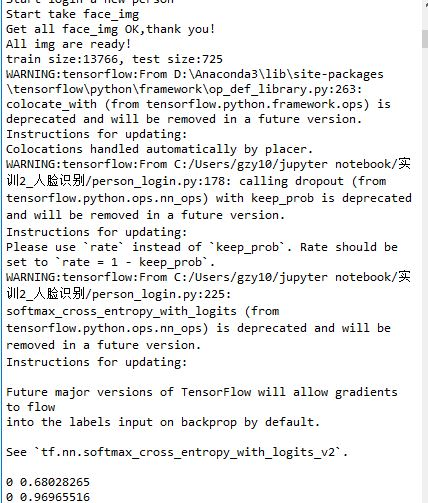

# 2016级项目实训成果展示 

## 《人脸识别》 - Python与机器学习方向

### 项目简介

用摄像头拍摄需要被识别的人脸，进行人脸图像采集，从图片中检测人脸位置并进行人脸图像处理，保存处理后的人脸图片，用相关图片信息训练神经网络模型。实现人脸图像的匹配与识别。主要功能模块有三个：人脸注册，人脸识别认证，人脸注销。

### 项目地址

- Github：[https://github.com/gaozhiyang1062/2016_GHL.git](https://github.com/gaozhiyang1062/2016_GHL.git)

### 项目成员

- 高志阳（项目经理、技术总监、开发工程师、测试工程师）
  - Email：[1062680111@qq.com](mailto:1062680111@qq.com) 
  - Github：[https://github.com/dougang1026](https://github.com/dougang1026)
- 韩锋（项目经理、技术总监、开发工程师、测试工程师）
  - Email：[963583749@qq.com](mailto:963583749@qq.com) 
  - Github：[https://github.com/hanfeng1997](https://github.com/hanfeng1997)
- 刘阳（项目经理、技术总监、开发工程师、测试工程师）
  - Email：[1256451380@qq.com](mailto:1256451380@qq.com) 
  - Github：[https://github.com/liuyang1997](https://github.com/liuyang1997)

### 项目截图

### 项目说明

1. 运行set_other_people.py，开始其他人脸图片的录入。其他人的图片放在input_faces文件夹中，识别其中人脸的位置并截取，把截取后的图片存入other_faces中帮助训练模型。文件夹为空或者完成后有相应提示。
2. 运行person_login.py，开始新成员录入。用摄像头拍摄照片，并识别其中人脸位置，截取人脸图片，并调整亮度和对比度，增加样本多样性，调整完成后保存照片至对应文件夹中（person_学号）。目标人脸图片拍摄完毕后会有相应提示。
3. 目标人脸图片拍摄完毕后自动开始训练神经网络。先将目标人脸图片和其他人脸图片打乱随机划分为训练集和测试集，然后开始构建神经网络并训练至正确率大于等于0.98时训练完成并保存训练完成后的模型，模型保存在学号对应的文件夹下。保存完成后会直接弹出视频窗口验证模型性能，5秒后自动关闭。
4. 如果某成员已经注册过了，则在调用person_login时输入已注册过的学号会直接调用曾经保存的神经网络模型，进行人脸识别验证。
5. 人脸注销调用person_delete.py。运行开始会提示输入要删除的成员学号，如果目标学号不存在则有错误的提示并选择重新输入学号或者退出。输入要删除的目标成员学号会删除对应成员的所有文件及模型。