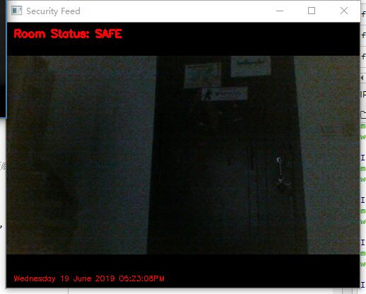
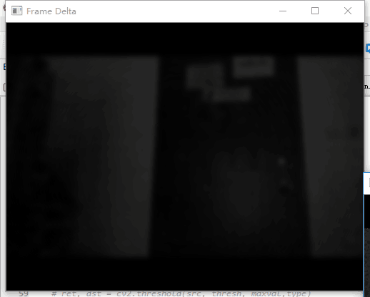
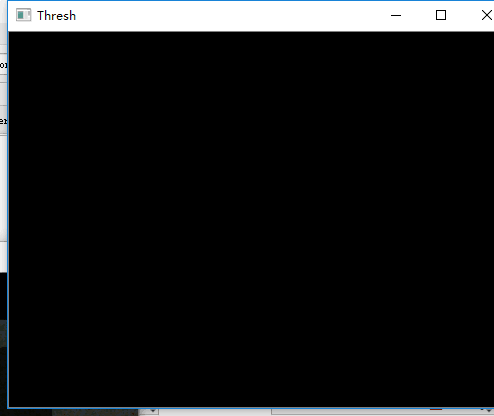
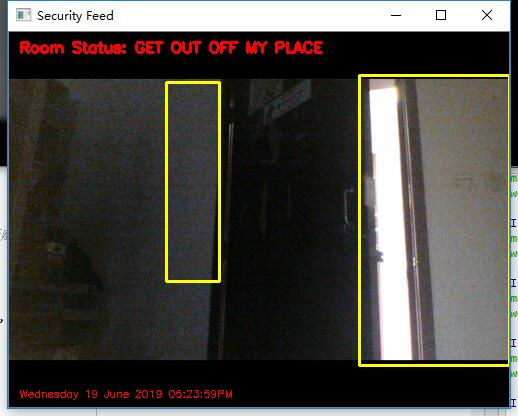
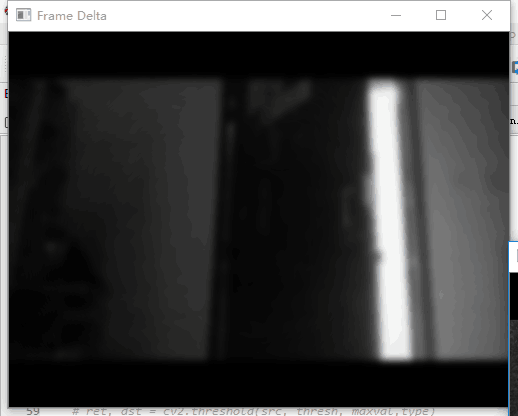
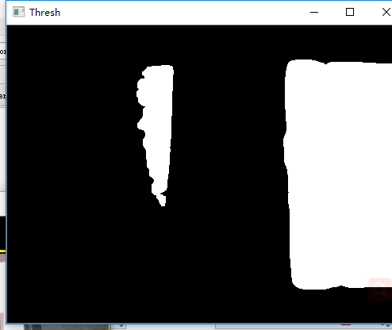

# 2016级项目实训成果展示 

## 《入侵识别》 - Python与机器学习方向

### 项目简介

一款能够识别图像变化的程序。对光线敏感，只要场景有变化，就会将其框出，并发出警报。入侵识别系统可监控如晚间仓库、教室、房屋等，并对入侵情况作出实时反应。以该程序为核心，可以有多种演化，如加入人脸识别系统后，识别到陌生人人脸，就命令电脑显示桌面、锁屏、睡眠、拍照等功能，确保信息安全。

### 项目地址

- Github: [https://github.com/Zikade/Intrusion_recognition](https://github.com/Zikade/Intrusion_recognition)

### 项目成员

- 金奕含
  - Email: [461614193@qq.com](mailto:461614193@qq.com)
  - Github: [https://github.com/Zikade](https://github.com/Zikade)

### 项目截图

    

    

    

    

    

    