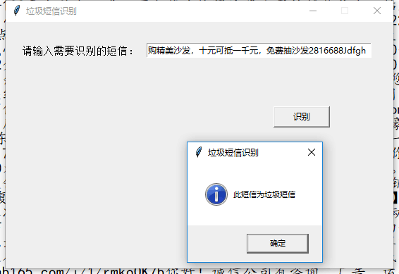
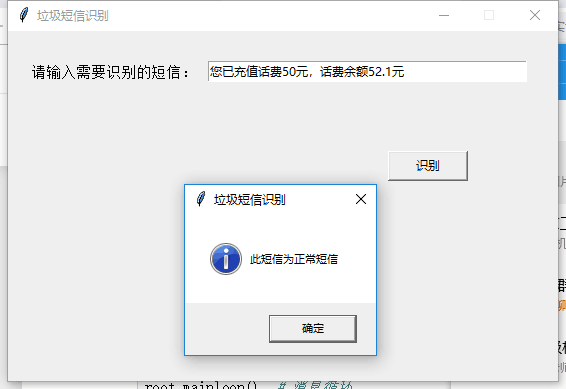
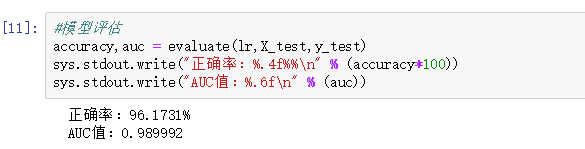
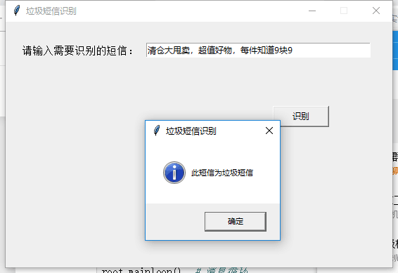
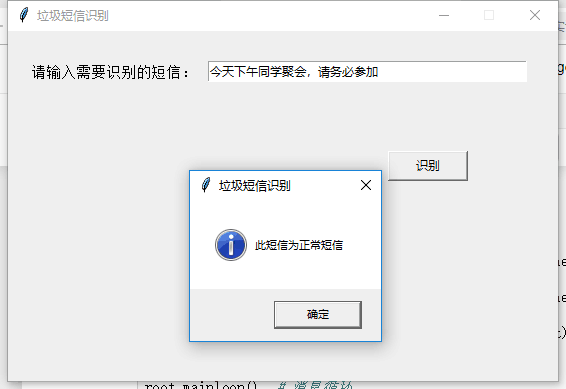
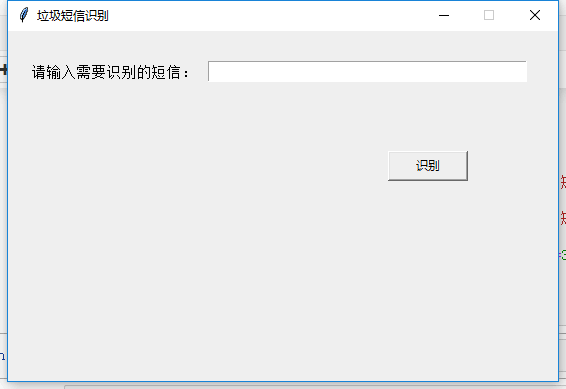
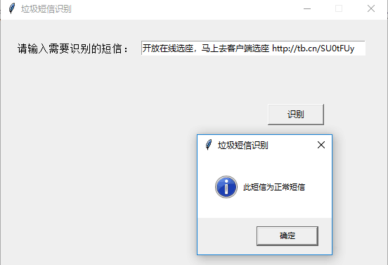

# 2016级项目实训成果展示 

## 《垃圾短信识别》 - Python与机器学习方向

### 项目简介

一款“语言类识别App”——专治垃圾短信，度你拥有一个绿色的信息环境！

随着科学技术的发展，信息的获取十分的方便，使得人们的生活变得更加的便利，但是也有一些人利用信息的这一特点来获取到人们的信息，向手机用户发送一些垃圾短信，其中掺杂着一些有毒的连接，使得只要一点击就会有一些不好的东西，有时还会扣取手机中的钱，给人们生活带来困扰。

此APP有效的解决了这一问题，该APP针对于用户接受到的短信进行识别，并做出判断哪些是垃圾短信哪些是正常短信，为用户提供了绿色的信息交互环境

### 项目地址
- Github：https://github.com/LiangMengShuang/Spam-SMS-Recognition1.git

### 项目成员

- 李晓丹（开发工程师、测试工程师）
  - Email：2427312392@qq.com
- 梁梦爽（项目经理、开发工程师、测试工程师）
  - Email：1950352363@qq.com

### 项目截图

