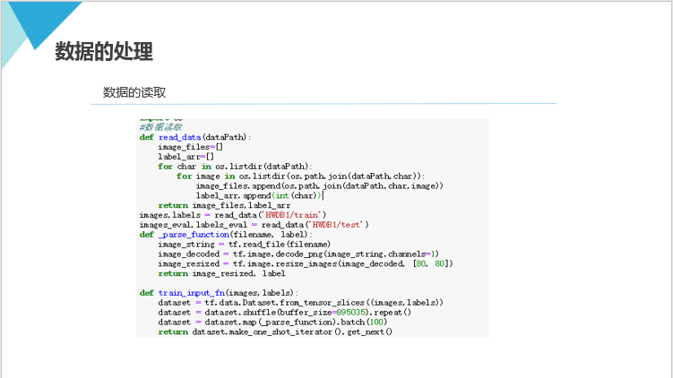
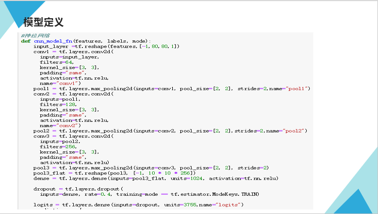
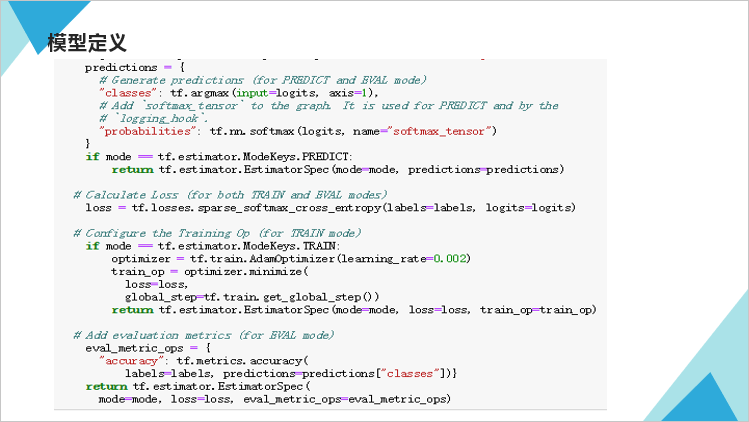
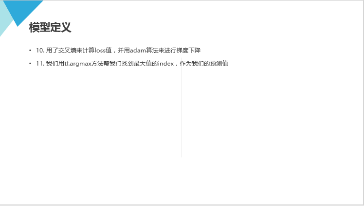
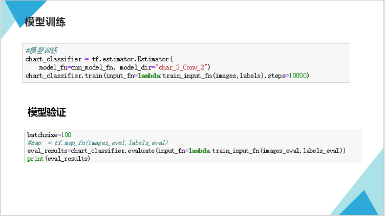
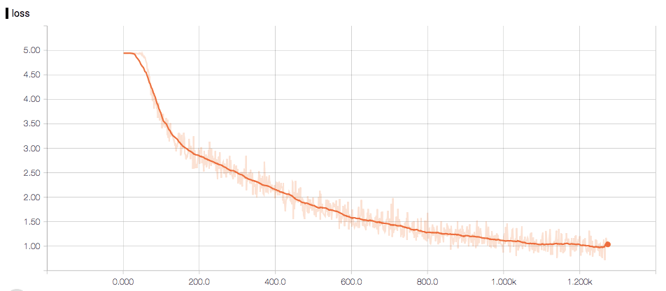

# 2016级项目实训成果展示 

## 《手写汉字识别》 - Python与机器学习方向

### 项目简介

随着智能手机、掌上电脑等移动信息工具的普及，手写识别技术进入了规模应用时代。手写识别（HandWriting Recognition）是指将在手写设备上书写时产生的有序轨迹信息化转化为[汉字](https://baike.baidu.com/item/%E6%B1%89%E5%AD%97)[内码](https://baike.baidu.com/item/%E5%86%85%E7%A0%81)的过程，实际上是手写轨迹的坐标序列到汉字的内码的一个映射过程，是[人机交互](https://baike.baidu.com/item/%E4%BA%BA%E6%9C%BA%E4%BA%A4%E4%BA%92)最自然、最方便的手段之一。手写识别能够使用户按照最自然、最方便的输入方式进行文字输入，易学易用，可取代键盘或者鼠标。用于手写输入的设备有许多种，比如电磁感应[手写板](https://baike.baidu.com/item/%E6%89%8B%E5%86%99%E6%9D%BF)、压感式手写板、触摸屏、[触控板](https://baike.baidu.com/item/%E8%A7%A6%E6%8E%A7%E6%9D%BF)、超声波笔等。

### 项目地址

- Github：https://github.com/Judongjie/xiangmu

### 项目成员

- 康丽娜（项目经理）
  - Email：2194767829@qq.com
  - Github：https://github.com/kanglina
- 侯梦媛（技术总监）
  - Email：m18731256939@163.com 
  - Github：https://github.com/hh1998lm
- 鞠栋杰（市场总监）
  - Email：785752070@qq.com
  - Github：https://github.com/Judongjie

### 项目截图

我们想用自定义的Estimator来训练我们的网络。为了使用Estimator，我们必须定义一个input function。

train_input_fn就是我们要提供给Estimator的input function。它负责给模型提供input数据。
from_tensor_slices方法把images和labels元素一一对应，并进行切片。
然后我们调用shuffle对所有的元素打乱顺序来达到模型的稳定性。
然后调用repeat方法来保证在模型迭代次数未到input数据可以重复被读取。
然后利用map函数来进行数据的逐条转化，也就是把图片路径转化为我们需要的实际图片数据。
batch方法把数据集分成多个小的批次。
最后Estimator需要我们把dataset转为one_shot_iterator来提供数据

我们的网络构成：
1. 卷积层1, 3×3的32个filter，same padding，激活函数用Relu
2. 最大池化层1，2×2的filter，步长为2
3. 卷积层2，3×3的64个filter，same padding，激活函数用Relu
4. 最大池化层2，2×2的filter，步长为2
5. 卷积层3，3×3的128个filter，same padding，激活函数用Relu
6. 最大池化层2，2×2的filter，步长为2
7. 全连接层，多少个神经元了？就取个整数1024个吧。激活函数还是用Relu
8. logit层，因为我们的训练集里一共有3755个不同的汉字，所以我们这一层的神经元个数为3755个，因为是logit层，后边我们要用softmax来计算概率，所以这一层不用激活函数。
9. 我们在全连接层应用了dropout来防止过拟合，提高模型的健壮性

