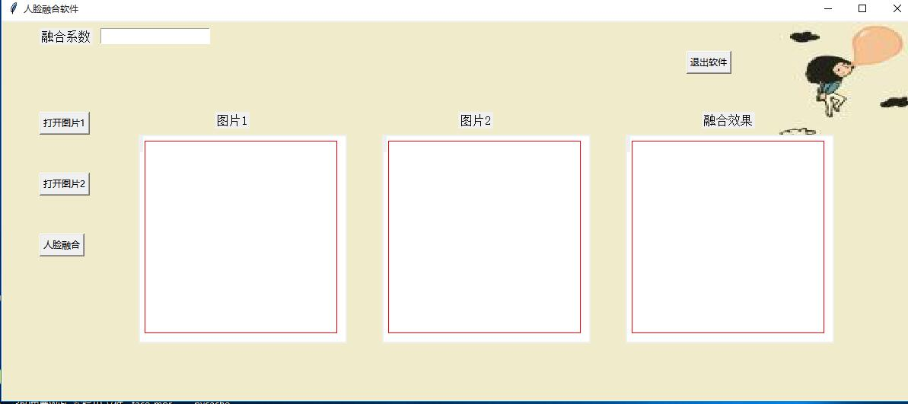
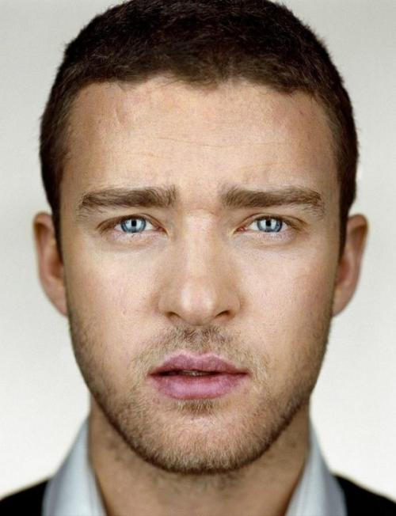
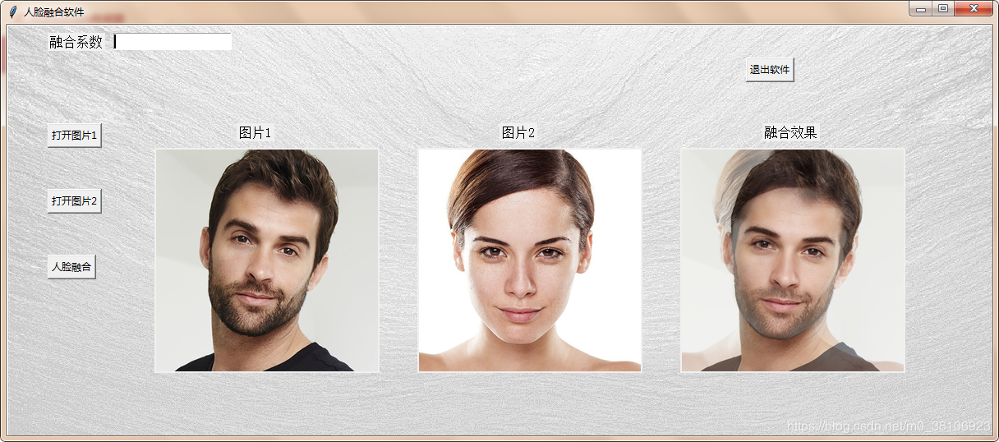

# 2016级项目实训成果展示 

## 《智能人脸合成》 - Python与机器学习方向

### 项目简介

随着医学的进步发展，整容渐渐成为了现代明星、网红的时尚。此软件是为了满足一些人，想要一张网红脸，但却无法实现的简单的需求

### 项目地址
- Github：[https://github.com/mayuehong225/face](https://github.com/mayuehong225/face)

### 项目成员

- 封寅凯（项目经理、UI设计师、开发工程师、测试工程师）
  - Email：[872040233@qq.com](872040233@qq.com) 
  - Github：[https://github.com/fykai0430](https://github.com/fykai0430)
- 马月红（市场总监、UI设计师、开发工程师、测试工程师）
  - Email：[1078597703@qq.com](mailto:1078597703@qq.com)
  - Github：[https://github.com/mayuehong225](https://github.com/mayuehong225)

### 项目截图

    

    
    
    
     

    

