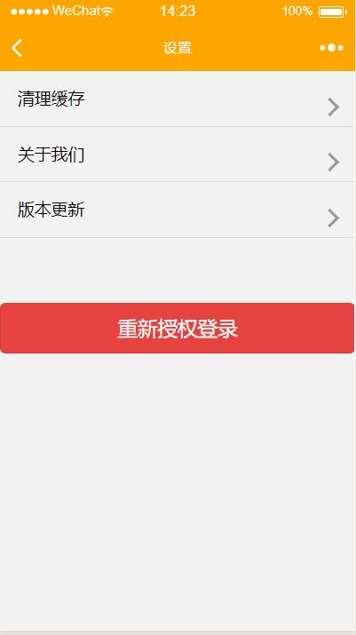

# 2016级项目实训成果展示 

## 《游则悠哉》 - Python与机器学习方向

### 项目简介

游则悠哉是一个服务于游客，通过线上匹配的旅游小程序。

游客选择出发的时间地点和景点，通过匹配导游功能可以在线匹配导游，可以选择某个特定的景点的导游，或者想去某一个城市但是自己没有很好的规划，可以选择导游所定制的路线，或者让导游为自己量身定制路线并让导游进行陪同讲解游玩。

### 项目地址

- Github : https://github.com/shanshanzha/travel-leisure

### 项目成员

- 苏家华(项目经理、UI设计师、开发工程师、测试工程师)
  - email：743587501@qq.com	
  - Github：https://github.com/shanshanzha

- 赵永权(技术总监、UI设计师、开发工程师、测试工程师)
  - email：zyq_361@163.com
  - Github：https://github.com/zyq-361

- 申尚东(产品经理、UI设计师、开发工程师、测试工程师)
  - email：2430136117@qq.com
  - Github：https://github.com/shenshangdong

### 项目截图

