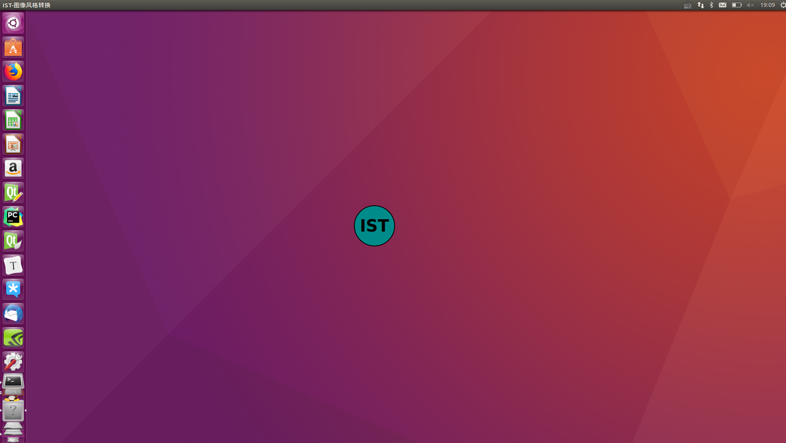
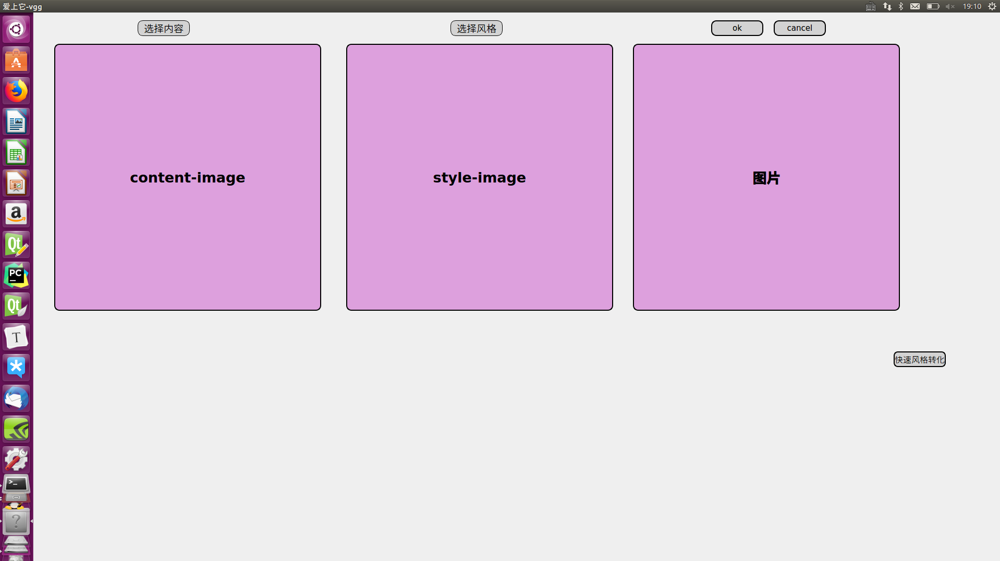
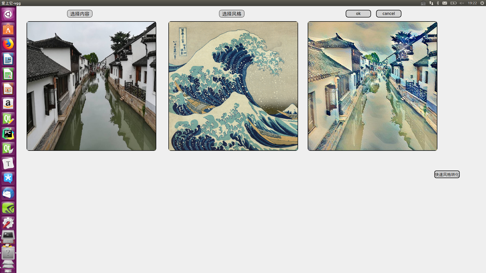
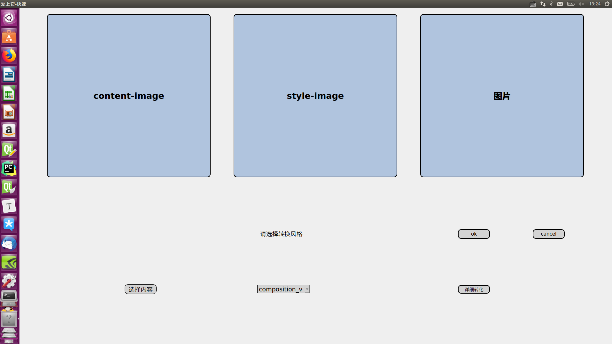
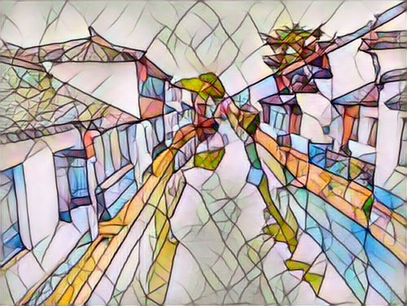

# 2016级项目实训成果展示 

## 《IST》 - Python与机器学习方向

### 项目简介

一款“图片处理类APP”——平面摄影秒变“世界名画“。

梵高的星空，蒙克的呐喊，毕加索的格尔尼卡等等，都是我们人类艺术文化史上闪耀的存在。我们在仰望这些艺术作品时，有没有想过，让自己的摄影作品与世界名画相碰撞，形成具有名画艺术风格的作品，我们来帮你实现，在这里，你可以将师大的时光塔和梵高的星空相结合，可以将师大的碎心湖，碎心楼和蒙克的呐喊相辉映，形成别具一格的艺术做作品。

摄影作品与世界名画元素相碰撞！

### 项目地址

- GitHub：https://github.com/circularful/DeepLearning

### 项目成员

- 李萌（项目负责人、VGG模型的构建、UI设计、VGG前后端的链接、页面跳转）
  - Email：[2563045237@qq.com.com](mailto:2569045237@qq.com) 
  - Github：[https://github.com/ouyangmemgmemg](https://github.com/ouyangmemgmemg)
- 赵一贺（市场总监、VGG模型的构建、UI设计、VGG前后端的链接、页面跳转）
  - Email：[1304150495@qq.com](mailto:1304150495@qq.com)
  - Github：[https://github.com/circularful](https://github.com/circularful)
- 刘子璇（项目负责人、模型的训练调参、UI设计、程序打包、项目展示）
  - Email：[2837409635@qq.com  ](mailto:2837409635@qq.com)
  - Github：[https://github.com/zixuan991130](https://github.com/nieliangpeng)
- 王紫薇（技术总监、模型的训练调参、UI设计、快速转换模型和前后端链接）
  - Email：1164393341@qq.com  
  - Github：[https://github.com/wangziwei1128](https://github.com/wangziwei1128)

### 项目截图

- APP启动页面

- 首页

- 效果图

- 快速风格转化界面

- 例子：风格图mosaic

- 效果图

