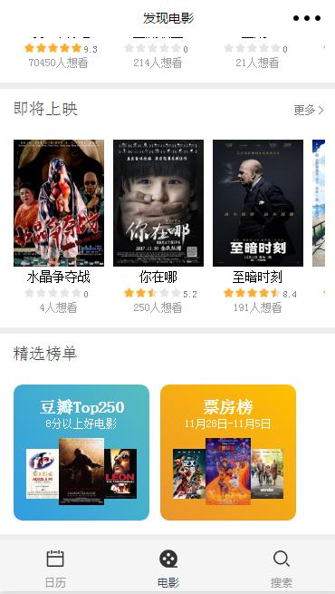
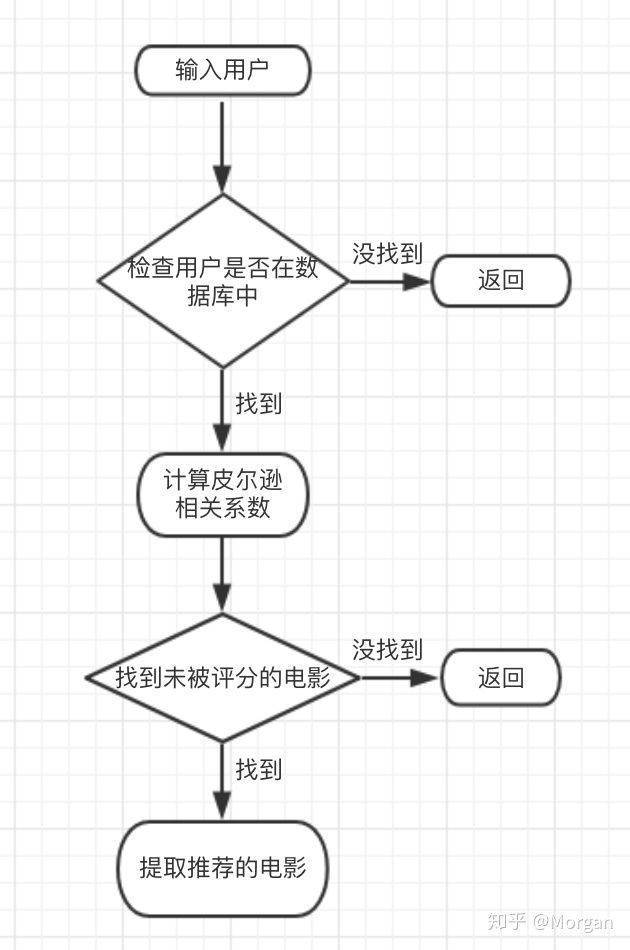
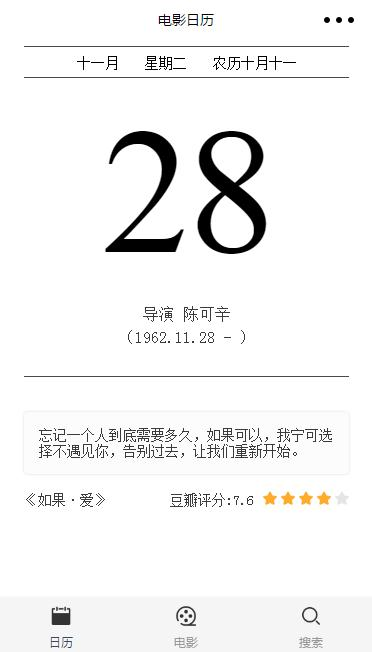
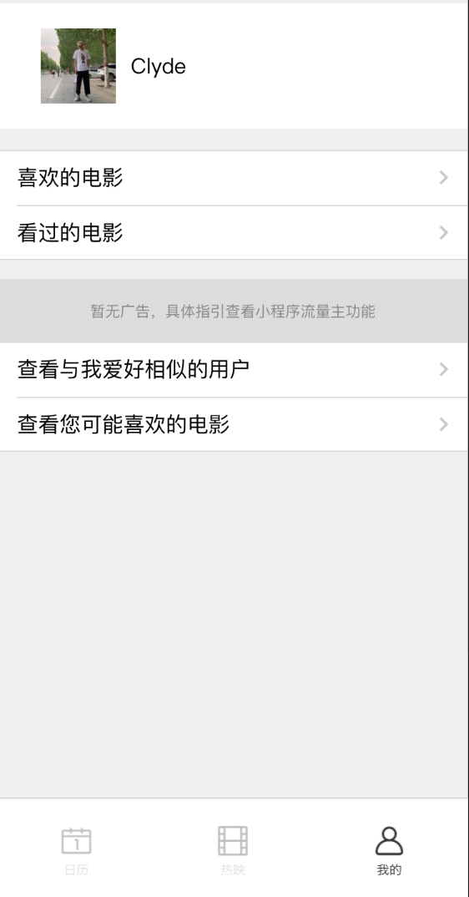
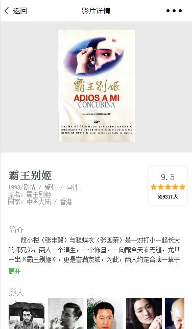
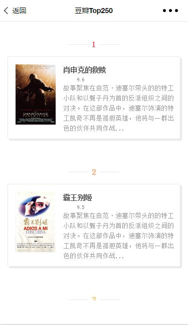

# 2016级项目实训成果展示 

## 《电影日历》 - Python与机器学习方向

### 项目简介

一款基于真正懂你的APP，每天，给你只属于你的电影日历

打开电脑，在浏览器中搜索热门的电影，搜来搜去，却也不知道到底哪一个才是自己喜欢的，最后打开一个电影，才发现浪费了时间，看了一个不合口味的电影。这时候，你需要一个懂你的电影管家，每天为你推荐一个电影，肯定合你口味。坚持评价电影，还会有意想不到的小惊喜。一键筛选与你口味相同的用户，和属于你的“ta”一起看属于你们的电影！

### 项目成员

- 李泽璐（项目经理、UI设计师、开发工程师、测试工程师）
  - Email：[learnedclyde@gmail.com]
  - Github：[https://github.com/lizelu123]
  
### 项目截图
发现电影

流程图

日历

我的

喜欢的电影

影片详情

TOP250