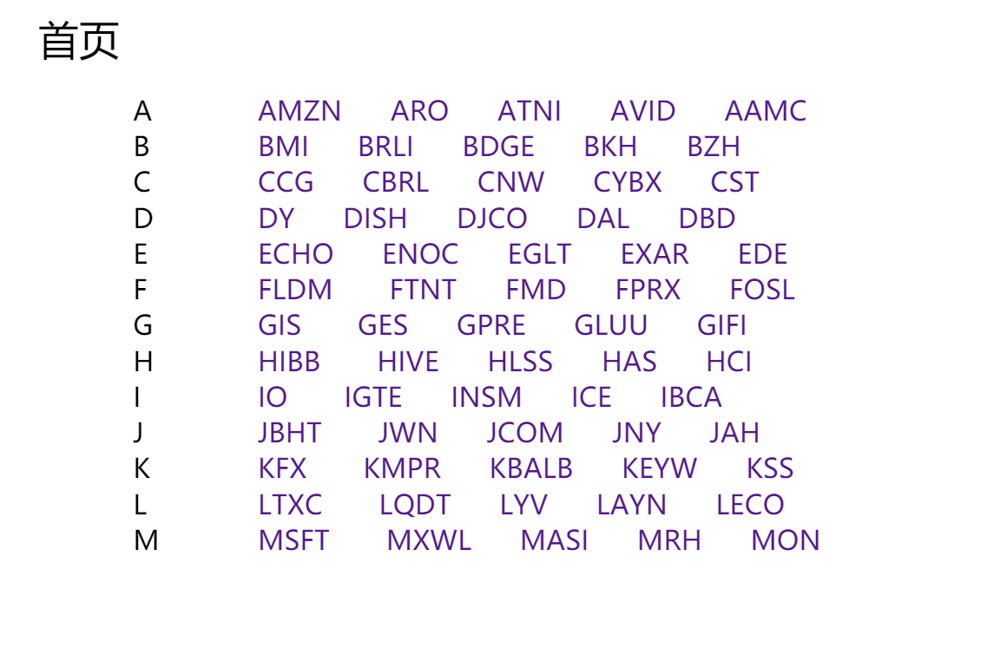
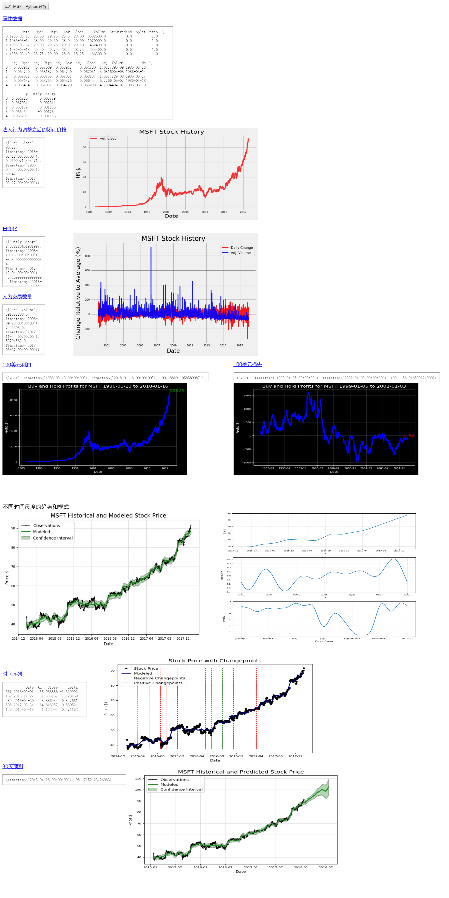

# 2016级项目实训成果展示 

## 《股票预测》 - Python与机器学习方向

### 项目简介

可以进行股票预测的网站。

## 项目地址

- Github：https://github.com/Lancer1998/Stock-forecast

## 项目成员

- 张鑫媛（项目经理、UI设计师、开发工程师、测试工程师）
	- Email：906280565@qq.com
	- GitHub：https://github.com/Lancer1998

- 金奕含（项目经理、UI设计师、开发工程师、测试工程师）
	- Email：461614193@qq.com
	- GitHub：https://github.com/Zikade

- 刘雪晴（项目经理、UI设计师、开发工程师、测试工程师）
	- Email：469414956@qq.com
	- GitHub：https://github.com/liuxueqing1023  

## 项目截图

