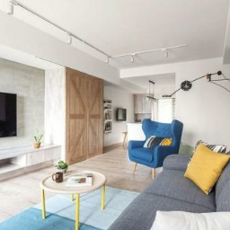
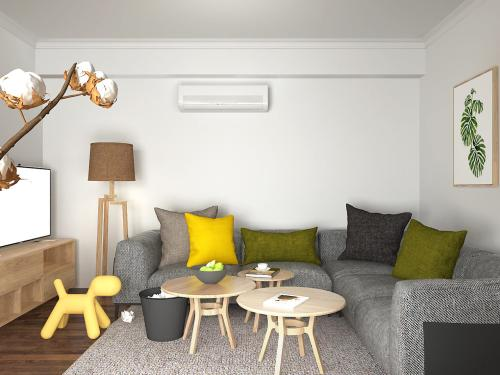
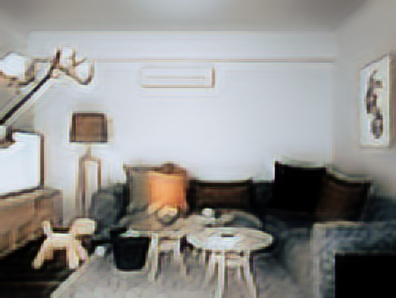
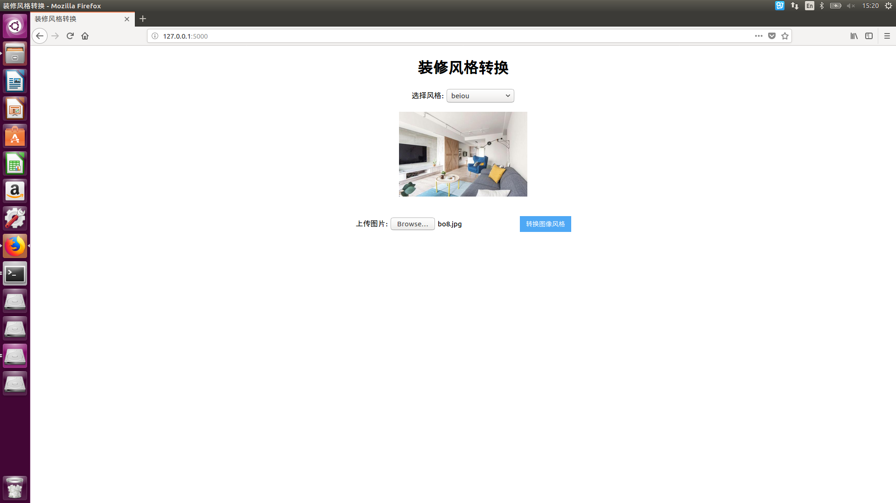
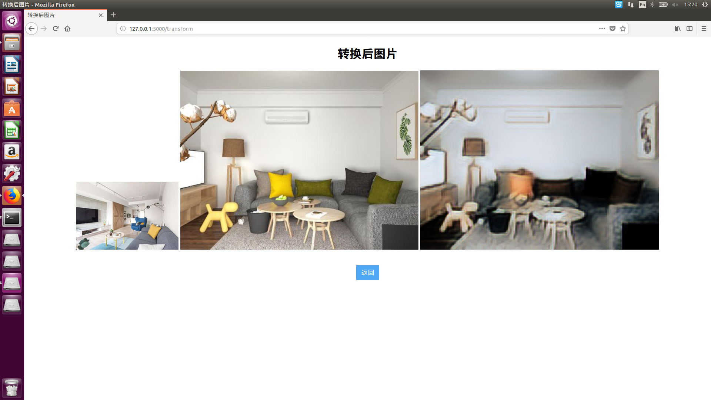
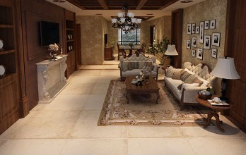
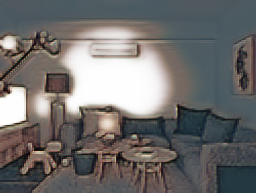
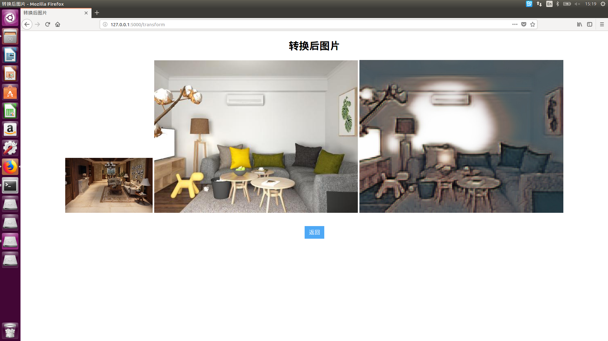
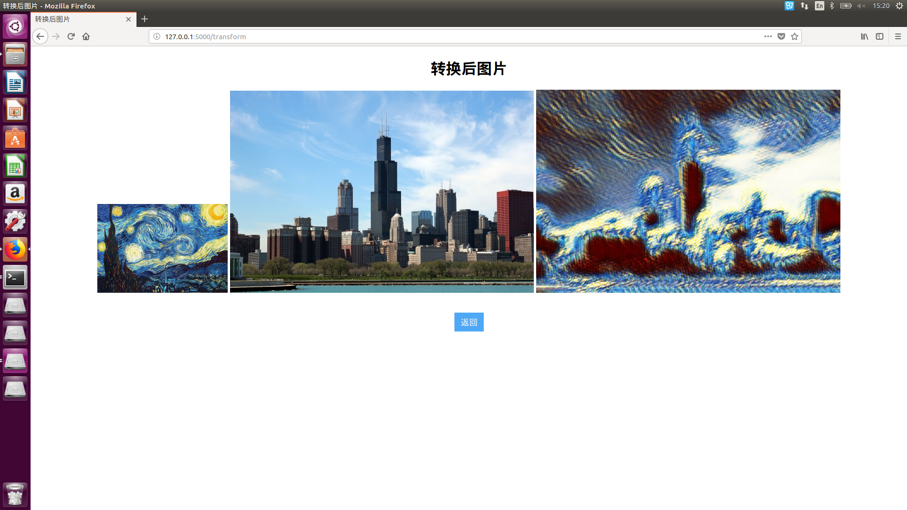

# 2016级项目实训成果展示 

## 《装修风格转换》 - Python与机器学习方向

### 项目简介

当你不确定自己的房间适合什么样的装修时，当你对五花八门的装修图片心存困惑时，当你对现有的装修感到不满时，不妨来求助它——一个可以帮助你解决装修风格烦恼的网页。

这是一个由我们设计的，为当代人解决装修问题的网页。你们只需要上传好新房图片，再从“北欧”，“美式”等装修风格中选择一个，便可以得到一张独属于自己房间的装修图片。简单快捷，新奇多元。

### 项目地址

- Github：https://github.com/zhangchenyang6/Decoration_style_transfer

### 项目成员

- 左林嶷（项目经理、市场总监、UI设计师、测试工程师）
  - Email：823766969@qq.com
  - Github：https://github.com/zuolinyi
- 张晨阳（产品经理、技术总监、UI设计师、开发工程师）
  - Email：961926425@qq.com
  - Github：https://github.com/zhangchenyang6

### 项目截图

